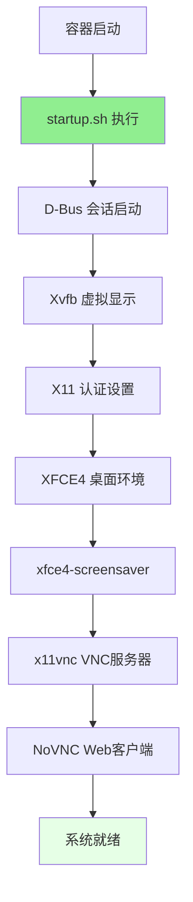
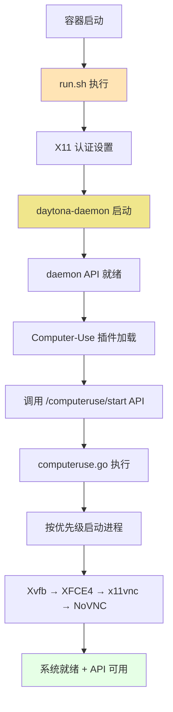

# 容器运行模式对比：VNC 模式 vs Daytona 模式

本文档详细对比了 Daytona Computer-Use Demo Container 的两种运行模式，分析它们的架构差异、启动流程、适用场景以及技术实现细节。

## 🚀 两种运行模式概览

Daytona Computer-Use Demo Container 支持两种不同的运行模式：

### VNC 模式（默认模式）

- **启动脚本**：`startup.sh`
- **特点**：轻量级桌面环境，直接启动进程
- **适用场景**：日常使用、学习演示、基础桌面自动化
- **资源占用**：低

### Daytona 模式（API 模式）

- **启动脚本**：`scripts/daytona/run.sh`
- **特点**：完整 API 服务，动态进程管理
- **适用场景**：API 开发、自动化集成、远程控制
- **资源占用**：中等（包含 daemon 服务）

## 模式选择指南

| 使用场景 | 推荐模式 | 命令示例 |
|----------|----------|----------|
| 日常桌面使用 | VNC | `./build-fast.sh vnc` |
| 学习桌面自动化 | VNC | `./build-fast.sh vnc` |
| API 开发测试 | Daytona | `./build-fast.sh daytona` |
| 程序化控制桌面 | Daytona | `./build-fast.sh daytona` |
| CI/CD 集成 | Daytona | `./build-fast.sh daytona` |
| 轻量级演示 | VNC | `./build-fast.sh vnc` |

## 架构对比概览

### VNC 模式架构



### Daytona 模式架构



## 详细模式对比

### 启动流程对比

| 阶段 | VNC 模式 (startup.sh) | Daytona 模式 (run.sh) |
|------|----------------------|----------------------|
| **1. 初始化** | D-Bus 会话启动 | X11 认证设置 |
| **2. 显示服务** | 直接启动 Xvfb | 等待 API 调用启动 |
| **3. 认证设置** | X11 认证配置 | 已在步骤1完成 |
| **4. 桌面环境** | 直接启动 XFCE4 | 通过 API 启动 |
| **5. 附加服务** | 启动屏保程序 | 不启动屏保 |
| **6. VNC 服务** | 直接启动 x11vnc | 通过 API 启动 |
| **7. Web 代理** | 直接启动 NoVNC | 通过 API 启动 |
| **8. API 服务** | 启动 daemon (可选) | daemon 已在步骤2启动 |

### 进程管理方式

#### VNC 模式 - 直接进程管理

```bash
# startup.sh 中的进程启动
Xvfb $DISPLAY -screen 0 ${VNC_RESOLUTION}x24 &
startxfce4 > ~/.daytona/computeruse/xfce4.log 2>&1 &
x11vnc -display $DISPLAY -forever -shared -rfbport $VNC_PORT -bg
websockify --web=/usr/share/novnc/ $NO_VNC_PORT localhost:$VNC_PORT &
```

**特点**：

- 🔧 **直接控制**：shell 脚本直接管理进程生命周期
- 🚀 **启动快速**：无中间层，直接启动
- 📝 **简单日志**：通过文件重定向处理日志
- 🔄 **重启简单**：kill 进程后重新启动

#### Daytona 模式 - API 驱动管理

```go
// computeruse.go 中的进程管理
func (c *ComputerUse) Start() (*computeruse.Empty, error) {
    c.startAllProcesses()  // 按优先级启动所有进程
}

func (c *ComputerUse) startProcess(process *Process) {
    process.cmd = exec.CommandContext(process.ctx, process.Command, process.Args...)
    // 设置环境变量、日志文件等
    process.cmd.Start()
}
```

**特点**：

- 🎯 **API 控制**：通过 HTTP API 动态管理进程
- 🔧 **结构化管理**：Go 语言的结构化进程对象
- 📊 **状态查询**：实时获取进程状态和信息
- 🔄 **细粒度控制**：可以单独重启特定进程

### 核心差异总结

| 维度 | VNC 模式 | Daytona 模式 |
|------|----------|-------------|
| **启动方式** | 脚本直接启动进程 | API 调用启动进程 |
| **进程管理** | Shell 后台进程管理 | Go 程序结构化管理 |
| **控制接口** | 命令行/容器内操作 | HTTP API 远程控制 |
| **状态监控** | ps/netstat 命令 | API 状态查询 |
| **日志管理** | 文件重定向 | 结构化日志对象 |
| **扩展性** | 修改脚本 | 插件架构扩展 |
| **集成能力** | 容器级集成 | API 级集成 |

## 进程对比详情

### 相同的核心进程

两种模式最终都会启动相同的核心桌面进程：

| 进程名称 | VNC 模式 | Daytona 模式 | 用途 |
|----------|----------|-------------|------|
| **Xvfb** | ✅ startup.sh | ✅ computeruse.go | X11 虚拟显示服务器 |
| **XFCE4** | ✅ startup.sh | ✅ computeruse.go | 桌面环境 |
| **x11vnc** | ✅ startup.sh | ✅ computeruse.go | VNC 服务器 |
| **NoVNC/websockify** | ✅ startup.sh | ✅ computeruse.go | Web VNC 客户端代理 |

### 不同的管理进程

| 进程名称 | VNC 模式 | Daytona 模式 | 说明 |
|----------|----------|-------------|------|
| **D-Bus** | ✅ startup.sh 中启动 | ✅ computeruse.go Initialize() | D-Bus 会话管理 |
| **daytona-daemon** | 🟡 可选启动 | ✅ 核心服务 | API 服务器 |
| **xfce4-screensaver** | ✅ 默认启动 | ❌ 不启动 | 屏幕保护程序 |
| **Computer-Use 插件** | ❌ 独立运行 | ✅ daemon 插件 | 桌面自动化API |

## 技术实现对比

### VNC 模式实现 (startup.sh)

#### 启动脚本架构

```bash
#!/bin/bash
set -e

# 1. D-Bus 会话设置
dbus-launch --sh-syntax > ~/.dbus-session
source ~/.dbus-session

# 2. Xvfb 虚拟显示
Xvfb $DISPLAY -screen 0 ${VNC_RESOLUTION}x24 &
wait_for_process "Xvfb" 10

# 3. X11 认证
export XAUTHORITY=/home/daytona/.Xauthority
touch $XAUTHORITY && chmod 600 $XAUTHORITY
xauth add $DISPLAY . $(mcookie)

# 4. XFCE4 桌面
startxfce4 > ~/.daytona/computeruse/xfce4.log 2>&1 &
wait_for_process "xfce4-session" 15

# 5. 屏保程序
xfce4-screensaver > ~/.daytona/computeruse/screensaver.log 2>&1 &

# 6. VNC 服务器
x11vnc -display $DISPLAY -forever -shared -rfbport $VNC_PORT -bg

# 7. Web VNC 客户端
websockify --web=/usr/share/novnc/ $NO_VNC_PORT localhost:$VNC_PORT &

# 8. 进程监控循环
while true; do
    # 检查关键进程状态
    check_critical_processes
    sleep 30
done
```

#### 优势与特点

**优势**：

- ✅ **启动速度快**：无中间层，直接启动进程
- ✅ **资源占用低**：只运行必要的桌面进程
- ✅ **简单可靠**：Shell 脚本逻辑简单，容易调试
- ✅ **无依赖**：不依赖额外的服务或 API
- ✅ **完整桌面**：包含屏保等完整桌面功能

**适用场景**：

- 🎯 日常桌面使用和演示
- 📚 学习桌面自动化工具
- 🔧 简单的自动化脚本开发
- 💻 轻量级 VNC 桌面需求

### Daytona 模式实现 (run.sh + computeruse.go)

#### 启动脚本架构 (run.sh)

```bash
#!/bin/bash
set -e

# 1. X11 认证设置
export XAUTHORITY=/home/daytona/.Xauthority
touch $XAUTHORITY && chmod 600 $XAUTHORITY
xauth add $DISPLAY . $(mcookie)

# 2. 启动 Daytona daemon
export DAYTONA_PROJECT_DIR=/home/daytona/shared
nohup daytona-daemon > ~/.daytona/computeruse/daemon.log 2>&1 &

# 3. 等待 API 就绪
for i in {1..30}; do
    curl -s "http://localhost:2280/version" >/dev/null && break
    sleep 1
done

# 4. 自动启动桌面进程
curl -X POST "http://localhost:2280/computeruse/start"

# 5. 监控 daemon 状态
while true; do
    if ! pgrep -f daytona-daemon > /dev/null; then
        echo "Daemon stopped, exiting..."
        break
    fi
    sleep 30
done
```

#### Computer-Use 插件架构 (computeruse.go)

```go
// 插件初始化
func (c *ComputerUse) Initialize() (*computeruse.Empty, error) {
    // 1. 启动 D-Bus 会话
    cmd := exec.Command("dbus-launch")
    // 设置环境变量...
    
    // 2. 准备进程配置
    c.initializeProcesses(homeDir)
}

// 进程启动
func (c *ComputerUse) Start() (*computeruse.Empty, error) {
    // 按优先级启动所有进程
    processes := c.getProcessesByPriority()
    for _, process := range processes {
        go c.startProcess(process)
        time.Sleep(2 * time.Second)  // 等待进程启动
    }
}

// 进程配置
func (c *ComputerUse) initializeProcesses(homeDir string) {
    // Xvfb (优先级 100)
    c.processes["xvfb"] = &Process{
        Command: "/usr/bin/Xvfb",
        Args:    []string{display, "-screen", "0", vncResolution + "x24"},
        Priority: 100,
        AutoRestart: true,
    }
    
    // XFCE4 (优先级 200)
    c.processes["xfce4"] = &Process{
        Command: "/usr/bin/startxfce4",
        Priority: 200,
        AutoRestart: true,
    }
    
    // x11vnc (优先级 300)
    c.processes["x11vnc"] = &Process{
        Command: "/usr/bin/x11vnc",
        Args:    []string{"-display", display, "-forever", "-shared", "-rfbport", vncPort},
        Priority: 300,
        AutoRestart: true,
    }
    
    // NoVNC (优先级 400) - 健壮启动逻辑
    var novncCommand string
    var novncArgs []string
    
    if _, err := os.Stat("/usr/share/novnc/utils/launch.sh"); err == nil {
        novncCommand = "/usr/share/novnc/utils/launch.sh"
        novncArgs = []string{"--vnc", "localhost:" + vncPort, "--listen", noVncPort}
    } else if _, err := os.Stat("/usr/share/novnc/utils/novnc_proxy"); err == nil {
        novncCommand = "/usr/share/novnc/utils/novnc_proxy"
        novncArgs = []string{"--vnc", "localhost:" + vncPort, "--listen", noVncPort}
    } else {
        novncCommand = "websockify"
        novncArgs = []string{"--web=/usr/share/novnc/", noVncPort, "localhost:" + vncPort}
    }
    
    c.processes["novnc"] = &Process{
        Command: novncCommand,
        Args:    novncArgs,
        Priority: 400,
        AutoRestart: true,
    }
}
```

#### 优势与特点

**优势**：

- 🚀 **API 控制**：提供完整的 HTTP API 接口
- 🔧 **动态管理**：可以动态启动、停止、重启进程
- 📊 **状态监控**：实时查询进程状态和系统信息
- 🔄 **自动恢复**：进程异常退出时自动重启
- 🎯 **细粒度控制**：可以单独控制特定进程
- 🛠️ **插件架构**：可扩展的插件系统
- 📝 **结构化日志**：详细的日志记录和分析

**适用场景**：

- 🔌 API 开发和集成测试
- 🤖 自动化系统集成
- 🎮 程序化桌面控制
- 📡 远程桌面管理
- 🔧 CI/CD 自动化流水线

## NoVNC 启动方式的健壮实现

### 三级回退机制

Daytona 模式在 NoVNC 启动时采用了健壮的三级回退机制：

```go
// Priority 1: Try launch.sh (modern NoVNC with enhanced features)
if _, err := os.Stat("/usr/share/novnc/utils/launch.sh"); err == nil {
    novncCommand = "/usr/share/novnc/utils/launch.sh"
    novncArgs = []string{"--vnc", "localhost:" + vncPort, "--listen", noVncPort}
    log.Infof("Using NoVNC launch.sh (recommended)")
} else if _, err := os.Stat("/usr/share/novnc/utils/novnc_proxy"); err == nil {
    // Priority 2: Try novnc_proxy (legacy NoVNC script)
    novncCommand = "/usr/share/novnc/utils/novnc_proxy"
    novncArgs = []string{"--vnc", "localhost:" + vncPort, "--listen", noVncPort}
    log.Infof("Using NoVNC novnc_proxy (legacy)")
} else {
    // Priority 3: Fallback to direct websockify (always available)
    novncCommand = "websockify"
    novncArgs = []string{"--web=/usr/share/novnc/", noVncPort, "localhost:" + vncPort}
    log.Infof("Using direct websockify (fallback)")
}
```

### 启动方式对比

| 方式 | VNC 模式 | Daytona 模式 | 特点 |
|------|----------|-------------|------|
| **launch.sh** | ❌ | ✅ 优先选择 | 现代 NoVNC，功能完整 |
| **novnc_proxy** | ❌ | ✅ 回退选择 | 遗留兼容，基础功能 |
| **websockify** | ✅ 直接使用 | ✅ 保底方案 | 直接代理，始终可用 |

## X11 认证问题修复

### 问题背景

在 Daytona 模式下，Computer-Use 插件需要通过 X11 认证文件访问 X 服务器，但最初的 `run.sh` 脚本缺少 X11 认证设置。

### 修复实现

**VNC 模式**（startup.sh）：

```bash
# Set up X11 authorization
export XAUTHORITY=/home/daytona/.Xauthority
touch $XAUTHORITY && chmod 600 $XAUTHORITY
xauth add $DISPLAY . $(mcookie)
```

**Daytona 模式**（run.sh）：

```bash
# Set up X11 authorization for Computer-Use plugin
export XAUTHORITY=/home/daytona/.Xauthority
touch $XAUTHORITY && chmod 600 $XAUTHORITY
xauth add $DISPLAY . $(mcookie) 2>/dev/null || true
```

### 修复效果

- ✅ **X11 认证错误消失**：`Could not get authority info` 错误已完全解决
- ✅ **环境一致性**：两种模式的 X11 设置保持一致
- ✅ **插件正常工作**：Computer-Use 插件可以正常访问 X 服务器

## API 接口对比

### VNC 模式 - 无 API 服务

VNC 模式专注于提供基础桌面环境，不包含 API 服务：

```bash
# VNC 模式的交互方式
# 1. 通过 VNC 客户端访问桌面
# 2. 在容器内直接运行命令
docker exec -it daytona-computer-use-demo xdotool click 100 100
docker exec -it daytona-computer-use-demo scrot screenshot.png

# 3. 使用预装的自动化工具
docker exec -it daytona-computer-use-demo ./scripts/demo.sh
```

**特点**：

- 🎯 **直接操作**：通过 VNC 或容器命令直接控制
- 🔧 **工具丰富**：预装 xdotool、scrot、wmctrl 等自动化工具
- 📝 **脚本化**：通过 shell 脚本实现自动化
- 🚀 **即时响应**：无网络延迟，直接执行

### Daytona 模式 - 完整 API 服务

Daytona 模式提供完整的 HTTP API 服务：

| API 类别 | 端点示例 | 功能描述 |
|----------|----------|----------|
| **系统管理** | `GET /version` | 获取 daemon 版本 |
| | `GET /project-dir` | 获取项目目录 |
| **插件控制** | `GET /computeruse/status` | 插件状态查询 |
| | `POST /computeruse/start` | 启动桌面进程 |
| | `GET /computeruse/process-status` | 进程状态查询 |
| **显示管理** | `GET /computeruse/display/info` | 显示器信息 |
| | `GET /computeruse/display/windows` | 窗口列表 |
| | `GET /computeruse/screenshot` | 屏幕截图 |
| **鼠标控制** | `GET /computeruse/mouse/position` | 鼠标位置 |
| | `POST /computeruse/mouse/move` | 移动鼠标 |
| | `POST /computeruse/mouse/click` | 鼠标点击 |
| **键盘控制** | `POST /computeruse/keyboard/type` | 输入文本 |
| | `POST /computeruse/keyboard/key` | 按键操作 |
| | `POST /computeruse/keyboard/hotkey` | 快捷键 |

#### API 使用示例

```bash
# 基础控制
curl http://localhost:2280/computeruse/status
curl -X POST http://localhost:2280/computeruse/mouse/move \
  -H "Content-Type: application/json" \
  -d '{"x": 500, "y": 300}'

# 自动化脚本
curl -X POST http://localhost:2280/computeruse/keyboard/type \
  -H "Content-Type: application/json" \
  -d '{"text": "Hello Daytona!", "delay": 50}'

# 系统信息
curl http://localhost:2280/computeruse/screenshot
curl http://localhost:2280/computeruse/process-status
```

**特点**：

- 🌐 **远程控制**：通过 HTTP API 远程控制桌面
- 🔌 **集成友好**：易于集成到各种系统和工具中
- 📊 **状态监控**：实时查询系统和进程状态
- 🚀 **自动化友好**：支持 CI/CD 和自动化流水线

## 环境变量和配置对比

### 共同的环境变量

两种模式都使用相同的基础环境变量：

| 变量名 | 默认值 | 用途 |
|--------|--------|------|
| `DISPLAY` | `:1` | X11 显示服务器 |
| `VNC_PORT` | `5901` | VNC 服务器端口 |
| `NO_VNC_PORT` | `6080` | NoVNC Web 端口 |
| `VNC_RESOLUTION` | `1280x720` | 桌面分辨率 |
| `VNC_USER` | `daytona` | 运行用户 |

### VNC 模式特有配置

```bash
# startup.sh 中的配置
export XAUTHORITY=/home/daytona/.Xauthority
export HOME=/home/daytona
export USER=daytona

# D-Bus 会话变量
source ~/.dbus-session
export DBUS_SESSION_BUS_ADDRESS
export DBUS_SESSION_BUS_PID
```

### Daytona 模式特有配置

```bash
# run.sh 中的配置
export DAYTONA_PROJECT_DIR=/home/daytona/shared
export DAYTONA_DAEMON_LOG_FILE_PATH=/home/daytona/.daytona/computeruse/daemon.log
export LOG_LEVEL=info

# X11 认证（确保 Computer-Use 插件可访问）
export XAUTHORITY=/home/daytona/.Xauthority
```

## 性能和资源使用对比

### 内存使用对比

| 组件 | VNC 模式 | Daytona 模式 | 差异 |
|------|----------|-------------|------|
| **基础进程** | ~150MB | ~150MB | 相同 |
| **Daemon 服务** | 0MB | ~50MB | +50MB |
| **Computer-Use 插件** | 0MB | ~30MB | +30MB |
| **总计** | ~150MB | ~230MB | +80MB |

### CPU 使用特点

**VNC 模式**：

- 空闲时：总 CPU < 1%
- 活跃时：2-10%（主要是 VNC 编码）

**Daytona 模式**：

- 空闲时：总 CPU < 2%（包含 daemon）
- 活跃时：3-12%（VNC + API 处理）
- API 调用时：短暂峰值 5-15%

### 启动时间对比

| 模式 | 冷启动 | 热启动 | 说明 |
|------|--------|--------|------|
| **VNC** | 15-25秒 | 10-15秒 | 直接启动进程 |
| **Daytona** | 25-35秒 | 15-20秒 | 包含 daemon 初始化 |

## 使用场景详细分析

### VNC 模式适用场景

#### 1. 学习和教育

```bash
# 学习桌面自动化
./build-fast.sh vnc
# 访问 http://localhost:6080/vnc.html
# 在桌面中练习 xdotool 命令
```

**优势**：

- 🎓 **学习友好**：直观的桌面环境
- 🔧 **工具齐全**：预装所有自动化工具
- 📚 **文档完整**：丰富的示例和教程

#### 2. 快速原型开发

```bash
# 快速测试自动化脚本
docker exec -it daytona-computer-use-demo bash
# 在容器内直接编写和测试脚本
xdotool search --name Firefox click %1
```

**优势**：

- ⚡ **启动快速**：无 API 层延迟
- 🔄 **迭代快速**：直接修改和测试
- 🛠️ **调试容易**：直观的视觉反馈

#### 3. 演示和展示

```bash
# 运行演示脚本
docker exec -it daytona-computer-use-demo ./scripts/demo.sh
# 或使用交互式演示
docker exec -it daytona-computer-use-demo ./scripts/interactive-demo.sh
```

### Daytona 模式适用场景

#### 1. API 开发和测试

```bash
# API 开发环境
./build-fast.sh daytona
# 测试 API 功能
curl http://localhost:2280/computeruse/status
./scripts/daytona/test-computer-use-api.sh
```

**优势**：

- 🔌 **API 完整**：所有功能通过 API 访问
- 📊 **状态监控**：实时查询系统状态
- 🧪 **测试友好**：自动化测试脚本

#### 2. CI/CD 集成

```yaml
# GitHub Actions 示例
- name: Setup Desktop Automation
  run: |
    ./build-fast.sh daytona
    # 等待服务就绪
    sleep 30
    # 运行自动化测试
    curl http://localhost:2280/computeruse/screenshot
```

**优势**：

- 🤖 **自动化友好**：API 调用易于脚本化
- 🔄 **状态可查**：可以查询进程和系统状态
- 📝 **日志完整**：结构化日志便于调试

#### 3. 远程桌面管理

```python
import requests

# Python 自动化示例
def take_screenshot():
    response = requests.get("http://localhost:2280/computeruse/screenshot")
    return response.json()["screenshot"]

def click_button(x, y):
    requests.post("http://localhost:2280/computeruse/mouse/click", 
                  json={"x": x, "y": y, "button": "left"})
```

**优势**：

- 🌐 **远程控制**：网络 API 访问
- 🔧 **编程友好**：支持各种编程语言
- 📡 **集成性强**：易于集成到现有系统

## 故障排除对比

### VNC 模式故障排除

#### 常见问题

1. **桌面无法访问**

```bash
# 检查 VNC 服务
docker exec -it daytona-computer-use-demo ps aux | grep x11vnc
docker exec -it daytona-computer-use-demo netstat -tlnp | grep 5901
```

2. **自动化工具不工作**

```bash
# 检查 X11 环境
docker exec -it daytona-computer-use-demo echo $DISPLAY
docker exec -it daytona-computer-use-demo xdpyinfo
```

#### 解决方案

```bash
# 重启容器
docker stop daytona-computer-use-demo
./run-demo.sh vnc

# 查看启动日志
docker logs daytona-computer-use-demo
```

### Daytona 模式故障排除

#### 常见问题

1. **API 服务不可用**

```bash
# 检查 daemon 进程
docker exec -it daytona-computer-use-demo ps aux | grep daytona-daemon
curl http://localhost:2280/version
```

2. **进程未启动**

```bash
# 检查进程状态
curl http://localhost:2280/computeruse/process-status
# 手动启动进程
curl -X POST http://localhost:2280/computeruse/start
```

#### 解决方案

```bash
# 查看 daemon 日志
docker exec -it daytona-computer-use-demo tail -f ~/.daytona/computeruse/daemon.log

# 重启 Daytona 模式
docker stop daytona-computer-use-demo
./run-demo.sh daytona
```

#### X11 相关警告信息

**Get Xid from Pid 错误**：

```
DEBUG: Get Xid from Pid errors is: failed to find a window with a matching pid
```

这是一个常见的 DEBUG 级别信息，**属于正常现象**，不影响系统功能：

**原因分析**：

- Computer-Use 插件尝试通过进程 ID 查找对应的窗口 ID
- 某些系统进程或后台进程没有对应的可见窗口
- X11 窗口系统的进程-窗口映射机制的预期行为

**特点**：

- ✅ **级别**: DEBUG 级别，非错误
- ✅ **功能**: 不影响桌面操作和 API 功能
- ✅ **频率**: 偶尔出现，特别是在系统初始化阶段
- ✅ **安全**: 完全安全，无需处理

**何时出现**：

- 系统启动过程中的进程检测
- 桌面环境组件初始化
- 某些后台服务进程扫描
- Computer-Use 插件定期状态检查

**处理建议**：

- 🔍 **忽略**: 这些信息可以安全忽略
- 📊 **过滤**: 如需清洁日志，可以过滤 DEBUG 级别信息
- 🎯 **关注**: 重点关注 ERROR 和 WARN 级别的日志信息

## 开发建议

### 选择 VNC 模式的情况

- ✅ **学习桌面自动化**：第一次接触桌面自动化
- ✅ **快速原型验证**：需要快速测试想法
- ✅ **简单脚本开发**：只需要基础的自动化功能
- ✅ **演示展示**：需要直观的桌面操作演示
- ✅ **资源受限环境**：需要最小的资源占用

### 选择 Daytona 模式的情况

- ✅ **API 开发**：开发桌面自动化 API 服务
- ✅ **系统集成**：需要集成到现有系统中
- ✅ **远程控制**：需要通过网络远程控制桌面
- ✅ **CI/CD 流水线**：自动化测试和部署
- ✅ **多语言支持**：使用 Python、Node.js 等语言调用

### 迁移建议

#### 从 VNC 模式迁移到 Daytona 模式

1. **学习 API**：熟悉 Computer-Use API 接口
2. **转换脚本**：将 xdotool 命令转换为 API 调用
3. **测试验证**：确保功能一致性
4. **性能优化**：根据实际需求调整配置

#### API 调用转换示例

```bash
# VNC 模式（xdotool）
xdotool mousemove 500 300
xdotool click 1
xdotool type "Hello World"

# Daytona 模式（API）
curl -X POST http://localhost:2280/computeruse/mouse/move \
  -H "Content-Type: application/json" \
  -d '{"x": 500, "y": 300}'

curl -X POST http://localhost:2280/computeruse/mouse/click \
  -H "Content-Type: application/json" \
  -d '{"x": 500, "y": 300, "button": "left"}'

curl -X POST http://localhost:2280/computeruse/keyboard/type \
  -H "Content-Type: application/json" \
  -d '{"text": "Hello World"}'
```

## 总结

### 两种模式的核心价值

**VNC 模式**：

- 🎯 **简单直接**：专注于桌面环境，无额外复杂性
- 🚀 **快速启动**：最小化启动时间和资源占用
- 📚 **学习友好**：适合初学者和教育场景
- 🔧 **工具丰富**：预装完整的自动化工具链

**Daytona 模式**：

- 🔌 **API 驱动**：现代化的 HTTP API 接口
- 🌐 **远程控制**：支持网络远程访问和控制
- 🤖 **自动化友好**：易于集成到 CI/CD 和自动化系统
- 📊 **状态监控**：完整的系统状态查询和监控

### 技术架构总结

| 层次 | VNC 模式 | Daytona 模式 |
|------|----------|-------------|
| **用户接口** | VNC 客户端 | HTTP API |
| **控制方式** | 直接命令 | API 调用 |
| **进程管理** | Shell 脚本 | Go 程序 |
| **服务架构** | 单体启动 | 微服务化 |
| **扩展方式** | 脚本修改 | 插件开发 |

### 最佳实践建议

1. **学习路径**：
   - 初学者：从 VNC 模式开始
   - 有经验者：直接使用 Daytona 模式
   - 系统集成：选择 Daytona 模式

2. **开发流程**：
   - 原型验证：VNC 模式快速测试
   - 功能开发：Daytona 模式 API 开发
   - 生产部署：根据需求选择合适模式

3. **性能考虑**：
   - 资源受限：选择 VNC 模式
   - 高并发：选择 Daytona 模式
   - 混合使用：根据场景动态选择

Daytona Computer-Use Demo Container 的双模式架构为不同层次的用户和不同类型的应用场景提供了灵活的选择，既保持了学习的简单性，又提供了生产环境的可扩展性。
