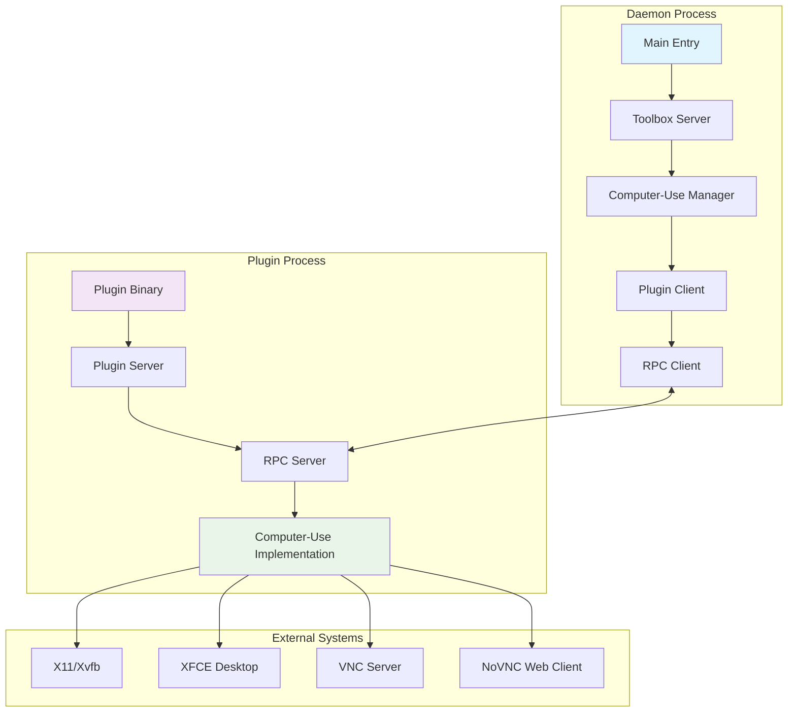
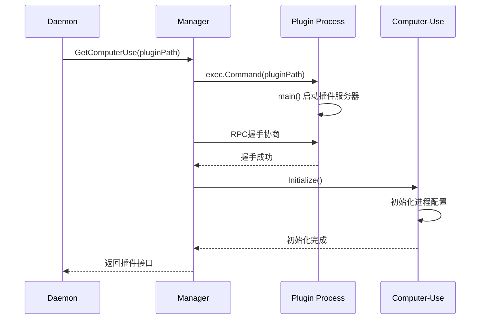
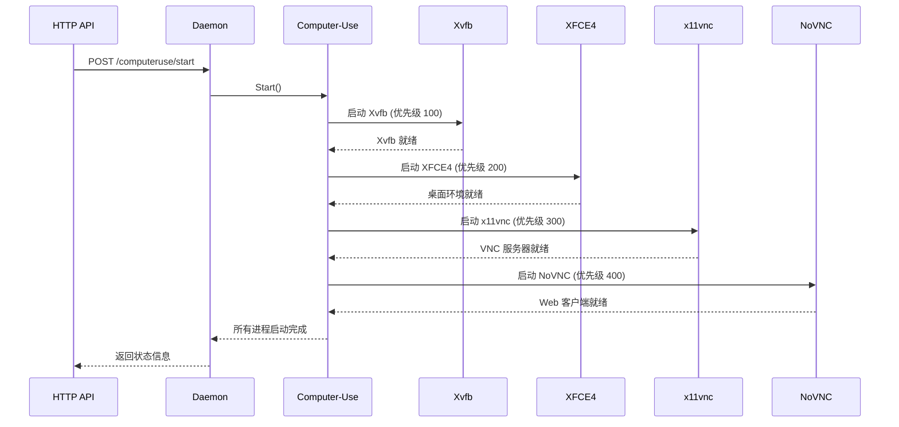
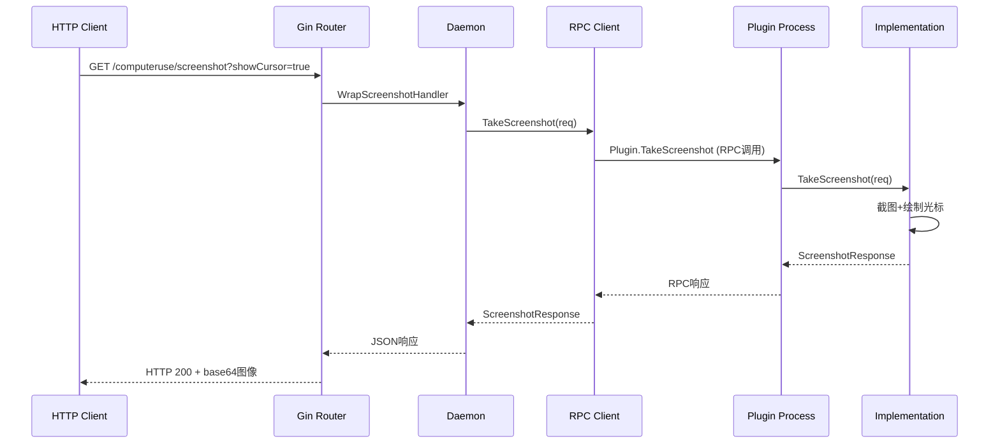

# Daytona Daemon 与 Computer-Use 插件集成架构分析

## 概述

本文档深入分析 Daytona Daemon (`apps/daemon`) 如何通过 HashiCorp Go-Plugin 框架集成和使用 Computer-Use 插件 (`libs/computer-use`)，实现桌面自动化和 GUI 控制功能。

## 架构关系图



## 核心组件分析

### 1. Daemon 侧集成架构

#### 1.1 主入口点

```go
// apps/daemon/cmd/daemon/main.go
func main() {
    toolBoxServer := &toolbox.Server{
        ProjectDir: c.ProjectDir,
    }
    
    // Graceful shutdown
    if toolBoxServer.ComputerUse != nil {
        _, err := toolBoxServer.ComputerUse.Stop()
        // ...
    }
}
```

**关键特点**:

- 主进程启动时创建 `toolbox.Server`
- 优雅关闭时停止 Computer-Use 进程
- 支持信号处理和进程清理

#### 1.2 Toolbox 服务器

```go
// apps/daemon/pkg/toolbox/toolbox.go
type Server struct {
    ProjectDir  string
    ComputerUse computeruse.IComputerUse
}

func (s *Server) Start() error {
    // 插件路径查找
    pluginPath := "/usr/local/lib/daytona-computer-use"
    if _, err := os.Stat(pluginPath); os.IsNotExist(err) {
        pluginPath = path.Join(configDir, "daytona-computer-use")
    }
    
    // 初始化插件
    s.ComputerUse, err = manager.GetComputerUse(pluginPath)
    
    // 注册 HTTP 端点
    computerUseController := r.Group("/computeruse")
    if s.ComputerUse != nil {
        // 启用功能端点
        computerUseController.POST("/start", s.startComputerUse)
        computerUseController.GET("/screenshot", computeruse.WrapScreenshotHandler(...))
        // ...
    } else {
        // 禁用功能中间件
        computerUseController.GET("/status", s.computerUseDisabledMiddleware())
        // ...
    }
}
```

**设计原则**:

- **容错性**: 插件加载失败时继续运行，提供降级功能
- **双路径查找**: 生产环境 (`/usr/local/lib`) + 开发环境 (`configDir`)
- **统一接口**: 无论插件是否可用，都注册相同的 HTTP 端点

#### 1.3 插件管理器

```go
// apps/daemon/pkg/toolbox/computeruse/manager/manager.go
var ComputerUseHandshakeConfig = plugin.HandshakeConfig{
    ProtocolVersion:  1,
    MagicCookieKey:   "DAYTONA_COMPUTER_USE_PLUGIN", 
    MagicCookieValue: "daytona_computer_use",
}

func GetComputerUse(path string) (computeruse.IComputerUse, error) {
    client := plugin.NewClient(&plugin.ClientConfig{
        HandshakeConfig: ComputerUseHandshakeConfig,
        Plugins:         pluginMap,
        Cmd:             exec.Command(path),
        Logger:          logger,
        Managed:         true,
    })
    
    rpcClient, err := client.Client()
    raw, err := rpcClient.Dispense(pluginName)
    impl, ok := raw.(computeruse.IComputerUse)
    
    _, err = impl.Initialize()
    return impl, nil
}
```

**插件生命周期管理**:

1. **发现**: 查找插件二进制文件
2. **握手**: 验证协议版本和魔法值
3. **启动**: 创建子进程和 RPC 连接
4. **初始化**: 调用插件的 `Initialize()` 方法
5. **使用**: 通过 RPC 调用插件方法
6. **清理**: 进程退出时自动清理

#### 1.4 错误处理和依赖检测

```go
func detectPluginError(path string) *ComputerUseError {
    // 执行插件获取详细错误信息
    cmd := exec.Command(path)
    output, err := cmd.CombinedOutput()
    
    // 检测 X11 运行时依赖
    if strings.Contains(output, "libX11") || strings.Contains(output, "libXtst") {
        return &ComputerUseError{
            Type: "dependency",
            Message: "Computer-use plugin requires X11 runtime libraries",
            Details: "Install libx11-6 libxtst6 xvfb x11vnc...",
        }
    }
    
    // 检测权限问题
    if strings.Contains(output, "Permission denied") {
        return &ComputerUseError{Type: "system", ...}
    }
    
    // 检测架构不匹配
    if strings.Contains(output, "wrong ELF class") {
        return &ComputerUseError{Type: "system", ...}
    }
}
```

**智能错误诊断**:

- **运行时依赖**: X11 库缺失检测
- **开发依赖**: 头文件缺失检测
- **系统问题**: 权限、架构兼容性
- **详细建议**: 针对不同系统提供安装命令

### 2. RPC 通信层

#### 2.1 接口定义

```go
// apps/daemon/pkg/toolbox/computeruse/interface.go
type IComputerUse interface {
    // 进程管理
    Initialize() (*Empty, error)
    Start() (*Empty, error)
    Stop() (*Empty, error)
    GetProcessStatus() (map[string]ProcessStatus, error)
    
    // 屏幕截图
    TakeScreenshot(*ScreenshotRequest) (*ScreenshotResponse, error)
    TakeCompressedScreenshot(*CompressedScreenshotRequest) (*ScreenshotResponse, error)
    
    // 鼠标控制
    GetMousePosition() (*MousePositionResponse, error)
    MoveMouse(*MoveMouseRequest) (*MousePositionResponse, error)
    Click(*ClickRequest) (*MouseClickResponse, error)
    
    // 键盘控制
    TypeText(*TypeTextRequest) (*Empty, error)
    PressKey(*PressKeyRequest) (*Empty, error)
    
    // 显示信息
    GetDisplayInfo() (*DisplayInfoResponse, error)
    GetWindows() (*WindowsResponse, error)
}
```

#### 2.2 RPC 客户端

```go
// apps/daemon/pkg/toolbox/computeruse/rpc_client.go
type ComputerUseRPCClient struct {
    client *rpc.Client
}

func (m *ComputerUseRPCClient) TakeScreenshot(request *ScreenshotRequest) (*ScreenshotResponse, error) {
    var resp ScreenshotResponse
    err := m.client.Call("Plugin.TakeScreenshot", request, &resp)
    return &resp, err
}
```

#### 2.3 RPC 服务端

```go
// apps/daemon/pkg/toolbox/computeruse/rpc_server.go
type ComputerUseRPCServer struct {
    Impl IComputerUse
}

func (m *ComputerUseRPCServer) TakeScreenshot(arg *ScreenshotRequest, resp *ScreenshotResponse) error {
    response, err := m.Impl.TakeScreenshot(arg)
    if err != nil {
        return err
    }
    *resp = *response
    return nil
}
```

### 3. Computer-Use 插件实现

#### 3.1 主入口点

```go
// libs/computer-use/main.go
func main() {
    hc_plugin.Serve(&hc_plugin.ServeConfig{
        HandshakeConfig: manager.ComputerUseHandshakeConfig,
        Plugins: map[string]hc_plugin.Plugin{
            "daytona-computer-use": &computeruse.ComputerUsePlugin{
                Impl: &cu.ComputerUse{},
            },
        },
        Logger: logger,
    })
}
```

#### 3.2 核心实现结构

```go
// libs/computer-use/pkg/computeruse/computeruse.go
type ComputerUse struct {
    processes map[string]*Process
    mu        sync.RWMutex
    configDir string
}

type Process struct {
    Name        string
    Command     string
    Args        []string
    Priority    int
    AutoRestart bool
    cmd         *exec.Cmd
    ctx         context.Context
    cancel      context.CancelFunc
    mu          sync.Mutex
    running     bool
}
```

#### 3.3 进程管理

```go
func (c *ComputerUse) initializeProcesses(homeDir string) {
    // Process 1: Xvfb (虚拟显示)
    c.processes["xvfb"] = &Process{
        Name:     "xvfb",
        Command:  "/usr/bin/Xvfb",
        Args:     []string{display, "-screen", "0", resolution + "x24"},
        Priority: 100,
        AutoRestart: true,
    }
    
    // Process 2: XFCE4 (桌面环境)
    c.processes["xfce4"] = &Process{
        Name:     "xfce4", 
        Command:  "/usr/bin/startxfce4",
        Priority: 200,
        AutoRestart: true,
    }
    
    // Process 3: x11vnc (VNC 服务器)
    c.processes["x11vnc"] = &Process{
        Name:     "x11vnc",
        Command:  "/usr/bin/x11vnc",
        Args:     []string{"-display", display, "-rfbport", vncPort, "-forever"},
        Priority: 300,
        AutoRestart: true,
    }
    
    // Process 4: NoVNC (Web VNC 客户端)
    c.processes["novnc"] = &Process{
        Name:     "novnc",
        Command:  "/usr/share/novnc/utils/launch.sh",
        Args:     []string{"--vnc", "localhost:" + vncPort, "--listen", noVncPort},
        Priority: 400,
        AutoRestart: true,
    }
}
```

**进程依赖链**:

1. **Xvfb** (优先级 100): 提供虚拟 X11 显示
2. **XFCE4** (优先级 200): 启动桌面环境
3. **x11vnc** (优先级 300): 暴露 VNC 访问接口
4. **NoVNC** (优先级 400): 提供 Web 访问能力

#### 3.4 GUI 控制实现

```go
// 屏幕截图
func (u *ComputerUse) TakeScreenshot(req *computeruse.ScreenshotRequest) (*computeruse.ScreenshotResponse, error) {
    bounds := screenshot.GetDisplayBounds(0)
    img, err := screenshot.CaptureRect(bounds)
    
    if req.ShowCursor {
        mouseX, mouseY := robotgo.Location()
        drawCursor(rgbaImg, mouseX, mouseY)
    }
    
    // 转换为 base64
    base64Str := base64.StdEncoding.EncodeToString(buf.Bytes())
    return &computeruse.ScreenshotResponse{Screenshot: base64Str}, nil
}

// 鼠标控制
func (u *ComputerUse) MoveMouse(req *computeruse.MoveMouseRequest) (*computeruse.MousePositionResponse, error) {
    robotgo.Move(req.X, req.Y)
    actualX, actualY := robotgo.Location()
    return &computeruse.MousePositionResponse{Position: computeruse.Position{X: actualX, Y: actualY}}, nil
}

// 键盘控制
func (u *ComputerUse) TypeText(req *computeruse.TypeTextRequest) (*computeruse.Empty, error) {
    if req.Delay > 0 {
        robotgo.TypeStr(req.Text, req.Delay)
    } else {
        robotgo.TypeStr(req.Text)
    }
    return new(computeruse.Empty), nil
}
```

**技术依赖**:

- **screenshot**: `github.com/kbinani/screenshot` - 屏幕截图
- **robotgo**: `github.com/go-vgo/robotgo` - 鼠标键盘控制
- **图像处理**: 光标绘制、压缩、缩放

### 4. HTTP API 层

#### 4.1 端点映射

```go
computerUseController := r.Group("/computeruse")
{
    // 管理端点
    computerUseController.POST("/start", s.startComputerUse)
    computerUseController.POST("/stop", s.stopComputerUse)
    computerUseController.GET("/process-status", s.getComputerUseStatus)
    
    // 屏幕截图端点
    computerUseController.GET("/screenshot", computeruse.WrapScreenshotHandler(...))
    computerUseController.GET("/screenshot/region", computeruse.WrapRegionScreenshotHandler(...))
    computerUseController.GET("/screenshot/compressed", computeruse.WrapCompressedScreenshotHandler(...))
    
    // 鼠标控制端点
    computerUseController.GET("/mouse/position", computeruse.WrapMousePositionHandler(...))
    computerUseController.POST("/mouse/move", computeruse.WrapMoveMouseHandler(...))
    computerUseController.POST("/mouse/click", computeruse.WrapClickHandler(...))
    
    // 键盘控制端点
    computerUseController.POST("/keyboard/type", computeruse.WrapTypeTextHandler(...))
    computerUseController.POST("/keyboard/key", computeruse.WrapPressKeyHandler(...))
}
```

#### 4.2 请求处理包装器

```go
func WrapScreenshotHandler(fn func(*ScreenshotRequest) (*ScreenshotResponse, error)) gin.HandlerFunc {
    return func(c *gin.Context) {
        req := &ScreenshotRequest{
            ShowCursor: c.Query("showCursor") == "true",
        }
        response, err := fn(req)
        if err != nil {
            c.JSON(http.StatusBadRequest, gin.H{"error": err.Error()})
            return
        }
        c.JSON(http.StatusOK, response)
    }
}
```

## 通信流程分析

### 1. 插件启动流程



### 2. 桌面进程启动流程  



### 3. API 调用流程



## 关键设计特性

### 1. 容错性设计

- **插件可选**: 插件加载失败时提供降级功能
- **依赖检测**: 智能诊断缺失的系统依赖
- **进程重启**: 自动重启崩溃的桌面进程
- **优雅关闭**: 信号处理和资源清理

### 2. 安全性考虑

- **进程隔离**: 插件运行在独立进程中
- **权限控制**: 最小权限原则
- **输入验证**: HTTP 请求参数验证
- **错误隐藏**: 不暴露内部实现细节

### 3. 性能优化

- **RPC 复用**: 长连接 RPC 通信
- **图像压缩**: 支持 JPEG/PNG 压缩和缩放
- **并发安全**: 使用互斥锁保护共享状态
- **资源管理**: 及时释放文件句柄和内存

### 4. 可维护性

- **接口抽象**: 清晰的插件接口定义
- **错误分类**: 结构化错误处理
- **日志记录**: 详细的操作日志
- **模块分离**: 明确的职责边界

## 部署和运行时要求

### 1. 系统依赖

```bash
# Ubuntu/Debian
apt-get install -y \
    libx11-6 libxrandr2 libxext6 libxrender1 libxfixes3 libxss1 \
    libxtst6 libxi6 libxinerama1 xvfb x11vnc novnc xfce4 \
    xfce4-terminal dbus-x11

# 环境变量
export DISPLAY=:0
export VNC_RESOLUTION=1920x1080  
export VNC_PORT=5901
export NO_VNC_PORT=6080
export VNC_USER=daytona
```

### 2. 插件部署

```bash
# 生产环境路径
/usr/local/lib/daytona-computer-use

# 开发环境路径  
~/.daytona/config/daytona-computer-use
```

### 3. 运行时检查

- X11 显示服务器可用性
- VNC 端口可用性
- 桌面环境依赖完整性
- 插件二进制文件权限

## 总结

Daytona Daemon 与 Computer-Use 插件的集成展现了现代微服务架构的最佳实践:

1. **松耦合设计**: 通过 RPC 实现进程隔离和故障隔离
2. **插件架构**: 可选功能模块，支持动态加载和卸载  
3. **容错机制**: 多层次错误处理和优雅降级
4. **标准化接口**: 统一的 HTTP API 和内部接口定义
5. **运维友好**: 详细的错误诊断和监控能力

这种架构设计使得 Daytona 能够在各种环境中稳定运行，为 AI 代理提供强大的桌面自动化能力。
