# Daytona Backup Manager 深度分析

## 概述

Daytona BackupManager 是 Daytona 沙盒生态系统中负责备份管理的核心组件。它通过自动化的备份创建、状态监控和清理机制，确保沙盒数据的持久化和可恢复性。BackupManager 采用事件驱动架构，结合定时任务和分布式锁机制，提供了高可靠性的备份服务。

## 核心功能概览

### 1. 自动备份创建

- **定时备份检查**: 每5分钟检查需要备份的沙盒
- **停止状态备份**: 每30秒为已停止的沙盒创建备份
- **事件驱动备份**: 响应沙盒归档事件自动创建备份

### 2. 备份状态同步

- **状态监控**: 每10秒同步备份进度
- **进度跟踪**: 监控 PENDING 和 IN_PROGRESS 状态的备份
- **错误重试**: 智能重试机制处理备份失败

### 3. 备份生命周期管理

- **镜像版本管理**: 维护多个备份版本历史
- **自动清理**: 沙盒销毁时清理相关备份
- **镜像验证**: 恢复时验证备份镜像的可用性

## 备份状态枚举

```typescript
export enum BackupState {
  NONE = 'None',           // 无备份
  PENDING = 'Pending',     // 等待备份
  IN_PROGRESS = 'InProgress', // 备份进行中
  COMPLETED = 'Completed', // 备份完成
  ERROR = 'Error',         // 备份错误
}
```

## 架构组件分析

### 核心依赖关系

```typescript
@Injectable()
export class BackupManager {
  constructor(
    @InjectRepository(Sandbox) private readonly sandboxRepository: Repository<Sandbox>,
    private readonly runnerService: RunnerService,
    private readonly runnerApiFactory: RunnerApiFactory,
    private readonly dockerRegistryService: DockerRegistryService,
    @InjectRedis() private readonly redis: Redis,
    private readonly dockerProvider: DockerProvider,
    private readonly redisLockProvider: RedisLockProvider,
  ) {}
}
```

### 关键组件作用

1. **SandboxRepository**: 沙盒实体数据访问
2. **RunnerService**: Runner 节点管理和查询
3. **RunnerApiFactory**: 创建 Runner API 客户端
4. **DockerRegistryService**: 容器镜像仓库管理
5. **DockerProvider**: Docker 镜像操作抽象层
6. **RedisLockProvider**: 分布式锁实现
7. **Redis**: 错误重试计数和缓存

## 定时任务详细分析

### 1. 即时备份检查 (每5分钟)

```typescript
@Cron(CronExpression.EVERY_5_MINUTES, { name: 'ad-hoc-backup-check' })
async adHocBackupCheck(): Promise<void>
```

**执行逻辑**：

1. 获取所有处于 READY 状态的 Runner
2. 查询每个 Runner 上需要备份的沙盒：
   - 状态: STARTED 或 ARCHIVING
   - 备份状态: NONE 或 COMPLETED
   - 排除预热池沙盒
   - 超过1小时未备份的沙盒
3. 并行处理，每个沙盒使用分布式锁防止重复备份
4. 限制每个 Runner 最多处理10个沙盒

**筛选条件**：

```typescript
const sandboxes = await this.sandboxRepository.find({
  where: {
    runnerId: runner.id,
    organizationId: Not(SANDBOX_WARM_POOL_UNASSIGNED_ORGANIZATION),
    state: In([SandboxState.STARTED, SandboxState.ARCHIVING]),
    backupState: In([BackupState.NONE, BackupState.COMPLETED]),
  },
  order: { lastBackupAt: 'ASC' },
  take: 10,
})

// 过滤超过1小时未备份的沙盒
.filter((sandbox) => 
  !sandbox.lastBackupAt || 
  sandbox.lastBackupAt < new Date(Date.now() - 1 * 60 * 60 * 1000)
)
```

### 2. 备份状态同步 (每10秒)

```typescript
@Cron(CronExpression.EVERY_10_SECONDS, { name: 'sync-backup-states' })
async syncBackupStates(): Promise<void>
```

**监控范围**：

- 沙盒状态: STARTED、STOPPED、ARCHIVING
- 备份状态: PENDING、IN_PROGRESS

**状态处理逻辑**：

```typescript
switch (sandbox.backupState) {
  case BackupState.PENDING:
    await this.handlePendingBackup(sandbox)
    break
  case BackupState.IN_PROGRESS:
    await this.checkBackupProgress(sandbox)
    break
}
```

**错误重试机制**：

```typescript
// 错误重试逻辑 (最多10次，5分钟TTL)
const errorRetryKey = `${lockKey}-error-retry`
const errorRetryCount = await this.redis.get(errorRetryKey)
if (parseInt(errorRetryCount) > 10) {
  await this.updateWorkspacBackupState(sandbox.id, BackupState.ERROR)
} else {
  await this.redis.setex(errorRetryKey, 300, errorRetryCount + 1)
}
```

### 3. 停止状态备份创建 (每30秒)

```typescript
@Cron(CronExpression.EVERY_30_SECONDS, { name: 'sync-stop-state-create-backups' })
async syncStopStateCreateBackups(): Promise<void>
```

**目标对象**：

- 沙盒状态: STOPPED 或 ARCHIVING
- 备份状态: NONE
- 必须有分配的 Runner

## 核心方法深度分析

### 1. 备份创建流程 (startBackupCreate)

```typescript
async startBackupCreate(sandboxId: string): Promise<void>
```

**前置验证**：

```typescript
// 状态验证
if (!(
  sandbox.state === SandboxState.STARTED ||
  sandbox.state === SandboxState.ARCHIVING ||
  (sandbox.state === SandboxState.STOPPED && sandbox.runnerId)
)) {
  throw new BadRequestError('Sandbox must be started or stopped with assigned runner')
}

// 避免重复备份
if (sandbox.backupState === BackupState.IN_PROGRESS || 
    sandbox.backupState === BackupState.PENDING) {
  return
}
```

**备份快照命名**：

```typescript
const timestamp = new Date().toISOString().replace(/[:.]/g, '-')
const backupSnapshot = `${registry.url}/${registry.project}/backup-${sandbox.id}:${timestamp}`
```

**备份历史管理**：

```typescript
// 将当前备份添加到历史记录
if (sandbox.lastBackupAt && sandbox.backupSnapshot && 
    [BackupState.NONE, BackupState.COMPLETED].includes(sandbox.backupState)) {
  sandbox.existingBackupSnapshots.push({
    snapshotName: sandbox.backupSnapshot,
    createdAt: sandbox.lastBackupAt,
  })
}

// 添加新备份到历史
existingBackupSnapshots.push({
  snapshotName: backupSnapshot,
  createdAt: new Date(),
})
```

### 2. 等待状态备份处理 (handlePendingBackup)

```typescript
private async handlePendingBackup(sandbox: Sandbox): Promise<void>
```

**Runner 状态检查**：

```typescript
const runnerSandboxResponse = await runnerSandboxApi.info(sandbox.id)
const runnerSandbox = runnerSandboxResponse.data
if (runnerSandbox.backupState?.toUpperCase() === 'IN_PROGRESS') {
  return // 已在进行中，无需重复启动
}
```

**备份启动**：

```typescript
await runnerSandboxApi.createBackup(sandbox.id, {
  registry: {
    url: registry.url,
    username: registry.username,
    password: registry.password,
  },
  snapshot: sandbox.backupSnapshot,
})
```

**错误处理**：

```typescript
if (error.response?.status === 400 && 
    error.response?.data?.message.includes('A backup is already in progress')) {
  await this.updateWorkspacBackupState(sandbox.id, BackupState.IN_PROGRESS)
  return
}
```

### 3. 备份进度检查 (checkBackupProgress)

```typescript
private async checkBackupProgress(sandbox: Sandbox): Promise<void>
```

**状态映射**：

```typescript
switch (sandboxInfo.data.backupState?.toUpperCase()) {
  case 'COMPLETED':
    sandbox.backupState = BackupState.COMPLETED
    sandbox.lastBackupAt = new Date()
    break
  case 'FAILED':
  case 'ERROR':
    await this.updateWorkspacBackupState(sandbox.id, BackupState.ERROR)
    break
}
```

### 4. 备份清理 (deleteSandboxBackupRepositoryFromRegistry)

```typescript
private async deleteSandboxBackupRepositoryFromRegistry(sandbox: Sandbox): Promise<void>
```

**清理逻辑**：

- 在沙盒销毁时触发
- 从 Docker Registry 中删除整个备份仓库
- 错误日志记录但不阻断流程

## 事件驱动机制

### 事件监听器

```typescript
@OnEvent(SandboxEvents.ARCHIVED)
private async handleSandboxArchivedEvent(event: SandboxArchivedEvent) {
  this.startBackupCreate(event.sandbox.id)
}

@OnEvent(SandboxEvents.DESTROYED)
private async handleSandboxDestroyedEvent(event: SandboxDestroyedEvent) {
  this.deleteSandboxBackupRepositoryFromRegistry(event.sandbox)
}

@OnEvent(SandboxEvents.BACKUP_CREATED)
private async handleSandboxBackupCreatedEvent(event: SandboxBackupCreatedEvent) {
  this.handlePendingBackup(event.sandbox)
}
```

### 事件触发时机

1. **ARCHIVED**: 沙盒归档完成时创建备份
2. **DESTROYED**: 沙盒销毁时清理备份
3. **BACKUP_CREATED**: 备份创建事件触发处理

## 分布式锁策略

### 锁的类型和用途

1. **全局同步锁**: `sync-backup-states` (10秒)
   - 确保备份状态同步任务的单实例执行

2. **沙盒级备份锁**: `sandbox-backup-${sandbox.id}` (60秒)
   - 防止同一沙盒的并发备份操作

3. **停止状态锁**: `sync-stop-state-create-backups` (30秒)
   - 停止状态备份创建的全局锁

### 锁使用模式

```typescript
const lockKey = `sandbox-backup-${sandbox.id}`
const hasLock = await this.redisLockProvider.lock(lockKey, 60)
if (!hasLock) {
  return // 无法获取锁，跳过处理
}

try {
  // 执行备份操作
} finally {
  // 锁会自动过期，无需手动释放
}
```

## 备份状态流转图


## 备份恢复集成分析

### 在 SandboxManager 中的使用

BackupManager 创建的备份主要用于沙盒恢复场景，特别是在 `SandboxManager.handleRunnerSandboxStoppedOrArchivedStateOnDesiredStateStart` 方法中：

```typescript
// 验证备份完整性
if (sandbox.backupState !== BackupState.COMPLETED) {
  await this.updateSandboxState(
    sandbox.id, SandboxState.ERROR, undefined,
    'Sandbox has no runner and backup is not completed'
  )
  return DONT_SYNC_AGAIN
}

// 备份快照验证和恢复
const existingBackups = sandbox.existingBackupSnapshots.map(
  (snapshot) => snapshot.snapshotName
)
let validBackup = sandbox.backupSnapshot
let exists = false

while (existingBackups.length > 0) {
  try {
    if (await this.dockerProvider.checkImageExistsInRegistry(validBackup, registry)) {
      exists = true
      break
    }
    validBackup = existingBackups.pop()
  } catch (error) {
    this.logger.error(`Failed to check backup snapshot ${validBackup}`)
  }
}
```

### 备份故障转移机制

1. **主备份验证**: 首先检查 `sandbox.backupSnapshot`
2. **历史备份回退**: 如果主备份不可用，逐个检查 `existingBackupSnapshots`
3. **镜像存在性验证**: 使用 `dockerProvider.checkImageExistsInRegistry` 验证
4. **错误处理**: 无可用备份时将沙盒标记为 ERROR 状态

## 性能优化策略

### 1. 并行处理

```typescript
// 并行处理多个Runner的备份检查
await Promise.all(
  readyRunners.map(async (runner) => {
    // 每个Runner内部的沙盒也并行处理
    await Promise.all(
      sandboxes.map(async (sandbox) => {
        // 备份处理逻辑
      })
    )
  })
)
```

### 2. 批量限制

- 每个 Runner 每次最多处理10个沙盒备份
- 避免系统过载和资源争用

### 3. 智能调度

- 按 `lastBackupAt` 升序排序，优先处理久未备份的沙盒
- 使用分布式锁避免重复处理

### 4. 错误隔离

- 单个沙盒备份失败不影响其他沙盒
- 使用 try-catch 包装每个备份操作

## 监控和可观测性

### 关键日志点

```typescript
// 错误日志
this.logger.error(`Failed to create backup for sandbox ${sandbox.id}:`, fromAxiosError(error))

// 备份仓库删除失败
this.logger.error(
  `Failed to delete backup repository ${sandbox.id} from registry ${registry.id}:`,
  fromAxiosError(error)
)
```

### 监控指标建议

1. **备份成功率**: 完成备份的沙盒数 / 尝试备份的沙盒数
2. **备份平均耗时**: 从 PENDING 到 COMPLETED 的平均时间
3. **错误重试次数**: 每个沙盒的重试统计
4. **备份队列长度**: PENDING 状态的备份数量
5. **存储使用量**: 备份镜像占用的存储空间

## 配置参数分析

### 硬编码配置

- **备份检查频率**: 5分钟
- **状态同步频率**: 10秒
- **停止状态检查**: 30秒
- **备份过期判断**: 1小时
- **错误重试次数**: 10次
- **重试TTL**: 5分钟 (300秒)

### 可优化的配置点

```typescript
// TODO 注释中提到的改进点
// 1. 使备份频率可配置
// 2. 增加批处理大小限制
// 3. 优化重试策略
```

## 安全性考虑

### 1. 访问控制

- 备份镜像存储在组织隔离的 Registry 中
- 使用 Registry 认证信息访问备份

### 2. 数据隔离

- 每个沙盒的备份独立存储
- 备份命名包含沙盒ID，避免冲突

### 3. 清理机制

- 沙盒销毁时自动清理相关备份
- 防止存储空间泄漏

## 故障排除指南

### 常见问题

1. **备份一直处于 PENDING 状态**
   - 检查 Runner 状态是否为 READY
   - 验证 Docker Registry 连接性
   - 检查分布式锁是否被长期持有

2. **备份创建失败**
   - 查看 Runner 日志中的详细错误信息
   - 验证 Registry 认证信息是否正确
   - 检查存储空间是否充足

3. **恢复时找不到备份**
   - 验证 `existingBackupSnapshots` 数组内容
   - 检查 Registry 中镜像是否存在
   - 确认镜像标签格式是否正确

### 调试技巧

```typescript
// 添加调试日志
this.logger.debug(`Starting backup for sandbox ${sandboxId}, current state: ${sandbox.backupState}`)

// 检查备份历史
console.log('Existing backups:', sandbox.existingBackupSnapshots)

// 验证 Registry 连接
await this.dockerProvider.checkImageExistsInRegistry(backupSnapshot, registry)
```

## 未来改进方向

### 1. 功能增强

- **增量备份**: 基于文件变更的增量备份机制
- **压缩优化**: 备份镜像压缩算法优化
- **多区域复制**: 跨区域备份镜像复制

### 2. 性能优化

- **并发控制**: 更精细的并发控制策略
- **缓存机制**: 备份状态和镜像存在性缓存
- **批量操作**: Registry API 的批量调用

### 3. 可靠性提升

- **健康检查**: 定期验证备份镜像完整性
- **自动修复**: 损坏备份的自动检测和修复
- **监控告警**: 备份失败的实时告警机制

### 4. 运维友好

- **配置外部化**: 将硬编码参数移至配置文件
- **指标暴露**: Prometheus 指标接口
- **管理工具**: 备份管理的 CLI 工具

## 系统交互架构图

以下是 BackupManager 与其他系统组件的完整交互流程：


## 备份状态机详细图

```mermaid
stateDiagram-v2
    [*] --> NONE: 沙盒创建
    
    NONE --> PENDING: 触发备份创建<br/>• 超过1小时未备份<br/>• 沙盒停止<br/>• 沙盒归档
    
    PENDING --> IN_PROGRESS: 备份启动成功<br/>runnerApi.createBackup()
    PENDING --> ERROR: 备份启动失败<br/>• Registry连接失败<br/>• Runner不可用
    PENDING --> PENDING: 重复处理<br/>Runner已在备份中
    
    IN_PROGRESS --> COMPLETED: Runner报告完成<br/>backupState='COMPLETED'
    IN_PROGRESS --> ERROR: Runner报告失败<br/>backupState='FAILED/ERROR'
    IN_PROGRESS --> IN_PROGRESS: 备份进行中<br/>等待Runner状态更新
    
    COMPLETED --> NONE: 沙盒重启<br/>重置备份状态
    COMPLETED --> PENDING: 下次备份创建<br/>超过1小时后
    
    ERROR --> PENDING: 重试备份<br/>重试次数 < 10
    ERROR --> ERROR: 达到重试上限<br/>重试次数 ≥ 10
    
    COMPLETED --> [*]: 沙盒销毁<br/>清理备份镜像
    ERROR --> [*]: 沙盒销毁<br/>清理失败的备份
    NONE --> [*]: 沙盒销毁<br/>无备份需清理
    
    note right of PENDING
        分布式锁保护
        sandbox-backup-${id}
        TTL: 60秒
    end note
    
    note right of IN_PROGRESS
        定时监控 (10秒)
        检查Runner状态
    end note
    
    note right of ERROR
        Redis重试计数
        TTL: 5分钟
        最大重试: 10次
    end note
    
    note right of COMPLETED
        更新lastBackupAt
        添加到历史记录
        existingBackupSnapshots
    end note
```



## 系统时序图


## 关键设计模式

### 1. 观察者模式 (Observer Pattern)

- **事件监听**: 通过 `@OnEvent` 装饰器监听沙盒生命周期事件
- **松耦合**: 事件发布者和消费者之间无直接依赖关系
- **扩展性**: 新的备份触发条件可以通过新事件轻松添加

### 2. 策略模式 (Strategy Pattern)

- **错误处理**: 不同错误类型采用不同的重试策略
- **备份验证**: 主备份失败时自动切换到历史备份策略

### 3. 状态模式 (State Pattern)

- **备份状态管理**: 通过 `BackupState` 枚举管理状态转换
- **状态驱动**: 不同状态下执行不同的处理逻辑

### 4. 单例模式 (Singleton Pattern)

- **分布式锁**: Redis 锁确保全局唯一性
- **资源管理**: 避免重复的备份操作

## 代码质量评估

### 优点

1. **高内聚低耦合**: 每个方法职责单一明确
2. **错误处理完善**: 全面的异常捕获和处理机制
3. **并发安全**: 使用 Redis 分布式锁防止竞态条件
4. **可观测性好**: 详细的日志记录便于调试
5. **扩展性强**: 模块化设计便于功能扩展

### 改进建议

1. **配置参数化**: 硬编码的时间间隔应该配置化
2. **指标收集**: 添加 Prometheus 指标用于监控
3. **批量操作**: Registry API 调用可以考虑批量优化
4. **增量备份**: 考虑实现增量备份减少存储开销
5. **健康检查**: 定期验证备份完整性

## 总结

Daytona BackupManager 是一个设计良好的备份管理系统，具有以下核心优势：

1. **自动化程度高**: 通过定时任务和事件驱动实现全自动备份
2. **可靠性强**: 分布式锁、错误重试和状态同步机制确保操作可靠性
3. **扩展性好**: 并行处理和模块化设计支持大规模部署
4. **容错能力强**: 多层备份验证和故障转移机制
5. **架构清晰**: 清晰的状态机和组件职责划分

该系统为 Daytona 平台提供了坚实的数据保护基础，确保用户的开发环境数据安全和可恢复性。通过持续的监控和优化，BackupManager 能够适应不同规模和复杂度的部署场景。

### 核心价值

- **数据安全**: 自动化备份机制确保数据不丢失
- **业务连续性**: 快速恢复能力保证服务可用性
- **运维友好**: 自动化运维减少人工干预
- **成本优化**: 智能调度减少资源浪费
