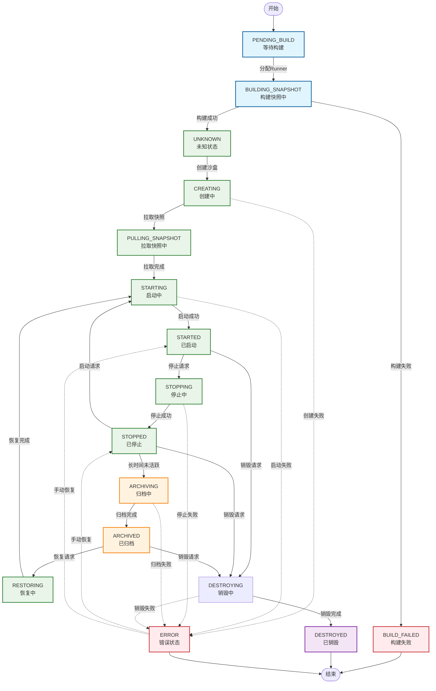

# Daytona Sandbox 状态流转深度分析

## 概述

Daytona 是一个现代化的云开发环境平台，其核心功能是管理开发沙盒（Sandbox）的完整生命周期。本文档深入分析了 Daytona 中 sandbox 状态管理的核心机制，重点关注状态流转过程、同步机制以及与 Runner 组件的交互。

## 核心概念

### 双状态模型

Daytona 采用双状态模型来管理 sandbox 生命周期：

1. **当前状态 (state)**: 表示 sandbox 的实际状态
2. **期望状态 (desiredState)**: 表示 sandbox 应该达到的目标状态

这种设计使系统能够：

- 异步处理状态转换
- 处理分布式环境中的状态一致性问题
- 支持状态转换的中间态追踪

#### 当前状态 (SandboxState)

表示 Sandbox 在任意时刻的实际状态，包含 16 种不同的状态：

```typescript
export enum SandboxState {
  CREATING = 'creating', // 创建中
  RESTORING = 'restoring', // 恢复中
  DESTROYED = 'destroyed', // 已销毁
  DESTROYING = 'destroying', // 销毁中
  STARTED = 'started', // 已启动
  STOPPED = 'stopped', // 已停止
  STARTING = 'starting', // 启动中
  STOPPING = 'stopping', // 停止中
  ERROR = 'error', // 错误状态
  BUILD_FAILED = 'build_failed', // 构建失败
  PENDING_BUILD = 'pending_build', // 等待构建
  BUILDING_SNAPSHOT = 'building_snapshot', // 构建快照中
  UNKNOWN = 'unknown', // 未知状态
  PULLING_SNAPSHOT = 'pulling_snapshot', // 拉取快照中
  ARCHIVING = 'archiving', // 归档中
  ARCHIVED = 'archived', // 已归档
}
```

#### 期望状态 (SandboxDesiredState)

表示用户或系统希望 Sandbox 最终达到的目标状态：

```typescript
export enum SandboxDesiredState {
  DESTROYED = 'destroyed', // 期望销毁
  STARTED = 'started', // 期望启动
  STOPPED = 'stopped', // 期望停止
  RESIZED = 'resized', // 期望调整大小
  ARCHIVED = 'archived', // 期望归档
}
```

### 状态同步机制

Daytona 使用 **事件驱动** + **定时轮询** 的混合同步机制：

- **定时任务**：每 10 秒执行一次状态同步检查
- **事件触发**：状态变更事件触发即时同步
- **分布式锁**：Redis 锁确保同一时刻只有一个实例处理特定沙盒

```typescript
// 核心定时任务
@Cron(CronExpression.EVERY_10_SECONDS, { name: 'sync-states' })
async syncStates(): Promise<void>
```

## 架构组件详解

### SandboxManager

`SandboxManager` 是状态管理的核心组件，负责：

- **定时同步任务**: 每10秒检查状态不一致的 sandbox
- **自动停止检查**: 每分钟检查需要自动停止的 sandbox
- **自动归档检查**: 每分钟检查需要自动归档的 sandbox
- **状态转换逻辑**: 根据期望状态处理具体的状态转换
- **备份系统**: 管理备份状态和备份流程
- **Runner 通信**: 与 Runner 进行状态同步和操作

### Runner 运行环境详解

Runner 是 Daytona 分布式架构的核心执行单元，作为沙盒运行环境的物理载体：

#### Runner 实体结构

```typescript
@Entity()
export class Runner {
  @PrimaryGeneratedColumn('uuid')
  id: string

  @Column({ unique: true })
  domain: string // Runner 访问域名

  @Column()
  apiUrl: string // Runner API 端点

  @Column()
  apiKey: string // API 认证密钥

  // 硬件资源配置
  @Column()
  cpu: number // CPU 核心数

  @Column()
  memory: number // 内存大小(GB)

  @Column()
  disk: number // 磁盘空间(GB)

  @Column()
  gpu: number // GPU 数量

  @Column()
  gpuType: string // GPU 类型

  // 分类和区域
  @Column({
    type: 'enum',
    enum: SandboxClass,
    default: SandboxClass.SMALL,
  })
  class: SandboxClass // 沙盒规格类别

  @Column({
    type: 'enum',
    enum: RunnerRegion,
  })
  region: RunnerRegion // 地理区域

  // 容量管理
  @Column({ default: 0 })
  used: number // 当前使用的沙盒数量

  @Column()
  capacity: number // 最大容量

  // 状态管理
  @Column({
    type: 'enum',
    enum: RunnerState,
    default: RunnerState.INITIALIZING,
  })
  state: RunnerState // Runner 状态

  @Column({ nullable: true })
  lastChecked: Date // 最后健康检查时间

  @Column({ default: false })
  unschedulable: boolean // 是否可调度
}
```

#### Runner 状态枚举

```typescript
export enum RunnerState {
  INITIALIZING = 'initializing', // 初始化中
  READY = 'ready', // 就绪状态
  DISABLED = 'disabled', // 已禁用
  DECOMMISSIONED = 'decommissioned', // 已退役
  UNRESPONSIVE = 'unresponsive', // 无响应
}
```

#### 沙盒规格分类

```typescript
export enum SandboxClass {
  SMALL = 'small', // 小型配置
  MEDIUM = 'medium', // 中型配置
  LARGE = 'large', // 大型配置
}
```

#### 地理区域分布

```typescript
export enum RunnerRegion {
  EU = 'eu', // 欧洲区域
  US = 'us', // 美国区域
  ASIA = 'asia', // 亚洲区域
}
```

#### Runner 选择策略

系统使用智能的 Runner 选择算法：

```typescript
// 负载均衡策略示例
const availableRunners = await this.runnerService.findAvailableRunners({
  region: sandbox.region,
  sandboxClass: sandbox.class,
  snapshotRef: snapshot.internalName,
})

// 排除之前使用的 Runner（容错迁移）
const lessUsedRunners = availableRunners.filter((runner) => runner.id !== sandbox.prevRunnerId)

// 随机选择策略（负载分散）
const randomRunnerIndex = (min: number, max: number) => Math.floor(Math.random() * (max - min + 1) + min)
const selectedRunner = availableRunners[randomRunnerIndex(0, availableRunners.length - 1)]
```

#### Runner 使用率管理

系统实时监控 Runner 使用情况：

```typescript
async recalculateRunnerUsage(runnerId: string) {
  const runner = await this.runnerRepository.findOne({ where: { id: runnerId } })

  // 重新计算使用率
  const sandboxes = await this.sandboxRepository.find({
    where: {
      runnerId: runner.id,
      state: Not(SandboxState.DESTROYED),
    },
  })
  runner.used = sandboxes.length

  await this.runnerRepository.save(runner)
}
```

### Runner API 交互层

通过 `RunnerApiFactory` 创建不同类型的 API 客户端：

```typescript
@Injectable()
export class RunnerApiFactory {
  createSandboxApi(runner: Runner): SandboxApi // 沙盒操作
  createSnapshotApi(runner: Runner): SnapshotsApi // 快照操作
  createToolboxApi(runner: Runner): ToolboxApi // 工具箱操作
  createRunnerApi(runner: Runner): DefaultApi // 通用操作
}
```

#### API 客户端配置

```typescript
createSandboxApi(runner: Runner): SandboxApi {
  const axiosInstance = axios.create({
    baseURL: runner.apiUrl,
    headers: {
      Authorization: `Bearer ${runner.apiKey}`,
    },
    timeout: 1 * 60 * 60 * 1000, // 1小时超时
  })

  // 错误处理拦截器
  axiosInstance.interceptors.response.use(
    (response) => response,
    (error) => {
      const errorMessage = error.response?.data?.message ||
                          error.response?.data ||
                          error.message ||
                          String(error)
      throw new Error(String(errorMessage))
    }
  )

  return new SandboxApi(new Configuration(), '', axiosInstance)
}
```

### BackupManager 备份系统详解

备份系统是 Daytona 数据持久化和灾难恢复的核心组件：

#### 备份状态枚举

```typescript
export enum BackupState {
  NONE = 'None', // 无备份
  PENDING = 'Pending', // 等待备份
  IN_PROGRESS = 'InProgress', // 备份进行中
  COMPLETED = 'Completed', // 备份完成
  ERROR = 'Error', // 备份错误
}
```

#### 备份触发机制

1. **定时备份检查** (每5分钟)：

```typescript
@Cron(CronExpression.EVERY_5_MINUTES, { name: 'ad-hoc-backup-check' })
async adHocBackupCheck(): Promise<void> {
  // 筛选需要备份的沙盒（超过1小时未备份）
  const sandboxes = sandboxes.filter(
    (sandbox) => !sandbox.lastBackupAt ||
    sandbox.lastBackupAt < new Date(Date.now() - 1 * 60 * 60 * 1000)
  )
}
```

2. **停止状态备份** (每30秒)：

```typescript
@Cron(CronExpression.EVERY_30_SECONDS, { name: 'sync-stop-state-create-backups' })
async syncStopStateCreateBackups(): Promise<void> {
  // 为已停止的沙盒创建备份
  const sandboxes = await this.sandboxRepository.find({
    where: {
      state: In([SandboxState.STOPPED, SandboxState.ARCHIVING]),
      backupState: In([BackupState.NONE]),
    },
  })
}
```

3. **事件驱动备份**：

```typescript
@OnEvent(SandboxEvents.ARCHIVED)
private async handleSandboxArchivedEvent(event: SandboxArchivedEvent) {
  this.startBackupCreate(event.sandbox.id)
}
```

#### 备份流程详解

1. **备份创建流程**：

```typescript
async startBackupCreate(sandboxId: string): Promise<void> {
  // 生成备份快照名称
  const timestamp = new Date().toISOString().replace(/[:.]/g, '-')
  const backupSnapshot = `${registry.url}/${registry.project}/backup-${sandbox.id}:${timestamp}`

  // 更新备份历史记录
  const existingBackupSnapshots = sandbox.existingBackupSnapshots
  existingBackupSnapshots.push({
    snapshotName: backupSnapshot,
    createdAt: new Date(),
  })

  // 设置备份状态为等待中
  sandbox.backupState = BackupState.PENDING
  sandbox.backupSnapshot = backupSnapshot
}
```

2. **备份进度监控**：

```typescript
private async checkBackupProgress(sandbox: Sandbox): Promise<void> {
  const sandboxInfo = await runnerSandboxApi.info(sandbox.id)

  switch (sandboxInfo.data.backupState?.toUpperCase()) {
    case 'COMPLETED':
      sandbox.backupState = BackupState.COMPLETED
      sandbox.lastBackupAt = new Date()
      break
    case 'FAILED':
    case 'ERROR':
      await this.updateWorkspacBackupState(sandbox.id, BackupState.ERROR)
      break
  }
}
```

#### 备份恢复机制

系统支持从备份恢复沙盒，即使原始快照已被删除：

```typescript
// 验证备份可用性
const existingBackups = sandbox.existingBackupSnapshots.map((existingSnapshot) => existingSnapshot.snapshotName)
let validBackup = sandbox.backupSnapshot

while (existingBackups.length > 0) {
  try {
    if (await this.dockerProvider.checkImageExistsInRegistry(validBackup, registry)) {
      exists = true
      break
    }
    validBackup = existingBackups.pop()
  } catch (error) {
    this.logger.error(`Failed to check backup snapshot ${validBackup}`)
  }
}
```

### Redis 锁系统

使用 Redis 分布式锁防止并发问题：

```typescript
// 同步实例状态锁
const lockKey = SYNC_INSTANCE_STATE_LOCK_KEY + sandboxId
const acquired = await this.redisLockProvider.lock(lockKey, 360)

// 归档操作锁（限制每个Runner最多3个并发归档）
const archiveLockKey = 'archive-lock-' + sandbox.runnerId
const archiveLockAcquired = await this.redisLockProvider.lock(lockKey, 10)

// 备份操作锁
const backupLockKey = `sandbox-backup-${sandbox.id}`
const backupLockAcquired = await this.redisLockProvider.lock(lockKey, 60)
```

### Warm Pool 预热池机制

系统支持预热池机制来提升沙盒创建速度：

```typescript
@Entity()
export class WarmPool {
  @PrimaryGeneratedColumn('uuid')
  id: string

  @Column()
  pool: number // 预热池大小

  @Column()
  snapshot: string // 快照名称

  @Column({
    type: 'enum',
    enum: RunnerRegion,
  })
  target: RunnerRegion // 目标区域

  @Column({
    type: 'enum',
    enum: SandboxClass,
  })
  class: SandboxClass // 沙盒类别

  // 资源配置
  @Column()
  cpu: number

  @Column()
  mem: number

  @Column()
  disk: number

  @Column()
  gpu: number
}
```

## 状态流转的触发机制

### 1. 事件触发

系统通过事件机制实现即时响应：

```typescript
@OnEvent(SandboxEvents.STARTED)
private async handleSandboxStartedEvent(event: SandboxStartedEvent) {
  this.syncInstanceState(event.sandbox.id).catch(this.logger.error)
}

@OnEvent(SandboxEvents.STOPPED)
private async handleSandboxStoppedEvent(event: SandboxStoppedEvent) {
  this.syncInstanceState(event.sandbox.id).catch(this.logger.error)
}

@OnEvent(SandboxEvents.ARCHIVED)
private async handleSandboxArchivedEvent(event: SandboxArchivedEvent) {
  this.syncInstanceState(event.sandbox.id).catch(this.logger.error)
}

@OnEvent(SandboxEvents.DESTROYED)
private async handleSandboxDestroyedEvent(event: SandboxDestroyedEvent) {
  this.syncInstanceState(event.sandbox.id).catch(this.logger.error)
}

@OnEvent(SandboxEvents.CREATED)
private async handleSandboxCreatedEvent(event: SandboxCreatedEvent) {
  this.syncInstanceState(event.sandbox.id).catch(this.logger.error)
}
```

### 2. API 调用触发

API操作直接更新期望状态并触发事件：

```typescript
async start(sandboxId: string): Promise<void> {
  sandbox.pending = true
  sandbox.desiredState = SandboxDesiredState.STARTED
  await this.sandboxRepository.save(sandbox)
  this.eventEmitter.emit(SandboxEvents.STARTED, new SandboxStartedEvent(sandbox))
}
```

### 3. 定时器触发

系统包含多个定时任务，分别处理不同的状态同步需求：

#### 核心状态同步（每10秒）

```typescript
@Cron(CronExpression.EVERY_10_SECONDS, { name: 'sync-states' })
async syncStates(): Promise<void> {
  // 同步状态不一致的沙盒（排除archived期望状态）
  const sandboxs = await this.sandboxRepository.find({
    where: {
      state: Not(In([SandboxState.DESTROYED, SandboxState.ERROR, SandboxState.BUILD_FAILED])),
      desiredState: Raw(
        () => `"Sandbox"."desiredState"::text != "Sandbox"."state"::text AND "Sandbox"."desiredState"::text != 'archived'`
      ),
    },
    take: 100,
    order: { lastActivityAt: 'DESC' },
  })
}
```

#### 归档状态同步（每10秒）

```typescript
@Cron(CronExpression.EVERY_10_SECONDS, { name: 'sync-archived-desired-states' })
async syncArchivedDesiredStates(): Promise<void> {
  // 专门处理期望状态为ARCHIVED的沙盒
  // 限制每个Runner最多3个并发归档操作
}
```

### 4. 自动化生命周期管理

#### 自动停止检查（每分钟）

```typescript
@Cron(CronExpression.EVERY_MINUTE, { name: 'auto-stop-check' })
async autostopCheck(): Promise<void> {
  // 使用Redis锁确保只有一个实例执行
  if (!(await this.redisLockProvider.lock('auto-stop-check-worker-selected', 60))) {
    return
  }
  
  // 检查超过 autoStopInterval 未活跃的沙盒
  const sandboxs = await this.sandboxRepository.find({
    where: {
      runnerId: runner.id,
      organizationId: Not(SANDBOX_WARM_POOL_UNASSIGNED_ORGANIZATION),
      state: SandboxState.STARTED,
      desiredState: SandboxDesiredState.STARTED,
      pending: Not(true),
      autoStopInterval: Not(0),
      lastActivityAt: Raw((alias) =>
        `${alias} < NOW() - INTERVAL '1 minute' * "autoStopInterval"`
      ),
    },
    order: { lastBackupAt: 'ASC' },
    take: 10, // 限制批处理大小
  })
}
```

#### 自动归档检查（每分钟）

```typescript
@Cron(CronExpression.EVERY_MINUTE, { name: 'auto-archive-check' })
async autoArchiveCheck(): Promise<void> {
  // 检查长时间停止且满足归档条件的沙盒
  const sandboxs = await this.sandboxRepository.find({
    where: {
      runnerId: runner.id,
      organizationId: Not(SANDBOX_WARM_POOL_UNASSIGNED_ORGANIZATION),
      state: SandboxState.STOPPED,
      desiredState: SandboxDesiredState.STOPPED,
      pending: Not(true),
      lastActivityAt: Raw((alias) =>
        `${alias} < NOW() - INTERVAL '1 minute' * "autoArchiveInterval"`
      ),
    },
    order: { lastBackupAt: 'ASC' },
    take: 3, // 每个Runner最多3个归档操作
  })
}
```

### 5. 备份管理定时任务

#### 即时备份检查（每5分钟）

```typescript
@Cron(CronExpression.EVERY_5_MINUTES, { name: 'ad-hoc-backup-check' })
async adHocBackupCheck(): Promise<void> {
  // 筛选需要备份的沙盒（超过1小时未备份）
  const sandboxes = sandboxes.filter(
    (sandbox) => !sandbox.lastBackupAt ||
    sandbox.lastBackupAt < new Date(Date.now() - 1 * 60 * 60 * 1000)
  )
}
```

#### 停止状态备份（每30秒）

```typescript
@Cron(CronExpression.EVERY_30_SECONDS, { name: 'sync-stop-state-create-backups' })
async syncStopStateCreateBackups(): Promise<void> {
  // 为已停止的沙盒创建备份
  const sandboxes = await this.sandboxRepository.find({
    where: {
      state: In([SandboxState.STOPPED, SandboxState.ARCHIVING]),
      backupState: In([BackupState.NONE]),
    },
    take: 10,
  })
}
```

#### 备份状态同步（每10秒）

```typescript
@Cron(CronExpression.EVERY_10_SECONDS, { name: 'sync-backup-states' })
async syncBackupStates(): Promise<void> {
  // 监控进行中的备份操作
  const sandboxes = await this.sandboxRepository.find({
    where: {
      state: In([SandboxState.STARTED, SandboxState.STOPPED, SandboxState.ARCHIVING]),
      backupState: In([BackupState.PENDING, BackupState.IN_PROGRESS]),
    },
  })
}
```

### 6. 期望状态处理逻辑

目前系统实际处理的期望状态包括：

```typescript
switch (sandbox.desiredState) {
  case SandboxDesiredState.STARTED:
    syncState = await this.handleSandboxDesiredStateStarted(sandbox)
    break
  case SandboxDesiredState.STOPPED:
    syncState = await this.handleSandboxDesiredStateStopped(sandbox)
    break
  case SandboxDesiredState.DESTROYED:
    syncState = await this.handleSandboxDesiredStateDestroyed(sandbox)
    break
  case SandboxDesiredState.ARCHIVED:
    syncState = await this.handleSandboxDesiredStateArchived(sandbox)
    break
  // 注意：RESIZED 状态在当前代码中没有具体处理逻辑
}
```

**重要说明**：虽然 `SandboxDesiredState` 枚举中定义了 `RESIZED` 状态，但在当前的 `SandboxManager` 代码中，**没有实现对 `RESIZED` 期望状态的具体处理逻辑**。这表明资源调整功能可能正在开发中或通过其他机制实现。

### 状态验证与约束

实体层面的状态验证确保状态转换的合法性：

```typescript
@BeforeUpdate()
validateDesiredState() {
  switch (this.desiredState) {
    case SandboxDesiredState.STARTED:
      if (![
        SandboxState.STARTED, SandboxState.STOPPED, SandboxState.STARTING,
        SandboxState.ARCHIVED, SandboxState.CREATING, SandboxState.UNKNOWN,
        SandboxState.RESTORING, SandboxState.PENDING_BUILD,
        SandboxState.BUILDING_SNAPSHOT, SandboxState.PULLING_SNAPSHOT,
        SandboxState.ERROR, SandboxState.BUILD_FAILED,
      ].includes(this.state)) {
        throw new Error(`Sandbox ${this.id} is not in a valid state to be started. State: ${this.state}`)
      }
      break
    // 其他状态验证...
  }
}
```

### 分布式锁机制优化

系统使用多层次的锁策略：

```typescript
// 1. 主同步锁（360秒）- 防止同一沙盒的并发操作
const lockKey = SYNC_INSTANCE_STATE_LOCK_KEY + sandboxId
const acquired = await this.redisLockProvider.lock(lockKey, 360)

// 2. 归档锁（10秒）- 限制每个Runner的并发归档数量
const archiveLockKey = 'archive-lock-' + sandbox.runnerId
const archiveLockAcquired = await this.redisLockProvider.lock(lockKey, 10)

// 3. 备份锁（60秒）- 防止重复备份操作
const backupLockKey = `sandbox-backup-${sandbox.id}`
const backupLockAcquired = await this.redisLockProvider.lock(lockKey, 60)

// 4. 工作选择锁（60秒）- 确保定时任务单实例执行
await this.redisLockProvider.lock('auto-stop-check-worker-selected', 60)
```

这种设计确保了：

- **状态一致性**：双状态模型清晰分离当前状态和目标状态
- **可靠性**：分布式锁和重试机制保证操作原子性
- **可扩展性**：事件驱动架构支持水平扩展
- **自动化**：定时任务实现无人值守的生命周期管理
- **性能优化**：分层锁机制和批处理策略提升系统吞吐量

## 完整状态流转图

下面的 Mermaid 图展示了 Sandbox 的完整生命周期状态流转：



## 核心状态转换逻辑

### 1. 同步实例状态主控制器

`syncInstanceState` 方法是状态同步的核心控制器，实现了完整的状态机逻辑：

```typescript
async syncInstanceState(sandboxId: string): Promise<void> {
  // 1. 获取分布式锁，防止并发操作（360秒超时）
  const lockKey = SYNC_INSTANCE_STATE_LOCK_KEY + sandboxId
  const acquired = await this.redisLockProvider.lock(lockKey, 360)
  if (!acquired) return

  // 2. 查询沙盒当前状态
  const sandbox = await this.sandboxRepository.findOneByOrFail({ id: sandboxId })

  // 3. 终态检查：如果已是终态，直接返回
  if ([SandboxState.DESTROYED, SandboxState.ERROR, SandboxState.BUILD_FAILED].includes(sandbox.state)) {
    await this.redisLockProvider.unlock(lockKey)
    return
  }

  let syncState = DONT_SYNC_AGAIN
  try {
    // 4. 根据期望状态分发到对应的处理器
    switch (sandbox.desiredState) {
      case SandboxDesiredState.STARTED:
        syncState = await this.handleSandboxDesiredStateStarted(sandbox)
        break
      case SandboxDesiredState.STOPPED:
        syncState = await this.handleSandboxDesiredStateStopped(sandbox)
        break
      case SandboxDesiredState.DESTROYED:
        syncState = await this.handleSandboxDesiredStateDestroyed(sandbox)
        break
      case SandboxDesiredState.ARCHIVED:
        syncState = await this.handleSandboxDesiredStateArchived(sandbox)
        break
    }
  } catch (error) {
    // 5. 智能错误处理：网络错误重试，业务错误记录
    if (error.code === 'ECONNRESET') {
      syncState = SYNC_AGAIN  // 网络错误，重试
    } else {
      const sandboxError = fromAxiosError(error)
      await this.updateSandboxState(sandbox.id, SandboxState.ERROR, undefined, sandboxError.message)
    }
  }

  await this.redisLockProvider.unlock(lockKey)

  // 6. 递归同步逻辑
  if (syncState === SYNC_AGAIN) {
    this.syncInstanceState(sandboxId)
  }
}
```

### 2. 期望状态：STARTED 的处理流程

启动流程根据当前状态执行不同的处理策略：

```typescript
private async handleSandboxDesiredStateStarted(sandbox: Sandbox): Promise<SyncState> {
  switch (sandbox.state) {
    case SandboxState.PENDING_BUILD:
      // 处理未分配构建的沙盒，分配Runner并开始构建
      return this.handleUnassignedBuildSandbox(sandbox)

    case SandboxState.BUILDING_SNAPSHOT:
      // 检查快照构建状态，等待构建完成
      return this.handleRunnerSandboxBuildingSnapshotStateOnDesiredStateStart(sandbox)

    case SandboxState.UNKNOWN:
      // 创建新的沙盒实例，发送create命令给Runner
      return this.handleRunnerSandboxUnknownStateOnDesiredStateStart(sandbox)

    case SandboxState.ARCHIVED:
    case SandboxState.STOPPED:
      // 恢复或启动已停止的沙盒，处理备份恢复逻辑
      return this.handleRunnerSandboxStoppedOrArchivedStateOnDesiredStateStart(sandbox)

    case SandboxState.RESTORING:
    case SandboxState.CREATING:
      // 检查创建状态，监控拉取快照进度
      return this.handleRunnerSandboxPullingSnapshotStateCheck(sandbox)

    case SandboxState.PULLING_SNAPSHOT:
    case SandboxState.STARTING:
      // 检查启动状态，确认沙盒是否启动成功
      return this.handleRunnerSandboxStartedStateCheck(sandbox)
  }
  return DONT_SYNC_AGAIN
}
```

### 3. 期望状态：STOPPED 的处理流程

停止流程涉及与Runner的协调通信：

```typescript
private async handleSandboxDesiredStateStopped(sandbox: Sandbox): Promise<SyncState> {
  const runner = await this.runnerService.findOne(sandbox.runnerId)
  if (runner.state !== RunnerState.READY) {
    return DONT_SYNC_AGAIN
  }

  switch (sandbox.state) {
    case SandboxState.STARTED:
      // 发送停止命令给Runner
      const runnerSandboxApi = this.runnerApiFactory.createSandboxApi(runner)
      await runnerSandboxApi.stop(sandbox.id)
      await this.updateSandboxState(sandbox.id, SandboxState.STOPPING)
      return SYNC_AGAIN

    case SandboxState.STOPPING:
      // 轮询检查停止状态
      const sandboxInfoResponse = await runnerSandboxApi.info(sandbox.id)
      const sandboxInfo = sandboxInfoResponse.data

      switch (sandboxInfo.state) {
        case RunnerSandboxState.SandboxStateStopped:
          // 停止成功，重置备份状态
          const sandboxToUpdate = await this.sandboxRepository.findOneByOrFail({ id: sandbox.id })
          sandboxToUpdate.state = SandboxState.STOPPED
          sandboxToUpdate.backupState = BackupState.NONE
          await this.sandboxRepository.save(sandboxToUpdate)
          return SYNC_AGAIN

        case RunnerSandboxState.SandboxStateError:
          await this.updateSandboxState(sandbox.id, SandboxState.ERROR, undefined, 'Sandbox is in error state on runner')
          return DONT_SYNC_AGAIN
      }
      return SYNC_AGAIN
  }
  return DONT_SYNC_AGAIN
}
```

### 4. 期望状态：ARCHIVED 的处理流程

归档是最复杂的流程，涉及备份、超时处理和资源清理：

```typescript
private async handleSandboxDesiredStateArchived(sandbox: Sandbox): Promise<SyncState> {
  // 1. 获取归档锁，限制并发归档数量（每个Runner最多3个）
  const lockKey = 'archive-lock-' + sandbox.runnerId
  if (!(await this.redisLockProvider.lock(lockKey, 10))) {
    return DONT_SYNC_AGAIN
  }

  // 2. 检查同Runner上的归档数量限制
  const inProgressOnRunner = await this.sandboxRepository.find({
    where: { runnerId: sandbox.runnerId, state: In([SandboxState.ARCHIVING]) },
    take: 100,
  })

  if (!inProgressOnRunner.find(s => s.id === sandbox.id)) {
    if (inProgressOnRunner.length > 2) {
      await this.redisLockProvider.unlock(lockKey)
      return DONT_SYNC_AGAIN
    }
  }

  switch (sandbox.state) {
    case SandboxState.STOPPED:
      await this.updateSandboxState(sandbox.id, SandboxState.ARCHIVING)
      // 继续到ARCHIVING处理

    case SandboxState.ARCHIVING:
      await this.redisLockProvider.unlock(lockKey)

      // 3. 检查备份错误和重试逻辑
      if (sandbox.backupState === BackupState.ERROR) {
        const retryCount = await this.getArchiveRetryCount(sandbox.id)
        if (retryCount > 3) {
          await this.updateSandboxState(sandbox.id, SandboxState.ERROR, undefined, 'Failed to archive sandbox')
          return DONT_SYNC_AGAIN
        }
        // 重置备份状态重试
        await this.sandboxRepository.update(sandbox.id, { backupState: BackupState.PENDING })
        return DONT_SYNC_AGAIN
      }

      // 4. 超时检查（120分钟）
      const twoHoursAgo = new Date(Date.now() - 120 * 60 * 1000)
      if (sandbox.lastActivityAt < twoHoursAgo) {
        await this.updateSandboxState(sandbox.id, SandboxState.ERROR, undefined, 'Archiving operation timed out')
        return DONT_SYNC_AGAIN
      }

      // 5. 等待备份完成
      if (sandbox.backupState !== BackupState.COMPLETED) {
        return DONT_SYNC_AGAIN
      }

      // 6. 备份完成，销毁Runner上的沙盒实例
      const runner = await this.runnerService.findOne(sandbox.runnerId)
      const runnerSandboxApi = this.runnerApiFactory.createSandboxApi(runner)

      try {
        const sandboxInfoResponse = await runnerSandboxApi.info(sandbox.id)
        const sandboxInfo = sandboxInfoResponse.data

        switch (sandboxInfo.state) {
          case RunnerSandboxState.SandboxStateDestroying:
            return SYNC_AGAIN  // 等待销毁完成
          case RunnerSandboxState.SandboxStateDestroyed:
            await this.updateSandboxState(sandbox.id, SandboxState.ARCHIVED, null)
            return DONT_SYNC_AGAIN
          default:
            await runnerSandboxApi.destroy(sandbox.id)
            return SYNC_AGAIN
        }
      } catch (error) {
        // 处理沙盒已销毁的情况
        if (this.isSandboxNotFoundError(error)) {
          await this.updateSandboxState(sandbox.id, SandboxState.ARCHIVED, null)
          return DONT_SYNC_AGAIN
        }
        throw error
      }
  }
  return DONT_SYNC_AGAIN
}
```

### 5. 期望状态：DESTROYED 的处理流程

销毁流程需要处理不同当前状态的清理逻辑：

```typescript
private async handleSandboxDesiredStateDestroyed(sandbox: Sandbox): Promise<SyncState> {
  // 1. 已归档的沙盒直接标记为销毁（无需Runner操作）
  if (sandbox.state === SandboxState.ARCHIVED) {
    await this.updateSandboxState(sandbox.id, SandboxState.DESTROYED)
    return DONT_SYNC_AGAIN
  }

  const runner = await this.runnerService.findOne(sandbox.runnerId)
  if (runner.state !== RunnerState.READY) {
    return DONT_SYNC_AGAIN
  }

  switch (sandbox.state) {
    case SandboxState.DESTROYED:
      return DONT_SYNC_AGAIN

    case SandboxState.DESTROYING:
      // 检查销毁状态并清理资源
      const runnerSandboxApi = this.runnerApiFactory.createSandboxApi(runner)
      try {
        const sandboxInfoResponse = await runnerSandboxApi.info(sandbox.id)
        const sandboxInfo = sandboxInfoResponse.data

        if (sandboxInfo.state === RunnerSandboxState.SandboxStateDestroyed ||
            sandboxInfo.state === RunnerSandboxState.SandboxStateError) {
          await runnerSandboxApi.removeDestroyed(sandbox.id)
        }
      } catch (e) {
        // 404表示沙盒已不存在
        if (e.response?.status !== 404) throw e
      }

      await this.updateSandboxState(sandbox.id, SandboxState.DESTROYED)
      return SYNC_AGAIN

    default:
      // 发送销毁命令
      try {
        const runnerSandboxApi = this.runnerApiFactory.createSandboxApi(runner)
        const sandboxInfoResponse = await runnerSandboxApi.info(sandbox.id)
        const sandboxInfo = sandboxInfoResponse.data

        if (sandboxInfo?.state === RunnerSandboxState.SandboxStateDestroyed) {
          await this.updateSandboxState(sandbox.id, SandboxState.DESTROYING)
          return SYNC_AGAIN
        }
        await runnerSandboxApi.destroy(sandbox.id)
      } catch (e) {
        if (e.response?.status !== 404) throw e
      }

      await this.updateSandboxState(sandbox.id, SandboxState.DESTROYING)
      return SYNC_AGAIN
  }
}
```

## 高级特性与优化策略

### 负载均衡与容错机制

#### 智能Runner迁移

系统支持基于负载的智能沙盒迁移：

```typescript
// 使用率阈值检查
const usageThreshold = 35
const runningSandboxsCount = await this.sandboxRepository.count({
  where: {
    runnerId: sandbox.runnerId,
    state: SandboxState.STARTED,
  },
})

if (runningSandboxsCount > usageThreshold) {
  // 寻找负载较低的Runner
  const availableRunners = await this.runnerService.findAvailableRunners({
    region: sandbox.region,
    sandboxClass: sandbox.class,
  })
  const lessUsedRunners = availableRunners.filter((runner) => runner.id !== sandbox.runnerId)

  if (lessUsedRunners.length > 0) {
    // 迁移到新Runner
    await this.sandboxRepository.update(sandbox.id, {
      runnerId: null,
      prevRunnerId: sandbox.runnerId,
    })
  }
}
```

#### 不可调度Runner处理

```typescript
// 检查Runner是否可调度
if (sandbox.runnerId) {
  const runner = await this.runnerService.findOne(sandbox.runnerId)
  if (runner.unschedulable) {
    // 检查备份完整性
    if (sandbox.backupState !== BackupState.COMPLETED) {
      // 备份未完成，继续使用当前Runner
    } else {
      // 迁移到可调度的Runner
      sandbox.prevRunnerId = sandbox.runnerId
      sandbox.runnerId = null
    }
  }
}
```

#### 前序Runner清理机制

当沙盒迁移到新Runner后，系统会自动清理前序Runner上的残留资源：

```typescript
// 如果沙盒被迁移到新Runner，清理旧Runner上的资源
if (sandbox.prevRunnerId) {
  const runner = await this.runnerService.findOne(sandbox.prevRunnerId)
  const runnerSandboxApi = this.runnerApiFactory.createSandboxApi(runner)
  
  try {
    // 首先尝试销毁沙盒
    await runnerSandboxApi.destroy(sandbox.id)

    // 等待销毁完成
    let retries = 0
    while (retries < 10) {
      try {
        const sandboxInfo = await runnerSandboxApi.info(sandbox.id)
        if (sandboxInfo.data.state === RunnerSandboxState.SandboxStateDestroyed) {
          break
        }
      } catch (e) {
        if (e.response?.status === 404) break // 沙盒已不存在
        throw e
      }
      await new Promise((resolve) => setTimeout(resolve, 1000 * retries))
      retries++
    }

    // 最终移除已销毁的沙盒
    await runnerSandboxApi.removeDestroyed(sandbox.id)
    sandbox.prevRunnerId = null
  } catch (e) {
    this.logger.error(`Failed to cleanup sandbox ${sandbox.id} on previous runner:`, fromAxiosError(e))
  }
}
```

### 备份与恢复的高级逻辑

#### 多备份源故障转移

```typescript
// 验证备份可用性并实现故障转移
const existingBackups = sandbox.existingBackupSnapshots.map((existingSnapshot) => existingSnapshot.snapshotName)
let validBackup
let exists = false

while (existingBackups.length > 0) {
  try {
    if (!validBackup) {
      // 优先使用最新的备份快照
      validBackup = sandbox.backupSnapshot
      existingBackups.pop()
    } else {
      // 回退到历史备份
      validBackup = existingBackups.pop()
    }
    if (await this.dockerProvider.checkImageExistsInRegistry(validBackup, registry)) {
      exists = true
      break
    }
  } catch (error) {
    this.logger.error(`Failed to check backup snapshot ${validBackup}:`, fromAxiosError(error))
  }
}

if (!exists) {
  await this.updateSandboxState(sandbox.id, SandboxState.ERROR, undefined, 'No valid backup snapshot found')
  return SYNC_AGAIN
}
```

### Runner健康监控

虽然文档中提到了健康检查，但实际的 `SandboxManager` 代码中并没有包含Runner健康检查逻辑。健康检查很可能是在单独的 `RunnerManager` 或相关服务中实现。

### 资源配置体系

#### 默认资源配置

```typescript
const DEFAULT_CPU = 2
const DEFAULT_MEMORY = 4
const DEFAULT_DISK = 10
const DEFAULT_GPU = 0
```

#### 动态资源验证

```typescript
private async validateOrganizationQuotas(
  organization: Organization,
  cpu: number,
  mem: number,
  disk: number
): Promise<void> {
  // 实现组织级别的资源配额验证
}
```

### 性能优化与可扩展性

#### 并发控制策略

1. **分布式锁粒度优化**：

   - 实例级锁：`sync-instance-state-{sandboxId}` (360秒)
   - Runner级锁：`archive-lock-{runnerId}` (10秒)
   - 操作级锁：`sandbox-backup-{sandboxId}` (60秒)
   - 工作选择锁：`auto-stop-check-worker-selected` (60秒)

2. **批处理优化**：

```typescript
// 批量处理备份检查
await Promise.all(
  readyRunners.map(async (runner) => {
    const sandboxes = await this.sandboxRepository.find({
      where: { runnerId: runner.id },
      take: 10, // 限制批处理大小
    })

    await Promise.all(
      sandboxes.map(async (sandbox) => {
        // 并行处理每个沙盒
      }),
    )
  }),
)
```

#### 事件驱动扩展

系统支持丰富的事件机制：

```typescript
export const SandboxEvents = {
  ARCHIVED: 'sandbox.archived',
  STATE_UPDATED: 'sandbox.state.updated',
  DESIRED_STATE_UPDATED: 'sandbox.desired-state.updated',
  CREATED: 'sandbox.created',
  STARTED: 'sandbox.started',
  STOPPED: 'sandbox.stopped',
  DESTROYED: 'sandbox.destroyed',
  RESIZED: 'sandbox.resized',
  BACKUP_CREATED: 'sandbox.backup.created',
} as const
```

#### 错误处理与重试策略

```typescript
// 智能错误处理
try {
  // 状态转换逻辑
} catch (error) {
  if (error.code === 'ECONNRESET') {
    syncState = SYNC_AGAIN  // 网络错误，自动重试
  } else {
    // 业务错误记录
    const sandboxError = fromAxiosError(error)
    await this.updateSandboxState(sandbox.id, SandboxState.ERROR, undefined, sandboxError.message)
  }
}
```

## 总结

Daytona 的 sandbox 状态管理系统展现了现代云平台在分布式环境下的复杂状态协调能力。关键特性包括：

1. **双状态模型**: 分离当前状态和期望状态，支持异步状态转换
2. **分布式Runner架构**: 支持多区域、多规格的Runner集群管理
3. **智能负载均衡**: 基于使用率的动态Runner分配和迁移
4. **完整备份体系**: 多层次备份机制确保数据安全和快速恢复
5. **分布式锁机制**: Redis锁机制确保状态转换的原子性和一致性
6. **事件驱动架构**: 支持水平扩展和实时响应
7. **智能重试和错误恢复**: 网络错误自动重试，业务错误进入错误状态
8. **自动化生命周期**: 基于时间和活跃度的自动停止和归档
9. **预热池优化**: Warm Pool机制提升沙盒创建速度
10. **容错迁移**: 支持Runner故障时的自动沙盒迁移

### 技术亮点

- **多频率定时任务**: 从每10秒到每小时的不同粒度任务调度
- **分层锁机制**: 360秒同步锁、10秒归档锁、60秒备份锁的精确控制
- **终态优化**: 自动跳过已销毁、错误、构建失败的沙盒
- **故障转移**: 多备份源的智能选择和验证
- **资源感知**: 基于使用率阈值的智能调度决策

### 架构优势

这套设计为大规模云开发环境提供了可靠、高效、可扩展的资源管理能力，能够处理复杂的多租户场景和大规模并发操作。特别是在分布式环境下的状态一致性保证和自动化运维方面，体现了企业级平台的成熟设计理念。

**注意**: `RESIZED` 期望状态虽然在枚举中定义，但当前版本的 `SandboxManager` 中没有实现相应的处理逻辑，这可能表明资源调整功能正在开发中或通过其他机制实现。
