# HashiCorp Go-Plugin 框架完整学习指南

## 🎯 学习目标

通过本案例，您将学会：

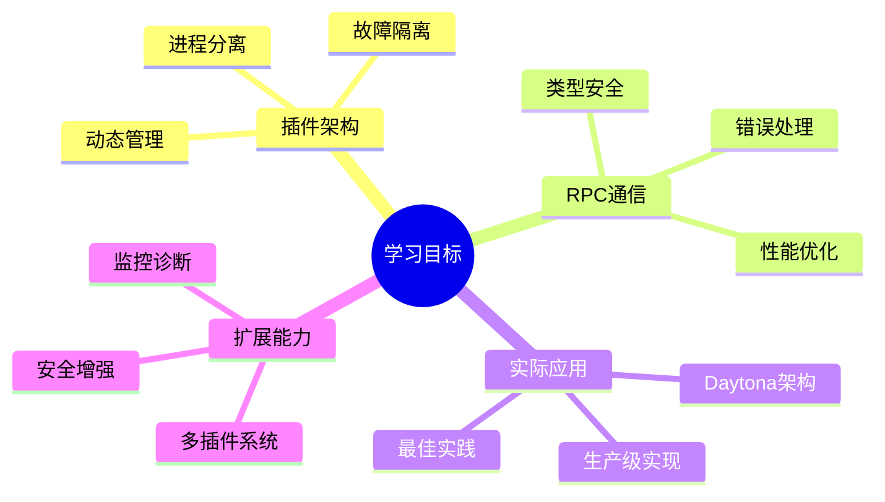

1. **理解插件架构**: 掌握进程分离和 RPC 通信的核心概念
2. **实现插件系统**: 从零构建一个完整的插件框架
3. **掌握最佳实践**: 学习错误处理、性能优化和安全设计
4. **应用到实际项目**: 理解 Daytona 等项目的架构设计

## 🏗️ 项目架构深度解析

### 整体架构图

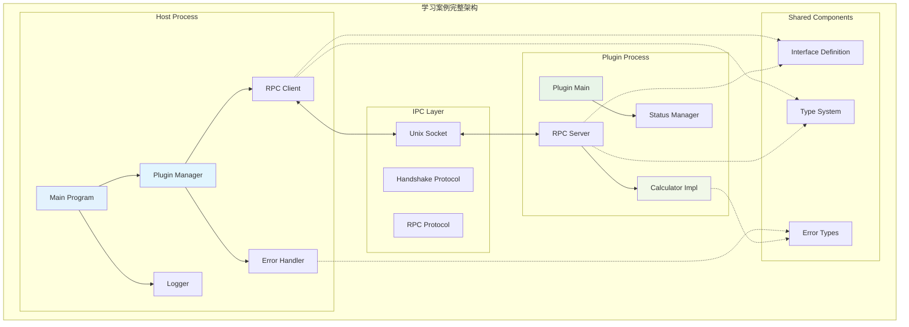

### 数据流图

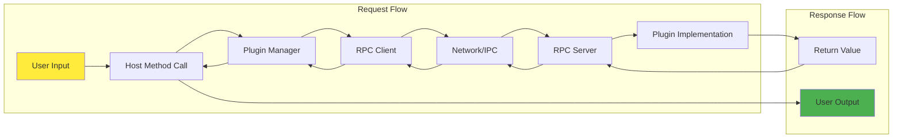

## 📁 项目结构详解

```
hashicorp-go-plugin-example/
├── 📋 文档系统
│   ├── README.md              # 项目概述和快速开始
│   ├── TUTORIAL.md            # 详细技术教程
│   ├── GUIDE.md              # 本学习指南
│   └── SETUP.md              # Go Workspace 集成配置
├── 🔧 构建系统
│   ├── Makefile              # 构建和运行脚本
│   ├── build.sh              # 自动化构建脚本
│   ├── go.mod                # Go 模块定义
│   └── project.json          # Nx 项目配置
├── 🤝 共享接口层 
│   ├── interface.go          # 插件接口定义
│   └── types.go              # 数据类型和 RPC 实现
├── 🖥️ 主程序层
│   ├── main.go               # 程序入口点
│   └── plugin_manager.go     # 插件生命周期管理
├── 🔌 插件实现层
│   ├── main.go               # 插件入口点
│   └── implementation.go     # 具体功能实现
└── 📚 示例和测试
    ├── basic/                # 基本用法演示
    │   └── main.go
    └── advanced_features.go   # 高级功能演示
```

## 🚀 分阶段学习路径

### 第一阶段：基础理解（1-2小时）

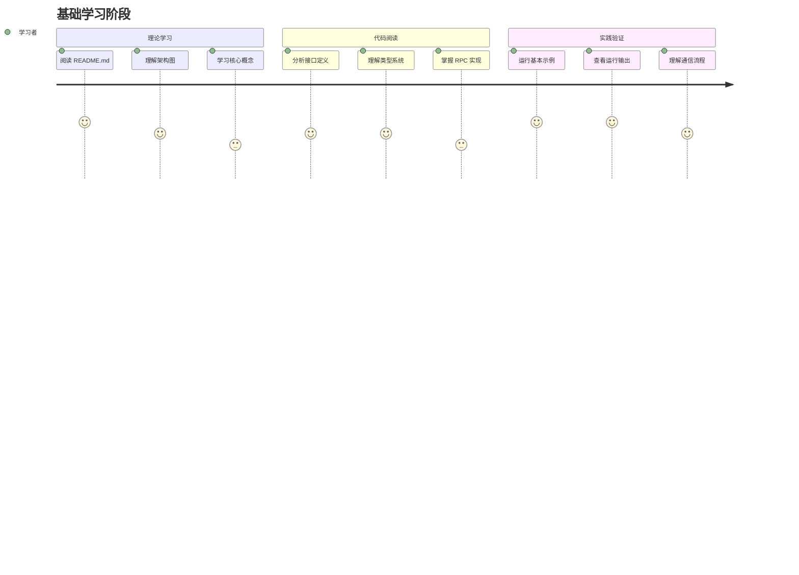

#### 📖 必读文件清单

- [ ] `shared/interface.go` - 理解接口设计原则
- [ ] `shared/types.go` - 学习 RPC 通信结构
- [ ] `TUTORIAL.md` - 掌握理论基础
- [ ] `README.md` - 了解项目整体架构

#### 🔧 实践验证

```bash
# 快速验证环境
make build

# 基础功能测试
make run-basic
make run-advanced  # 查看高级功能演示
```

**预期学习成果**：

- ✅ 理解插件架构的核心优势
- ✅ 掌握 RPC 通信的基本原理
- ✅ 能够成功运行示例程序

### 第二阶段：深入实现（2-3小时）

```mermaid
gantt
    title 深入实现学习计划
    dateFormat  HH:mm
    axisFormat %H:%M
    
    section 插件实现
    分析业务逻辑        :a1, 08:00, 30m
    理解启动流程        :a2, after a1, 30m
    
    section 主程序架构
    学习插件管理        :b1, 09:00, 45m
    理解集成方式        :b2, after b1, 30m
    
    section 完整演示
    运行主程序          :c1, 10:15, 15m
    分析输出结果        :c2, after c1, 30m
```

#### 🔍 深度代码分析

- [ ] `plugin/implementation.go` - 学习业务逻辑实现
- [ ] `plugin/main.go` - 理解插件启动流程  
- [ ] `host/plugin_manager.go` - 学习插件管理策略
- [ ] `host/main.go` - 理解系统集成方式

#### 🏃‍♂️ 运行完整演示

```bash
# 完整功能演示
make run-host

# 观察日志输出
# 理解生命周期管理
# 分析性能指标
```

**预期学习成果**：

- ✅ 掌握插件的完整生命周期
- ✅ 理解主程序的管理策略
- ✅ 能够分析系统性能指标

### 第三阶段：实践扩展（3-4小时）

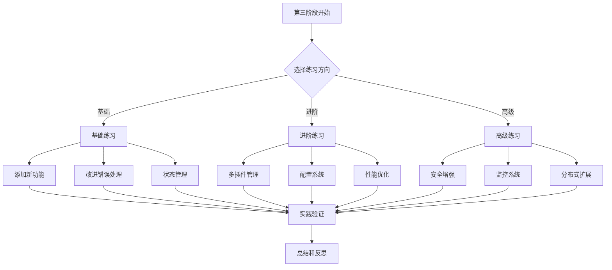

#### 📚 基础练习

**任务 1: 扩展计算器功能**

```go
// 在 shared/interface.go 中添加
Sqrt(a float64) (float64, error)
Power(base, exp float64) (float64, error)
Factorial(n int) (int, error)
```

**实现步骤**:

1. 修改接口定义
2. 更新 RPC 客户端和服务端
3. 在插件中实现具体逻辑
4. 编写测试用例验证

**任务 2: 改进错误处理**

```go
// 定义详细错误类型
type CalculatorError struct {
    Code    ErrorCode
    Message string
    Details map[string]interface{}
}
```

#### 🔧 进阶练习

**任务 1: 多插件管理系统**

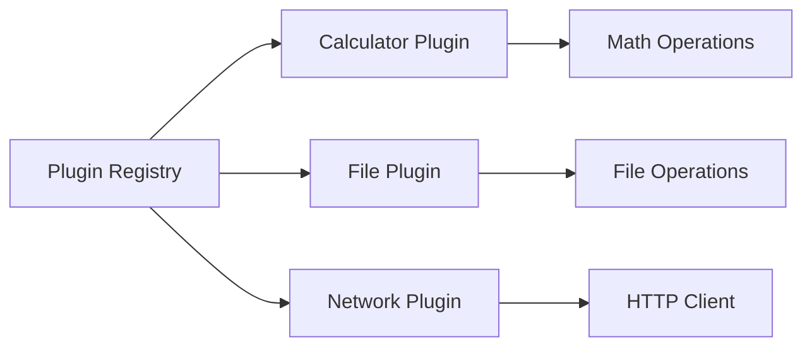

**任务 2: 配置管理系统**

```yaml
# plugin-config.yaml
plugins:
  calculator:
    precision: 10
    timeout: 30s
  file-ops:
    max_file_size: "100MB"
    allowed_paths: ["/tmp", "/data"]
```

#### 🚀 高级练习

**任务 1: 安全增强**

- TLS 加密通信
- 插件签名验证
- 权限控制系统

**任务 2: 监控和诊断**

- 健康检查端点
- 性能指标收集
- 故障自动恢复

## 🔍 核心技术深度剖析

### 接口设计模式分析

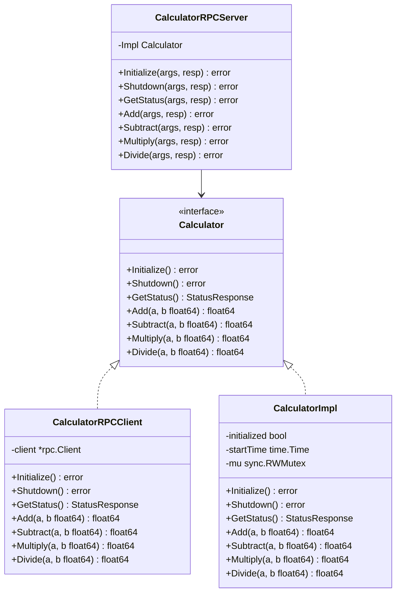

### 通信协议详细分析

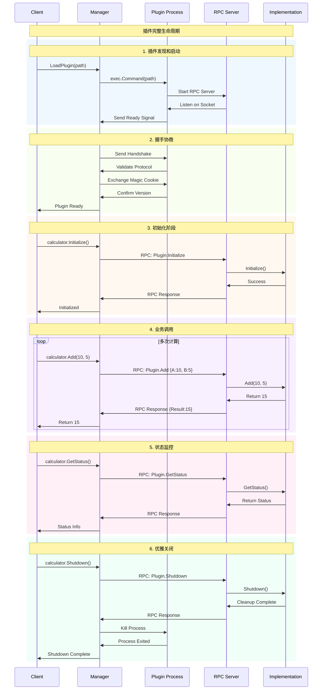

## 🎯 与 Daytona 架构的深度对比

### 架构映射关系表

| 组件类型 | 学习案例 | Daytona 实际项目 | 功能对比 |
|---------|----------|------------------|----------|
| **主程序** | `host/main.go` | `apps/daemon/cmd/daemon/main.go` | 程序入口，初始化系统 |
| **插件管理** | `PluginManager` | `computeruse/manager/manager.go` | 插件生命周期管理 |
| **接口定义** | `Calculator` | `IComputerUse` | 统一的插件接口 |
| **RPC 客户端** | `CalculatorRPCClient` | `rpc_client.go` | 主程序侧的 RPC 调用 |
| **RPC 服务端** | `CalculatorRPCServer` | `rpc_server.go` | 插件侧的 RPC 处理 |
| **插件实现** | `CalculatorImpl` | `computeruse.go` | 具体的业务逻辑 |
| **HTTP 集成** | 可扩展 | `toolbox.go` | REST API 封装 |

### 设计模式对比分析

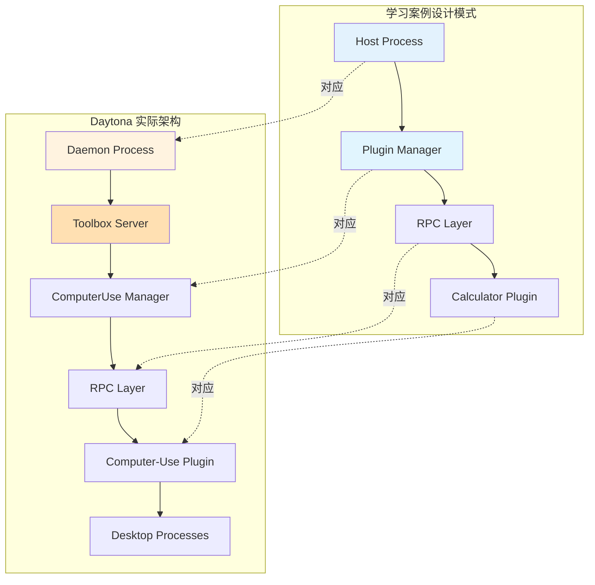

### 实际应用场景映射

**学习案例中的计算操作**：

```go
// 简单的数学计算
result, err := calculator.Add(10, 5)
result, err := calculator.Divide(100, 20)
```

**Daytona 中的桌面控制操作**：

```go
// 复杂的桌面交互
screenshot, err := computerUse.TakeScreenshot()
err = computerUse.LeftClick(100, 200)
err = computerUse.TypeText("Hello World")
```

## 🛠️ 开发实践和调试技巧

### 日志和调试配置

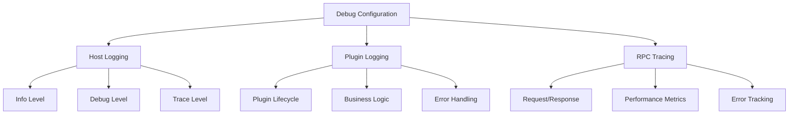

### 性能测试和优化

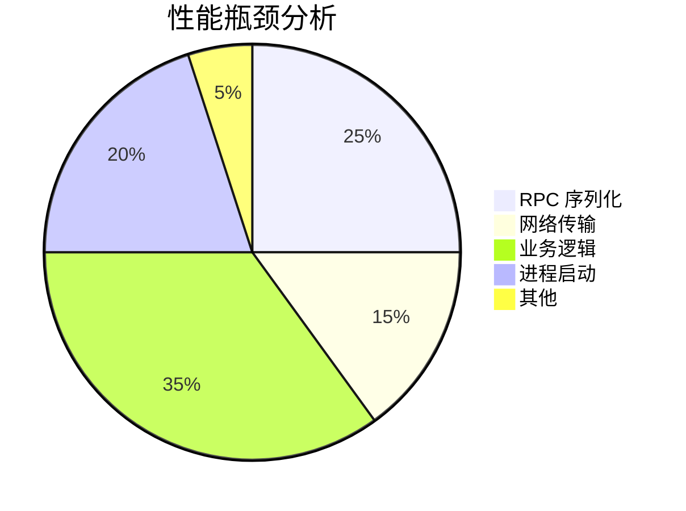

### 常见问题诊断流程

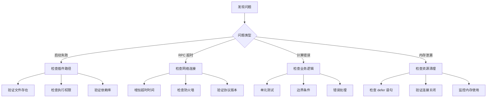

## 📈 进阶学习方向

### 安全增强路线图

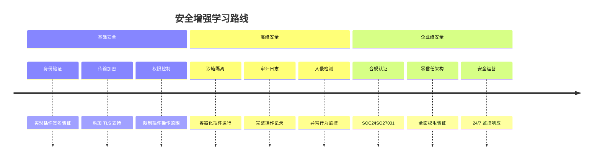

### 性能优化路线图

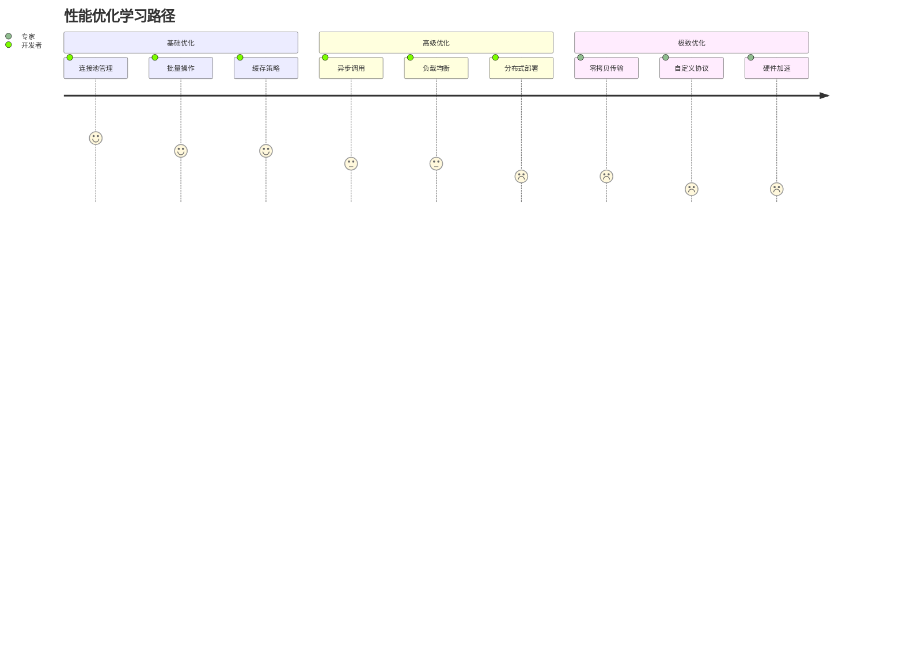

## 🎓 学习成果评估

### 能力评估矩阵

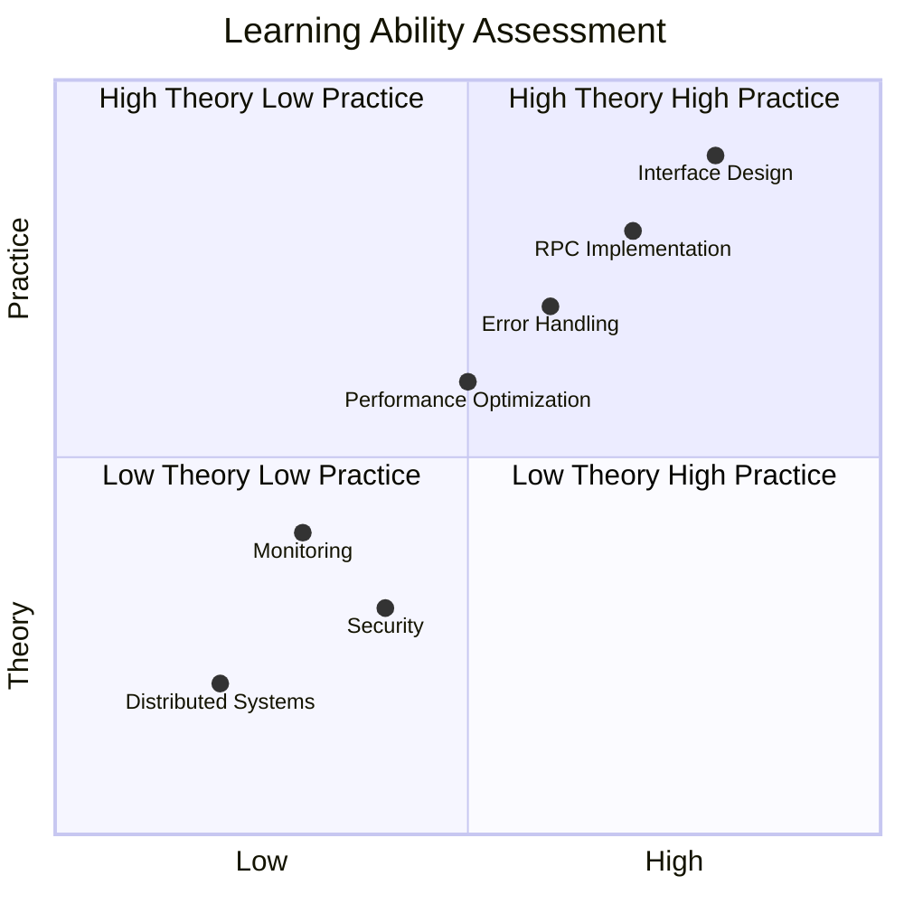

### 自检清单

**🎯 基础理解** (必须掌握):

- [ ] 理解插件架构的核心优势和适用场景
- [ ] 掌握 RPC 通信原理和实现方式
- [ ] 能够成功运行和测试所有示例
- [ ] 理解错误处理和生命周期管理

**🔧 实现能力** (熟练掌握):

- [ ] 能够修改接口并实现新功能
- [ ] 理解并能优化性能瓶颈
- [ ] 掌握调试和诊断技巧
- [ ] 能够处理各种异常情况

**🚀 应用能力** (深度掌握):

- [ ] 能够设计和实现新的插件类型
- [ ] 理解并能实现安全增强措施
- [ ] 掌握分布式架构设计原理
- [ ] 能够指导他人学习和实践

### 实战项目建议

**🎮 项目 1: 扩展计算器生态**

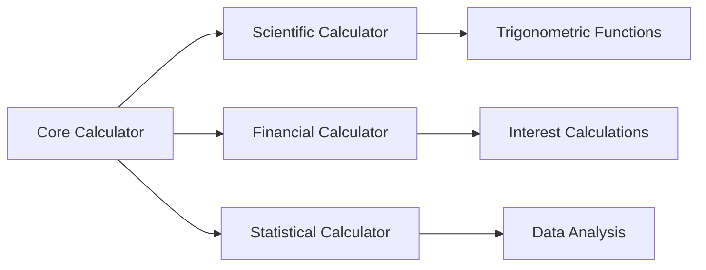

**📁 项目 2: 文件操作插件系统**

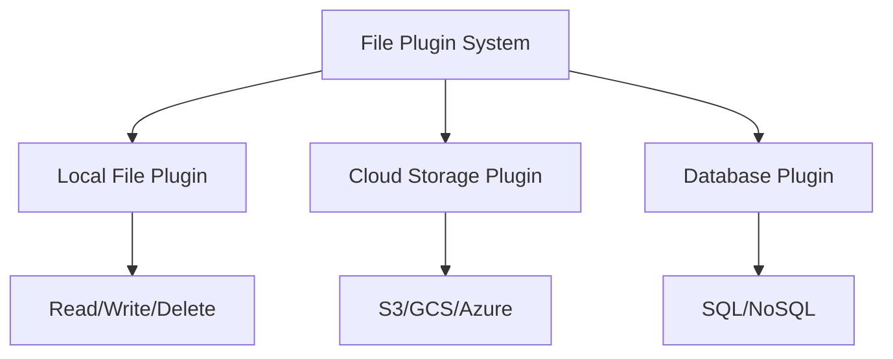

**🌐 项目 3: 微服务插件框架**

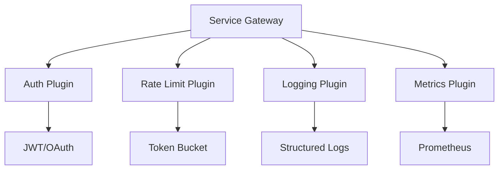

## 📚 扩展学习资源

### 官方文档和最佳实践

- 📖 [HashiCorp go-plugin 官方文档](https://github.com/hashicorp/go-plugin)
- 🔧 [Go RPC 标准库文档](https://pkg.go.dev/net/rpc)
- 🏗️ [插件架构设计模式](https://martinfowler.com/articles/plugins.html)

### 开源项目案例研究

- 🎯 [Daytona](https://github.com/daytonaio/daytona) - 本案例的灵感来源
- 🔨 [Terraform Providers](https://registry.terraform.io/browse/providers) - 大规模插件生态
- 🔐 [Vault Plugins](https://www.vaultproject.io/docs/plugins) - 安全相关插件
- 🌊 [Grafana Plugins](https://grafana.com/docs/grafana/latest/developers/plugins/) - 可视化插件系统

### 技术深度学习

- 🔄 [Go 并发编程](https://go.dev/doc/articles/race_detector)
- 🏢 [微服务架构模式](https://microservices.io/patterns/)
- 📊 [分布式系统设计](https://dancres.github.io/Pages/)
- 🛡️ [系统安全设计](https://owasp.org/www-project-application-security-verification-standard/)

---

🎉 **恭喜您完成了 HashiCorp Go-Plugin 框架的深度学习！**

通过本指南的系统学习，您已经：

✅ **掌握了插件架构的核心设计原理**  
✅ **理解了 RPC 通信的实现细节**  
✅ **具备了构建生产级插件系统的能力**  
✅ **了解了 Daytona 等实际项目的架构思路**

现在您可以将这些知识应用到实际项目中，构建可扩展、可维护、安全可靠的分布式插件系统。

🚀 **继续探索，成为插件架构的专家！**
