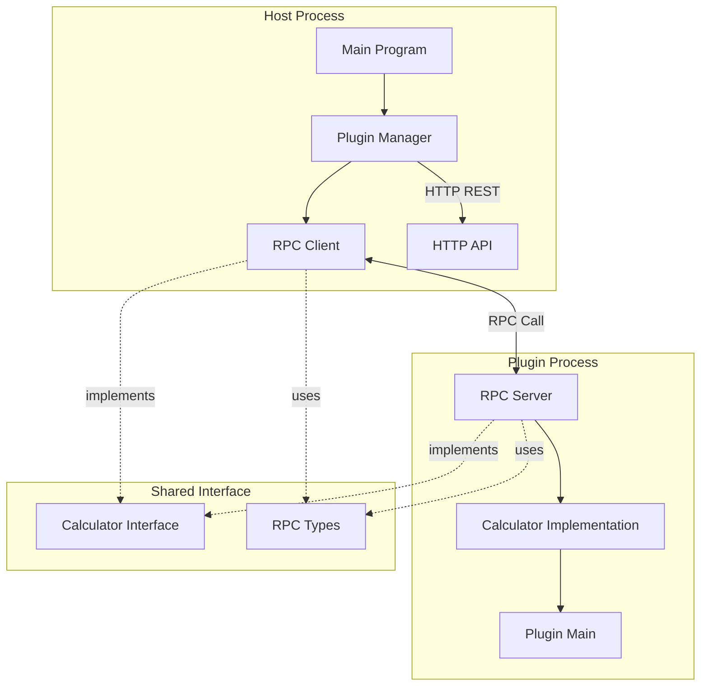
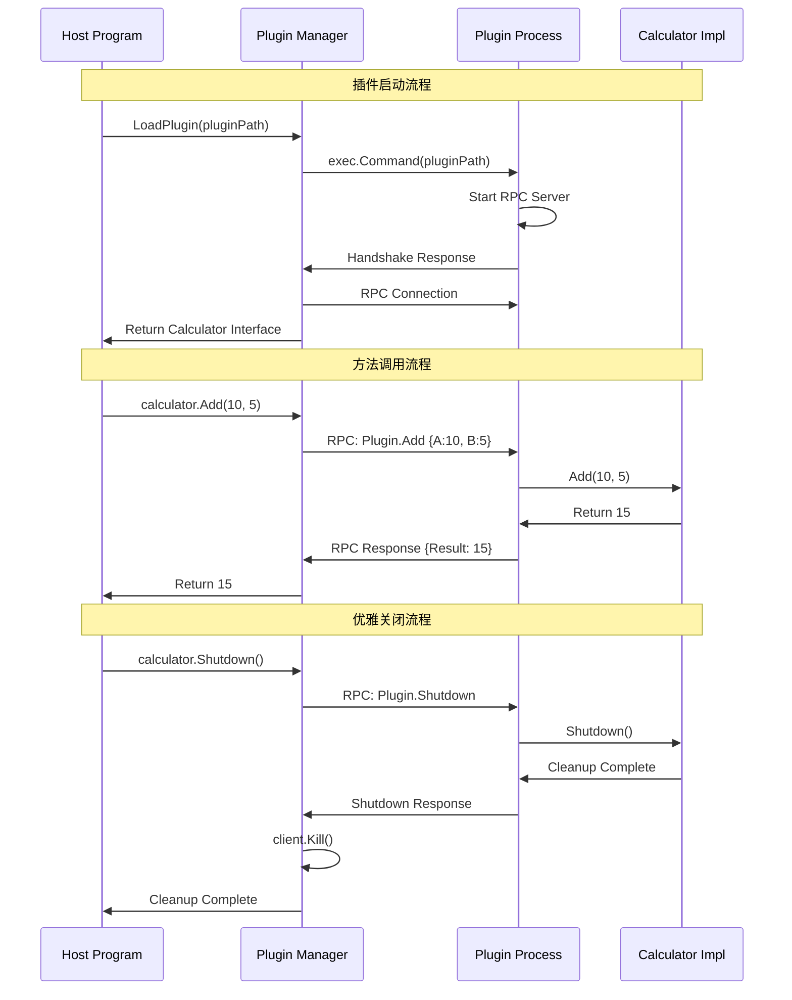
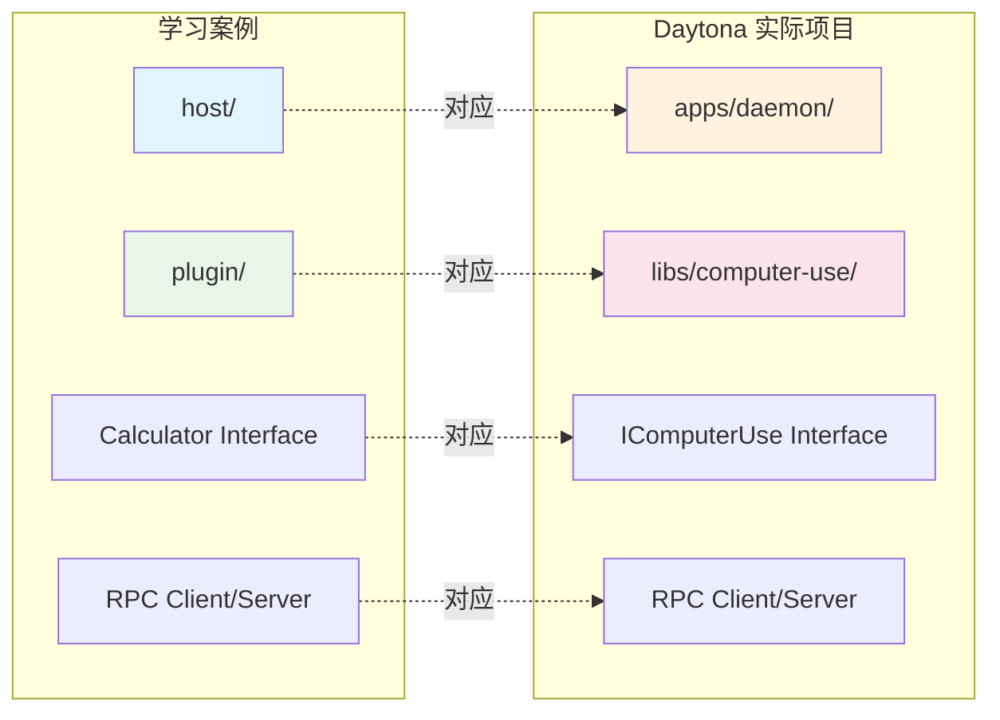

# HashiCorp Go-Plugin 框架学习案例

## 概述

本案例演示如何使用 HashiCorp Go-Plugin 框架实现跨进程 RPC 通信，模拟 Daytona Daemon 与 Computer-Use 插件的交互模式。

## 项目架构



## 项目结构

```
deep-docs/hashicorp-go-plugin-example/
├── README.md                    # 本文档
├── GUIDE.md                     # 完整学习指南
├── TUTORIAL.md                  # 技术教程
├── SETUP.md                     # 配置说明
├── go.mod                       # Go 模块文件
├── project.json                 # Nx 项目配置
├── Makefile                     # 构建脚本
├── shared/                      # 共享接口和类型定义
│   ├── interface.go            # 插件接口定义
│   └── types.go                # 数据类型和 RPC 实现
├── host/                        # 主程序 (类似 Daemon)
│   ├── main.go                 # 主程序入口
│   └── plugin_manager.go       # 插件管理器
├── plugin/                      # 插件实现
│   ├── main.go                 # 插件入口
│   └── implementation.go       # 具体功能实现
└── examples/                    # 使用示例
    ├── basic/                   # 基本用法示例
    │   └── main.go             # 示例程序入口
    └── advanced_features.go     # 高级功能演示
```

## 核心特性

### 🔌 插件架构

- **进程分离**: 主程序和插件运行在独立进程中
- **故障隔离**: 插件崩溃不影响主程序
- **动态管理**: 支持插件的加载、启动和关闭

### 🔗 RPC 通信

- **跨进程调用**: 通过 RPC 实现方法调用
- **类型安全**: 强类型接口定义
- **错误传播**: 完整的错误处理机制

### 🛠️ 生命周期管理

- **握手协商**: 插件启动时的版本验证
- **状态监控**: 实时监控插件运行状态
- **优雅关闭**: 安全的资源清理

## 快速开始

### 方式一：使用 Makefile（推荐）

```bash
# 在学习案例目录下
cd deep-docs/hashicorp-go-plugin-example

# 构建所有组件
make build

# 运行主程序演示
make run-host

# 运行基本示例
make run-basic

# 运行高级功能示例
make run-advanced
```

### 方式二：使用 Nx 命令

```bash
# 在项目根目录下
nx build hashicorp-go-plugin-example
nx run-host hashicorp-go-plugin-example
nx run-basic hashicorp-go-plugin-example
nx run-advanced hashicorp-go-plugin-example
```

### 方式三：手动构建

```bash
cd deep-docs/hashicorp-go-plugin-example

# 1. 编译插件
cd plugin
go build -o ../calculator-plugin .
cd ..

# 2. 编译主程序
cd host
go build -o ../host-program .
cd ..

# 3. 编译示例
cd examples/basic
go build -o ../../basic-example .
cd ../..

cd examples
go build -o ../advanced-example advanced_features.go
cd ..

# 4. 运行
./host-program         # 完整演示
./basic-example        # 基本示例
./advanced-example     # 高级功能示例
```

## 通信流程



## 预期输出

### 主程序演示

```
=== HashiCorp Go-Plugin 学习案例 ===
主程序启动中...
[INFO] 发现插件: calculator-plugin
[INFO] 插件握手成功
[INFO] 插件初始化完成

=== 基本计算演示 ===
插件状态: active (版本: 1.0.0)
计算结果: 10 + 5 = 15.00
计算结果: 20 - 8 = 12.00
计算结果: 6 * 7 = 42.00
计算结果: 84 / 2 = 42.00

=== 错误处理演示 ===
除零错误处理: division by zero

=== 性能测试 ===
执行 1000 次计算耗时: 40ms (平均: 40µs/次)

[INFO] 插件关闭完成
```

### 高级功能演示

```
=== 高级功能示例 ===
1. 连接到插件...
2. 测试初始化...
3. 执行多个操作...
  加法 结果: 150.00
  减法 结果: 70.00
  乘法 结果: 96.00
  除法 结果: 12.00
4. 测试错误处理...
  ✓ 除零错误正确处理: division by zero
5. 性能测试...
  执行 10000 次操作
  总耗时: 287ms
  错误数: 0
  吞吐量: 34811 ops/sec
6. 状态监控...
  插件进程存活: true
7. 优雅关闭...
  ✓ 插件关闭成功
```

## 学习重点

### 🎯 核心概念

- **接口设计**: 跨进程接口定义的最佳实践
- **RPC 通信**: 客户端/服务端实现模式
- **进程管理**: 子进程生命周期管理
- **错误处理**: 分层错误处理策略

### 🔍 实现细节

- **握手机制**: 版本协商和安全验证
- **序列化**: 参数和返回值的序列化
- **并发安全**: 多线程环境下的安全调用
- **资源管理**: 内存和连接的正确清理

### 📈 性能优化

- **连接复用**: RPC 连接的复用策略
- **批量操作**: 减少 RPC 调用次数
- **超时控制**: 合理的超时设置
- **监控指标**: 性能指标的收集和分析

## 扩展练习

### 📚 基础练习

1. **添加新功能**: 为计算器添加开平方、取对数等功能
2. **改进错误处理**: 实现更详细的错误分类和处理
3. **状态管理**: 添加计算历史记录功能

### 🔧 进阶练习

1. **实现新插件**: 创建文件操作插件 (读取、写入、删除文件)
2. **多插件管理**: 同时管理多个不同类型的插件
3. **配置管理**: 添加插件配置文件支持

### 🚀 高级练习

1. **安全增强**: 实现 TLS 加密通信和身份验证
2. **热重载**: 实现插件的动态重载功能
3. **分布式架构**: 支持网络远程插件调用

## 与 Daytona 的关联



### 设计模式映射

- **主程序**: `host/` ↔ `apps/daemon/`
- **插件**: `plugin/` ↔ `libs/computer-use/`
- **接口**: `Calculator` ↔ `IComputerUse`
- **管理器**: `PluginManager` ↔ `computeruse/manager`
- **通信**: 计算操作 ↔ 桌面控制操作

通过学习本案例，您将深入理解 Daytona 的插件架构设计原理和实现细节。

## 其他文档

- 📖 [完整学习指南](./GUIDE.md) - 分阶段学习路径和实战练习
- 🔧 [技术教程](./TUTORIAL.md) - 详细的技术实现解析
- ⚙️ [配置说明](./SETUP.md) - Go Workspace 集成配置

---

🎯 **开始您的插件架构学习之旅！** 从基础概念到生产级实现，掌握现代分布式系统的核心设计模式。
