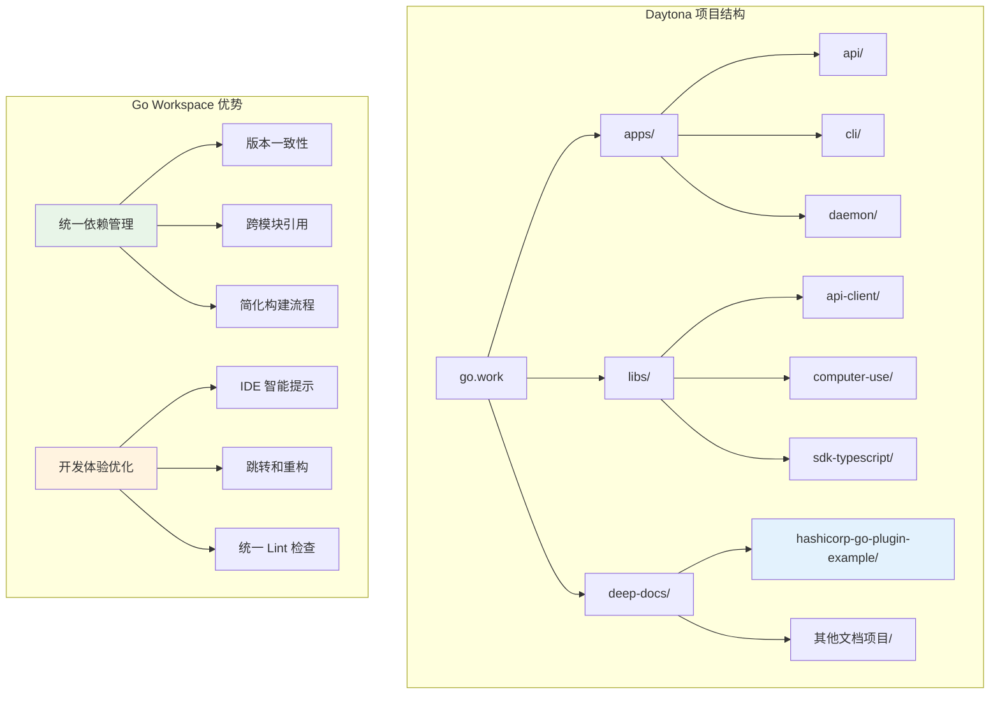
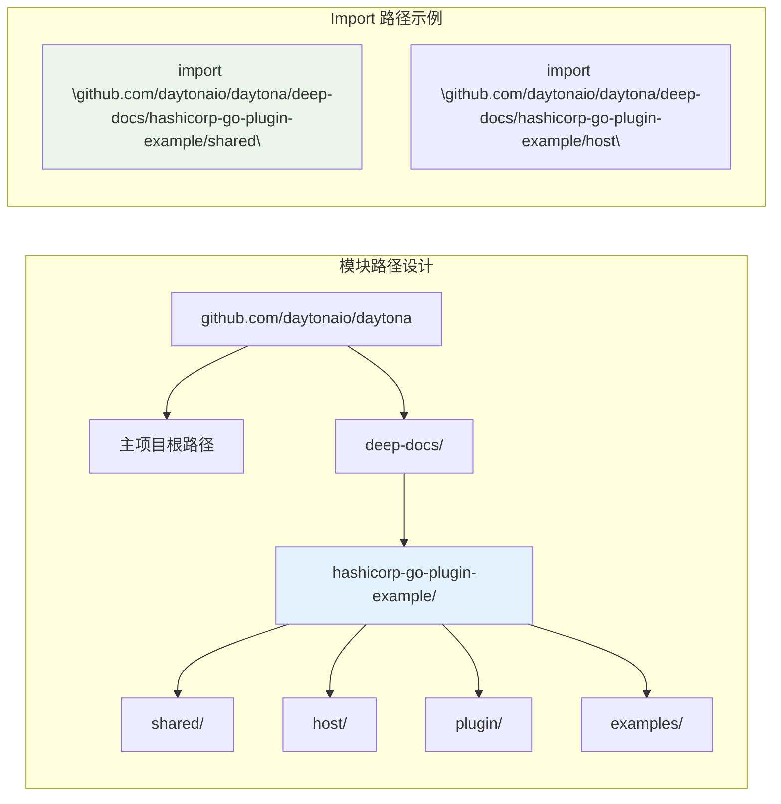
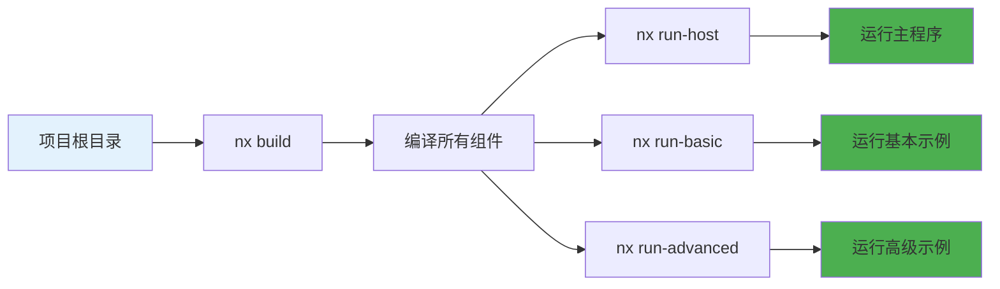
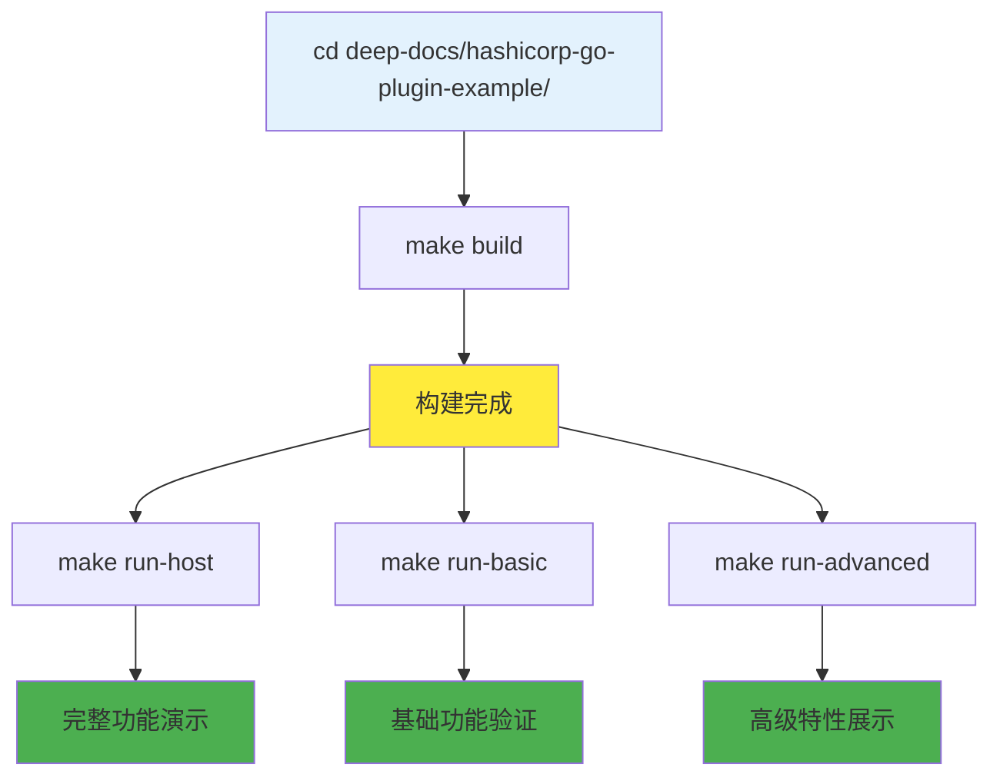
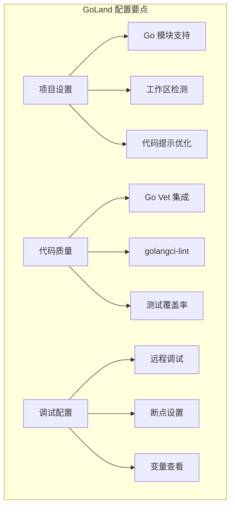
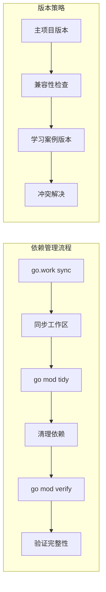
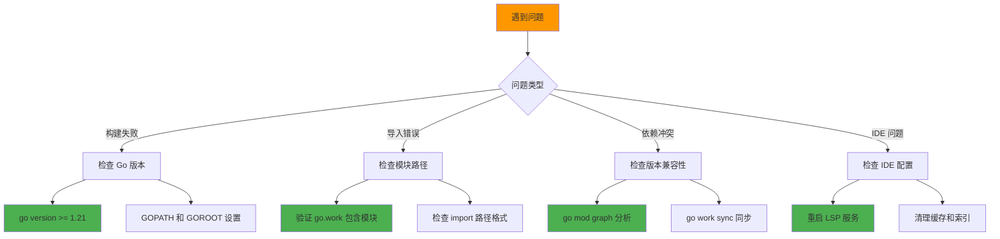
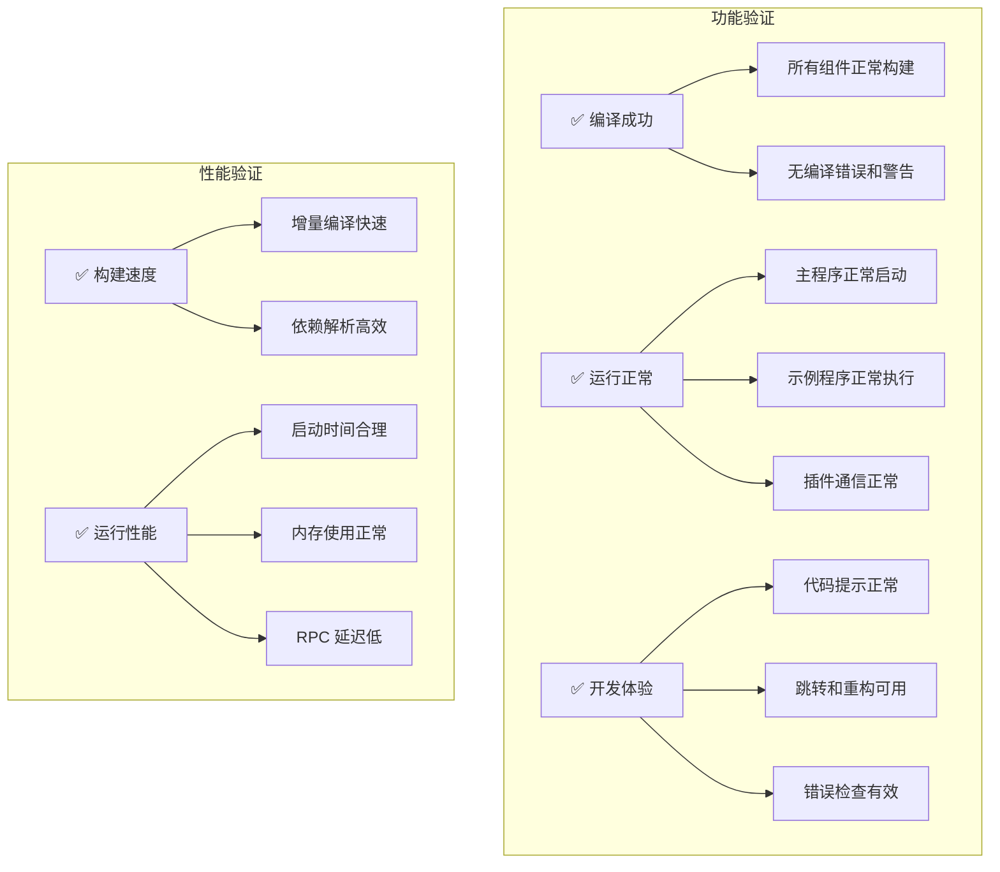
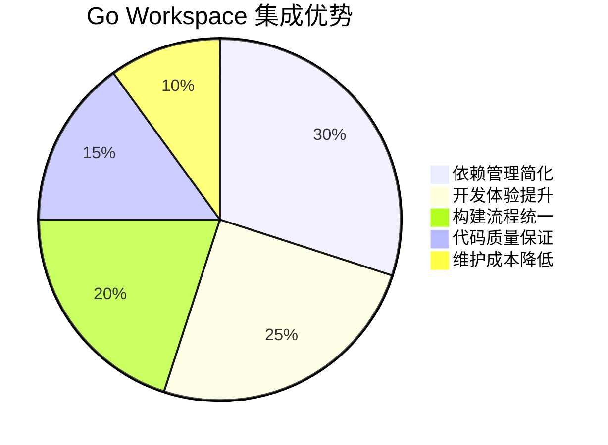

# Go Workspace 集成配置指南

## 🎯 配置概述

本学习案例采用了现代化的 Go Workspace 模式，与 Daytona 主项目实现统一的依赖管理和构建流程。这种集成方式不仅简化了开发环境配置，还提供了更好的代码提示、错误检查和项目管理能力。

## 🏗️ 集成架构图



## ⚙️ 配置详解

### 1. Go Workspace 配置

#### 根目录配置文件

```go
// go.work - 位于项目根目录
go 1.21

use (
    ./apps/api
    ./apps/cli
    ./apps/daemon
    ./apps/dashboard
    ./apps/proxy
    ./apps/runner
    ./libs/api-client-go
    ./libs/common-go
    ./libs/computer-use
    ./libs/sdk-typescript
    ./deep-docs/hashicorp-go-plugin-example  // 学习案例模块
)
```

#### 学习案例模块配置

```go
// deep-docs/hashicorp-go-plugin-example/go.mod
module github.com/daytonaio/daytona/deep-docs/hashicorp-go-plugin-example

go 1.21

require (
    github.com/hashicorp/go-hclog v1.6.2
    github.com/hashicorp/go-plugin v1.6.0
)

require (
    github.com/fatih/color v1.13.0 // indirect
    github.com/golang/protobuf v1.5.3 // indirect
    github.com/hashicorp/yamux v0.1.1 // indirect
    github.com/mattn/go-colorable v0.1.12 // indirect
    github.com/mattn/go-isatty v0.0.14 // indirect
    github.com/mitchellh/go-testing-interface v0.0.0-20171004221916-a61a99592b77 // indirect
    github.com/oklog/run v1.0.0 // indirect
    golang.org/x/net v0.17.0 // indirect
    golang.org/x/sys v0.13.0 // indirect
    golang.org/x/text v0.13.0 // indirect
    google.golang.org/genproto/googleapis/rpc v0.0.0-20230711160842-782d3b101e98 // indirect
    google.golang.org/grpc v1.58.3 // indirect
    google.golang.org/protobuf v1.31.0 // indirect
)
```

### 2. 模块路径设计

#### 路径层次结构



#### 代码中的导入语句

```go
// 正确的导入方式
package main

import (
    "github.com/daytonaio/daytona/deep-docs/hashicorp-go-plugin-example/shared"
    "github.com/hashicorp/go-hclog"
    "github.com/hashicorp/go-plugin"
)

// 错误的导入方式（不要使用）
// import "hashicorp-go-plugin-example/shared"  // ❌
// import "./shared"                            // ❌
```

### 3. 构建系统集成

#### Nx 项目配置

```json
{
  "name": "hashicorp-go-plugin-example",
  "type": "application",
  "projectType": "application",
  "targets": {
    "build": {
      "executor": "nx:run-commands",
      "options": {
        "commands": [
          "cd plugin && go build -o ../calculator-plugin .",
          "cd host && go build -o ../host-program .",
          "cd examples/basic && go build -o ../../basic-example .",
          "cd examples && go build -o ../advanced-example advanced_features.go"
        ],
        "cwd": "deep-docs/hashicorp-go-plugin-example"
      }
    },
    "run-host": {
      "executor": "nx:run-commands",
      "options": {
        "command": "./host-program",
        "cwd": "deep-docs/hashicorp-go-plugin-example"
      },
      "dependsOn": ["build"]
    },
    "run-basic": {
      "executor": "nx:run-commands",
      "options": {
        "command": "./basic-example",
        "cwd": "deep-docs/hashicorp-go-plugin-example"
      },
      "dependsOn": ["build"]
    },
    "run-advanced": {
      "executor": "nx:run-commands",
      "options": {
        "command": "./advanced-example", 
        "cwd": "deep-docs/hashicorp-go-plugin-example"
      },
      "dependsOn": ["build"]
    },
    "clean": {
      "executor": "nx:run-commands",
      "options": {
        "commands": [
          "rm -f calculator-plugin host-program basic-example advanced-example"
        ],
        "cwd": "deep-docs/hashicorp-go-plugin-example"
      }
    }
  },
  "tags": ["learning", "example", "go-plugin"]
}
```

## 🚀 运行方式详解

### 方式一：Nx 命令（项目根目录）



```bash
# 在项目根目录执行
cd /path/to/daytona

# 构建学习案例
nx build hashicorp-go-plugin-example

# 运行不同组件
nx run-host hashicorp-go-plugin-example     # 主程序演示
nx run-basic hashicorp-go-plugin-example    # 基本示例
nx run-advanced hashicorp-go-plugin-example # 高级功能示例

# 清理构建产物
nx clean hashicorp-go-plugin-example
```

### 方式二：Makefile（学习案例目录）



```bash
# 切换到学习案例目录
cd deep-docs/hashicorp-go-plugin-example

# 查看所有可用命令
make help

# 构建和运行
make build          # 构建所有组件
make run-host       # 运行完整演示
make run-basic      # 运行基本示例
make run-advanced   # 运行高级功能示例

# 开发辅助命令
make clean          # 清理构建产物
make verify         # 代码验证
make format         # 代码格式化
```

### 方式三：手动构建

```bash
# 步骤化构建流程
cd deep-docs/hashicorp-go-plugin-example

# 1. 依赖管理
go mod tidy

# 2. 构建插件
cd plugin
go build -o ../calculator-plugin .
cd ..

# 3. 构建主程序
cd host
go build -o ../host-program .
cd ..

# 4. 构建示例
cd examples/basic
go build -o ../../basic-example .
cd ../..

cd examples  
go build -o ../advanced-example advanced_features.go
cd ..

# 5. 运行测试
./host-program          # 完整演示
./basic-example         # 基本示例
./advanced-example      # 高级功能示例
```

## 🔧 开发环境优化

### IDE 配置建议

#### VS Code 配置

```json
// .vscode/settings.json
{
  "go.goroot": "/usr/local/go",
  "go.gopath": "/Users/username/go", 
  "go.toolsGopath": "/Users/username/go",
  "go.useLanguageServer": true,
  "go.languageServerFlags": [
    "-rpc.trace",
    "serve",
    "--debug=localhost:6060"
  ],
  "go.lintTool": "golangci-lint",
  "go.lintFlags": [
    "--fast"
  ],
  "go.formatTool": "goimports",
  "go.testFlags": [
    "-v",
    "-race"
  ],
  "gopls": {
    "build.experimentalWorkspaceModule": true,
    "ui.semanticTokens": true
  }
}
```

#### GoLand 配置



### 依赖管理策略

#### 版本控制最佳实践



```bash
# 依赖管理命令序列
cd /path/to/daytona

# 1. 同步工作区
go work sync

# 2. 更新学习案例依赖
cd deep-docs/hashicorp-go-plugin-example
go mod tidy
go mod verify

# 3. 检查依赖冲突
go list -m all | grep -E "(plugin|hclog)"

# 4. 返回根目录验证
cd ../..
go work vendor  # 可选：创建 vendor 目录
```

## 🔍 故障排除指南

### 常见问题诊断流程



### 问题 1: 模块未找到

```bash
# 症状：cannot find module 错误
# 解决方案：
cd /path/to/daytona
go work sync

# 验证模块是否正确包含
go list ./deep-docs/hashicorp-go-plugin-example/...
```

### 问题 2: Import 路径错误

```bash
# 症状：package xxx is not in GOROOT 错误
# 检查 import 语句是否使用完整路径：

# ❌ 错误用法
import "shared" 
import "./shared"
import "hashicorp-go-plugin-example/shared"

# ✅ 正确用法  
import "github.com/daytonaio/daytona/deep-docs/hashicorp-go-plugin-example/shared"
```

### 问题 3: 依赖版本冲突

```bash
# 症状：版本冲突或不兼容错误
# 诊断和解决：

# 1. 查看依赖图
go mod graph | grep plugin

# 2. 检查版本要求
go list -m -versions github.com/hashicorp/go-plugin

# 3. 强制使用特定版本
go mod edit -require=github.com/hashicorp/go-plugin@v1.6.0
go mod tidy
```

### 问题 4: IDE 智能提示失效

```bash
# VS Code 解决方案：
# 1. 重启 Go 语言服务器
Ctrl+Shift+P → "Go: Restart Language Server"

# 2. 重新加载窗口
Ctrl+Shift+P → "Developer: Reload Window"

# 3. 清理模块缓存
go clean -modcache

# GoLand 解决方案：
# 1. 文件 → 使缓存无效并重启
# 2. 设置 → Go → Go 模块 → 启用 Go 模块集成
# 3. 重新导入项目
```

## 📊 集成效果验证

### 验证清单



### 验证脚本

```bash
#!/bin/bash
# 集成验证脚本

echo "=== Go Workspace 集成验证 ==="

# 1. 检查 Go 版本
echo "1. 检查 Go 版本..."
go version

# 2. 验证工作区配置  
echo "2. 验证工作区配置..."
go work edit -print

# 3. 检查模块状态
echo "3. 检查模块状态..."
cd deep-docs/hashicorp-go-plugin-example
go list -m all | head -10

# 4. 运行构建测试
echo "4. 运行构建测试..."
make build

# 5. 运行功能测试
echo "5. 运行功能测试..."
timeout 10s ./host-program || echo "主程序测试完成"

# 6. 验证 Nx 集成
echo "6. 验证 Nx 集成..."
cd ../..
nx run-basic hashicorp-go-plugin-example

echo "=== 验证完成 ==="
```

## 🎯 配置优势总结

### 技术优势



1. **🔧 依赖管理简化**
   - 统一的版本控制
   - 自动冲突解决
   - 跨模块依赖支持

2. **💡 开发体验提升**  
   - 智能代码提示
   - 准确的跳转和重构
   - 实时错误检查

3. **⚡ 构建流程统一**
   - 一键构建所有组件
   - 统一的 CI/CD 流程
   - 标准化的项目管理

4. **🛡️ 代码质量保证**
   - 统一的 Lint 规则
   - 自动化测试集成
   - 代码规范检查

### 学习价值

通过这种集成配置，学习者可以：

- **体验现代 Go 项目的最佳实践**
- **理解大型项目的模块化管理**  
- **掌握企业级开发环境配置**
- **学习项目治理和工程化思维**

---

🎉 **配置指南完成！**

现在您已经掌握了：

✅ **Go Workspace 的配置原理和实践方法**  
✅ **模块化项目的依赖管理策略**  
✅ **多种构建和运行方式的使用技巧**  
✅ **开发环境优化和故障排除能力**  

这种现代化的项目配置方式不仅提升了学习效率，更为将来参与大型开源项目奠定了坚实基础！

🚀 **享受高效的开发体验，专注于核心技术学习！**
