# HashiCorp Go-Plugin 框架技术教程

## 🎯 教程概述

本教程通过一个完整的计算器插件案例，深入剖析 HashiCorp Go-Plugin 框架的技术实现原理，从接口设计到 RPC 通信，从进程管理到错误处理，全面掌握插件系统的核心技术。

## 📋 技术栈架构

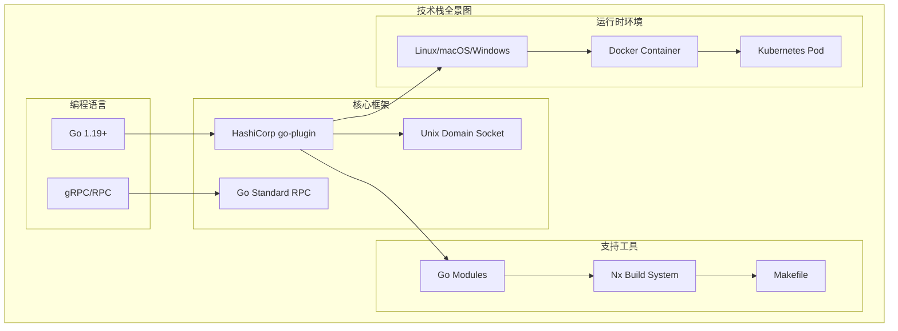

## 🏗️ 核心架构深度解析

### 1. 插件架构设计原理

```mermaid
architecture-beta
    group api(logos:api)[Plugin API Layer]
    group host(logos:go)[Host Process]
    group plugin(logos:go)[Plugin Process]
    group ipc(logos:grpc)[IPC Communication]
    
    service calc(logos:calculator)[Calculator Interface] in api
    service manager(logos:gear)[Plugin Manager] in host
    service impl(logos:code)[Implementation] in plugin
    service rpc(logos:graphql)[RPC Layer] in ipc
    
    calc:L -- R:manager
    manager:B -- T:rpc
    rpc:B -- T:impl
    impl:T -- B:calc
```

**设计原则分析**：

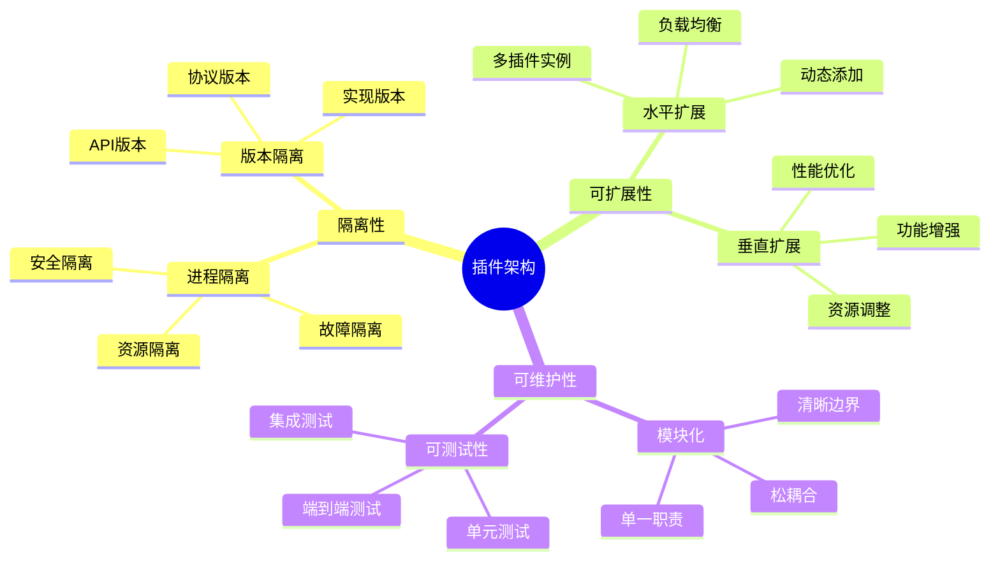

### 2. 接口设计深度剖析

#### 接口定义的核心原则

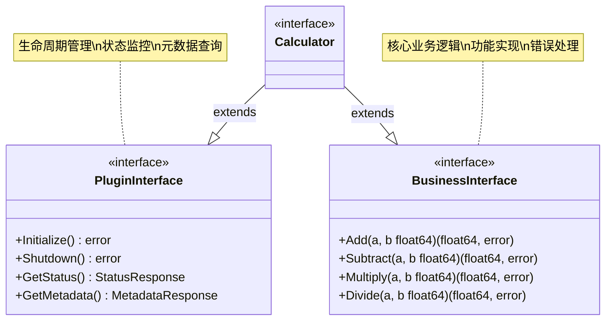

#### 方法签名设计策略

```go
// 生命周期方法 - 无参数，返回错误
func Initialize() error
func Shutdown() error

// 状态查询方法 - 无参数，返回结构体
func GetStatus() (*StatusResponse, error)

// 业务方法 - 简单参数，明确返回值
func Add(a, b float64) (float64, error)
func Divide(a, b float64) (float64, error)

// 复杂操作 - 结构体参数，结构体返回
func ProcessBatch(req *BatchRequest) (*BatchResponse, error)
```

### 3. RPC 通信机制深度分析

#### 握手协商协议

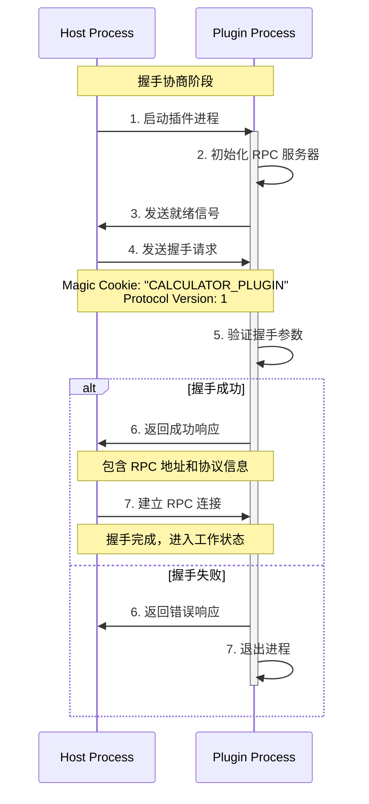

#### RPC 调用链路详解

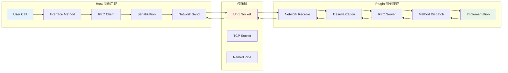

#### 数据序列化协议

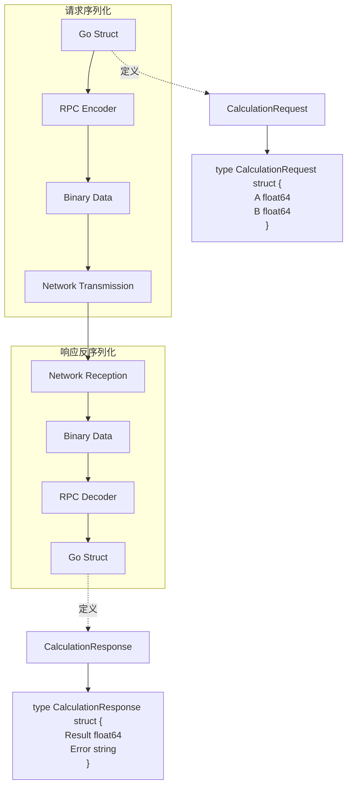

## 🔧 实现步骤详细解析

### 步骤 1: 共享接口设计

#### 接口定义策略

```go
// shared/interface.go

package shared

import "time"

// Calculator 定义计算器插件的核心接口
type Calculator interface {
    // 生命周期管理接口
    LifecycleManager
    
    // 状态监控接口
    StatusProvider
    
    // 业务功能接口
    MathOperations
}

// LifecycleManager 生命周期管理
type LifecycleManager interface {
    Initialize() error
    Shutdown() error
}

// StatusProvider 状态提供者
type StatusProvider interface {
    GetStatus() (*StatusResponse, error)
    GetMetadata() (*MetadataResponse, error)
}

// MathOperations 数学运算接口
type MathOperations interface {
    Add(a, b float64) (float64, error)
    Subtract(a, b float64) (float64, error)
    Multiply(a, b float64) (float64, error)
    Divide(a, b float64) (float64, error)
}
```

#### 类型系统设计

```mermaid
erDiagram
    CalculationRequest {
        float64 A
        float64 B
        string Operation
        map[string]interface{} Metadata
    }
    
    CalculationResponse {
        float64 Result
        string Error
        time.Duration Duration
        map[string]interface{} Metadata
    }
    
    StatusResponse {
        string Status
        string Message
        time.Time StartTime
        time.Duration Uptime
        int64 RequestCount
        float64 AverageLatency
    }
    
    MetadataResponse {
        string Name
        string Version
        string Description
        []string SupportedOperations
        map[string]string Config
    }
    
    CalculationRequest ||--o{ CalculationResponse : "processes"
    StatusResponse ||--|| MetadataResponse : "includes"
```

### 步骤 2: RPC 客户端实现

#### 客户端架构设计

```go
// shared/types.go - RPC Client

type CalculatorRPCClient struct {
    client *rpc.Client
    logger hclog.Logger
    metrics *ClientMetrics
    mu sync.RWMutex
}

func (c *CalculatorRPCClient) Add(a, b float64) (float64, error) {
    start := time.Now()
    defer func() {
        c.metrics.RecordLatency("add", time.Since(start))
    }()
    
    req := &CalculationRequest{
        A: a,
        B: b,
        Operation: "add",
        Metadata: map[string]interface{}{
            "timestamp": start.Unix(),
            "client_id": c.getClientID(),
        },
    }
    
    var resp CalculationResponse
    err := c.client.Call("Plugin.Add", req, &resp)
    if err != nil {
        c.metrics.RecordError("add")
        return 0, fmt.Errorf("RPC call failed: %w", err)
    }
    
    if resp.Error != "" {
        return 0, errors.New(resp.Error)
    }
    
    c.metrics.RecordSuccess("add")
    return resp.Result, nil
}
```

#### 错误处理和重试机制

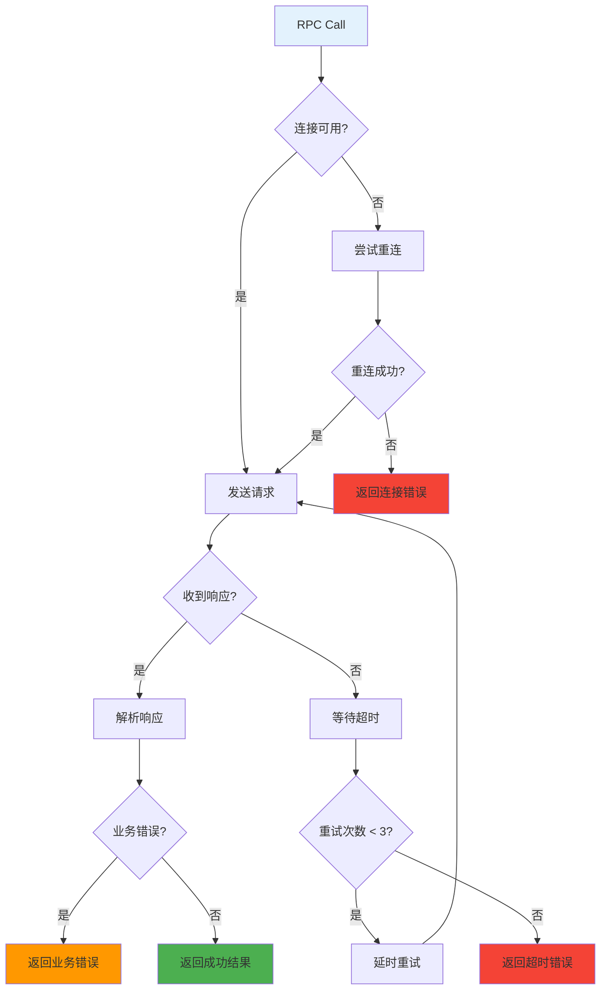

### 步骤 3: RPC 服务端实现

#### 服务端架构设计

```go
// shared/types.go - RPC Server

type CalculatorRPCServer struct {
    Impl Calculator
    logger hclog.Logger
    metrics *ServerMetrics
    mu sync.RWMutex
}

func (s *CalculatorRPCServer) Add(args *CalculationRequest, resp *CalculationResponse) error {
    start := time.Now()
    
    // 记录请求
    s.logger.Debug("Received Add request", 
        "a", args.A, 
        "b", args.B, 
        "client_id", args.Metadata["client_id"])
    
    // 参数验证
    if err := s.validateCalculationRequest(args); err != nil {
        resp.Error = err.Error()
        return nil
    }
    
    // 执行业务逻辑
    result, err := s.Impl.Add(args.A, args.B)
    if err != nil {
        resp.Error = err.Error()
        s.metrics.RecordError("add")
        return nil
    }
    
    // 构造响应
    resp.Result = result
    resp.Duration = time.Since(start)
    resp.Metadata = map[string]interface{}{
        "server_time": time.Now().Unix(),
        "operation": "add",
    }
    
    s.metrics.RecordSuccess("add", time.Since(start))
    
    s.logger.Debug("Add request completed", 
        "result", result, 
        "duration", resp.Duration)
    
    return nil
}
```

### 步骤 4: 插件实现

#### 业务逻辑实现

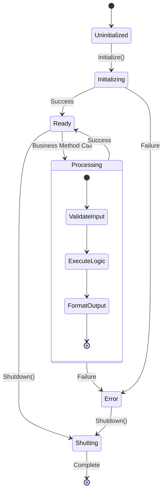

#### 并发安全的实现

```go
// plugin/implementation.go

type CalculatorImpl struct {
    initialized bool
    startTime   time.Time
    requestCount atomic.Int64
    mu          sync.RWMutex
    
    // 配置项
    precision   int
    maxValue    float64
    
    // 监控指标
    metrics     *ImplementationMetrics
    logger      hclog.Logger
}

func (c *CalculatorImpl) Add(a, b float64) (float64, error) {
    c.mu.RLock()
    defer c.mu.RUnlock()
    
    if !c.initialized {
        return 0, errors.New("calculator not initialized")
    }
    
    // 增加请求计数
    count := c.requestCount.Add(1)
    c.logger.Debug("Processing add request", "count", count)
    
    // 参数验证
    if math.IsNaN(a) || math.IsNaN(b) {
        return 0, errors.New("invalid input: NaN not allowed")
    }
    
    if math.Abs(a) > c.maxValue || math.Abs(b) > c.maxValue {
        return 0, fmt.Errorf("input value exceeds maximum: %f", c.maxValue)
    }
    
    // 执行计算
    result := a + b
    
    // 精度控制
    multiplier := math.Pow(10, float64(c.precision))
    result = math.Round(result*multiplier) / multiplier
    
    // 结果验证
    if math.IsInf(result, 0) {
        return 0, errors.New("result overflow")
    }
    
    c.metrics.RecordOperation("add", time.Since(time.Now()))
    return result, nil
}
```

### 步骤 5: 主程序集成

#### 插件管理器实现

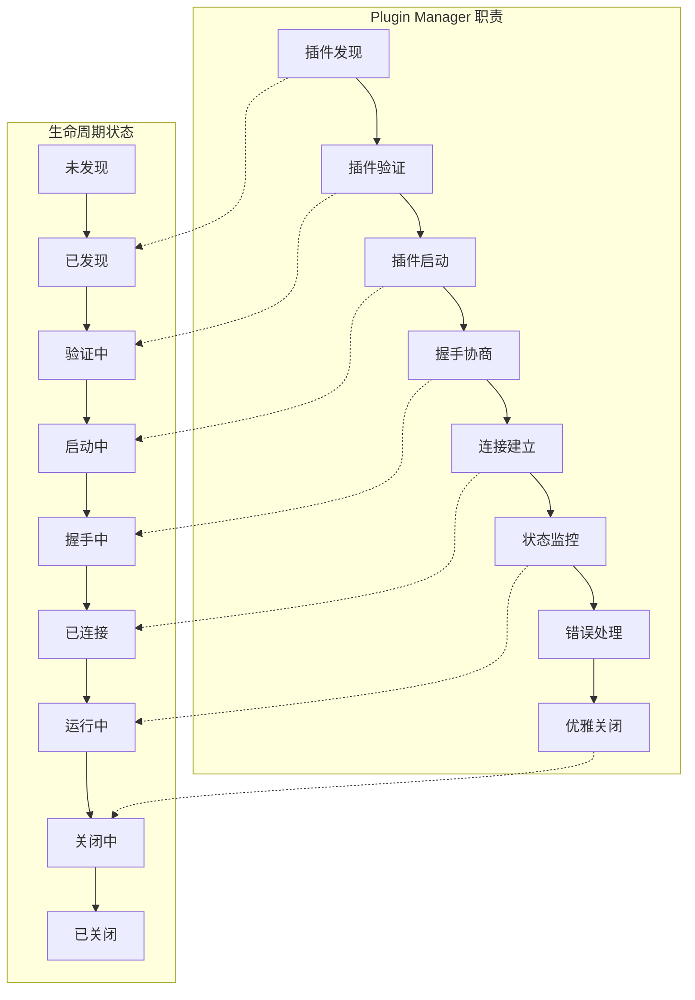

## 🔍 高级特性深度分析

### 1. 性能优化策略

#### 连接池管理

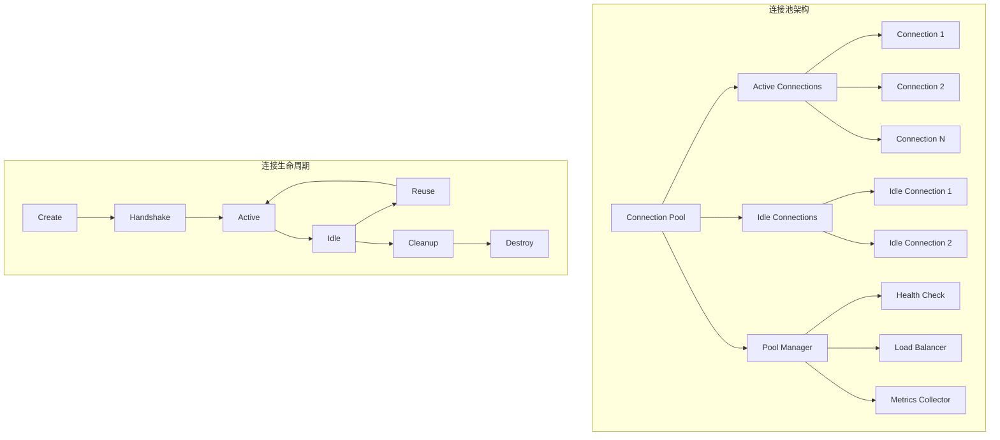

#### 批量操作优化

```go
// 批量操作接口设计
type BatchOperations interface {
    BatchAdd(requests []AddRequest) ([]AddResponse, error)
    BatchCalculate(operations []Operation) (*BatchResult, error)
}

// 批量处理实现
func (c *CalculatorImpl) BatchAdd(requests []AddRequest) ([]AddResponse, error) {
    responses := make([]AddResponse, len(requests))
    
    // 并发处理
    var wg sync.WaitGroup
    errChan := make(chan error, len(requests))
    
    for i, req := range requests {
        wg.Add(1)
        go func(index int, request AddRequest) {
            defer wg.Done()
            
            result, err := c.Add(request.A, request.B)
            if err != nil {
                errChan <- fmt.Errorf("batch[%d]: %w", index, err)
                return
            }
            
            responses[index] = AddResponse{
                Result: result,
                Index:  index,
            }
        }(i, req)
    }
    
    wg.Wait()
    close(errChan)
    
    // 收集错误
    var errors []error
    for err := range errChan {
        errors = append(errors, err)
    }
    
    if len(errors) > 0 {
        return nil, fmt.Errorf("batch operation failed: %v", errors)
    }
    
    return responses, nil
}
```

### 2. 错误处理策略

#### 分层错误处理

```mermaid
pyramid
    title 错误处理层次
    Business Logic : 业务逻辑错误
    RPC Layer : RPC 通信错误  
    Network Layer : 网络传输错误
    System Layer : 系统级错误
```

#### 错误恢复机制

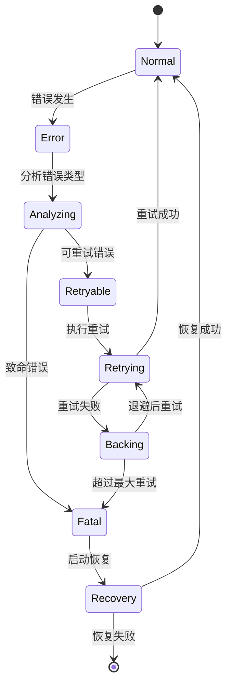

### 3. 监控和诊断

#### 指标收集系统

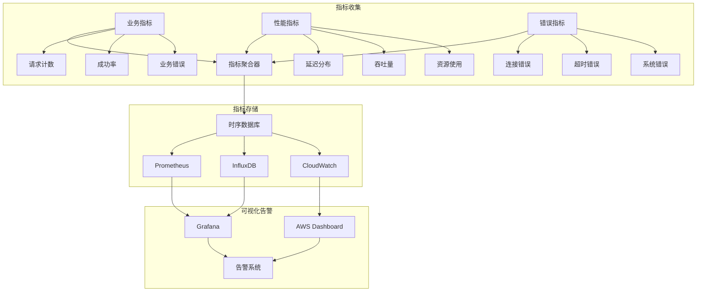

## 🛡️ 安全设计

### 1. 身份验证机制

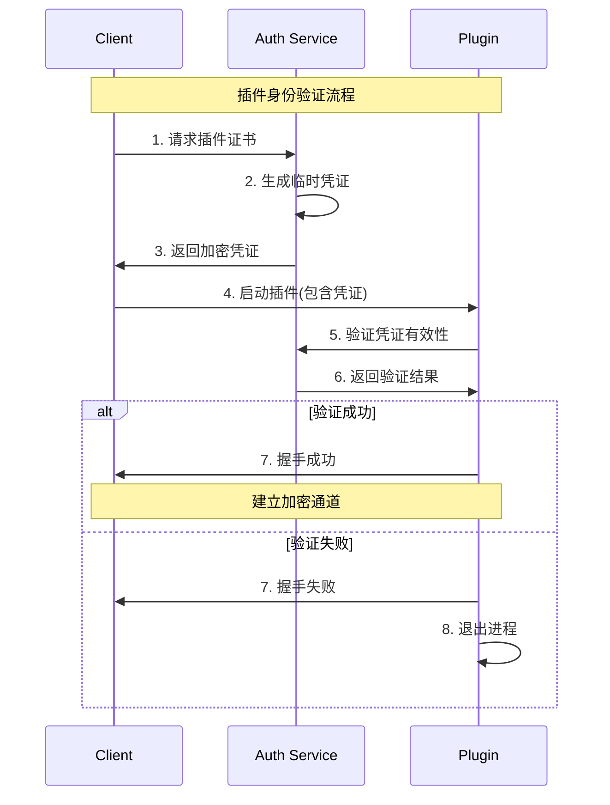

### 2. 权限控制系统

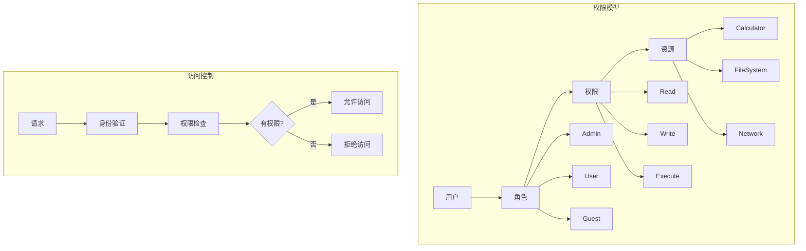

## 📊 实际应用场景分析

### 1. 与现实项目的对比

#### Daytona 架构映射

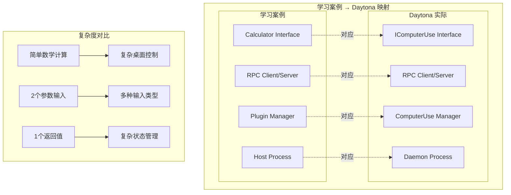

### 2. 扩展方向分析

#### 多插件生态系统

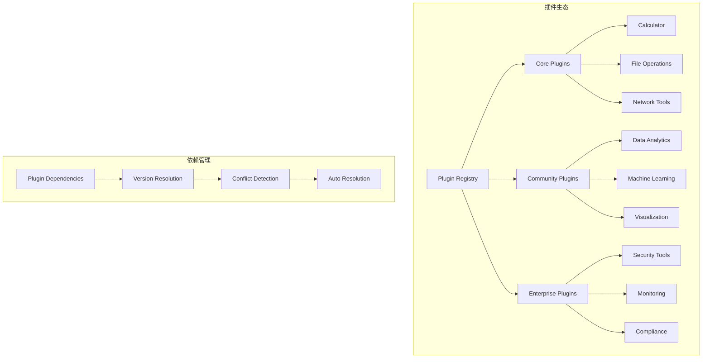

## 🎓 进阶实战练习

### 练习 1: 实现科学计算器

```go
// 扩展接口定义
type ScientificCalculator interface {
    Calculator // 继承基础计算器
    
    // 科学计算功能
    Sin(angle float64) (float64, error)
    Cos(angle float64) (float64, error)
    Tan(angle float64) (float64, error)
    Log(base, value float64) (float64, error)
    Pow(base, exp float64) (float64, error)
    Sqrt(value float64) (float64, error)
    
    // 单位转换
    SetAngleUnit(unit AngleUnit) error
    GetAngleUnit() AngleUnit
}

type AngleUnit int

const (
    Radians AngleUnit = iota
    Degrees
)
```

### 练习 2: 实现插件配置系统

```yaml
# plugin-config.yaml
plugin_system:
  discovery:
    paths:
      - "./plugins"
      - "/usr/local/lib/plugins"
    auto_scan: true
    scan_interval: "30s"
  
  calculator:
    precision: 15
    max_value: 1e100
    angle_unit: "radians"
    cache_size: 1000
    
  security:
    enable_tls: true
    cert_file: "/etc/ssl/plugin.crt"
    key_file: "/etc/ssl/plugin.key"
    verify_signatures: true
```

### 练习 3: 实现分布式插件系统

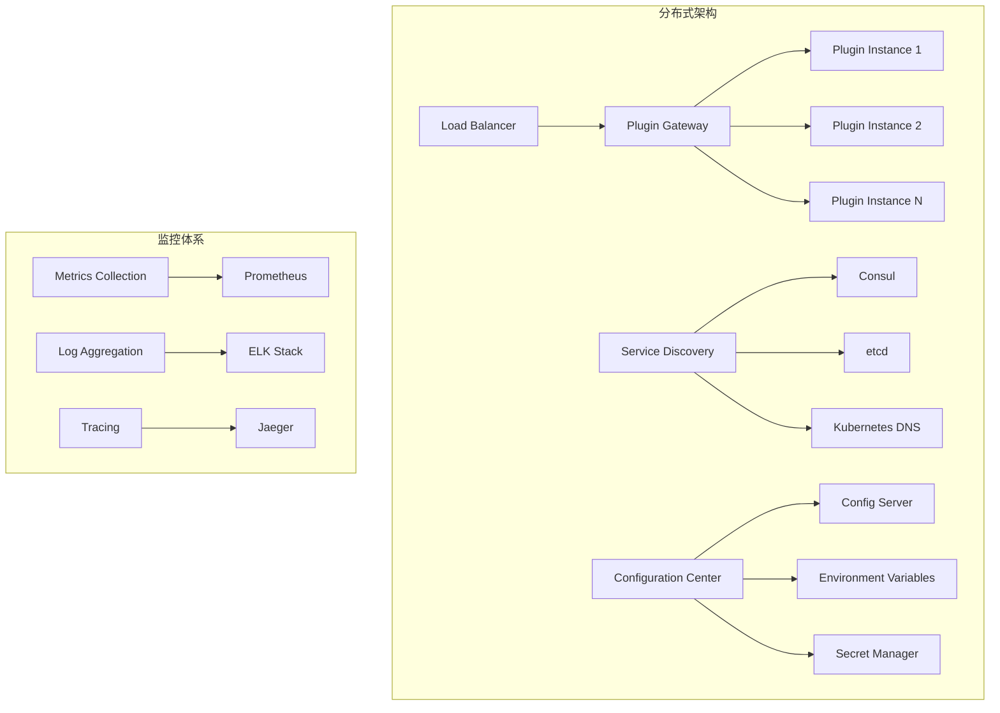

## 📚 最佳实践总结

### 1. 接口设计最佳实践

```mermaid
graph TD
    A[接口设计原则] --> B[简单性]
    A --> C[稳定性]
    A --> D[可扩展性]
    A --> E[一致性]
    
    B --> B1[方法命名清晰]
    B --> B2[参数数量适中]
    B --> B3[返回值明确]
    
    C --> C1[向后兼容]
    C --> C2[版本控制]
    C --> C3[错误处理]
    
    D --> D1[预留扩展点]
    D --> D2[组合而非继承]
    D --> D3[配置驱动]
    
    E --> E1[命名规范]
    E --> E2[错误格式]
    E --> E3[日志格式]
```

### 2. 性能优化最佳实践

- **连接复用**: 避免频繁创建/销毁连接
- **批量操作**: 减少 RPC 调用次数
- **异步处理**: 非阻塞的操作模式
- **缓存策略**: 合理使用内存缓存
- **资源池**: 复用昂贵的资源对象

### 3. 安全设计最佳实践

- **最小权限**: 插件只获得必要权限
- **输入验证**: 严格验证所有输入参数
- **输出过滤**: 防止敏感信息泄露
- **加密通信**: 使用 TLS 保护数据传输
- **审计日志**: 记录所有关键操作

### 4. 运维监控最佳实践

- **健康检查**: 定期检查插件状态
- **指标收集**: 收集关键业务和技术指标
- **日志标准化**: 统一的日志格式和级别
- **告警机制**: 及时发现和响应问题
- **自动恢复**: 故障时的自动恢复策略

---

🎉 **技术教程完成！**

通过本教程的学习，您已经深入理解了：

✅ **插件架构的技术原理和设计思想**  
✅ **RPC 通信的实现细节和优化策略**  
✅ **进程管理的最佳实践和安全考虑**  
✅ **错误处理和监控的系统性方法**  
✅ **从原型到生产级系统的演进路径**

现在您具备了构建企业级插件系统的技术能力，可以将这些知识应用到实际项目中，创造更加灵活和可扩展的软件架构！

🚀 **继续实践，精通插件架构的每一个技术细节！**
