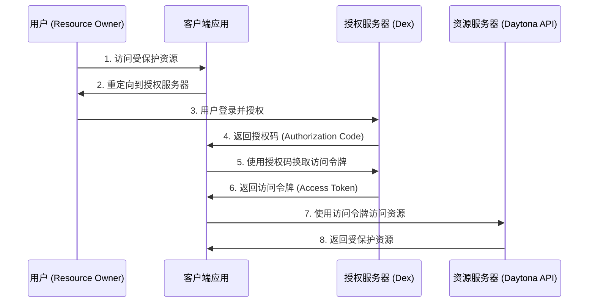
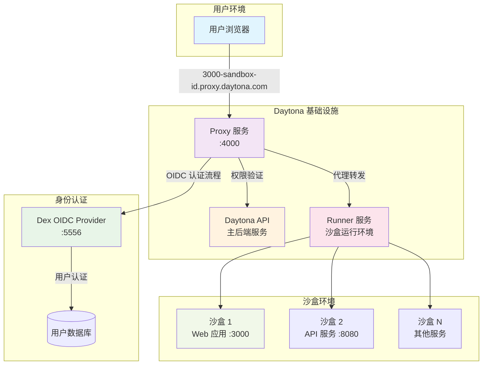
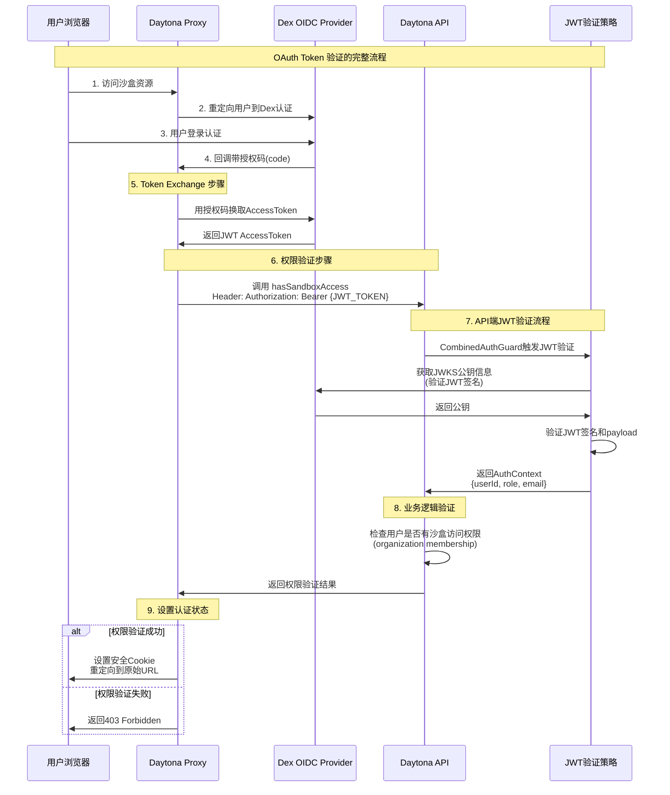
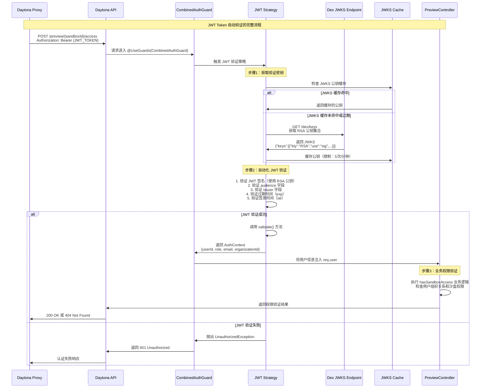
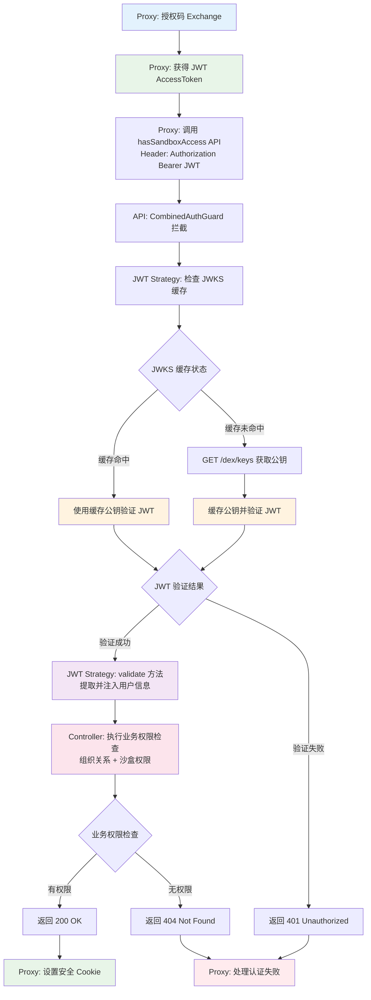
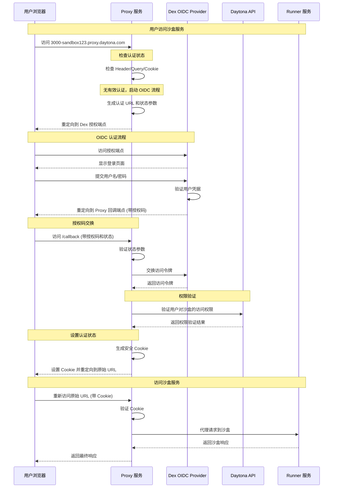
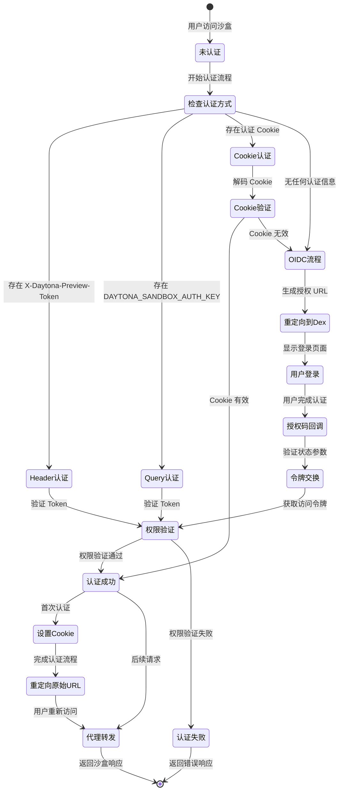
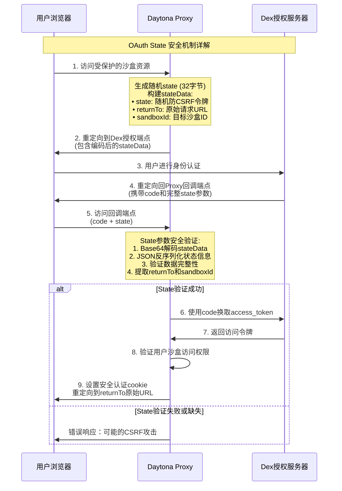
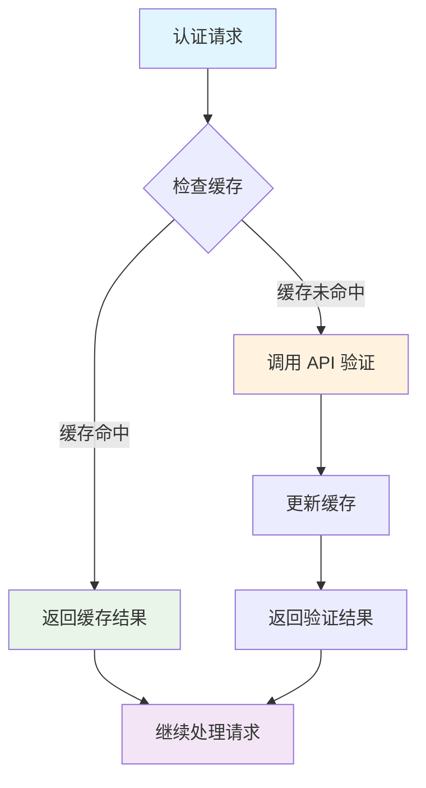

# Daytona OAuth/OIDC 认证机制深度解析

## 1. 概述

本文档详细介绍了 Daytona 项目中 OAuth 2.0 和 OpenID Connect (OIDC) 认证机制的实现，重点分析了 Proxy 服务如何与 Dex 身份提供商集成，为沙盒环境提供安全的认证和授权服务。

## 2. OAuth 2.0 基础概念

### 2.1 什么是 OAuth 2.0

OAuth 2.0 是一个开放标准的授权协议，允许第三方应用程序在不获取用户密码的情况下，获得用户账户的有限访问权限。它通过将用户认证与资源授权分离，提供了一种安全、标准化的方式来处理 API 访问控制。

### 2.2 OAuth 2.0 核心角色

1. **资源所有者 (Resource Owner)**：通常是用户，拥有受保护资源的访问权限
2. **客户端 (Client)**：请求访问受保护资源的应用程序
3. **授权服务器 (Authorization Server)**：验证资源所有者身份并颁发访问令牌
4. **资源服务器 (Resource Server)**：托管受保护资源的服务器

### 2.3 OAuth 2.0 授权码流程



## 3. OpenID Connect (OIDC) 扩展

### 3.1 OIDC 简介

OpenID Connect 是基于 OAuth 2.0 构建的身份认证层，它在 OAuth 2.0 的授权基础上添加了用户身份验证功能。OIDC 提供了标准化的方式来获取用户身份信息。

### 3.2 OIDC 核心概念

- **ID Token**：包含用户身份信息的 JWT 令牌
- **UserInfo 端点**：提供用户详细信息的 API 端点
- **Discovery 端点**：提供 OIDC 提供商配置信息的端点
- **Scopes**：定义访问权限范围，如 `openid`、`profile`、`email`

## 4. Daytona 中的 OAuth/OIDC 架构

### 4.1 系统架构图



### 4.2 核心组件职责

1. **Proxy 服务**：OAuth 客户端，处理认证流程和请求代理
2. **Dex**：OIDC 身份提供商，负责用户认证和令牌颁发
3. **Daytona API**：资源服务器，验证用户权限和管理沙盒资源

## 5. Dex 身份提供商配置

### 5.1 Dex 简介

Dex 是一个基于 OIDC 的身份提供商，支持多种认证后端（如 LDAP、GitHub、Google 等）。在 Daytona 项目中，Dex 作为统一的身份认证入口。

### 5.2 Dex 配置分析

```yaml
# .devcontainer/dex/config.yaml
issuer: http://localhost:5556/dex
storage:
  type: memory
web:
  http: 0.0.0.0:5556
  allowedOrigins: ['*']
  allowedHeaders: ['x-requested-with']
staticClients:
  - id: daytona
    redirectURIs:
      - 'http://localhost:3000'
      - 'http://localhost:3000/api/oauth2-redirect.html'
      - 'http://localhost:3009/callback'
      - 'http://proxy.localhost:4000/callback'
    name: 'Daytona'
    public: true
enablePasswordDB: true
staticPasswords:
  - email: 'dev@daytona.io'
    hash: '$2y$10$gOIUUTz9iMqa3NAQZq1CHuv8.h.yc2tI2h4aGVas4ftUy0Op5pwUW'
    username: 'admin'
    userID: '1234'
```

**配置要点解析：**

1. **issuer**：OIDC 提供商的唯一标识符
2. **storage.type: memory**：使用内存存储（开发环境）
3. **staticClients**：预配置的 OAuth 客户端
4. **redirectURIs**：允许的重定向 URI 列表
5. **public: true**：公开客户端，无需客户端密钥
6. **enablePasswordDB**：启用内置用户数据库
7. **staticPasswords**：预配置的测试用户

### 5.3 Docker Compose 集成

```yaml
# .devcontainer/docker-compose.local.yaml
services:
  dex:
    image: dexidp/dex:v2.42.0
    ports:
      - "5556:5556"
    volumes:
      - ./dex/config.yaml:/etc/dex/config.yaml
    command: ['dex', 'serve', '/etc/dex/config.yaml']
```

## 6. Proxy 服务中的 OAuth 实现

### 6.1 认证配置结构

```go
// apps/proxy/cmd/proxy/config/config.go
type Config struct {
    ProxyPort     int          `envconfig:"PROXY_PORT" validate:"required"`
    ProxyDomain   string       `envconfig:"PROXY_DOMAIN" validate:"required"`
    ProxyProtocol string       `envconfig:"PROXY_PROTOCOL" validate:"required"`
    ProxyApiKey   string       `envconfig:"PROXY_API_KEY" validate:"required"`
    DaytonaApiUrl string       `envconfig:"DAYTONA_API_URL" validate:"required"`
    Oidc          OidcConfig   `envconfig:"OIDC"`
    // ... 其他配置
}

type OidcConfig struct {
    ClientId     string `envconfig:"CLIENT_ID" validate:"required"`
    ClientSecret string `envconfig:"CLIENT_SECRET"`
    Domain       string `envconfig:"DOMAIN" validate:"required"`
    Audience     string `envconfig:"AUDIENCE" validate:"required"`
}
```

### 6.2 多层认证机制

Proxy 服务实现了多层认证策略，按优先级顺序：

```go
// apps/proxy/pkg/proxy/auth.go
func (p *Proxy) Authenticate(ctx *gin.Context, sandboxId string) (err error, didRedirect bool) {
    // 1. HTTP Header 认证 (最高优先级)
    authKey := ctx.Request.Header.Get(DAYTONA_SANDBOX_AUTH_KEY_HEADER)
    
    if authKey == "" {
        // 2. Query Parameter 认证
        if ctx.Query(DAYTONA_SANDBOX_AUTH_KEY_QUERY_PARAM) != "" {
            authKey = ctx.Query(DAYTONA_SANDBOX_AUTH_KEY_QUERY_PARAM)
        } else {
            // 3. Cookie 认证
            cookieSandboxId, err := ctx.Cookie(DAYTONA_SANDBOX_AUTH_COOKIE_NAME + sandboxId)
            if err == nil && cookieSandboxId != "" {
                // 验证安全 Cookie
                err = p.secureCookie.Decode(DAYTONA_SANDBOX_AUTH_COOKIE_NAME+sandboxId, 
                                          cookieSandboxId, &decodedValue)
                if err == nil && decodedValue == sandboxId {
                    return nil, false  // 认证成功
                }
            }
            
            // 4. OIDC 流程 (最后选择)
            authUrl, err := p.getAuthUrl(ctx, sandboxId)
            if err != nil {
                return fmt.Errorf("failed to get auth URL: %w", err), false
            }
            ctx.Redirect(http.StatusTemporaryRedirect, authUrl)
            return errors.New("auth key is required"), true
        }
    }
    
    // 验证 Token 有效性
    if authKey != "" {
        isValid, err := p.getSandboxAuthKeyValid(ctx, sandboxId, authKey)
        if err != nil {
            return fmt.Errorf("failed to get sandbox auth key valid status: %w", err), false
        }
        if !*isValid {
            return errors.New("invalid auth key"), false
        }
        return nil, false
    }
    
    return errors.New("auth key is required"), false
}
```

## 7. OIDC 认证流程详解

### 7.1 认证 URL 生成

```go
// apps/proxy/pkg/proxy/auth_callback.go
func (p *Proxy) getAuthUrl(ctx *gin.Context, sandboxId string) (string, error) {
    // 1. 初始化 OIDC 提供商
    provider, err := oidc.NewProvider(ctx, p.config.Oidc.Domain)
    if err != nil {
        return "", fmt.Errorf("failed to initialize OIDC provider: %w", err)
    }

    // 2. 配置 OAuth2 客户端
    oauth2Config := oauth2.Config{
        ClientID:     p.config.Oidc.ClientId,
        ClientSecret: p.config.Oidc.ClientSecret,
        RedirectURL:  fmt.Sprintf("%s://%s/callback", p.config.ProxyProtocol, p.config.ProxyDomain),
        Endpoint:     provider.Endpoint(),
        Scopes:       []string{oidc.ScopeOpenID, "profile"},
    }

    // 3. 生成随机状态参数 (CSRF防护)
    state, err := GenerateRandomState()  // 32字节加密安全随机数
    if err != nil {
        return "", fmt.Errorf("failed to generate random state: %w", err)
    }

    // 4. 构建复合状态数据 (包含防CSRF令牌和上下文信息)
    stateData := map[string]string{
        "state":     state,          // 随机防CSRF令牌
        "returnTo":  fmt.Sprintf("%s://%s%s", p.config.ProxyProtocol, ctx.Request.Host, ctx.Request.URL.String()),  // 原始请求URL
        "sandboxId": sandboxId,      // 目标沙盒ID
    }
    stateJson, err := json.Marshal(stateData)
    if err != nil {
        return "", fmt.Errorf("failed to marshal state: %w", err)
    }
    encodedState := base64.URLEncoding.EncodeToString(stateJson)

    // 5. 生成授权 URL
    authURL := oauth2Config.AuthCodeURL(
        encodedState,
        oauth2.SetAuthURLParam("audience", p.config.Oidc.Audience),
    )

    return authURL, nil
}
```

### 7.2 认证回调处理

```go
// apps/proxy/pkg/proxy/auth_callback.go
func (p *Proxy) AuthCallback(ctx *gin.Context) {
    // 1. 获取授权码和状态参数
    code := ctx.Query("code")
    state := ctx.Query("state")
    
    // 2. 解码并验证状态参数 (CSRF防护关键步骤)
    stateJson, err := base64.URLEncoding.DecodeString(state)
    if err != nil {
        ctx.Error(common_errors.NewBadRequestError(fmt.Errorf("failed to decode state: %w", err)))
        return
    }

    var stateData map[string]string
    err = json.Unmarshal(stateJson, &stateData)
    if err != nil {
        ctx.Error(common_errors.NewBadRequestError(fmt.Errorf("failed to unmarshal state: %w", err)))
        return
    }

    // 3. 获取原始请求信息
    returnTo := stateData["returnTo"]
    sandboxId := stateData["sandboxId"]

    // 4. 交换访问令牌
    provider, err := oidc.NewProvider(ctx, p.config.Oidc.Domain)
    if err != nil {
        ctx.Error(common_errors.NewBadRequestError(fmt.Errorf("failed to initialize OIDC provider: %w", err)))
        return
    }

    oauth2Config := oauth2.Config{
        ClientID:     p.config.Oidc.ClientId,
        ClientSecret: p.config.Oidc.ClientSecret,
        RedirectURL:  fmt.Sprintf("%s://%s/callback", p.config.ProxyProtocol, ctx.Request.Host),
        Endpoint:     provider.Endpoint(),
        Scopes:       []string{oidc.ScopeOpenID, "profile"},
    }

    token, err := oauth2Config.Exchange(ctx, code)
    if err != nil {
        ctx.Error(common_errors.NewBadRequestError(fmt.Errorf("failed to exchange token: %w", err)))
        return
    }

    // 5. 验证沙盒访问权限
    hasAccess := p.hasSandboxAccess(ctx, sandboxId, token.AccessToken)
    if !hasAccess {
        ctx.Error(common_errors.NewNotFoundError(errors.New("sandbox not found")))
        return
    }

    // 6. 设置认证 Cookie
    cookieDomain := p.config.ProxyDomain
    cookieDomain = strings.Split(cookieDomain, ":")[0]
    cookieDomain = fmt.Sprintf(".%s", cookieDomain)

    encoded, err := p.secureCookie.Encode(DAYTONA_SANDBOX_AUTH_COOKIE_NAME+sandboxId, sandboxId)
    if err != nil {
        ctx.Error(common_errors.NewBadRequestError(fmt.Errorf("failed to encode cookie: %w", err)))
        return
    }

    ctx.SetCookie(DAYTONA_SANDBOX_AUTH_COOKIE_NAME+sandboxId, encoded, 3600, "/", cookieDomain, p.config.EnableTLS, true)

    // 7. 重定向回原始 URL
    ctx.Redirect(http.StatusFound, returnTo)
}
```

### 7.3 权限验证

```go
// apps/proxy/pkg/proxy/auth_callback.go
func (p *Proxy) hasSandboxAccess(ctx context.Context, sandboxId string, authToken string) bool {
    clientConfig := daytonaapiclient.NewConfiguration()
    clientConfig.Servers = daytonaapiclient.ServerConfigurations{
        {
            URL: p.config.DaytonaApiUrl,
        },
    }
    clientConfig.AddDefaultHeader("Authorization", "Bearer "+authToken)

    apiClient := daytonaapiclient.NewAPIClient(clientConfig)
    res, _ := apiClient.PreviewAPI.HasSandboxAccess(ctx, sandboxId).Execute()

    return res != nil && res.StatusCode == http.StatusOK
}
```

## 8. OAuth Token 验证机制深度解析

### 8.1 Token Exchange 与双重验证流程

在完成 OAuth 授权码流程后，Daytona 实现了一个精密的双重验证机制，确保用户身份验证的安全性和业务权限的准确性。

#### 8.1.1 Token Exchange 的核心目的

当用户通过 Dex 完成身份认证后，Proxy 服务需要将授权码换取访问令牌：

```go
// 关键步骤：用授权码换取 JWT 访问令牌
token, err := oauth2Config.Exchange(ctx, code)
if err != nil {
    ctx.Error(common_errors.NewBadRequestError(fmt.Errorf("failed to exchange token: %w", err)))
    return
}

// 使用获得的 AccessToken 进行权限验证
hasAccess := p.hasSandboxAccess(ctx, sandboxId, token.AccessToken)
```

**为什么需要 Token Exchange？**

1. **安全性**：授权码只能使用一次，且有时效性
2. **标准化**：符合 OAuth 2.0 授权码流程规范
3. **令牌获取**：获得 JWT 访问令牌用于后续 API 调用

#### 8.1.2 双重验证架构



### 8.2 API 端的 JWT 验证机制

**CombinedAuthGuard 认证策略：**

```typescript
// apps/api/src/auth/combined-auth.guard.ts
@Injectable()
export class CombinedAuthGuard extends AuthGuard(['jwt', 'api-key']) {
    // 支持 JWT 和 API Key 两种认证方式
    async canActivate(context: ExecutionContext): Promise<boolean> {
        return await super.canActivate(context) as boolean
    }
}
```

**JWT 验证配置：**

```typescript
// apps/api/src/auth/auth.module.ts
{
    provide: JwtStrategy,
    useFactory: async (userService: UserService, httpService: HttpService, configService: TypedConfigService) => {
        // 动态获取 Dex 的 OIDC 配置
        const discoveryUrl = `${configService.get('oidc.issuer')}/.well-known/openid-configuration`
        const metadata = await firstValueFrom(httpService.get(discoveryUrl))

        return new JwtStrategy({
            audience: configService.get('oidc.audience'),
            issuer: metadata.issuer,
            jwksUri: metadata.jwks_uri,  // Dex 的公钥端点：http://localhost:5556/dex/keys
        }, userService)
    }
}
```

#### 8.2.1 JWKS 自动发现和配置过程

在 API 服务启动时，系统会自动从 Dex 的 OIDC Discovery 端点获取完整的认证配置：

```typescript
// 自动发现流程
const discoveryUrl = `${configService.get('oidc.issuer')}/.well-known/openid-configuration`
// 实际请求：http://localhost:5556/dex/.well-known/openid-configuration

const metadata = await firstValueFrom(httpService.get(discoveryUrl))
// 获得的配置包括：
// {
//   "issuer": "http://localhost:5556/dex",
//   "authorization_endpoint": "http://localhost:5556/dex/auth",
//   "token_endpoint": "http://localhost:5556/dex/token", 
//   "jwks_uri": "http://localhost:5556/dex/keys",  // JWT 验证的关键端点
//   "userinfo_endpoint": "http://localhost:5556/dex/userinfo",
//   ...
// }
```

#### 8.2.2 JWT 自动验证机制详解

当 Proxy 发送带有 JWT Token 的请求到 API 时，整个验证过程是**完全自动化**的：

```typescript
// apps/api/src/auth/jwt.strategy.ts
export class JwtStrategy extends PassportStrategy(Strategy) {
    constructor(options: JwtStrategyConfig, userService: UserService) {
        super({
            // 关键配置：自动化 JWT 验证
            secretOrKeyProvider: passportJwtSecret({
                cache: true,                    // 自动缓存 JWKS 公钥
                rateLimit: true,               // 启用请求限流保护
                jwksRequestsPerMinute: 5,      // 每分钟最多 5 次公钥请求
                jwksUri: options.jwksUri,      // http://localhost:5556/dex/keys
            }),
            jwtFromRequest: ExtractJwt.fromAuthHeaderAsBearerToken(), // 从 Authorization Header 提取
            audience: options.audience,        // 验证 JWT 的受众
            issuer: options.issuer,           // 验证 JWT 的签发者
            algorithms: ['RS256'],            // 指定签名算法
        })
    }

    async validate(request: Request, payload: any): Promise<AuthContext> {
        // 此方法只在 JWT 验证成功后才会被调用
        const userId = payload.sub  // 从 JWT payload 中提取用户 ID
        let user = await this.userService.findOne(userId)
        
        // 自动用户管理：基于 JWT payload 创建或更新用户信息
        if (!user) {
            user = await this.userService.create({
                id: userId,
                name: payload.name || 'Unknown',
                email: payload.email || '',
                emailVerified: payload.email_verified || false,
            })
        }

        return {
            userId: user.id,
            role: user.role,
            email: user.email,
            organizationId: request.get('X-Organization-Id'),
        }
    }
}
```

#### 8.2.3 JWT Token 完整验证流程

以下时序图展示了从 Token Exchange 到业务权限验证的完整自动化流程：



#### 8.2.4 JWKS 端点和公钥验证详解

**Dex JWKS 端点返回的公钥格式：**

当 JWT Strategy 访问 `http://localhost:5556/dex/keys` 时，获得的是标准的 JWKS (JSON Web Key Set) 格式：

```json
{
  "keys": [
    {
      "use": "sig",           // 用途：签名验证
      "kty": "RSA",          // 密钥类型：RSA
      "kid": "abc123...",    // 密钥 ID（用于匹配 JWT header 中的 kid）
      "alg": "RS256",        // 签名算法
      "n": "very_long_base64_encoded_modulus...",     // RSA 公钥的 modulus
      "e": "AQAB"            // RSA 公钥的 exponent (通常是 65537)
    }
  ]
}
```

**自动化验证过程：**

1. **提取 JWT Header**：从 JWT 中提取 `kid` (Key ID) 字段
2. **匹配公钥**：在 JWKS 中找到对应 `kid` 的公钥
3. **验证签名**：使用 RSA 公钥验证 JWT 的签名
4. **验证 Claims**：检查 `iss`、`aud`、`exp`、`iat` 等声明

#### 8.2.5 性能优化和容错机制

**缓存策略：**

```typescript
passportJwtSecret({
    cache: true,                    // 启用公钥缓存
    rateLimit: true,               // 启用请求限流
    jwksRequestsPerMinute: 5,      // 防止频繁请求 JWKS 端点
    jwksUri: "http://localhost:5556/dex/keys"
})
```

**容错和高可用性：**

- **离线验证**：一旦获得公钥，JWT 验证不依赖 Dex 的在线状态
- **缓存机制**：即使 Dex 临时不可用，缓存的公钥仍可继续验证 JWT
- **限流保护**：避免对 Dex JWKS 端点造成过大压力
- **自动重试**：公钥过期时自动重新获取

这种设计确保了 JWT 验证的**高性能**、**高可靠性**和**高安全性**，完全符合企业级应用的要求。

### 8.3 hasSandboxAccess 业务权限验证

**API 控制器实现：**

```typescript
// apps/api/src/sandbox/controllers/preview.controller.ts
@Get(':sandboxId/access')
@UseGuards(CombinedAuthGuard)  // 触发 JWT 验证
@ApiOAuth2(['openid', 'profile', 'email'])
@ApiBearerAuth()
async hasSandboxAccess(@Req() req: Request, @Param('sandboxId') sandboxId: string): Promise<boolean> {
    // JWT 验证成功后，从 req.user 获取用户信息
    const userId = req.user?.userId

    // Redis 缓存优化
    const cached = await this.redis.get(`preview:access:${sandboxId}:${userId}`)
    if (cached) {
        if (cached === '1') return true
        throw new NotFoundException(`Sandbox with ID ${sandboxId} not found`)
    }

    // 业务逻辑验证：检查用户组织关系
    const organizations = await this.organizationService.findByUser(userId)
    const sandbox = await this.sandboxService.findOne(sandboxId)
    const hasAccess = organizations.find((org) => org.id === sandbox.organizationId)
    
    if (!hasAccess) {
        await this.redis.setex(`preview:access:${sandboxId}:${userId}`, 3, '0')
        throw new NotFoundException(`Sandbox with ID ${sandboxId} not found`)
    }
    
    // 缓存访问权限结果
    await this.redis.setex(`preview:access:${sandboxId}:${userId}`, 30, '1')
    return true
}
```

### 8.4 JWT 验证技术细节

**离线验证机制：**

API 端不需要每次都向 Dex 进行在线验证，而是通过以下方式实现高效的离线验证：

1. **JWKS 公钥验证**：

   ```typescript
   // 从 Dex 获取公钥
   const JWKS = createRemoteJWKSet(new URL(options.jwksUri))
   
   // 使用公钥验证 JWT 签名
   const { payload } = await jwtVerify(token, JWKS, {
       audience: this.options.audience,
       issuer: this.options.issuer,
       algorithms: ['RS256'],
   })
   ```

2. **公钥缓存策略**：

   ```typescript
   secretOrKeyProvider: passportJwtSecret({
       cache: true,          // 缓存公钥
       rateLimit: true,      // 限制请求频率
       jwksRequestsPerMinute: 5,  // 每分钟最多5次公钥请求
       jwksUri: options.jwksUri,
   })
   ```

3. **JWT Payload 验证**：
   - **签名验证**：确保 token 是由 Dex 签发且未被篡改
   - **时效性验证**：检查 `exp` (过期时间) 和 `iat` (签发时间)
   - **受众验证**：验证 `aud` 字段是否匹配配置的 audience
   - **签发者验证**：验证 `iss` 字段是否匹配 Dex 的 issuer

### 8.5 架构设计的合理性分析

通过前面详细的技术解析，我们可以看到这种双重验证架构的设计合理性：

**OAuth2 注解的完整意义：**

```typescript
@Get(':sandboxId/access')
@UseGuards(CombinedAuthGuard)              // 实际的验证逻辑执行
@ApiOAuth2(['openid', 'profile', 'email']) // OpenAPI 文档标注
@ApiBearerAuth()                           // Swagger UI 认证标注
async hasSandboxAccess(@Req() req: Request, @Param('sandboxId') sandboxId: string) {
    const userId = req.user?.userId // JWT 验证成功后自动注入的用户信息
    // ... 业务权限验证逻辑
}
```

**设计优势分析：**

1. **职责分离**：
   - **CombinedAuthGuard + JWT Strategy**：负责身份验证和用户信息提取
   - **Controller 业务逻辑**：负责具体的权限检查和业务规则

2. **安全层次化**：
   - **第一层**：JWT 密码学验证（确保令牌真实性）
   - **第二层**：业务权限验证（确保访问合法性）

3. **性能最优化**：
   - **JWT 验证**：离线进行，无需网络请求
   - **业务验证**：Redis 缓存优化，减少数据库压力

4. **标准合规性**：
   - 完全遵循 OAuth 2.0 和 OIDC 标准
   - 支持标准的 Bearer Token 认证方式

### 8.6 端到端验证流程总结

基于前面详细的技术分析，以下是从 Token Exchange 到业务权限验证的完整流程：



**流程关键特点：**

- **自动化程度高**：除初始配置外，整个验证过程无需人工干预
- **性能优化全面**：JWKS 缓存、业务权限缓存、限流保护
- **安全机制完备**：JWT 密码学验证 + 业务权限验证双重保障
- **标准合规完整**：严格遵循 OAuth 2.0/OIDC 规范的最佳实践

## 9. 完整的 OIDC 认证流程

在深入了解了 OAuth Token 验证机制的技术细节后，让我们回顾整个 OIDC 认证流程的宏观视图，了解各个组件如何协同工作，形成完整的安全认证体系。

### 9.1 时序图



### 9.2 状态流转图



## 10. 安全机制分析

### 10.1 状态参数 (State Parameter) - CSRF 防护核心

#### 10.1.1 什么是 OAuth State 参数

OAuth State 参数是 OAuth 2.0 规范中的一个重要安全机制，它是一个**不透明的随机字符串**，用于在授权请求和授权响应之间维持状态，主要目的是**防止跨站请求伪造（CSRF）攻击**。

#### 10.1.2 State 参数的核心作用

**主要安全目的：**

1. **CSRF 攻击防护**：防止恶意网站伪造授权请求
2. **请求唯一性保证**：确保每个认证流程都有唯一标识
3. **重放攻击防护**：防止旧的认证URL被重复使用
4. **会话状态维持**：在认证流程中保持请求上下文

**为什么每次生成不同的 URL：**

```go
// 每次调用都生成新的32字节随机数据
func GenerateRandomState() (string, error) {
    b := make([]byte, 32)  // 256位随机数据
    _, err := rand.Read(b)  // 使用加密安全的随机数生成器
    if err != nil {
        return "", err
    }
    return base64.URLEncoding.EncodeToString(b), nil  // Base64编码（约44字符）
}
```

虽然同一个用户访问同一个沙盒时每次的 `authURL` 确实不同，但这**不是为了简单地让URL不同**，而是OAuth 2.0 安全最佳实践的体现。

#### 10.1.3 Daytona 中的 State 参数实现

**State 数据结构：**

```go
// 复合状态数据，包含多种信息
stateData := map[string]string{
    "state":     randomState,    // 32字节随机防CSRF令牌
    "returnTo":  originalURL,    // 用户原始请求的完整URL
    "sandboxId": sandboxId,      // 目标沙盒ID
}

// Base64编码后作为OAuth state参数
stateJson, _ := json.Marshal(stateData)
encodedState := base64.URLEncoding.EncodeToString(stateJson)
```

**安全验证流程：**



#### 10.1.4 安全攻击防护机制

**1. CSRF 攻击防护：**

```go
// 攻击场景：恶意网站试图伪造授权请求
// 攻击者无法预测随机生成的state值
// 只有发起认证请求的页面才知道正确的state值

// 回调验证时必须匹配state参数
state := ctx.Query("state")
if state == "" {
    ctx.Error(common_errors.NewBadRequestError(errors.New("no state in callback")))
    return
}

// 解码并验证state数据
stateJson, err := base64.URLEncoding.DecodeString(state)
if err != nil {
    ctx.Error(common_errors.NewBadRequestError(fmt.Errorf("failed to decode state: %w", err)))
    return
}
```

**2. 重放攻击防护：**

- 每次认证请求都生成新的随机state
- 旧的认证URL无法被重复使用
- 确保认证流程的时效性

**3. 会话固定攻击防护：**

- State参数绑定特定的认证会话
- 防止攻击者固定用户会话标识

#### 10.1.5 OAuth 2.0 规范最佳实践

根据 [RFC 6749](https://tools.ietf.org/html/rfc6749) OAuth 2.0 规范：

> **RECOMMENDED.** An unguessable random string. It is used to protect against cross-site request forgery attacks.

**关键要点：**

1. **必须是不可猜测的随机字符串**
2. **强烈推荐使用**（虽然标记为RECOMMENDED，但在安全环境中实际是必需的）
3. **客户端应该验证返回的state参数**

**实现细节：**

```go
// Daytona实现完全符合OAuth 2.0最佳实践
func GenerateRandomState() (string, error) {
    b := make([]byte, 32)
    _, err := rand.Read(b)  // 使用加密安全随机数生成器
    if err != nil {
        return "", err
    }
    return base64.URLEncoding.EncodeToString(b), nil
}
```

这种实现确保了：

- **足够的熵**：32字节提供256位安全性
- **加密安全**：使用crypto/rand而非math/rand
- **URL安全**：Base64 URL编码适合在URL中传输

### 10.2 安全 Cookie

**目的**：防止 Cookie 劫持和篡改

**实现**：

```go
// 使用 Gorilla SecureCookie
proxy.secureCookie = securecookie.New([]byte(config.ProxyApiKey), nil)

// Cookie 编码
encoded, err := p.secureCookie.Encode(cookieName, sandboxId)

// Cookie 设置
ctx.SetCookie(cookieName, encoded, 3600, "/", cookieDomain, p.config.EnableTLS, true)
//                                                                    ↑        ↑
//                                                                 Secure  HttpOnly
```

### 10.3 域名安全

**通配符域名策略**：

```go
cookieDomain := p.config.ProxyDomain
cookieDomain = strings.Split(cookieDomain, ":")[0]
cookieDomain = fmt.Sprintf(".%s", cookieDomain)  // .proxy.daytona.com
```

### 10.4 重定向 URI 验证

**Dex 配置中的白名单**：

```yaml
staticClients:
  - id: daytona
    redirectURIs:
      - 'http://localhost:3000'
      - 'http://localhost:3000/api/oauth2-redirect.html'
      - 'http://localhost:3009/callback'
      - 'http://proxy.localhost:4000/callback'
```

## 11. 缓存策略与性能优化

### 11.1 多层缓存架构

```go
type Proxy struct {
    runnerCache              cache.ICache[RunnerInfo]  // 1小时TTL
    sandboxPublicCache       cache.ICache[bool]        // 2分钟TTL
    sandboxAuthKeyValidCache cache.ICache[bool]        // 2分钟TTL
}
```

### 11.2 缓存实现策略

```go
// Redis 缓存 (生产环境)
if config.Redis != nil {
    proxy.runnerCache, err = cache.NewRedisCache[RunnerInfo](config.Redis, "proxy:sandbox-runner-info:")
    proxy.sandboxPublicCache, err = cache.NewRedisCache[bool](config.Redis, "proxy:sandbox-public:")
    proxy.sandboxAuthKeyValidCache, err = cache.NewRedisCache[bool](config.Redis, "proxy:sandbox-auth-key-valid:")
} else {
    // 内存缓存 (开发环境)
    proxy.runnerCache = cache.NewMapCache[RunnerInfo]()
    proxy.sandboxPublicCache = cache.NewMapCache[bool]()
    proxy.sandboxAuthKeyValidCache = cache.NewMapCache[bool]()
}
```

### 11.3 缓存查询流程



## 12. 环境配置与部署

### 12.1 开发环境配置

```bash
# Proxy 服务环境变量
PROXY_PORT=4000
PROXY_DOMAIN=proxy.localhost
PROXY_PROTOCOL=http
PROXY_API_KEY=your-api-key
DAYTONA_API_URL=http://localhost:3001

# OIDC 配置
OIDC_CLIENT_ID=daytona
OIDC_DOMAIN=http://localhost:5556/dex
OIDC_AUDIENCE=daytona

# 可选 Redis 配置
REDIS_HOST=localhost
REDIS_PORT=6379
```

### 12.2 Docker Compose 集成

```yaml
version: '3.8'
services:
  proxy:
    build: ./apps/proxy
    ports:
      - "4000:4000"
    environment:
      - PROXY_PORT=4000
      - PROXY_DOMAIN=proxy.localhost
      - OIDC_CLIENT_ID=daytona
      - OIDC_DOMAIN=http://dex:5556/dex
    depends_on:
      - dex
      - api
  
  dex:
    image: dexidp/dex:v2.42.0
    ports:
      - "5556:5556"
    volumes:
      - ./dex/config.yaml:/etc/dex/config.yaml
    command: ['dex', 'serve', '/etc/dex/config.yaml']
  
  api:
    build: ./apps/api
    ports:
      - "3001:3001"
    depends_on:
      - db
```

## 13. 故障排除指南

### 13.1 常见问题

1. **认证失败**
   - 检查 OIDC 配置是否正确
   - 验证 Dex 服务是否正常运行
   - 确认重定向 URI 是否在白名单中

2. **Cookie 问题**
   - 检查域名配置是否正确
   - 验证 HTTPS 设置
   - 确认 Cookie 安全设置

3. **权限验证失败**
   - 检查 Daytona API 连接
   - 验证访问令牌有效性
   - 确认用户对沙盒的访问权限

### 13.2 调试技巧

```go
// 启用详细日志
log.SetLevel(log.DebugLevel)

// 添加调试信息
log.Debugf("OIDC config: %+v", p.config.Oidc)
log.Debugf("Token: %s", token.AccessToken)
log.Debugf("Sandbox access: %v", hasAccess)
```

### 13.3 监控指标

建议监控的关键指标：

1. **认证成功率**：成功认证的请求比例
2. **认证延迟**：从开始认证到完成的时间
3. **缓存命中率**：缓存命中的请求比例
4. **错误率**：认证失败的请求比例
5. **令牌刷新频率**：令牌刷新的频率

## 14. 最佳实践

### 14.1 安全实践

- 使用 HTTPS 传输敏感信息
- 定期轮换客户端密钥
- 实施适当的令牌过期策略
- 启用详细的安全日志记录

### 14.2 性能优化

- 合理设置缓存 TTL
- 使用连接池减少网络开销
- 实施请求去重和限流
- 监控和优化数据库查询

### 14.3 运维建议

- 实施健康检查端点
- 配置适当的超时设置
- 建立监控和告警机制
- 定期备份配置和数据

## 15. 总结

Daytona 的 OAuth/OIDC 认证机制通过以下方式实现了安全、高效的身份验证：

1. **标准化协议**：严格遵循 OAuth 2.0 和 OIDC 标准规范
2. **多层认证**：支持 Header、Query、Cookie 和 OIDC 多种认证方式
3. **强化安全机制**：
   - **State 参数 CSRF 防护**：32字节加密安全随机数，防止跨站请求伪造
   - **安全 Cookie**：使用 Gorilla SecureCookie 防止篡改和劫持
   - **域名验证**：通配符域名策略和重定向URI白名单
   - **多重攻击防护**：防止重放攻击、会话固定攻击等
4. **性能优化**：多层缓存架构（Redis/内存）、连接池等性能优化措施
5. **灵活部署**：支持开发和生产环境的不同配置需求

**关键安全特性：**

- **每次认证的唯一性**：通过随机State参数确保每个认证流程都是独立且安全的
- **OAuth 2.0 最佳实践**：完全符合RFC 6749规范的安全建议
- **双重验证机制**：JWT身份验证 + 业务权限验证，确保安全性和准确性
- **离线JWT验证**：通过JWKS公钥验证，提供高性能的令牌验证
- **企业级安全标准**：多层防护机制确保生产环境的安全性

**核心技术亮点：**

- **Token Exchange 流程**：标准OAuth 2.0授权码换取访问令牌机制
- **JWKS公钥验证**：离线JWT签名验证，减少网络依赖提升性能
- **多策略认证**：支持JWT和API Key两种认证方式的灵活切换
- **智能缓存优化**：多层缓存策略（JWKS公钥、用户权限、组织关系）
- **自动用户管理**：基于JWT payload自动创建和更新用户信息

这种设计为 Daytona 平台提供了企业级的身份认证和授权能力，不仅确保了沙盒环境的安全访问，还通过精密的双重验证机制（OAuth身份认证 + 业务权限验证）和高效的离线JWT验证技术，为用户提供了既安全又高性能的开发环境体验。整个系统严格遵循OAuth 2.0和OIDC标准，同时通过创新的架构设计实现了安全性、性能和可扩展性的完美平衡。
