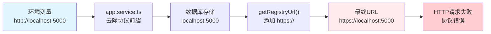
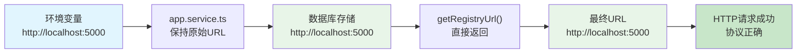

# Daytona Registry URL 协议处理问题分析

## 问题概述

在 Daytona 项目中发现了一个关于 Docker Registry URL 协议处理的严重问题。该问题涉及多个服务组件，导致 Registry 镜像删除操作失败，影响系统的正常运行。

## 问题详细描述

### 1. 问题现象

当配置 Docker Registry URL 为 `http://localhost:5000` 格式时，系统在执行镜像删除操作时失败，错误原因是请求协议从 `http` 被错误地转换为 `https`。

### 2. 问题根因

**协议处理逻辑不一致**：

- 环境变量配置：`TRANSIENT_REGISTRY_URL=http://localhost:5000`
- 存储到数据库：`localhost:5000`（去除协议前缀）
- 使用时恢复：`https://localhost:5000`（强制添加 https 前缀）

### 3. 涉及的文件和方法

#### 3.1 `apps/api/src/app.service.ts`

**问题代码：**

```typescript
// initializeTransientRegistry() 方法 - 第 78 行
registryUrl = registryUrl.replace(/^(https?:\/\/)/, '')

// initializeInternalRegistry() 方法 - 第 107 行  
registryUrl = registryUrl.replace(/^(https?:\/\/)/, '')
```

**问题分析：**

- 从环境变量 `TRANSIENT_REGISTRY_URL` 和 `INTERNAL_REGISTRY_URL` 读取的完整 URL
- 强制去除协议前缀 `http://` 或 `https://`
- 将不完整的 URL 存储到数据库中

#### 3.2 `apps/api/src/docker-registry/services/docker-registry.service.ts`

**问题代码：**

```typescript
// getRegistryUrl() 方法 - 第 246-253 行
getRegistryUrl(registry: DockerRegistry): string {
  // Dev mode
  if (registry.url === 'registry:5000') {
    return 'http://registry:5000'
  }

  return registry.url.startsWith('http') ? registry.url : `https://${registry.url}`
}
```

**问题分析：**

- 当 `registry.url` 为 `localhost:5000` 时（已被去除协议）
- 不符合 `registry:5000` 的特殊情况
- 不以 `http` 开头，因此强制添加 `https://` 前缀
- 导致最终 URL 为 `https://localhost:5000`，与原始配置不符

#### 3.3 `apps/api/src/sandbox/docker/docker-provider.ts`

**受影响代码：**

```typescript
// deleteRepositoryWithPrefix() 方法 - 第 190 行
const registryUrl = this.dockerRegistryService.getRegistryUrl(registry)

// 第 194 行：构建 API 请求 URL
const tagsUrl = `${registryUrl}/v2/${repoPath}/tags/list`
```

**问题影响：**

- `registryUrl` 变为 `https://localhost:5000`
- 导致对本地开发环境的 HTTP 服务发起 HTTPS 请求
- 请求失败，镜像删除操作失败

#### 3.4 `apps/api/src/docker-registry/controllers/docker-registry.controller.ts`

**矛盾的设计：**

```typescript
// create() 方法 - 第 44 行
create(
  @AuthContext() authContext: OrganizationAuthContext,
  @Body() createDockerRegistryDto: CreateDockerRegistryDto,
): Promise<DockerRegistryDto>
```

**分析：**

- Controller 的 `create` 方法允许用户创建包含 `http://` 或 `https://` 前缀的 Registry
- 但系统初始化时强制去除这些前缀，造成行为不一致

## 数据流分析

### 当前错误流程



### 预期正确流程



## 影响范围

### 1. 功能影响

- **镜像删除失败**：`deleteRepositoryWithPrefix` 方法无法正常工作
- **备份清理失败**：沙盒备份镜像无法从 Registry 中删除
- **存储空间浪费**：无法清理的镜像占用存储空间
- **开发环境问题**：本地开发时无法正常测试镜像管理功能

### 2. 环境影响

- **开发环境**：使用 `http://localhost:5000` 或 `http://registry:5000` 时必然失败
- **生产环境**：如果使用 HTTP 协议的内部 Registry 也会失败
- **测试环境**：自动化测试可能因此失败

### 3. 组件影响

- **DockerProvider**：镜像管理功能受损
- **BackupManager**：备份清理功能失效
- **SandboxManager**：沙盒生命周期管理受影响

## 解决方案

### 1. 保持协议一致性（推荐方案）

#### 修复 `apps/api/src/app.service.ts`

```typescript
private async initializeTransientRegistry(): Promise<void> {
  const existingRegistry = await this.dockerRegistryService.getDefaultTransientRegistry()
  if (existingRegistry) {
    return
  }

  const registryUrl = this.configService.getOrThrow('transientRegistry.url')
  const registryAdmin = this.configService.getOrThrow('transientRegistry.admin')
  const registryPassword = this.configService.getOrThrow('transientRegistry.password')
  const registryProjectId = this.configService.getOrThrow('transientRegistry.projectId')

  if (!registryUrl || !registryAdmin || !registryPassword || !registryProjectId) {
    this.logger.warn('Registry configuration not found, skipping transient registry setup')
    return
  }

  // 移除这行代码：registryUrl = registryUrl.replace(/^(https?:\/\/)/, '')

  this.logger.log('Initializing default transient registry...')

  await this.dockerRegistryService.create({
    name: 'Transient Registry',
    url: registryUrl, // 保持原始完整 URL
    username: registryAdmin,
    password: registryPassword,
    project: registryProjectId,
    registryType: RegistryType.TRANSIENT,
    isDefault: true,
  })

  this.logger.log('Default transient registry initialized successfully')
}

private async initializeInternalRegistry(): Promise<void> {
  const existingRegistry = await this.dockerRegistryService.getDefaultInternalRegistry()
  if (existingRegistry) {
    return
  }

  const registryUrl = this.configService.getOrThrow('internalRegistry.url')
  const registryAdmin = this.configService.getOrThrow('internalRegistry.admin')
  const registryPassword = this.configService.getOrThrow('internalRegistry.password')
  const registryProjectId = this.configService.getOrThrow('internalRegistry.projectId')

  if (!registryUrl || !registryAdmin || !registryPassword || !registryProjectId) {
    this.logger.warn('Registry configuration not found, skipping internal registry setup')
    return
  }

  // 移除这行代码：registryUrl = registryUrl.replace(/^(https?:\/\/)/, '')

  this.logger.log('Initializing default internal registry...')

  await this.dockerRegistryService.create({
    name: 'Internal Registry',
    url: registryUrl, // 保持原始完整 URL
    username: registryAdmin,
    password: registryPassword,
    project: registryProjectId,
    registryType: RegistryType.INTERNAL,
    isDefault: true,
  })

  this.logger.log('Default internal registry initialized successfully')
}
```

#### 修复 `apps/api/src/docker-registry/services/docker-registry.service.ts`

```typescript
getRegistryUrl(registry: DockerRegistry): string {
  // 开发模式特殊处理：如果 URL 没有协议前缀，默认使用 HTTP
  if (registry.url === 'registry:5000') {
    return 'http://registry:5000'
  }

  // 如果 URL 已包含协议，直接返回
  if (registry.url.startsWith('http://') || registry.url.startsWith('https://')) {
    return registry.url
  }

  // 对于没有协议的 URL，根据上下文决定协议
  // 开发环境特殊主机名使用 HTTP，其他情况使用 HTTPS
  if (registry.url.includes('localhost') || 
      registry.url.includes('127.0.0.1') || 
      registry.url.includes('registry:')) {
    return `http://${registry.url}`
  }

  return `https://${registry.url}`
}
```

### 2. 向后兼容方案（备选）

如果需要保持向后兼容，可以采用更复杂的策略：

```typescript
getRegistryUrl(registry: DockerRegistry): string {
  // 如果 URL 已包含协议，直接返回
  if (registry.url.startsWith('http://') || registry.url.startsWith('https://')) {
    return registry.url
  }

  // 特殊情况处理
  if (registry.url === 'registry:5000') {
    return 'http://registry:5000'
  }

  // 检查是否有存储的协议信息（可以添加新字段）
  if (registry.protocol) {
    return `${registry.protocol}://${registry.url}`
  }

  // 默认规则：本地开发环境使用 HTTP，其他使用 HTTPS
  const useHttp = registry.url.includes('localhost') || 
                  registry.url.includes('127.0.0.1') ||
                  registry.url.match(/:\d+$/) // 包含端口号的通常是开发环境
  
  return useHttp ? `http://${registry.url}` : `https://${registry.url}`
}
```

### 3. 数据库迁移方案

对于已经存储了无协议 URL 的现有数据，需要创建数据库迁移：

```typescript
// 新的迁移文件：UpdateRegistryUrls
export class UpdateRegistryUrls implements MigrationInterface {
  public async up(queryRunner: QueryRunner): Promise<void> {
    // 查询所有不以 http 开头的 registry 记录
    const registries = await queryRunner.query(`
      SELECT id, url FROM docker_registry 
      WHERE url NOT LIKE 'http%'
    `)

    for (const registry of registries) {
      let newUrl: string
      
      // 根据特定规则修复协议
      if (registry.url.includes('localhost') || 
          registry.url.includes('127.0.0.1') || 
          registry.url === 'registry:5000') {
        newUrl = `http://${registry.url}`
      } else {
        newUrl = `https://${registry.url}`
      }

      await queryRunner.query(`
        UPDATE docker_registry 
        SET url = ? 
        WHERE id = ?
      `, [newUrl, registry.id])
    }
  }

  public async down(queryRunner: QueryRunner): Promise<void> {
    // 回滚操作：移除协议前缀
    await queryRunner.query(`
      UPDATE docker_registry 
      SET url = REPLACE(REPLACE(url, 'https://', ''), 'http://', '')
      WHERE url LIKE 'http%'
    `)
  }
}
```

## 测试验证

### 1. 单元测试

```typescript
describe('DockerRegistryService', () => {
  describe('getRegistryUrl', () => {
    it('should preserve http protocol for localhost', () => {
      const registry = { url: 'http://localhost:5000' } as DockerRegistry
      const result = service.getRegistryUrl(registry)
      expect(result).toBe('http://localhost:5000')
    })

    it('should preserve https protocol', () => {
      const registry = { url: 'https://harbor.company.com' } as DockerRegistry
      const result = service.getRegistryUrl(registry)
      expect(result).toBe('https://harbor.company.com')
    })

    it('should handle registry:5000 special case', () => {
      const registry = { url: 'registry:5000' } as DockerRegistry
      const result = service.getRegistryUrl(registry)
      expect(result).toBe('http://registry:5000')
    })

    it('should default to https for production hostnames', () => {
      const registry = { url: 'harbor.company.com' } as DockerRegistry
      const result = service.getRegistryUrl(registry)
      expect(result).toBe('https://harbor.company.com')
    })
  })
})
```

### 2. 集成测试

```typescript
describe('Registry Operations', () => {
  it('should successfully delete repositories from http registry', async () => {
    // 使用 http://localhost:5000 配置
    const registry = await createTestRegistry('http://localhost:5000')
    
    // 执行删除操作
    await dockerProvider.deleteRepositoryWithPrefix('test-repo', 'backup-', registry)
    
    // 验证删除成功
    expect(mockAxios.delete).toHaveBeenCalledWith(
      expect.stringContaining('http://localhost:5000')
    )
  })
})
```

### 3. 端到端测试

```typescript
describe('Docker Registry E2E', () => {
  it('should handle complete lifecycle with http registry', async () => {
    // 1. 初始化系统（自动创建 registry）
    await app.init()
    
    // 2. 创建镜像
    const imageName = 'test-image:latest'
    await dockerProvider.pushImage(imageName, registryConfig)
    
    // 3. 删除镜像
    await dockerProvider.deleteBackupImageFromRegistry(imageName, registry)
    
    // 4. 验证镜像已删除
    const exists = await dockerProvider.checkImageExistsInRegistry(imageName, registry)
    expect(exists).toBe(false)
  })
})
```

## 风险评估

### 1. 修复风险

- **低风险**：推荐方案是移除不必要的协议处理，简化逻辑
- **数据一致性**：需要确保数据库中现有数据的一致性
- **向后兼容**：需要考虑已部署系统的兼容性

### 2. 不修复风险

- **功能缺陷**：镜像删除功能持续失效
- **资源浪费**：无法清理的镜像占用存储空间
- **开发体验**：本地开发环境无法正常工作
- **技术债务**：问题会随着系统规模扩大而放大

## 实施建议

### 1. 修复优先级

1. **立即修复**：`app.service.ts` 中的协议去除逻辑
2. **跟进修复**：`docker-registry.service.ts` 中的协议恢复逻辑
3. **数据修复**：创建数据库迁移脚本
4. **测试验证**：完善相关测试用例

### 2. 发布策略

1. **开发环境验证**：在开发环境完整测试修复效果
2. **集成测试**：确保所有相关功能正常工作
3. **分阶段发布**：先发布到测试环境，再到生产环境
4. **回滚准备**：准备快速回滚方案

### 3. 监控措施

1. **日志监控**：增加 Registry URL 处理的详细日志
2. **错误监控**：监控镜像删除操作的成功率
3. **性能监控**：确保修复不会影响性能

## 总结

这个问题是典型的数据处理一致性问题，根源在于：

1. **过度处理**：在不必要的地方去除了协议信息
2. **假设错误**：错误假设所有 Registry 都应该使用 HTTPS
3. **逻辑割裂**：初始化逻辑与使用逻辑不一致

通过保持 URL 的完整性并简化处理逻辑，可以彻底解决这个问题，同时提高代码的可维护性和可理解性。

修复这个问题不仅能解决当前的功能缺陷，还能为未来的系统扩展提供更好的基础，特别是在支持多种 Registry 类型和协议方面。
