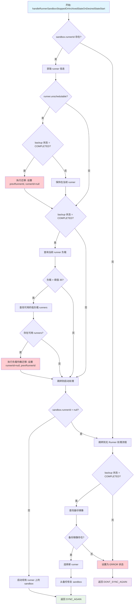
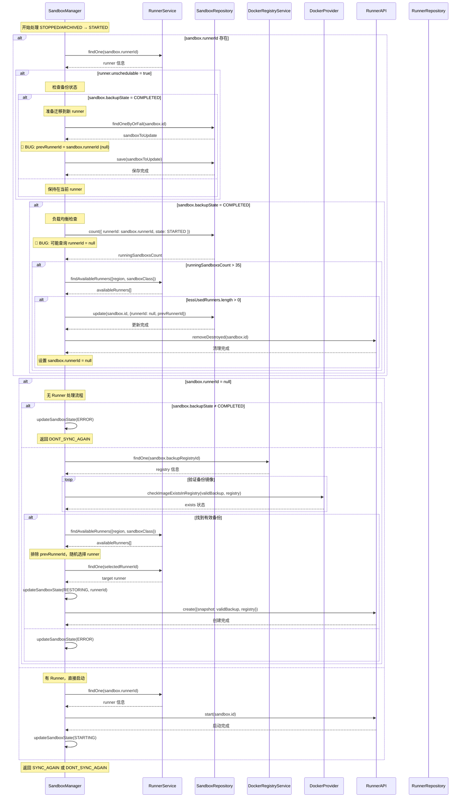

# SandboxManager Runner 分配逻辑 Bug 分析

## Bug 概述

在 `SandboxManager` 类的 `handleRunnerSandboxStoppedOrArchivedStateOnDesiredStateStart` 方法中发现了一个严重的逻辑缺陷。当 runner 变为不可调度状态且 sandbox 具有完整备份时，由于不正确的状态管理导致负载均衡逻辑失效。

## Bug 位置

**文件**: `apps/api/src/sandbox/managers/sandbox.manager.ts`  
**方法**: `handleRunnerSandboxStoppedOrArchivedStateOnDesiredStateStart`  
**行数**: 820-877

## 原始代码设计意图

### 方法概述

`handleRunnerSandboxStoppedOrArchivedStateOnDesiredStateStart` 方法是 sandbox 状态管理的核心组件之一，负责处理当 sandbox 处于 `STOPPED` 或 `ARCHIVED` 状态但期望状态为 `STARTED` 时的逻辑。

### 设计目标

1. **Runner 健康检查与迁移**: 检测并处理不可调度的 runner，确保 sandbox 能迁移到健康的 runner
2. **负载均衡**: 监控 runner 负载，在必要时将 sandbox 迁移到负载较低的 runner
3. **备份恢复**: 当 sandbox 需要重新启动时，从备份中恢复数据
4. **资源优化**: 确保集群资源的合理分配和利用

### 核心流程

该方法包含三个主要的逻辑分支：

1. **不可调度 Runner 处理** (821-838行)
   - 检测当前 runner 是否为 unschedulable
   - 如果备份完成，将 sandbox 迁移到新 runner
   - 如果备份未完成，保持在原 runner

2. **负载均衡检查** (840-877行)  
   - 检查当前 runner 的负载情况
   - 如果超过阈值且有可用的低负载 runner，执行迁移

3. **Sandbox 启动处理** (879-1015行)
   - 如果 sandbox 没有分配 runner，从备份恢复
   - 如果有 runner，直接启动 sandbox

### 详细流程图



### 关键决策点说明

#### 1. Unschedulable Runner 检查

- **目的**: 确保 sandbox 不会在不健康的 runner 上运行
- **条件**: `runner.unschedulable = true`
- **动作**: 如果有完整备份，迁移到新 runner；否则保持原状

#### 2. 负载均衡检查  

- **目的**: 优化集群资源分配，避免单个 runner 过载
- **阈值**: 35 个运行中的 sandbox
- **条件**: 当前 runner 负载超过阈值且存在可用的低负载 runner
- **动作**: 将 sandbox 迁移到负载较低的 runner

#### 3. 备份恢复处理

- **目的**: 为没有分配 runner 的 sandbox 提供恢复机制
- **前提**: 必须有完整的备份 (`BackupState.COMPLETED`)
- **流程**: 验证备份镜像 → 选择新 runner → 从备份恢复

### 设计特点

#### 多层次迁移策略

1. **健康性优先**: 优先处理不可调度的 runner
2. **性能优化**: 通过负载均衡提升整体性能  
3. **容错恢复**: 通过备份机制确保数据不丢失

#### 状态一致性保证

- 使用 `prevRunnerId` 追踪 sandbox 的迁移历史
- 确保在迁移过程中能够正确清理旧 runner 上的资源
- 支持排除策略，避免重新分配到问题 runner

#### 渐进式处理

- 每个决策点都是独立的，允许多个条件同时满足
- 支持复合场景：unschedulable runner + 负载过高
- 最终统一到启动处理逻辑

### 组件交互序列图



上述序列图展示了方法执行过程中各个组件之间的详细交互，包括：

#### 主要参与者

- **SandboxManager**: 核心协调者，执行主要业务逻辑
- **RunnerService**: 提供 runner 查询和管理功能
- **SandboxRepository**: 数据库操作，sandbox 状态持久化
- **DockerRegistryService**: 管理 Docker registry 配置
- **DockerProvider**: 处理 Docker 镜像相关操作
- **RunnerAPI**: 与具体 runner 节点的通信接口

#### 关键交互流程

1. **健康检查阶段**
   - 查询 runner 状态，检测是否为 unschedulable
   - 根据备份状态决定是否迁移

2. **负载均衡阶段**  
   - 查询当前 runner 的负载情况
   - 寻找可用的低负载 runner
   - 执行迁移操作

3. **恢复启动阶段**
   - 验证备份镜像的可用性
   - 选择目标 runner 并创建 sandbox
   - 或直接在现有 runner 上启动

#### Bug 标注

序列图中用 🐛 标记了两个主要的 bug 位置：

- **Bug 1**: `prevRunnerId` 被错误赋值为 `null`
- **Bug 2**: 负载均衡查询可能使用 `runnerId = null`

## 根本原因分析

### 问题描述

该方法包含两个主要的 bug：

1. **数据库更新错误**: 在处理 unschedulable runner 时，`prevRunnerId` 被错误地设置为 `null`
2. **状态依赖错误**: 第二个条件块使用了被第一个条件块修改后的 `runnerId` 值

### 详细代码流程分析

```typescript
if (sandbox.runnerId) {
  const runner = await this.runnerService.findOne(sandbox.runnerId)
  if (runner.unschedulable) {
    if (sandbox.backupState !== BackupState.COMPLETED) {
      // Keep sandbox on the same runner
    } else {
      sandbox.prevRunnerId = sandbox.runnerId
      sandbox.runnerId = null
      
      // ❌ BUG 1: Database update with incorrect value
      const sandboxToUpdate = await this.sandboxRepository.findOneByOrFail({
        id: sandbox.id,
      })
      sandboxToUpdate.prevRunnerId = sandbox.runnerId  // ❌ This is now null!
      sandboxToUpdate.runnerId = null
      await this.sandboxRepository.save(sandboxToUpdate)
    }
  }

  // ❌ BUG 2: This condition uses modified runnerId value
  if (sandbox.backupState === BackupState.COMPLETED) {
    const usageThreshold = 35
    const runningSandboxsCount = await this.sandboxRepository.count({
      where: {
        runnerId: sandbox.runnerId,  // ❌ This might be null now
        state: SandboxState.STARTED,
      },
    })
    // Load balancing logic fails when runnerId is null
  }
}
```

### Bug 后果

1. **数据完整性问题**: `prevRunnerId` 被错误地设置为 `null`，丢失了原始 runner 信息
2. **负载均衡失效**: 当 `runnerId` 为 `null` 时，负载均衡查询返回 0，导致错误的负载评估
3. **迁移逻辑受损**: 系统无法正确排除之前的 runner，可能重新分配到同一个不可调度的 runner
4. **资源分配不当**: 负载均衡机制在某些情况下完全失效

## Bug 影响评估

### 严重性: 高

**功能影响**:

- 当 runner 变为不可调度时，负载均衡机制完全失效
- Sandbox 迁移逻辑受损
- 系统无法有效地重新分配负载

**性能影响**:

- 不可调度的 runner 可能继续过载
- 集群中的资源利用率变得不均衡
- 由于性能下降导致用户体验不佳

**数据一致性影响**:

- 内存中和持久化状态之间的数据库状态不一致
- `prevRunnerId` 字段包含错误的 null 值而不是原始的 runner ID

## 技术分析

### 状态变更问题

这个 bug 展示了一个典型的状态变更问题：

1. **内存对象修改**: `sandbox.runnerId = null`
2. **后续逻辑依赖**: 第二个条件块仍然使用修改后的值
3. **数据库不一致**: 持久化状态与预期逻辑不匹配

**注意**: 连续的 `if` 语句实际上是正确的设计，不是问题。原始代码的意图是两个条件都可能执行，这是合理的负载均衡策略。

## 修复实现

### 推荐解决方案: 使用临时变量

```typescript
private async handleRunnerSandboxStoppedOrArchivedStateOnDesiredStateStart(sandbox: Sandbox): Promise<SyncState> {
  if (sandbox.runnerId) {
    const runner = await this.runnerService.findOne(sandbox.runnerId)
    const originalRunnerId = sandbox.runnerId  // Store original value
    
    if (runner.unschedulable) {
      if (sandbox.backupState !== BackupState.COMPLETED) {
        // Keep sandbox on the same runner
      } else {
        sandbox.prevRunnerId = sandbox.runnerId
        sandbox.runnerId = null

        const sandboxToUpdate = await this.sandboxRepository.findOneByOrFail({
          id: sandbox.id,
        })
        sandboxToUpdate.prevRunnerId = sandbox.prevRunnerId  // Use correct value
        sandboxToUpdate.runnerId = null
        await this.sandboxRepository.save(sandboxToUpdate)
      }
    }

    // Use original runner ID for load balancing check
    if (sandbox.backupState === BackupState.COMPLETED && originalRunnerId) {
      const usageThreshold = 35
      const runningSandboxsCount = await this.sandboxRepository.count({
        where: {
          runnerId: originalRunnerId,  // Use original runner ID
          state: SandboxState.STARTED,
        },
      })
      
      if (runningSandboxsCount > usageThreshold) {
        const availableRunners = await this.runnerService.findAvailableRunners({
          region: sandbox.region,
          sandboxClass: sandbox.class,
        })
        const lessUsedRunners = availableRunners.filter((runner) => runner.id !== originalRunnerId)

        if (lessUsedRunners.length > 0) {
          await this.sandboxRepository.update(sandbox.id, {
            runnerId: null,
            prevRunnerId: originalRunnerId,
          })
          try {
            const runnerSandboxApi = this.runnerApiFactory.createSandboxApi(runner)
            await runnerSandboxApi.removeDestroyed(sandbox.id)
          } catch (e) {
            this.logger.error(
              `Failed to cleanup sandbox ${sandbox.id} on previous runner ${runner.id}:`,
              fromAxiosError(e),
            )
          }
          sandbox.prevRunnerId = originalRunnerId
          sandbox.runnerId = null
        }
      }
    }
  }

  // Rest of the method remains the same...
}
```

## 测试策略

### 单元测试用例

1. **不可调度 Runner 且备份完成**

   ```typescript
   it('should correctly migrate sandbox from unschedulable runner with completed backup', async () => {
     const sandbox = createMockSandbox({
       runnerId: 'runner-1',
       backupState: BackupState.COMPLETED
     })
     const runner = createMockRunner({ id: 'runner-1', unschedulable: true })
     
     await sandboxManager.handleRunnerSandboxStoppedOrArchivedStateOnDesiredStateStart(sandbox)
     
     expect(sandbox.prevRunnerId).toBe('runner-1')
     expect(sandbox.runnerId).toBe(null)
   })
   ```

2. **不可调度 Runner 不触发负载均衡**

   ```typescript
   it('should not perform load balancing for unschedulable runners', async () => {
     const sandbox = createMockSandbox({
       runnerId: 'runner-1',
       backupState: BackupState.COMPLETED
     })
     const runner = createMockRunner({ id: 'runner-1', unschedulable: true })
     
     const countSpy = jest.spyOn(sandboxRepository, 'count')
     
     await sandboxManager.handleRunnerSandboxStoppedOrArchivedStateOnDesiredStateStart(sandbox)
     
     // Should not query with null runnerId
     expect(countSpy).not.toHaveBeenCalledWith({
       where: { runnerId: null, state: SandboxState.STARTED }
     })
   })
   ```

### 集成测试用例

1. **端到端 Runner 迁移流程**
2. **高 Runner 利用率下的负载均衡**
3. **数据库一致性验证**

## 监控和可观测性

### 需要监控的指标

1. **Runner 迁移率**: 跟踪由于不可调度 runner 导致的迁移频率
2. **负载均衡效果**: 监控 sandbox 在 runner 间的分布
3. **迁移失败率**: 跟踪失败的迁移尝试

### 日志增强

```typescript
// Add structured logging for debugging
this.logger.debug('Processing sandbox runner assignment', {
  sandboxId: sandbox.id,
  currentRunnerId: sandbox.runnerId,
  prevRunnerId: sandbox.prevRunnerId,
  runnerUnschedulable: runner?.unschedulable,
  backupState: sandbox.backupState
})
```

## 预防策略

### 代码审查指南

1. **状态变更意识**: 审查任何在执行过程中修改对象状态的方法
2. **连续条件块**: 对依赖相同变量的连续 `if` 语句要谨慎
3. **变量作用域管理**: 对在执行过程中会改变的值使用临时变量

### 静态分析规则

1. 添加 ESLint 规则来检测潜在的状态变更 bug
2. 实现 TypeScript 对可空类型的严格检查
3. 尽可能使用不可变模式

## 相关问题

### 代码库中的类似模式

搜索类似模式发现此问题仅限于此方法。但是，以下方法应该审查是否存在类似问题：

1. `handleSandboxDesiredStateArchived` - 复杂的状态转换
2. `handleSandboxDesiredStateDestroyed` - 多个条件块

### 技术债务

这个 bug 突出了以下需求：

1. **不可变状态管理**: 考虑使用不可变状态模式
2. **更好的方法分解**: 将复杂方法分解为更小、更专注的函数
3. **增强测试**: 为状态转换逻辑提供更全面的单元测试

## 结论

这个 bug 展示了在复杂异步操作中仔细管理状态的重要性。主要问题不是控制流设计（连续的 `if` 语句是正确的），而是状态修改后的值被错误使用。修复方法很直接：使用临时变量保存原始值，确保后续逻辑使用正确的数据。

## Git Commit Recommendation

```
fix(sandbox): resolve runner assignment logic bug in load balancing

Fix critical bug in handleRunnerSandboxStoppedOrArchivedStateOnDesiredStateStart 
where setting sandbox.runnerId to null when migrating from unschedulable runners 
caused subsequent load balancing logic to fail.

The issue occurred because:
- First condition block sets sandbox.runnerId = null for unschedulable runners
- Second condition block uses the modified runnerId (null) for load balancing query
- Database query with runnerId=null returns incorrect count, breaking load balancing

Changes:
- Store original runnerId before modification to preserve load balancing logic
- Fix prevRunnerId assignment to use correct value instead of null
- Ensure load balancing only runs for schedulable runners with valid runnerId

Fixes: Load balancing failure when runners become unschedulable
Impact: Improves sandbox distribution and resource utilization across runner cluster
```
