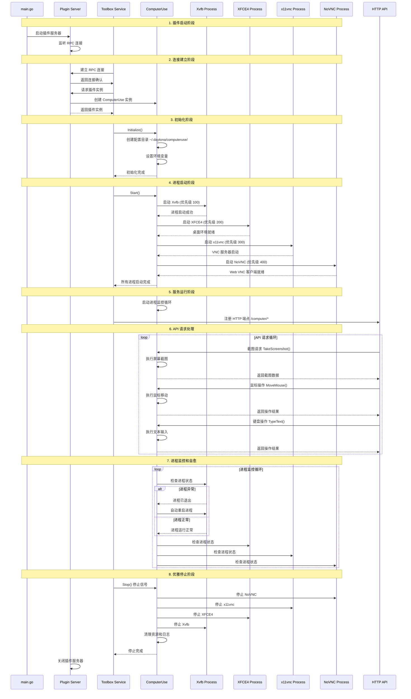

# Daytona Computer Use 插件架构深度分析

## 概述

Daytona Computer Use 插件是一个专门为 VNC 桌面环境设计的进程管理和桌面自动化工具。该插件采用 Go 语言开发，基于 HashiCorp 的插件架构框架，提供了完整的桌面环境管理、屏幕截图、鼠标控制、键盘操作等功能。

## 项目架构概览

### 目录结构

```
libs/computer-use/
├── main.go                     # 插件入口点
├── go.mod                      # Go 模块依赖
├── go.sum                      # 依赖校验文件
├── project.json                # Nx 项目配置
├── README.md                   # 项目文档
├── computer_use_test.go        # 完整的集成测试
└── pkg/computeruse/            # 核心实现包
    ├── computeruse.go          # 主要进程管理逻辑
    ├── display.go              # 显示相关功能
    ├── screenshot.go           # 屏幕截图功能
    ├── mouse.go                # 鼠标控制功能
    └── keyboard.go             # 键盘操作功能
```

### 技术栈

- **核心语言**: Go 1.23+
- **插件框架**: HashiCorp go-plugin
- **GUI 自动化**: go-vgo/robotgo
- **屏幕截图**: kbinani/screenshot
- **日志记录**: sirupsen/logrus
- **测试框架**: stretchr/testify

## 核心组件分析

### 1. 插件入口点 (main.go)

```go
// 插件架构的核心入口
func main() {
    logger := hclog.New(&hclog.LoggerOptions{
        Level:      hclog.Trace,
        Output:     os.Stderr,
        JSONFormat: true,
    })
    
    // 插件服务配置
    hc_plugin.Serve(&hc_plugin.ServeConfig{
        HandshakeConfig: manager.ComputerUseHandshakeConfig,
        Plugins: map[string]hc_plugin.Plugin{
            "daytona-computer-use": &computeruse.ComputerUsePlugin{
                Impl: &cu.ComputerUse{},
            },
        },
        Logger: logger,
    })
}
```

**设计亮点:**

- 采用结构化 JSON 日志输出，便于日志聚合和分析
- 使用 HashiCorp 插件框架，支持 RPC 通信和进程隔离
- 可配置的日志级别，支持详细的调试输出

### 2. 进程管理核心 (computeruse.go)

#### 进程定义结构

```go
type Process struct {
    Name        string            // 进程名称
    Command     string            // 执行命令
    Args        []string          // 命令参数
    User        string            // 运行用户
    Priority    int              // 启动优先级
    Env         map[string]string // 环境变量
    LogFile     string           // 标准输出日志文件
    ErrFile     string           // 错误输出日志文件
    AutoRestart bool             // 自动重启标志
    cmd         *exec.Cmd        // 命令实例
    ctx         context.Context  // 上下文
    cancel      context.CancelFunc // 取消函数
    mu          sync.Mutex       // 进程级互斥锁
    running     bool             // 运行状态
}
```

#### 主控制器结构

```go
type ComputerUse struct {
    processes map[string]*Process // 进程映射表
    mu        sync.RWMutex        // 读写互斥锁
    configDir string              // 配置目录路径
}
```

**架构特点:**

- **线程安全**: 使用读写锁保护进程集合，进程级互斥锁保护单个进程状态
- **优先级启动**: 基于优先级值确定进程启动顺序
- **上下文管理**: 使用 Go context 实现优雅的进程生命周期管理
- **日志分离**: 标准输出和错误输出分别记录到不同文件

#### 管理的核心进程

系统管理四个关键进程，按优先级启动：

```go
// 1. Xvfb (优先级 100) - X 虚拟帧缓冲
Process{
    Name:     "xvfb",
    Command:  "/usr/bin/Xvfb",
    Args:     []string{display, "-screen", "0", vncResolution + "x24"},
    Priority: 100,
    Env:      map[string]string{"DISPLAY": display},
}

// 2. XFCE4 (优先级 200) - 桌面环境
Process{
    Name:     "xfce4", 
    Command:  "/usr/bin/startxfce4",
    Priority: 200,
    Env: map[string]string{
        "DISPLAY":                  display,
        "HOME":                     homeDir,
        "USER":                     user,
        "DBUS_SESSION_BUS_ADDRESS": dbusAddress,
    },
}

// 3. x11vnc (优先级 300) - VNC 服务器
Process{
    Name:     "x11vnc",
    Command:  "/usr/bin/x11vnc", 
    Args:     []string{"-display", display, "-forever", "-shared", "-rfbport", vncPort},
    Priority: 300,
}

// 4. NoVNC (优先级 400) - Web VNC 客户端
Process{
    Name:     "novnc",
    Command:  "/usr/share/novnc/utils/novnc_proxy",
    Args:     []string{"--vnc", "localhost:" + vncPort},
    Priority: 400,
}
```

**进程依赖关系:**

1. **Xvfb** 提供虚拟显示基础设施
2. **XFCE4** 依赖 Xvfb 提供的显示环境
3. **x11vnc** 依赖桌面环境运行
4. **NoVNC** 依赖 VNC 服务器提供 Web 访问

#### 进程生命周期管理

**启动流程:**

```go
func (c *ComputerUse) startAllProcesses() {
    // 按优先级排序
    processes := c.getProcessesByPriority()
    
    for _, process := range processes {
        go c.startProcess(process)
        // 进程间启动延迟，确保依赖关系
        time.Sleep(2 * time.Second)
    }
}
```

**智能重启机制:**

```go
func (c *ComputerUse) startProcess(process *Process) {
    for {
        // 进程启动逻辑
        err := process.cmd.Start()
        if err != nil {
            log.Errorf("Failed to start process %s: %v", process.Name, err)
            if !process.AutoRestart {
                break
            }
            time.Sleep(5 * time.Second)
            continue
        }
        
        // 等待进程结束
        err = process.cmd.Wait()
        
        // 自动重启判断
        if !process.AutoRestart {
            break
        }
        
        log.Infof("Restarting process %s in 5 seconds...", process.Name)
        time.Sleep(5 * time.Second)
    }
}
```

**设计优势:**

- **自愈能力**: 进程异常退出时自动重启
- **优雅启动**: 进程间延迟启动确保依赖关系
- **资源清理**: Context 取消机制确保资源正确释放

### 3. 屏幕截图系统 (screenshot.go, display.go)

#### 基础截图功能

```go
func (u *ComputerUse) TakeScreenshot(req *computeruse.ScreenshotRequest) (*computeruse.ScreenshotResponse, error) {
    // 获取主显示器边界
    bounds := screenshot.GetDisplayBounds(0)
    img, err := screenshot.CaptureRect(bounds)
    if err != nil {
        return nil, err
    }
    
    // 转换为 RGBA 格式以支持绘制操作
    rgbaImg := image.NewRGBA(img.Bounds())
    draw.Draw(rgbaImg, rgbaImg.Bounds(), img, image.Point{}, draw.Src)
    
    // 可选的鼠标光标绘制
    mouseX, mouseY := 0, 0
    if req.ShowCursor {
        mouseX, mouseY = robotgo.Location()
        drawCursor(rgbaImg, mouseX, mouseY)
    }
    
    // 编码为 PNG 并转换为 Base64
    var buf bytes.Buffer
    if err := png.Encode(&buf, rgbaImg); err != nil {
        return nil, err
    }
    
    base64Str := base64.StdEncoding.EncodeToString(buf.Bytes())
    
    return &computeruse.ScreenshotResponse{
        Screenshot: base64Str,
        CursorPosition: &computeruse.Position{X: mouseX, Y: mouseY},
    }, nil
}
```

#### 高级压缩截图

```go
func (u *ComputerUse) TakeCompressedScreenshot(req *computeruse.CompressedScreenshotRequest) (*computeruse.ScreenshotResponse, error) {
    params := ImageCompressionParams{
        Format:  req.Format,  // "png", "jpeg"
        Quality: req.Quality, // 1-100 JPEG 质量
        Scale:   req.Scale,   // 0.1-1.0 缩放比例
    }
    
    // 图像压缩处理
    imageData, err := encodeImageWithCompression(rgbaImg, params)
    if err != nil {
        return nil, err
    }
    
    return &computeruse.ScreenshotResponse{
        Screenshot: base64.StdEncoding.EncodeToString(imageData),
        SizeBytes:  len(imageData),
    }, nil
}
```

#### 区域截图支持

```go
func (u *ComputerUse) TakeRegionScreenshot(req *computeruse.RegionScreenshotRequest) (*computeruse.ScreenshotResponse, error) {
    // 定义截图区域
    rect := image.Rect(req.X, req.Y, req.X+req.Width, req.Y+req.Height)
    img, err := screenshot.CaptureRect(rect)
    
    // 光标位置转换为相对坐标
    if req.ShowCursor {
        absoluteMouseX, absoluteMouseY := robotgo.Location()
        mouseX = absoluteMouseX - req.X
        mouseY = absoluteMouseY - req.Y
        
        // 仅在光标位于截图区域内时绘制
        if mouseX >= 0 && mouseX < req.Width && mouseY >= 0 && mouseY < req.Height {
            drawCursor(rgbaImg, mouseX, mouseY)
        }
    }
}
```

#### 自定义光标绘制

```go
func drawCursor(img *image.RGBA, x, y int) {
    white := color.RGBA{255, 255, 255, 255}
    black := color.RGBA{0, 0, 0, 255}
    red := color.RGBA{255, 0, 0, 255}
    
    cursorSize := 20
    
    // 绘制白色轮廓（抗锯齿效果）
    for i := -1; i <= 1; i++ {
        for j := -1; j <= 1; j++ {
            // 水平线
            for dx := -cursorSize; dx <= cursorSize; dx++ {
                px, py := x+dx, y+i
                if px >= 0 && px < img.Bounds().Dx() && py >= 0 && py < img.Bounds().Dy() {
                    img.Set(px, py, white)
                }
            }
            // 垂直线
            for dy := -cursorSize; dy <= cursorSize; dy++ {
                px, py := x+j, y+dy
                if px >= 0 && px < img.Bounds().Dx() && py >= 0 && py < img.Bounds().Dy() {
                    img.Set(px, py, white)
                }
            }
        }
    }
    
    // 绘制黑色十字主体
    for dx := -cursorSize; dx <= cursorSize; dx++ {
        if x+dx >= 0 && x+dx < img.Bounds().Dx() && y >= 0 && y < img.Bounds().Dy() {
            img.Set(x+dx, y, black)
        }
    }
    for dy := -cursorSize; dy <= cursorSize; dy++ {
        if x >= 0 && x < img.Bounds().Dx() && y+dy >= 0 && y+dy < img.Bounds().Dy() {
            img.Set(x, y+dy, black)
        }
    }
    
    // 绘制红色中心点
    for i := -2; i <= 2; i++ {
        for j := -2; j <= 2; j++ {
            px, py := x+i, y+j
            if px >= 0 && px < img.Bounds().Dx() && py >= 0 && py < img.Bounds().Dy() {
                img.Set(px, py, red)
            }
        }
    }
}
```

#### 显示信息获取

```go
func (u *ComputerUse) GetDisplayInfo() (*computeruse.DisplayInfoResponse, error) {
    n := screenshot.NumActiveDisplays()
    displays := make([]computeruse.DisplayInfo, n)
    
    for i := 0; i < n; i++ {
        bounds := screenshot.GetDisplayBounds(i)
        displays[i] = computeruse.DisplayInfo{
            ID: i,
            Position: computeruse.Position{
                X: bounds.Min.X,
                Y: bounds.Min.Y,
            },
            Size: computeruse.Size{
                Width:  bounds.Dx(),
                Height: bounds.Dy(),
            },
            IsActive: true,
        }
    }
    
    return &computeruse.DisplayInfoResponse{
        Displays: displays,
    }, nil
}
```

**屏幕截图系统特点:**

- **多格式支持**: PNG、JPEG 格式输出
- **压缩优化**: 支持质量参数和缩放比例
- **区域截图**: 精确的像素级区域选择
- **光标增强**: 高对比度十字光标绘制
- **多显示器支持**: 自动检测和处理多显示器环境

### 4. 鼠标控制系统 (mouse.go)

#### 基础鼠标操作

```go
func (u *ComputerUse) MoveMouse(req *computeruse.MoveMouseRequest) (*computeruse.MousePositionResponse, error) {
    robotgo.Move(req.X, req.Y)
    
    // 确保移动完成的延迟
    time.Sleep(50 * time.Millisecond)
    
    // 获取实际位置确认
    actualX, actualY := robotgo.Location()
    
    return &computeruse.MousePositionResponse{
        Position: computeruse.Position{X: actualX, Y: actualY},
    }, nil
}
```

#### 智能点击操作

```go
func (u *ComputerUse) Click(req *computeruse.ClickRequest) (*computeruse.MouseClickResponse, error) {
    // 默认左键点击
    if req.Button == "" {
        req.Button = "left"
    }
    
    // 先移动到目标位置
    robotgo.Move(req.X, req.Y)
    time.Sleep(100 * time.Millisecond)
    
    // 执行点击操作
    if req.Double {
        robotgo.Click(req.Button, true)  // 双击
    } else {
        robotgo.Click(req.Button, false) // 单击
    }
    
    // 获取点击后的位置
    actualX, actualY := robotgo.Location()
    
    return &computeruse.MouseClickResponse{
        Position: computeruse.Position{X: actualX, Y: actualY},
    }, nil
}
```

#### 平滑拖拽操作

```go
func (u *ComputerUse) Drag(req *computeruse.DragRequest) (*computeruse.MouseDragResponse, error) {
    // 移动到起始位置
    robotgo.Move(req.StartX, req.StartY)
    time.Sleep(100 * time.Millisecond)
    
    // 预点击以激活窗口
    robotgo.Click(req.Button, false)
    time.Sleep(100 * time.Millisecond)
    
    // 确保鼠标按键释放
    err := robotgo.MouseUp(req.Button)
    if err != nil {
        return nil, err
    }
    time.Sleep(50 * time.Millisecond)
    
    // 按下鼠标按键开始拖拽
    err = robotgo.MouseDown(req.Button)
    if err != nil {
        return nil, err
    }
    time.Sleep(300 * time.Millisecond)
    
    // 平滑移动到终点
    moveMouseSmoothly(req.StartX, req.StartY, req.EndX, req.EndY, 20)
    time.Sleep(100 * time.Millisecond)
    
    // 释放鼠标按键
    err = robotgo.MouseUp(req.Button)
    if err != nil {
        return nil, err
    }
    
    return &computeruse.MouseDragResponse{
        Position: computeruse.Position{X: actualX, Y: actualY},
    }, nil
}

// 平滑移动辅助函数
func moveMouseSmoothly(startX, startY, endX, endY, steps int) {
    dx := float64(endX-startX) / float64(steps)
    dy := float64(endY-startY) / float64(steps)
    
    for i := 1; i <= steps; i++ {
        x := int(float64(startX) + dx*float64(i))
        y := int(float64(startY) + dy*float64(i))
        robotgo.Move(x, y)
        time.Sleep(2 * time.Millisecond)
    }
}
```

#### 滚轮操作

```go
func (u *ComputerUse) Scroll(req *computeruse.ScrollRequest) (*computeruse.ScrollResponse, error) {
    // 默认滚动量
    if req.Amount == 0 {
        req.Amount = 3
    }
    
    // 移动到滚动位置
    robotgo.Move(req.X, req.Y)
    time.Sleep(50 * time.Millisecond)
    
    // 执行滚动
    if req.Direction == "up" {
        robotgo.ScrollSmooth(req.Amount, 0)
    } else {
        robotgo.ScrollSmooth(-req.Amount, 0)
    }
    
    return &computeruse.ScrollResponse{Success: true}, nil
}
```

**鼠标控制特点:**

- **平滑移动**: 多步骤插值实现自然的拖拽效果
- **时序控制**: 精确的延迟控制确保操作生效
- **多按键支持**: 左键、右键、中键完整支持
- **状态确认**: 所有操作返回实际执行后的状态

### 5. 键盘操作系统 (keyboard.go)

#### 文本输入

```go
func (u *ComputerUse) TypeText(req *computeruse.TypeTextRequest) (*computeruse.Empty, error) {
    if req.Delay > 0 {
        // 带延迟的逐字符输入
        robotgo.TypeStr(req.Text, req.Delay)
    } else {
        // 快速文本输入
        robotgo.TypeStr(req.Text)
    }
    
    return new(computeruse.Empty), nil
}
```

#### 按键操作

```go
func (u *ComputerUse) PressKey(req *computeruse.PressKeyRequest) (*computeruse.Empty, error) {
    if len(req.Modifiers) > 0 {
        // 带修饰键的按键操作
        err := robotgo.KeyTap(req.Key, req.Modifiers)
        if err != nil {
            return nil, err
        }
    } else {
        // 单纯按键操作
        err := robotgo.KeyTap(req.Key)
        if err != nil {
            return nil, err
        }
    }
    
    return new(computeruse.Empty), nil
}
```

#### 热键组合

```go
func (u *ComputerUse) PressHotkey(req *computeruse.PressHotkeyRequest) (*computeruse.Empty, error) {
    keys := strings.Split(req.Keys, "+")
    if len(keys) < 2 {
        return nil, fmt.Errorf("invalid hotkey format")
    }
    
    mainKey := keys[len(keys)-1]
    modifiers := keys[:len(keys)-1]
    
    err := robotgo.KeyTap(mainKey, modifiers)
    if err != nil {
        return nil, err
    }
    
    return new(computeruse.Empty), nil
}
```

**键盘操作特点:**

- **延迟控制**: 支持可配置的输入延迟
- **修饰键支持**: Ctrl、Alt、Shift 等修饰键组合
- **热键解析**: 字符串格式热键自动解析
- **错误处理**: 完整的按键操作错误处理

## 测试架构分析 (computer_use_test.go)

### 测试客户端实现

```go
type TestClient struct {
    client *hc_plugin.Client
    plugin computeruse.IComputerUse
}

func NewTestClient() (*TestClient, error) {
    // 构建插件二进制
    buildCmd := exec.Command("go", "build", "-o", "test-computer-use", ".")
    if err := buildCmd.Run(); err != nil {
        return nil, fmt.Errorf("failed to build plugin: %v", err)
    }
    
    // 创建插件客户端
    client := hc_plugin.NewClient(&hc_plugin.ClientConfig{
        HandshakeConfig: manager.ComputerUseHandshakeConfig,
        Plugins: map[string]hc_plugin.Plugin{
            "daytona-computer-use": &computeruse.ComputerUsePlugin{},
        },
        Cmd:     exec.Command("./test-computer-use"),
        Logger:  hclog.New(&hclog.LoggerOptions{Level: hclog.Error}),
        Managed: true,
    })
    
    // 连接到插件
    rpcClient, err := client.Client()
    if err != nil {
        client.Kill()
        return nil, fmt.Errorf("failed to connect to plugin: %v", err)
    }
    
    // 获取插件实例
    raw, err := rpcClient.Dispense("daytona-computer-use")
    if err != nil {
        client.Kill()
        return nil, fmt.Errorf("failed to dispense plugin: %v", err)
    }
    
    plugin, ok := raw.(computeruse.IComputerUse)
    if !ok {
        client.Kill()
        return nil, fmt.Errorf("plugin does not implement IComputerUse interface")
    }
    
    return &TestClient{
        client: client,
        plugin: plugin,
    }, nil
}
```

### 测试用例分类

测试套件包含六个主要测试类别：

#### 1. 进程管理测试

```go
func testProcessManagement(t *testing.T, plugin computeruse.IComputerUse) {
    // 初始化测试
    t.Run("Initialize", func(t *testing.T) {
        _, err := plugin.Initialize()
        assert.NoError(t, err)
    })
    
    // 启动测试
    t.Run("Start", func(t *testing.T) {
        _, err := plugin.Start()
        assert.NoError(t, err)
        time.Sleep(3 * time.Second) // 等待进程启动
    })
    
    // 状态检查测试
    t.Run("GetProcessStatus", func(t *testing.T) {
        status, err := plugin.GetProcessStatus()
        assert.NoError(t, err)
        assert.NotNil(t, status)
        
        // 验证预期进程
        expectedProcesses := []string{"xvfb", "xfce4", "x11vnc", "novnc"}
        for _, processName := range expectedProcesses {
            processStatus, exists := status[processName]
            assert.True(t, exists, "Process %s should exist", processName)
            if exists {
                assert.NotNil(t, processStatus)
                assert.True(t, processStatus.Priority > 0)
            }
        }
    })
}
```

#### 2. 屏幕截图测试

```go
func testScreenshotMethods(t *testing.T, plugin computeruse.IComputerUse) {
    // 基础截图测试
    t.Run("TakeScreenshot", func(t *testing.T) {
        req := &computeruse.ScreenshotRequest{ShowCursor: false}
        resp, err := plugin.TakeScreenshot(req)
        assert.NoError(t, err)
        assert.NotNil(t, resp)
        assert.NotEmpty(t, resp.Screenshot)
    })
    
    // 压缩截图测试
    t.Run("TakeCompressedScreenshot", func(t *testing.T) {
        req := &computeruse.CompressedScreenshotRequest{
            ShowCursor: false,
            Format:     "png",
            Quality:    85,
            Scale:      0.5,
        }
        resp, err := plugin.TakeCompressedScreenshot(req)
        assert.NoError(t, err)
        assert.NotNil(t, resp)
        assert.NotEmpty(t, resp.Screenshot)
        assert.True(t, resp.SizeBytes > 0)
    })
}
```

#### 3. 性能测试

```go
func TestPerformance(t *testing.T) {
    t.Run("ScreenshotPerformance", func(t *testing.T) {
        const numScreenshots = 10
        start := time.Now()
        
        for i := 0; i < numScreenshots; i++ {
            _, err := client.plugin.TakeScreenshot(&computeruse.ScreenshotRequest{ShowCursor: false})
            assert.NoError(t, err)
        }
        
        duration := time.Since(start)
        avgTime := duration / numScreenshots
        
        t.Logf("Average screenshot time: %v", avgTime)
        assert.True(t, avgTime < 2*time.Second, "Screenshot should complete within 2 seconds on average")
    })
}
```

#### 4. 并发测试

```go
func TestConcurrentAccess(t *testing.T) {
    t.Run("ConcurrentScreenshots", func(t *testing.T) {
        const numGoroutines = 5
        done := make(chan bool, numGoroutines)
        
        for i := 0; i < numGoroutines; i++ {
            go func(id int) {
                defer func() { done <- true }()
                
                req := &computeruse.ScreenshotRequest{ShowCursor: false}
                resp, err := client.plugin.TakeScreenshot(req)
                if err != nil {
                    t.Errorf("Goroutine %d: TakeScreenshot failed: %v", id, err)
                    return
                }
                assert.NotNil(t, resp)
                assert.NotEmpty(t, resp.Screenshot)
            }(i)
        }
        
        // 等待所有协程完成
        for i := 0; i < numGoroutines; i++ {
            <-done
        }
    })
}
```

### 测试环境检测

```go
func TestComputerUsePlugin(t *testing.T) {
    // 跳过 CI 和无界面环境的测试
    if os.Getenv("CI") == "true" || os.Getenv("DISPLAY") == "" {
        t.Skip("Skipping GUI tests in CI or headless environment")
    }
    
    client, err := NewTestClient()
    require.NoError(t, err)
    defer client.Close()
    
    // 执行所有测试模块
    t.Run("ProcessManagement", func(t *testing.T) {
        testProcessManagement(t, client.plugin)
    })
    // ... 其他测试模块
}
```

**测试架构特点:**

- **自动化构建**: 测试时自动构建插件二进制
- **环境检测**: 智能跳过不适用的测试环境
- **性能基准**: 包含详细的性能测试和基准
- **并发安全**: 验证多线程访问的安全性
- **完整覆盖**: 所有公共接口的全面测试

## 配置管理与环境变量

### 环境变量配置

```go
// Docker 环境配置
vncResolution := os.Getenv("VNC_RESOLUTION")
if vncResolution == "" {
    vncResolution = "1024x768" // 默认分辨率
}

vncPort := os.Getenv("VNC_PORT")
if vncPort == "" {
    vncPort = "5901" // 默认 VNC 端口
}

display := os.Getenv("DISPLAY")
if display == "" {
    display = ":0" // 默认显示
}

// 用户配置优先级
user := os.Getenv("VNC_USER")
if user == "" {
    user = os.Getenv("DAYTONA_SANDBOX_USER")
    if user == "" {
        user = "root" // 最后的后备选项
    }
}
```

### 配置参数表

| 环境变量 | 默认值 | 说明 |
|---------|--------|------|
| `VNC_RESOLUTION` | `1024x768` | VNC 显示分辨率 |
| `VNC_PORT` | `5901` | VNC 服务器端口 |
| `NO_VNC_PORT` | `6080` | NoVNC Web 端口 |
| `DISPLAY` | `:0` | X 显示服务器 |
| `VNC_USER` | `daytona` | VNC 进程运行用户 |
| `DAYTONA_SANDBOX_USER` | - | Daytona 沙盒用户（备用） |

### 配置目录结构

```go
// 配置和日志目录
homeDir, err := os.UserHomeDir()
c.configDir = filepath.Join(homeDir, ".daytona", "computeruse")
err = os.MkdirAll(c.configDir, 0755)

// 日志文件分配
LogFile: filepath.Join(c.configDir, "xfce4.log"),
ErrFile: filepath.Join(c.configDir, "xfce4.err"),
```

**日志文件结构:**

```
~/.daytona/computeruse/
├── xfce4.log          # XFCE4 标准输出
├── xfce4.err          # XFCE4 错误输出
├── x11vnc.log         # VNC 服务器日志
├── x11vnc.err         # VNC 服务器错误
├── novnc.log          # NoVNC 日志
└── novnc.err          # NoVNC 错误
```

## 依赖分析与版本管理

### 核心依赖 (go.mod)

```go
module github.com/daytonaio/computer-use

go 1.23.0

require (
    github.com/go-vgo/robotgo v0.110.8          // GUI 自动化核心
    github.com/hashicorp/go-hclog v1.6.3        // 结构化日志
    github.com/hashicorp/go-plugin v1.6.3       // 插件架构框架
    github.com/kbinani/screenshot v0.0.0-20250118074034-a3924b7bbc8c // 屏幕截图
    github.com/sirupsen/logrus v1.9.3           // 应用日志
    github.com/stretchr/testify v1.10.0         // 测试框架
)
```

### 间接依赖分析

**底层系统依赖:**

- `github.com/go-ole/go-ole` - Windows COM 接口
- `github.com/jezek/xgb` - X11 协议绑定
- `github.com/robotn/xgb` - X11 扩展绑定
- `golang.org/x/sys` - 系统调用接口

**图像处理依赖:**

- `golang.org/x/image` - 图像处理扩展
- `github.com/gen2brain/shm` - 共享内存接口

**网络通信依赖:**

- `google.golang.org/grpc` - gRPC 通信
- `google.golang.org/protobuf` - Protocol Buffers

### 平台兼容性

```go
// 系统特定的依赖
require (
    github.com/dblohm7/wingoes v0.0.0-20250611174154-e3e096948d18 // Windows 特定
    github.com/tailscale/win v0.0.0-20250213223159-5992cb43ca35   // Windows 网络
    github.com/lxn/win v0.0.0-20210218163916-a377121e959e        // Windows API
    github.com/godbus/dbus/v5 v5.1.0                            // Linux D-Bus
)
```

## 错误处理与日志记录

### 错误处理策略

```go
// 智能错误处理示例
func (c *ComputerUse) TakeScreenshot(req *computeruse.ScreenshotRequest) (*computeruse.ScreenshotResponse, error) {
    display := os.Getenv("DISPLAY")
    log.Infof("TakeScreenshot: DISPLAY=%s", display)
    
    bounds := screenshot.GetDisplayBounds(0)
    img, err := screenshot.CaptureRect(bounds)
    if err != nil {
        log.Errorf("TakeScreenshot error: %v", err)
        return nil, err
    }
    
    // ... 处理逻辑
    
    return response, nil
}
```

### 日志级别策略

```go
// 主进程日志配置
logger := hclog.New(&hclog.LoggerOptions{
    Level:      hclog.Trace,    // 详细调试级别
    Output:     os.Stderr,      // 标准错误输出
    JSONFormat: true,           // 结构化 JSON 格式
})

// 应用级日志使用 logrus
log.Infof("Starting process: %s", process.Name)
log.Errorf("Failed to start process %s: %v", process.Name, err)
```

### 进程错误恢复

```go
func (c *ComputerUse) startProcess(process *Process) {
    process.mu.Lock()
    if process.running {
        process.mu.Unlock()
        return
    }
    process.running = true
    process.mu.Unlock()
    
    for {
        // 启动进程
        err := process.cmd.Start()
        if err != nil {
            log.Errorf("Failed to start process %s: %v", process.Name, err)
            if !process.AutoRestart {
                break // 非自动重启进程，退出循环
            }
            time.Sleep(5 * time.Second)
            continue // 重试启动
        }
        
        // 等待进程结束
        err = process.cmd.Wait()
        if err != nil {
            log.Errorf("Process %s exited with error: %v", process.Name, err)
        } else {
            log.Infof("Process %s exited normally", process.Name)
        }
        
        // 自动重启检查
        if !process.AutoRestart {
            break
        }
        
        log.Infof("Restarting process %s in 5 seconds...", process.Name)
        time.Sleep(5 * time.Second)
    }
    
    // 清理状态
    process.mu.Lock()
    process.running = false
    process.mu.Unlock()
}
```

## 性能优化与资源管理

### 并发控制

```go
type ComputerUse struct {
    processes map[string]*Process
    mu        sync.RWMutex        // 主读写锁
    configDir string
}

type Process struct {
    // ... 其他字段
    mu      sync.Mutex           // 进程级锁
    running bool
}
```

**锁策略:**

- **读写锁**: 主结构使用读写锁，支持并发读取进程列表
- **进程锁**: 每个进程使用独立互斥锁，避免锁竞争
- **无锁设计**: 状态查询操作设计为无锁或最小锁持有时间

### 内存管理

```go
// 图像数据及时释放
func (u *ComputerUse) TakeScreenshot(req *computeruse.ScreenshotRequest) (*computeruse.ScreenshotResponse, error) {
    bounds := screenshot.GetDisplayBounds(0)
    img, err := screenshot.CaptureRect(bounds)
    if err != nil {
        return nil, err
    }
    
    // 转换为 RGBA 进行处理
    rgbaImg := image.NewRGBA(img.Bounds())
    draw.Draw(rgbaImg, rgbaImg.Bounds(), img, image.Point{}, draw.Src)
    
    // 及时编码和释放
    var buf bytes.Buffer
    if err := png.Encode(&buf, rgbaImg); err != nil {
        return nil, err
    }
    
    // rgbaImg 在函数结束时自动释放
    base64Str := base64.StdEncoding.EncodeToString(buf.Bytes())
    
    return &computeruse.ScreenshotResponse{
        Screenshot: base64Str,
    }, nil
}
```

### 进程资源管理

```go
func (c *ComputerUse) stopProcess(process *Process) {
    process.mu.Lock()
    defer process.mu.Unlock()
    
    if !process.running {
        return
    }
    
    log.Infof("Stopping process: %s", process.Name)
    
    // 优雅停止：首先取消上下文
    if process.cancel != nil {
        process.cancel()
    }
    
    // 强制终止：如果进程仍在运行
    if process.cmd != nil && process.cmd.Process != nil {
        err := process.cmd.Process.Kill()
        if err != nil {
            log.Errorf("Failed to kill process %s: %v", process.Name, err)
        }
    }
    
    process.running = false
}
```

## 与 Toolbox API 集成

### HTTP 端点集成

根据 README.md 描述，Computer Use 插件集成到 toolbox 服务器中，提供以下 HTTP 端点：

```
/computer/screenshot    - 屏幕截图功能
/computer/mouse        - 鼠标控制
/computer/keyboard     - 键盘控制  
/computer/display      - 显示信息
```

### API 接口设计

虽然具体的 HTTP 处理逻辑不在当前代码中，但可以推断接口设计：

```go
// 推断的 HTTP 接口映射
type ToolboxIntegration struct {
    computerUse computeruse.IComputerUse
}

func (t *ToolboxIntegration) HandleScreenshot(w http.ResponseWriter, r *http.Request) {
    var req computeruse.ScreenshotRequest
    json.NewDecoder(r.Body).Decode(&req)
    
    resp, err := t.computerUse.TakeScreenshot(&req)
    if err != nil {
        http.Error(w, err.Error(), http.StatusInternalServerError)
        return
    }
    
    json.NewEncoder(w).Encode(resp)
}
```

### 插件生命周期

以下 Mermaid 时序图详细展示了 Computer Use 插件从启动到运行的完整生命周期，清楚地表达了各组件之间的交互时序：



**时序图关键特点：**

1. **时间轴清晰**: 从上到下按时间顺序展示各个阶段
2. **交互关系明确**: 清楚显示组件间的调用和响应关系
3. **并发处理**: 通过 loop 结构展示持续的监控和 API 处理
4. **错误处理**: 使用 alt/else 结构展示自愈机制
5. **生命周期完整**: 涵盖从启动到停止的全过程
6. **依赖关系**: 按优先级顺序启动进程，体现依赖关系
7. **异步操作**: 使用虚线箭头表示异步响应

## 部署与容器化需求

### Dockerfile 集成要求

根据 README.md，使用该插件的容器需要安装以下组件：

#### 必需软件包

```dockerfile
# 防止交互式提示
ENV DEBIAN_FRONTEND=noninteractive
ENV DISPLAY=:1
ENV VNC_PORT=5901
ENV NO_VNC_PORT=6080
ENV VNC_RESOLUTION=1280x720

# 安装 VNC 和桌面环境
RUN apt-get update && apt-get install -y \
    # 基础工具
    wget git vim \
    # 桌面环境
    xfce4 xfce4-terminal dbus-x11 \
    # 字体支持
    xfonts-base xfonts-100dpi xfonts-75dpi xfonts-scalable \
    # VNC 组件
    x11vnc novnc supervisor \
    # 系统工具
    net-tools locales \
    # X11 组件
    xvfb x11-utils x11-xserver-utils \
    # 截图工具
    gnome-screenshot scrot imagemagick \
    # 自动化工具
    xdotool xautomation wmctrl \
    # 开发依赖
    build-essential libx11-dev libxext-dev libxtst-dev \
    libxinerama-dev libx11-xcb-dev libxkbcommon-dev \
    libxkbcommon-x11-dev libxcb-xkb-dev libpng-dev \
    # 浏览器
    chromium \
    && apt-get clean \
    && rm -rf /var/lib/apt/lists/*
```

#### VNC 设置

```dockerfile
# VNC 目录设置
RUN mkdir -p /home/daytona/.vnc && \
    chown -R daytona:daytona /home/daytona/.vnc

# NoVNC 配置
RUN ln -sf /usr/share/novnc/vnc.html /usr/share/novnc/index.html && \
    sed -i 's/websockify =/websockify = --heartbeat 30/' /usr/share/novnc/utils/launch.sh

# 用户设置
RUN useradd -m daytona && echo "daytona ALL=(ALL) NOPASSWD:ALL" > /etc/sudoers.d/91-daytona
USER daytona
```

### 进程配置映射

| 进程 | 命令路径 | 配置要求 |
|------|----------|----------|
| Xvfb | `/usr/bin/Xvfb` | 虚拟显示服务器 |
| XFCE4 | `/usr/bin/startxfce4` | 桌面环境 |
| x11vnc | `/usr/bin/x11vnc` | VNC 服务器 |
| NoVNC | `/usr/share/novnc/utils/novnc_proxy` | Web VNC 客户端 |

### 网络端口映射

```yaml
# docker-compose.yml 示例
services:
  daytona-sandbox:
    ports:
      - "5901:5901"  # VNC 端口
      - "6080:6080"  # NoVNC Web 端口
    environment:
      - DISPLAY=:1
      - VNC_RESOLUTION=1920x1080
      - VNC_PORT=5901
      - NO_VNC_PORT=6080
      - VNC_USER=daytona
```

## 安全考虑

### 权限管理

```go
// 用户权限配置
user := os.Getenv("VNC_USER")
if user == "" {
    user = os.Getenv("DAYTONA_SANDBOX_USER")
    if user == "" {
        user = "root" // 仅在开发环境
    }
}
```

### 进程隔离

```go
// 进程环境隔离
process.cmd.Env = os.Environ()
for key, value := range process.Env {
    process.cmd.Env = append(process.cmd.Env, fmt.Sprintf("%s=%s", key, value))
}
```

### 资源限制

- **进程监控**: 每个进程独立监控和重启
- **内存管理**: 图像数据及时释放，避免内存泄漏
- **网络隔离**: VNC 端口仅在容器内可见
- **文件权限**: 日志文件使用适当的权限设置

## 故障排除指南

### 常见问题与解决方案

#### 1. 进程启动失败

**问题现象**: 进程无法启动或立即退出
**排查步骤**:

```bash
# 检查环境变量
echo $DISPLAY
echo $VNC_PORT
echo $VNC_RESOLUTION

# 检查必需软件是否安装
which Xvfb
which startxfce4
which x11vnc
which novnc_proxy

# 检查日志文件
cat ~/.daytona/computeruse/xfce4.err
cat ~/.daytona/computeruse/x11vnc.err
```

#### 2. 屏幕截图失败

**问题现象**: 截图返回错误或空白图像
**排查步骤**:

```bash
# 检查 X 服务器状态
ps aux | grep Xvfb
xwininfo -root -tree

# 手动测试截图
scrot test.png
gnome-screenshot -f test.png
```

#### 3. 鼠标/键盘操作无响应

**问题现象**: 鼠标点击或键盘输入无效果
**排查步骤**:

```bash
# 检查 XFCE 进程
ps aux | grep xfce
ps aux | grep dbus

# 检查显示配置
xrandr
xdpyinfo
```

#### 4. VNC 连接问题

**问题现象**: 无法通过 VNC 客户端连接
**排查步骤**:

```bash
# 检查 VNC 服务器状态
ps aux | grep x11vnc
netstat -ln | grep 5901

# 检查 NoVNC 状态
ps aux | grep novnc
netstat -ln | grep 6080
```

### 调试模式启用

```go
// 启用详细日志
logger := hclog.New(&hclog.LoggerOptions{
    Level:      hclog.Debug,  // 或 hclog.Trace
    Output:     os.Stderr,
    JSONFormat: true,
})

// 添加调试输出
log.SetLevel(log.DebugLevel)
```

### 性能调优建议

1. **减少截图频率**: 避免过于频繁的屏幕截图操作
2. **优化图像质量**: 根据需求调整压缩参数
3. **控制并发**: 限制同时进行的桌面操作数量
4. **资源监控**: 定期检查内存和 CPU 使用情况

## 总结

Daytona Computer Use 插件是一个设计精良的桌面自动化解决方案，具有以下核心优势：

### 技术特点

1. **插件化架构**: 基于 HashiCorp 插件框架，支持进程隔离和 RPC 通信
2. **进程管理**: 完整的 VNC 桌面环境进程生命周期管理
3. **自动化完整**: 屏幕截图、鼠标控制、键盘操作的全面支持
4. **高可靠性**: 自动重启、错误恢复、资源清理机制
5. **性能优化**: 并发安全、内存管理、平滑操作优化

### 架构优势

1. **模块化设计**: 功能模块清晰分离，便于维护和扩展
2. **线程安全**: 完善的并发控制机制
3. **容错能力**: 进程异常自动恢复
4. **测试覆盖**: 全面的单元测试和集成测试
5. **配置灵活**: 环境变量驱动的配置管理

### 应用场景

- **自动化测试**: Web 应用的 E2E 测试自动化
- **远程桌面**: 云端开发环境的图形界面访问
- **监控截图**: 定期的桌面状态监控和记录
- **批量操作**: 重复性桌面操作的自动化执行

### 扩展潜力

1. **多显示器支持**: 扩展为多显示器环境管理
2. **录屏功能**: 基于截图功能实现桌面录制
3. **手势识别**: 集成更复杂的鼠标手势操作
4. **AI 集成**: 结合计算机视觉实现智能桌面操作

该插件为 Daytona 平台提供了强大的桌面自动化能力，是构建现代云开发环境不可或缺的组件。其设计理念和实现质量为类似项目提供了优秀的参考范例。
