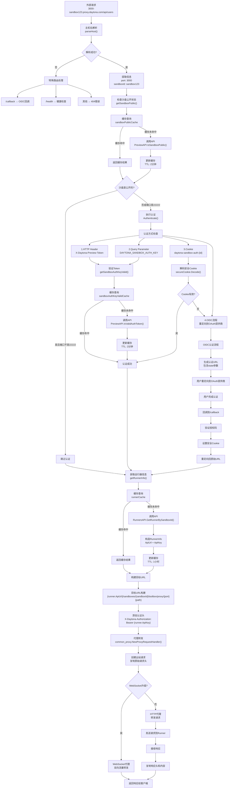
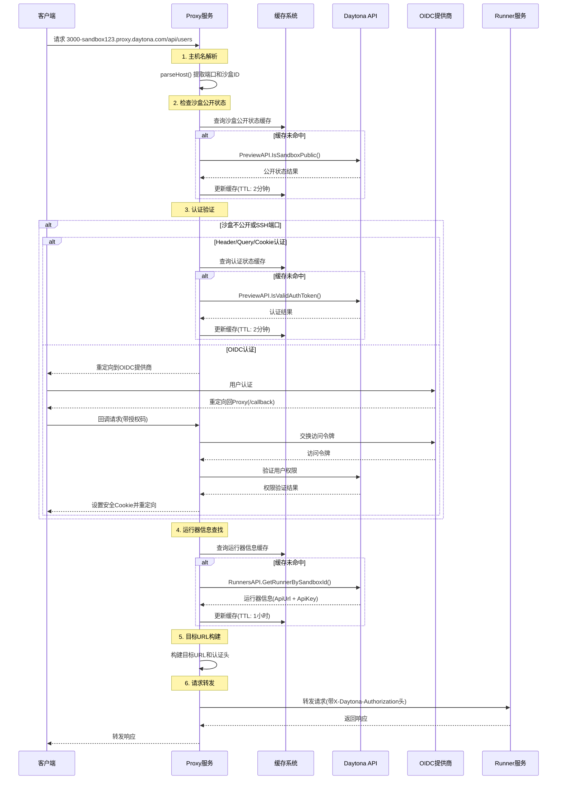
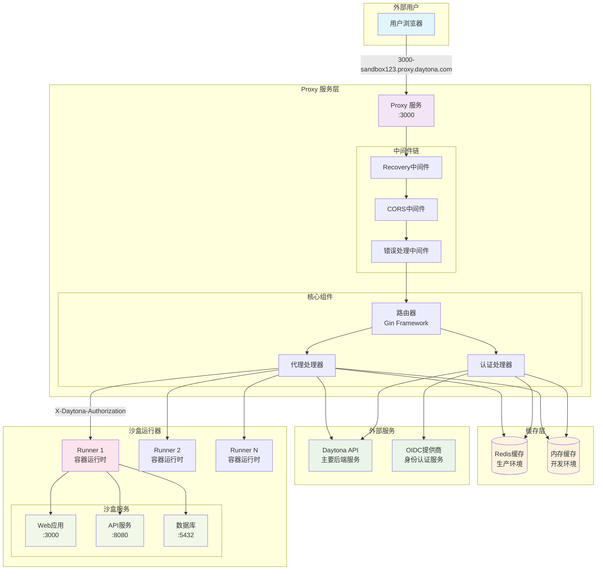

# Daytona Proxy 服务源码分析

## 概述

Daytona Proxy 是一个基于 Go 和 Gin 框架的 HTTP 代理服务，主要作用是为 Daytona 沙盒（Sandbox）环境提供安全的外部访问入口。通过分析源码，我们可以深入理解其工作机制和设计思路。

## 核心作用分析

### 1. 沙盒服务外部化访问

**问题背景**：

- 沙盒环境运行在隔离的容器中
- 内部服务（如 Web 应用、API）需要外部访问
- 直接暴露容器端口存在安全风险

**解决方案**：

```go
// apps/proxy/pkg/proxy/get_target.go
func (p *Proxy) GetProxyTarget(ctx *gin.Context) (*url.URL, string, map[string]string, error) {
    // 1. 解析主机名获取目标端口和沙盒ID
    targetPort, sandboxID, err := p.parseHost(ctx.Request.Host)
    
    // 2. 验证访问权限
    isPublic, err := p.getSandboxPublic(ctx, sandboxID)
    if !*isPublic || targetPort == "22222" {
        err, didRedirect := p.Authenticate(ctx, sandboxID)
    }
    
    // 3. 获取运行器信息并构建目标URL
    runnerInfo, err := p.getRunnerInfo(ctx, sandboxID)
    targetURL := fmt.Sprintf("%s/sandboxes/%s/toolbox/proxy/%s", 
                            runnerInfo.ApiUrl, sandboxID, targetPort)
}
```

### 2. 统一认证网关

**作用**：为所有沙盒访问提供统一的认证入口

**实现机制**：

```go
// apps/proxy/pkg/proxy/auth.go
func (p *Proxy) Authenticate(ctx *gin.Context, sandboxId string) (err error, didRedirect bool) {
    // 优先级1: HTTP Header认证
    authKey := ctx.Request.Header.Get(DAYTONA_SANDBOX_AUTH_KEY_HEADER)
    
    if authKey == "" {
        // 优先级2: Query Parameter认证
        if ctx.Query(DAYTONA_SANDBOX_AUTH_KEY_QUERY_PARAM) != "" {
            authKey = ctx.Query(DAYTONA_SANDBOX_AUTH_KEY_QUERY_PARAM)
        } else {
            // 优先级3: Cookie认证
            cookieSandboxId, err := ctx.Cookie(DAYTONA_SANDBOX_AUTH_COOKIE_NAME + sandboxId)
            if err == nil && cookieSandboxId != "" {
                // 验证安全Cookie
                err = p.secureCookie.Decode(DAYTONA_SANDBOX_AUTH_COOKIE_NAME+sandboxId, 
                                          cookieSandboxId, &decodedValue)
            } else {
                // 优先级4: OIDC流程
                authUrl, err := p.getAuthUrl(ctx, sandboxId)
                ctx.Redirect(http.StatusTemporaryRedirect, authUrl)
                return errors.New("auth key is required"), true
            }
        }
    }
}
```

### 3. 智能路由解析器

**作用**：将外部URL转换为内部服务地址

**解析逻辑**：

```go
// apps/proxy/pkg/proxy/get_target.go
func (p *Proxy) parseHost(host string) (targetPort string, sandboxID string, err error) {
    // 输入: "3000-abc123-def456.proxy.daytona.com"
    // 输出: targetPort="3000", sandboxID="abc123-def456"
    
    parts := strings.Split(host, ".")
    hostPrefix := parts[0] // "3000-abc123-def456"
    dashIndex := strings.Index(hostPrefix, "-")
    
    targetPort = hostPrefix[:dashIndex]     // "3000"
    sandboxID = hostPrefix[dashIndex+1:]    // "abc123-def456"
    
    return targetPort, sandboxID, nil
}
```

## 核心工作流程分析

### 整体流程图

**完整的代理工作流程：**



**时序图展示组件间交互：**



**系统架构图：**



### 1. 应用程序启动流程

```go
// apps/proxy/cmd/proxy/main.go
func main() {
    // 1. 加载配置
    config, err := config.GetConfig()
    
    // 2. 启动代理服务
    proxy.StartProxy(config)
}
```

**配置加载过程**：

```go
// apps/proxy/cmd/proxy/config/config.go
func GetConfig() (*Config, error) {
    // 1. 加载环境文件
    err := godotenv.Overload(".env", ".env.local", ".env.production")
    
    // 2. 处理环境变量
    err = envconfig.Process("", config)
    
    // 3. 验证配置
    var validate = validator.New()
    err = validate.Struct(config)
    
    return config, nil
}
```

### 2. 代理服务初始化流程

```go
// apps/proxy/pkg/proxy/proxy.go
func StartProxy(config *Config) error {
    proxy := &Proxy{config: config}
    
    // 1. 初始化安全Cookie处理器
    proxy.secureCookie = securecookie.New([]byte(config.ProxyApiKey), nil)
    
    // 2. 配置Daytona API客户端
    clientConfig := daytonaapiclient.NewConfiguration()
    clientConfig.Servers = daytonaapiclient.ServerConfigurations{{URL: config.DaytonaApiUrl}}
    clientConfig.AddDefaultHeader("Authorization", "Bearer "+config.ProxyApiKey)
    proxy.daytonaApiClient = daytonaapiclient.NewAPIClient(clientConfig)
    
    // 3. 初始化缓存系统
    if config.Redis != nil {
        // Redis缓存 - 生产环境
        proxy.runnerCache, err = cache.NewRedisCache[RunnerInfo](config.Redis, "proxy:sandbox-runner-info:")
        proxy.sandboxPublicCache, err = cache.NewRedisCache[bool](config.Redis, "proxy:sandbox-public:")
        proxy.sandboxAuthKeyValidCache, err = cache.NewRedisCache[bool](config.Redis, "proxy:sandbox-auth-key-valid:")
    } else {
        // 内存缓存 - 开发环境
        proxy.runnerCache = cache.NewMapCache[RunnerInfo]()
        proxy.sandboxPublicCache = cache.NewMapCache[bool]()
        proxy.sandboxAuthKeyValidCache = cache.NewMapCache[bool]()
    }
    
    // 4. 配置HTTP路由器
    router := gin.New()
    router.Use(gin.Recovery())
    
    // 5. 配置CORS中间件
    router.Use(corsMiddleware)
    
    // 6. 配置错误处理中间件
    router.Use(common_errors.NewErrorMiddleware(...))
    
    // 7. 配置主要路由处理器
    router.Any("/*path", mainRouteHandler)
    
    return httpServer.Serve(listener)
}
```

### 3. 请求处理主流程

**路由分发逻辑**：

```go
// apps/proxy/pkg/proxy/proxy.go (mainRouteHandler)
router.Any("/*path", func(ctx *gin.Context) {
    _, _, err := proxy.parseHost(ctx.Request.Host)
    
    // 如果主机名无效，处理特殊路由
    if err != nil {
        switch ctx.Request.Method {
        case "GET":
            switch ctx.Request.URL.Path {
            case "/callback":
                proxy.AuthCallback(ctx)  // OIDC回调处理
                return
            case "/health":
                ctx.JSON(http.StatusOK, gin.H{"status": "ok"})  // 健康检查
                return
            }
        }
        ctx.Error(common_errors.NewNotFoundError(errors.New("not found")))
        return
    }
    
    // 主代理逻辑
    common_proxy.NewProxyRequestHandler(proxy.GetProxyTarget)(ctx)
})
```

### 4. 详细的代理转发流程

**步骤1：目标解析**

```go
// apps/proxy/pkg/proxy/get_target.go
func (p *Proxy) GetProxyTarget(ctx *gin.Context) (*url.URL, string, map[string]string, error) {
    // 1. 解析请求主机名
    targetPort, sandboxID, err := p.parseHost(ctx.Request.Host)
    // 输入: "3000-sandbox123.proxy.daytona.com"
    // 输出: targetPort="3000", sandboxID="sandbox123"
    
    // 2. 检查沙盒公开状态（带缓存）
    isPublic, err := p.getSandboxPublic(ctx, sandboxID)
    
    // 3. 权限验证逻辑
    if !*isPublic || targetPort == "22222" {  // 22222是SSH端口，始终需要认证
        err, didRedirect := p.Authenticate(ctx, sandboxID)
        if err != nil {
            return nil, "", nil, err
        }
    }
    
    // 4. 获取运行器信息（带缓存）
    runnerInfo, err := p.getRunnerInfo(ctx, sandboxID)
    
    // 5. 构建最终目标URL
    targetURL := fmt.Sprintf("%s/sandboxes/%s/toolbox/proxy/%s", 
                            runnerInfo.ApiUrl, sandboxID, targetPort)
    
    // 6. 处理路径参数
    path := ctx.Param("path")
    if path == "" {
        path = "/"
    } else if !strings.HasPrefix(path, "/") {
        path = "/" + path
    }
    
    fullTargetURL := fmt.Sprintf("%s%s", targetURL, path)
    if ctx.Request.URL.RawQuery != "" {
        fullTargetURL = fmt.Sprintf("%s?%s", fullTargetURL, ctx.Request.URL.RawQuery)
    }
    
    // 7. 返回代理目标和认证头
    return target, fullTargetURL, map[string]string{
        "X-Daytona-Authorization": fmt.Sprintf("Bearer %s", runnerInfo.ApiKey),
    }, nil
}
```

**步骤2：缓存查询机制**

```go
// 运行器信息缓存查询
func (p *Proxy) getRunnerInfo(ctx context.Context, sandboxId string) (*RunnerInfo, error) {
    // 1. 检查缓存
    has, err := p.runnerCache.Has(ctx, sandboxId)
    if has {
        return p.runnerCache.Get(ctx, sandboxId)  // 缓存命中，直接返回
    }
    
    // 2. 缓存未命中，调用API
    runner, _, err := p.daytonaApiClient.RunnersAPI.GetRunnerBySandboxId(
        context.Background(), sandboxId).Execute()
    
    // 3. 构造运行器信息
    info := RunnerInfo{
        ApiUrl: runner.ApiUrl,  // 运行器API地址
        ApiKey: runner.ApiKey,  // 运行器API密钥
    }
    
    // 4. 存入缓存（TTL: 1小时）
    p.runnerCache.Set(ctx, sandboxId, info, 1*time.Hour)
    
    return &info, nil
}
```

**步骤3：实际代理转发**

```go
// libs/common-go/pkg/proxy/proxy.go
func NewProxyRequestHandler(getProxyTarget func(*gin.Context) (*url.URL, string, map[string]string, error)) gin.HandlerFunc {
    return func(ctx *gin.Context) {
        // 1. 获取代理目标
        target, fullTargetURL, extraHeaders, err := getProxyTarget(ctx)
        
        // 2. 创建出站请求
        outReq, err := http.NewRequestWithContext(
            ctx.Request.Context(),
            ctx.Request.Method,
            fullTargetURL,
            ctx.Request.Body,
        )
        
        // 3. 复制请求头
        for key, values := range ctx.Request.Header {
            if key != "Connection" {
                for _, value := range values {
                    outReq.Header.Add(key, value)
                }
            }
        }
        
        // 4. 设置目标主机和认证头
        outReq.Host = target.Host
        outReq.Header.Set("Connection", "keep-alive")
        for key, value := range extraHeaders {
            outReq.Header.Add(key, value)
        }
        
        // 5. WebSocket升级检查
        if ctx.Request.Header.Get("Upgrade") == "websocket" {
            // WebSocket代理逻辑
            handleWebSocketProxy(ctx, fullTargetURL, extraHeaders)
            return
        }
        
        // 6. 执行HTTP代理请求
        resp, err := proxyClient.Do(outReq)
        
        // 7. 复制响应头和内容
        for key, values := range resp.Header {
            for _, value := range values {
                ctx.Writer.Header().Add(key, value)
            }
        }
        ctx.Writer.WriteHeader(resp.StatusCode)
        io.Copy(ctx.Writer, resp.Body)
    }
}
```

### 5. OIDC认证流程分析

**认证URL生成**：

```go
// apps/proxy/pkg/proxy/auth_callback.go
func (p *Proxy) getAuthUrl(ctx *gin.Context, sandboxId string) (string, error) {
    // 1. 初始化OIDC提供者
    provider, err := oidc.NewProvider(ctx, p.config.Oidc.Domain)
    
    // 2. 配置OAuth2客户端
    oauth2Config := oauth2.Config{
        ClientID:     p.config.Oidc.ClientId,
        ClientSecret: p.config.Oidc.ClientSecret,
        RedirectURL:  fmt.Sprintf("%s://%s/callback", p.config.ProxyProtocol, p.config.ProxyDomain),
        Endpoint:     provider.Endpoint(),
        Scopes:       []string{oidc.ScopeOpenID, "profile"},
    }
    
    // 3. 生成状态参数
    state, err := GenerateRandomState()
    stateData := map[string]string{
        "state":     state,
        "returnTo":  fmt.Sprintf("%s://%s%s", p.config.ProxyProtocol, ctx.Request.Host, ctx.Request.URL.String()),
        "sandboxId": sandboxId,
    }
    stateJson, err := json.Marshal(stateData)
    encodedState := base64.URLEncoding.EncodeToString(stateJson)
    
    // 4. 生成认证URL
    authURL := oauth2Config.AuthCodeURL(encodedState, oauth2.SetAuthURLParam("audience", p.config.Oidc.Audience))
    return authURL, nil
}
```

**认证回调处理**：

```go
// apps/proxy/pkg/proxy/auth_callback.go
func (p *Proxy) AuthCallback(ctx *gin.Context) {
    // 1. 获取授权码
    code := ctx.Query("code")
    state := ctx.Query("state")
    
    // 2. 解析状态参数
    stateJson, err := base64.URLEncoding.DecodeString(state)
    var stateData map[string]string
    json.Unmarshal(stateJson, &stateData)
    
    // 3. 交换访问令牌
    token, err := oauth2Config.Exchange(ctx, code)
    
    // 4. 验证沙盒访问权限
    hasAccess := p.hasSandboxAccess(ctx, stateData["sandboxId"], token.AccessToken)
    
    // 5. 设置认证Cookie
    encoded, err := p.secureCookie.Encode(DAYTONA_SANDBOX_AUTH_COOKIE_NAME+sandboxId, sandboxId)
    ctx.SetCookie(DAYTONA_SANDBOX_AUTH_COOKIE_NAME+sandboxId, encoded, 3600, "/", 
                  cookieDomain, p.config.EnableTLS, true)
    
    // 6. 重定向回原始URL
    ctx.Redirect(http.StatusFound, stateData["returnTo"])
}
```

### 6. 缓存系统实现分析

**Redis缓存实现**：

```go
// apps/proxy/pkg/cache/redis_cache.go
type RedisCache[T any] struct {
    redis     *redis.Client
    keyPrefix string
}

func (c *RedisCache[T]) Set(ctx context.Context, key string, value T, expiration time.Duration) error {
    // 1. 包装值对象
    jsonValue, err := json.Marshal(ValueObject[T]{Value: value})
    
    // 2. 存储到Redis
    return c.redis.Set(ctx, c.keyPrefix+key, string(jsonValue), expiration).Err()
}

func (c *RedisCache[T]) Get(ctx context.Context, key string) (*T, error) {
    // 1. 从Redis获取
    value, err := c.redis.Get(ctx, c.keyPrefix+key).Result()
    
    // 2. 反序列化
    var result ValueObject[T]
    err = json.Unmarshal([]byte(value), &result)
    return &result.Value, nil
}
```

**内存缓存实现**：

```go
// apps/proxy/pkg/cache/map_cache.go
type MapCache[T any] struct {
    cacheMap cmap.ConcurrentMap[string, T]  // 并发安全的Map
}

func (c *MapCache[T]) Set(ctx context.Context, key string, value T, expiration time.Duration) error {
    c.cacheMap.Set(key, value)  // 注意：内存缓存忽略过期时间
    return nil
}

func (c *MapCache[T]) Get(ctx context.Context, key string) (*T, error) {
    value, ok := c.cacheMap.Get(key)
    if !ok {
        return nil, errors.New("key not found")
    }
    return &value, nil
}
```

## 关键设计模式分析

### 1. 策略模式 - 缓存实现

```go
// 定义统一的缓存接口
type ICache[T any] interface {
    Get(ctx context.Context, key string) (*T, error)
    Set(ctx context.Context, key string, value T, expiration time.Duration) error
    Delete(ctx context.Context, key string) error
    Has(ctx context.Context, key string) (bool, error)
}

// 运行时选择具体实现
if config.Redis != nil {
    proxy.runnerCache = cache.NewRedisCache[RunnerInfo](config.Redis, "proxy:sandbox-runner-info:")
} else {
    proxy.runnerCache = cache.NewMapCache[RunnerInfo]()
}
```

### 2. 中间件模式 - 请求处理链

```go
router := gin.New()
router.Use(gin.Recovery())           // 异常恢复中间件
router.Use(corsMiddleware)           // CORS处理中间件
router.Use(errorHandlingMiddleware)  // 错误处理中间件
router.Any("/*path", mainHandler)    // 主处理器
```

### 3. 装饰器模式 - 代理请求包装

```go
// 将具体的目标解析逻辑包装成通用的代理处理器
common_proxy.NewProxyRequestHandler(proxy.GetProxyTarget)(ctx)
```

## 性能优化策略分析

### 1. 连接池优化

```go
// libs/common-go/pkg/proxy/proxy.go
var proxyTransport = &http.Transport{
    MaxIdleConns:        100,      // 最大空闲连接数
    MaxIdleConnsPerHost: 100,      // 每个主机最大空闲连接数
    DialContext: (&net.Dialer{
        KeepAlive: 30 * time.Second,  // 保持连接30秒
    }).DialContext,
}
```

### 2. 多层缓存策略

```go
// 不同数据类型使用不同的TTL策略
p.runnerCache.Set(ctx, sandboxId, info, 1*time.Hour)        // 运行器信息：1小时
p.sandboxPublicCache.Set(ctx, sandboxId, isPublic, 2*time.Minute)     // 公开状态：2分钟
p.sandboxAuthKeyValidCache.Set(ctx, authKey, isValid, 2*time.Minute)  // 认证状态：2分钟
```

### 3. 并发安全设计

```go
// 使用并发安全的Map实现
cacheMap cmap.ConcurrentMap[string, T]

// Redis客户端单例模式
var client *redis.Client
if client == nil {
    client = redis.NewClient(&redis.Options{...})
}
```

## 安全机制源码分析

### 1. 安全Cookie实现

```go
// 使用Gorilla SecureCookie确保Cookie安全
proxy.secureCookie = securecookie.New([]byte(config.ProxyApiKey), nil)

// Cookie编码和解码
encoded, err := p.secureCookie.Encode(cookieName, sandboxId)
err = p.secureCookie.Decode(cookieName, cookieValue, &decodedValue)
```

### 2. CORS安全策略

```go
// 动态CORS配置，支持临时禁用
router.Use(func(ctx *gin.Context) {
    if ctx.Request.Header.Get("X-Daytona-Disable-CORS") == "true" {
        ctx.Request.Header.Del("X-Daytona-Disable-CORS")
        return  // 跳过CORS处理
    }
    
    corsConfig := cors.DefaultConfig()
    corsConfig.AllowOriginFunc = func(origin string) bool { return true }
    corsConfig.AllowCredentials = true
    // 动态收集请求头作为允许的头部
    corsConfig.AllowHeaders = slices.Collect(maps.Keys(ctx.Request.Header))
    cors.New(corsConfig)(ctx)
})
```

### 3. 权限验证机制

```go
// 通过Daytona API验证用户权限
func (p *Proxy) hasSandboxAccess(ctx context.Context, sandboxId string, authToken string) bool {
    clientConfig := daytonaapiclient.NewConfiguration()
    clientConfig.AddDefaultHeader("Authorization", "Bearer "+authToken)
    
    apiClient := daytonaapiclient.NewAPIClient(clientConfig)
    res, _ := apiClient.PreviewAPI.HasSandboxAccess(ctx, sandboxId).Execute()
    
    return res != nil && res.StatusCode == http.StatusOK
}
```

## 错误处理机制分析

### 1. 统一错误处理

```go
// 使用通用错误中间件
router.Use(common_errors.NewErrorMiddleware(func(ctx *gin.Context, err error) common_errors.ErrorResponse {
    return common_errors.ErrorResponse{
        StatusCode: http.StatusInternalServerError,
        Message:    err.Error(),
    }
}))
```

### 2. 错误类型分类

```go
// 不同类型的错误使用不同的HTTP状态码
ctx.Error(common_errors.NewBadRequestError(err))      // 400
ctx.Error(common_errors.NewUnauthorizedError(err))    // 401
ctx.Error(common_errors.NewNotFoundError(err))        // 404
```

## 总结

通过源码分析，Daytona Proxy 服务的核心作用和工作流程可以总结为：

### 核心作用

1. **安全网关**：为沙盒服务提供统一的认证和授权入口
2. **智能路由**：将外部友好的URL转换为内部服务地址
3. **性能优化**：通过缓存和连接池提升访问性能
4. **协议支持**：支持HTTP/HTTPS和WebSocket协议

### 工作流程

1. **请求接收** → **主机名解析** → **权限验证** → **目标解析** → **代理转发** → **响应返回**
2. **多层缓存**减少对后端API的调用
3. **OIDC集成**提供标准化的身份认证
4. **中间件链**确保请求处理的统一性和安全性

整个设计体现了高内聚、低耦合的软件架构原则，通过接口抽象、中间件模式和缓存策略，实现了一个高性能、安全可靠的代理服务。
