# Daytona SandboxManager 全面代码分析

## 概述

`SandboxManager` 是 Daytona 平台的核心组件，负责管理沙盒（Sandbox）的完整生命周期。它采用事件驱动架构结合定时任务，实现了复杂的分布式沙盒状态管理、自动化运维和资源调度功能。

## 核心架构设计

### 依赖注入架构

```typescript
@Injectable()
export class SandboxManager {
  constructor(
    @InjectRepository(Sandbox) private readonly sandboxRepository: Repository<Sandbox>,
    @InjectRepository(SnapshotRunner) private readonly snapshotRunnerRepository: Repository<SnapshotRunner>,
    private readonly runnerService: RunnerService,
    private readonly runnerApiFactory: RunnerApiFactory,
    private readonly dockerRegistryService: DockerRegistryService,
    @InjectRedis() private readonly redis: Redis,
    private readonly snapshotService: SnapshotService,
    private readonly redisLockProvider: RedisLockProvider,
    private readonly dockerProvider: DockerProvider,
  ) {}
}
```

### 组件职责分析

1. **数据访问层**
   - `sandboxRepository`: 沙盒实体数据操作
   - `snapshotRunnerRepository`: 快照构建状态管理

2. **服务层**
   - `runnerService`: Runner 节点管理和选择
   - `snapshotService`: 快照相关业务逻辑
   - `dockerRegistryService`: 容器镜像仓库管理

3. **外部接口层**
   - `runnerApiFactory`: Runner API 客户端工厂
   - `dockerProvider`: Docker 操作抽象层

4. **基础设施层**
   - `redis`: 缓存和分布式锁存储
   - `redisLockProvider`: 分布式锁实现

## 定时任务系统

### 1. 自动停止检查 (每分钟)

```typescript
@Cron(CronExpression.EVERY_MINUTE, { name: 'auto-stop-check' })
@OtelSpan()
async autostopCheck(): Promise<void>
```

**功能**：检查并自动停止超过 `autoStopInterval` 时间未活跃的沙盒

**核心逻辑**：

- 使用 Redis 锁确保单实例执行
- 查询条件：状态为 STARTED、期望状态为 STARTED、未处于 pending 状态
- 按 `lastBackupAt` 升序排序，优先处理久未备份的沙盒
- 限制每次处理 10 个沙盒

**SQL 查询条件**：

```sql
WHERE runnerId = ? 
  AND organizationId != 'SANDBOX_WARM_POOL_UNASSIGNED_ORGANIZATION'
  AND state = 'STARTED'
  AND desiredState = 'STARTED' 
  AND pending != true
  AND autoStopInterval != 0
  AND lastActivityAt < NOW() - INTERVAL '1 minute' * autoStopInterval
ORDER BY lastBackupAt ASC
LIMIT 10
```

### 2. 自动归档检查 (每分钟)

```typescript
@Cron(CronExpression.EVERY_MINUTE, { name: 'auto-archive-check' })
async autoArchiveCheck(): Promise<void>
```

**功能**：检查并自动归档长时间停止的沙盒

**特点**：

- 状态条件：STOPPED 且期望状态为 STOPPED
- 限制每个 Runner 最多 3 个并发归档操作
- 按 `lastBackupAt` 升序处理

### 3. 状态同步 (每10秒)

```typescript
@Cron(CronExpression.EVERY_10_SECONDS, { name: 'sync-states' })
@OtelSpan()
async syncStates(): Promise<void>
```

**功能**：同步状态不一致的沙盒（当前状态 != 期望状态）

**查询条件**：

```sql
WHERE state NOT IN ('destroyed', 'error', 'build_failed')
  AND desiredState != state 
  AND desiredState != 'archived'
ORDER BY lastActivityAt DESC
LIMIT 100
```

### 4. 归档状态同步 (每10秒)

```typescript
@Cron(CronExpression.EVERY_10_SECONDS, { name: 'sync-archived-desired-states' })
async syncArchivedDesiredStates(): Promise<void>
```

**功能**：专门处理期望状态为 ARCHIVED 的沙盒

**特殊逻辑**：

- 排除已有 3 个归档中沙盒的 Runner
- 防止 Runner 过载

## 核心状态同步机制

### 主控制器方法

```typescript
async syncInstanceState(sandboxId: string): Promise<void>
```

**分布式锁策略**：

- 锁键：`sync-instance-state-{sandboxId}`
- 超时：360 秒（6 分钟）
- 目的：防止同一沙盒的并发状态转换

**状态分发逻辑**：

```typescript
switch (sandbox.desiredState) {
  case SandboxDesiredState.STARTED:
    syncState = await this.handleSandboxDesiredStateStarted(sandbox)
    break
  case SandboxDesiredState.STOPPED:
    syncState = await this.handleSandboxDesiredStateStopped(sandbox)
    break
  case SandboxDesiredState.DESTROYED:
    syncState = await this.handleSandboxDesiredStateDestroyed(sandbox)
    break
  case SandboxDesiredState.ARCHIVED:
    syncState = await this.handleSandboxDesiredStateArchived(sandbox)
    break
}
```

**错误处理策略**：

- 网络错误 (`ECONNRESET`)：自动重试
- 业务错误：标记为 ERROR 状态并记录错误信息

**递归同步机制**：

- 返回 `SYNC_AGAIN`：立即递归调用 `syncInstanceState`
- 返回 `DONT_SYNC_AGAIN`：结束同步流程

## 期望状态处理详解

### 1. STARTED 状态处理

```typescript
private async handleSandboxDesiredStateStarted(sandbox: Sandbox): Promise<SyncState>
```

#### STARTED 状态处理时序图

以下时序图展示了 STARTED 状态处理的完整交互流程，包括各个组件之间的调用关系：

```mermaid
sequenceDiagram
    participant API as API调用
    participant SM as SandboxManager
    participant DB as Database
    participant RS as RunnerService
    participant RAF as RunnerApiFactory
    participant Runner as Runner API
    participant SS as SnapshotService
    participant DRS as DockerRegistryService
    participant DP as DockerProvider

    Note over API, DP: STARTED 状态处理完整流程

    API->>SM: handleSandboxDesiredStateStarted(sandbox)
    SM->>SM: switch (sandbox.state)

    alt sandbox.state = PENDING_BUILD
        SM->>SM: handleUnassignedBuildSandbox()
        SM->>RS: getRandomAvailableRunner(criteria)
        alt 找到已构建快照的Runner
            RS-->>SM: runner
            SM->>DB: updateSandboxState(UNKNOWN, runnerId)
            SM-->>API: SYNC_AGAIN
        else 检查正在构建的Runner
            SM->>RS: getSnapshotRunners(snapshotRef)
            RS-->>SM: snapshotRunners[]
            loop 遍历snapshotRunners
                SM->>RS: findOne(runnerId)
                RS-->>SM: runner
                alt runner.used < capacity AND BUILDING_SNAPSHOT
                    SM->>DB: updateSandboxState(BUILDING_SNAPSHOT, runnerId)
                    SM-->>API: SYNC_AGAIN
                else snapshotRunner.state = ERROR
                    SM->>DB: updateSandboxState(BUILD_FAILED, errorReason)
                    SM-->>API: DONT_SYNC_AGAIN
                end
            end
        else 分配新Runner开始构建
            SM->>RS: getRunnersWithMultipleSnapshotsBuilding()
            RS-->>SM: excludedRunnerIds[]
            SM->>RS: getRandomAvailableRunner(excludedIds)
            RS-->>SM: runner
            SM->>SM: buildOnRunner(buildInfo, runnerId)
            SM->>RS: findOne(runnerId)
            RS-->>SM: runner
            SM->>RAF: createSnapshotApi(runner)
            RAF-->>SM: runnerSnapshotApi
            loop 重试最多10次
                SM->>Runner: buildSnapshot(buildInfo)
                alt 构建成功
                    Runner-->>SM: success
                    Note over SM: 构建成功，退出循环
                else ECONNRESET错误
                    SM->>SM: 等待重试
                else 其他错误
                    SM->>RS: createSnapshotRunner(ERROR)
                    Note over SM: 构建失败，退出流程
                end
            end
            SM->>Runner: snapshotExists(snapshotRef)
            Runner-->>SM: exists?
            SM->>RS: createSnapshotRunner(state)
            SM->>DB: updateSandboxState(BUILDING_SNAPSHOT, runnerId)
            SM->>RS: recalculateRunnerUsage(runnerId)
            SM-->>API: SYNC_AGAIN
        end

    else sandbox.state = BUILDING_SNAPSHOT
        SM->>SM: handleRunnerSandboxBuildingSnapshotStateOnDesiredStateStart()
        SM->>RS: getSnapshotRunner(runnerId, snapshotRef)
        RS-->>SM: snapshotRunner
        alt snapshotRunner.state = READY
            SM->>DB: updateSandboxState(UNKNOWN)
            SM-->>API: SYNC_AGAIN
        else snapshotRunner.state = ERROR
            SM->>DB: updateSandboxState(BUILD_FAILED, errorReason)
            SM-->>API: DONT_SYNC_AGAIN
        else snapshotRunner.state = BUILDING_SNAPSHOT
            SM->>SM: sleep(1000ms)
            SM-->>API: SYNC_AGAIN
        end

    else sandbox.state = UNKNOWN
        SM->>SM: handleRunnerSandboxUnknownStateOnDesiredStateStart()
        SM->>RS: findOne(runnerId)
        RS-->>SM: runner
        alt runner.state != READY
            SM-->>API: DONT_SYNC_AGAIN
        else 创建沙盒
            alt 没有buildInfo
                SM->>SS: getSnapshotByName(snapshot, orgId)
                SS-->>SM: snapshot
                SM->>DRS: findOneBySnapshotImageName(name, orgId)
                DRS-->>SM: registry
                SM->>SM: 构建createSandboxDto(预构建)
            else 有buildInfo
                SM->>SM: getEntrypointFromDockerfile()
                SM->>SM: 构建createSandboxDto(构建)
            end
            SM->>RAF: createSandboxApi(runner)
            RAF-->>SM: runnerSandboxApi
            SM->>Runner: create(createSandboxDto)
            Runner-->>SM: success
            SM->>DB: updateSandboxState(CREATING)
            SM-->>API: SYNC_AGAIN
        end

    else sandbox.state = STOPPED/ARCHIVED
        SM->>SM: handleRunnerSandboxStoppedOrArchivedStateOnDesiredStateStart()
        alt 检查Runner可调度性
            SM->>RS: findOne(runnerId)
            RS-->>SM: runner
            alt runner.unschedulable AND backupCompleted
                SM->>DB: 迁移到新Runner(设置prevRunnerId)
            else 负载过高且有备份
                SM->>DB: count(STARTED sandboxs on runner)
                alt count > 35
                    SM->>RS: findAvailableRunners()
                    RS-->>SM: availableRunners[]
                    SM->>DB: 迁移到新Runner
                    SM->>Runner: removeDestroyed(sandboxId)
                end
            end
        end
        alt runnerId = null (无分配Runner)
            alt backupState != COMPLETED
                SM->>DB: updateSandboxState(ERROR)
                SM-->>API: DONT_SYNC_AGAIN
            else 从备份恢复
                SM->>DRS: findOne(backupRegistryId)
                DRS-->>SM: registry
                loop 验证备份存在性
                    SM->>DP: checkImageExistsInRegistry(backup, registry)
                    DP-->>SM: exists?
                end
                SM->>RS: findAvailableRunners(exclude prevRunner)
                RS-->>SM: availableRunners[]
                SM->>SM: 随机选择Runner
                SM->>DB: updateSandboxState(RESTORING, runnerId)
                SM->>RAF: createSandboxApi(runner)
                RAF-->>SM: runnerSandboxApi
                SM->>Runner: create(restoreDto)
                Runner-->>SM: success
                SM-->>API: SYNC_AGAIN
            end
        else 有分配的Runner
            SM->>RAF: createSandboxApi(runner)
            RAF-->>SM: runnerSandboxApi
            SM->>Runner: start(sandboxId)
            Runner-->>SM: success
            SM->>DB: updateSandboxState(STARTING)
            SM-->>API: SYNC_AGAIN
        end

    else sandbox.state = RESTORING/CREATING
        SM->>SM: handleRunnerSandboxPullingSnapshotStateCheck()
        SM->>RAF: createSandboxApi(runner)
        RAF-->>SM: runnerSandboxApi
        SM->>Runner: info(sandboxId)
        Runner-->>SM: sandboxInfo
        alt state = PULLING_SNAPSHOT
            SM->>DB: updateSandboxState(PULLING_SNAPSHOT)
        else state = ERROR
            SM->>DB: updateSandboxState(ERROR)
        else 其他状态
            SM->>DB: updateSandboxState(STARTING)
        end
        SM-->>API: SYNC_AGAIN

    else sandbox.state = PULLING_SNAPSHOT/STARTING
        SM->>SM: handleRunnerSandboxStartedStateCheck()
        SM->>RAF: createSandboxApi(runner)
        RAF-->>SM: runnerSandboxApi
        SM->>Runner: info(sandboxId)
        Runner-->>SM: sandboxInfo
        alt state = STARTED
            SM->>SM: getSandboxDaemonVersion()
            SM->>RAF: createToolboxApi(runner)
            RAF-->>SM: runnerToolboxApi
            SM->>Runner: sandboxesSandboxIdToolboxPathGet(version)
            Runner-->>SM: version
            SM->>DB: updateSandboxState(STARTED, version)
            alt 有prevRunnerId
                SM->>SM: 清理前序Runner
                SM->>RAF: createSandboxApi(prevRunner)
                RAF-->>SM: prevRunnerApi
                SM->>Runner: destroy(sandboxId)
                loop 等待销毁完成
                    SM->>Runner: info(sandboxId)
                end
                SM->>Runner: removeDestroyed(sandboxId)
                SM->>DB: 清空prevRunnerId
            end
        else state = ERROR
            SM->>DB: updateSandboxState(ERROR)
        end
        SM-->>API: SYNC_AGAIN

    else sandbox.state = ERROR
        SM->>SM: 临时错误恢复处理
        alt sandboxId.startsWith('err_')
            SM-->>API: DONT_SYNC_AGAIN
        else 尝试恢复
            SM->>RAF: createSandboxApi(runner)
            RAF-->>SM: runnerSandboxApi
            SM->>Runner: info(sandboxId)
            Runner-->>SM: sandboxInfo
            alt state = STARTED
                SM->>DB: updateSandboxState(STARTED)
                SM->>SM: getSandboxDaemonVersion()
            end
        end
    end

    SM-->>API: return SyncState
```

#### STARTED 状态机转换图

STARTED 状态处理是最复杂的流程，涉及多个不同的状态分支。为了便于理解，我们将其拆分为以下几个独立的状态处理图：

##### 1. 构建相关状态处理

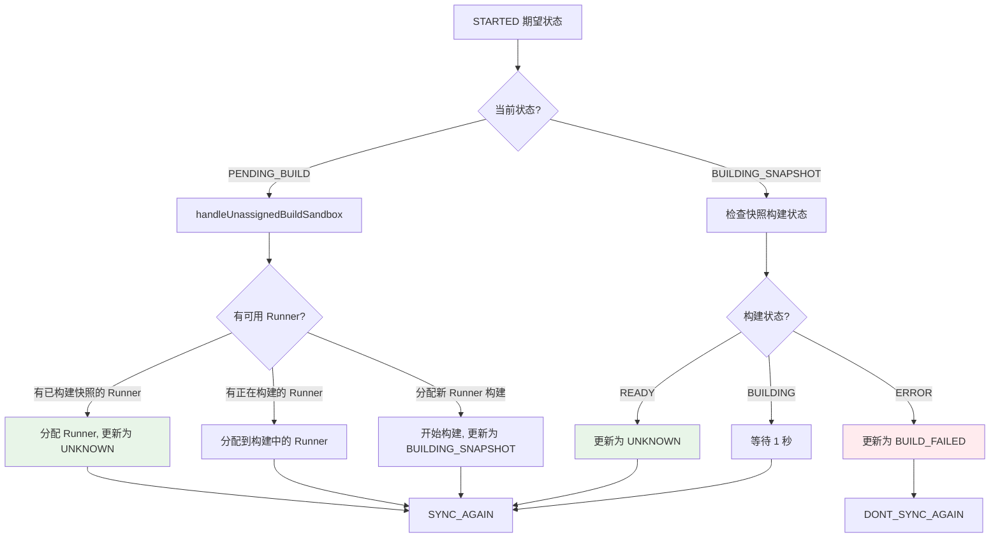

##### 2. 沙盒创建状态处理

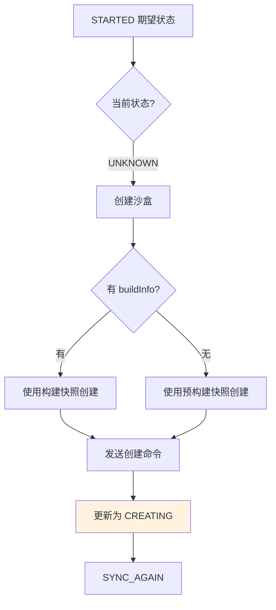

##### 3. 停止/归档状态恢复处理

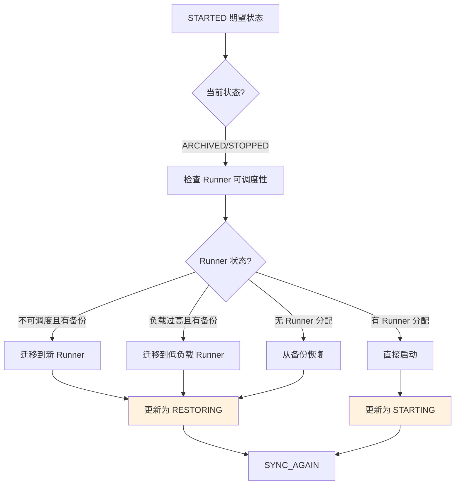

##### 4. 启动过程状态监控

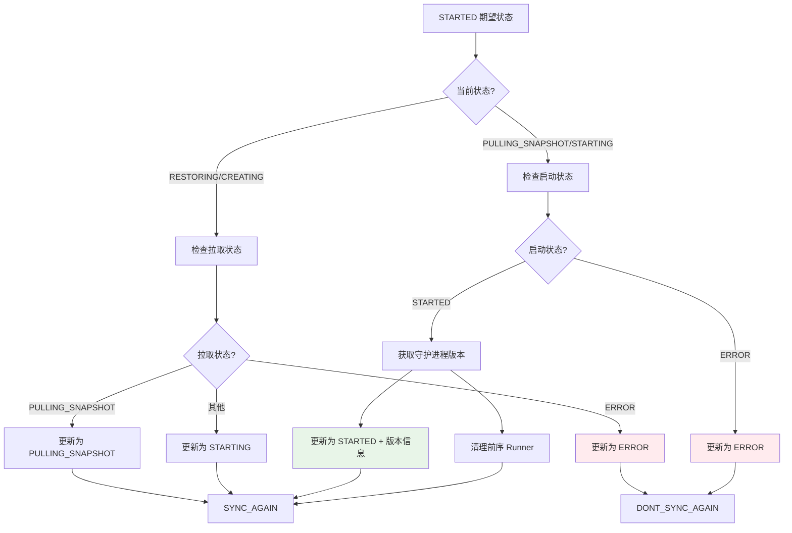

##### 5. 错误恢复处理

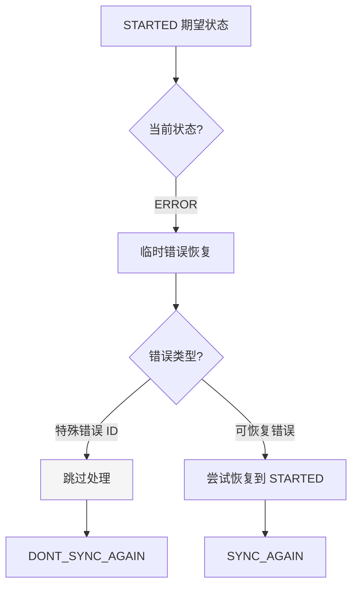

#### 构建沙盒分配逻辑

**优先级策略**：

1. 寻找已有快照构建的可用 Runner
2. 寻找正在构建相同快照的 Runner
3. 分配新的可用 Runner 开始构建

```typescript
// 1. 尝试分配已有快照的 Runner
const runner = await this.runnerService.getRandomAvailableRunner({
  region: sandbox.region,
  sandboxClass: sandbox.class,
  snapshotRef: sandbox.buildInfo.snapshotRef,
})

// 2. 检查正在构建的 Runner
const snapshotRunners = await this.runnerService.getSnapshotRunners(sandbox.buildInfo.snapshotRef)

// 3. 排除多快照构建的 Runner
const excludedRunnerIds = await this.runnerService.getRunnersWithMultipleSnapshotsBuilding()
```

#### 快照构建流程

```typescript
async buildOnRunner(buildInfo: BuildInfo, runnerId: string, organizationId: string)
```

**重试机制**：

- 最大重试次数：10 次
- 重试间隔：递增延迟（1秒、2秒、3秒...）
- 失败处理：创建错误状态的 SnapshotRunner

**构建参数**：

```typescript
await runnerSnapshotApi.buildSnapshot({
  snapshot: buildInfo.snapshotRef,
  organizationId: organizationId,
  dockerfile: buildInfo.dockerfileContent,
  context: buildInfo.contextHashes,
})
```

### 2. STOPPED 状态处理

```typescript
private async handleSandboxDesiredStateStopped(sandbox: Sandbox): Promise<SyncState>
```

**状态转换流程**：

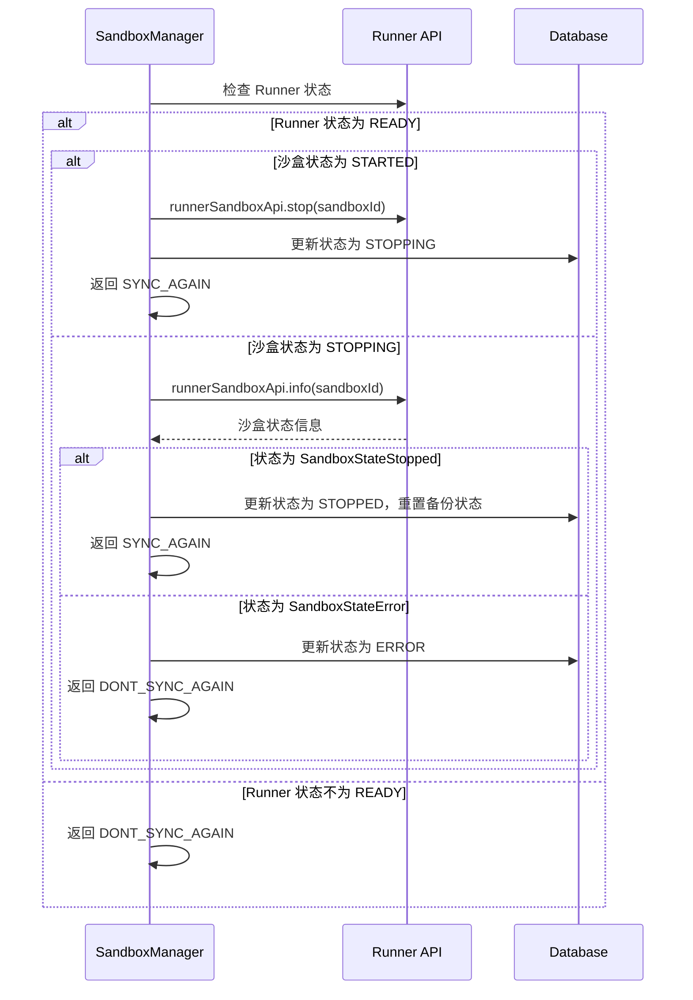

#### STOPPED 状态机转换图

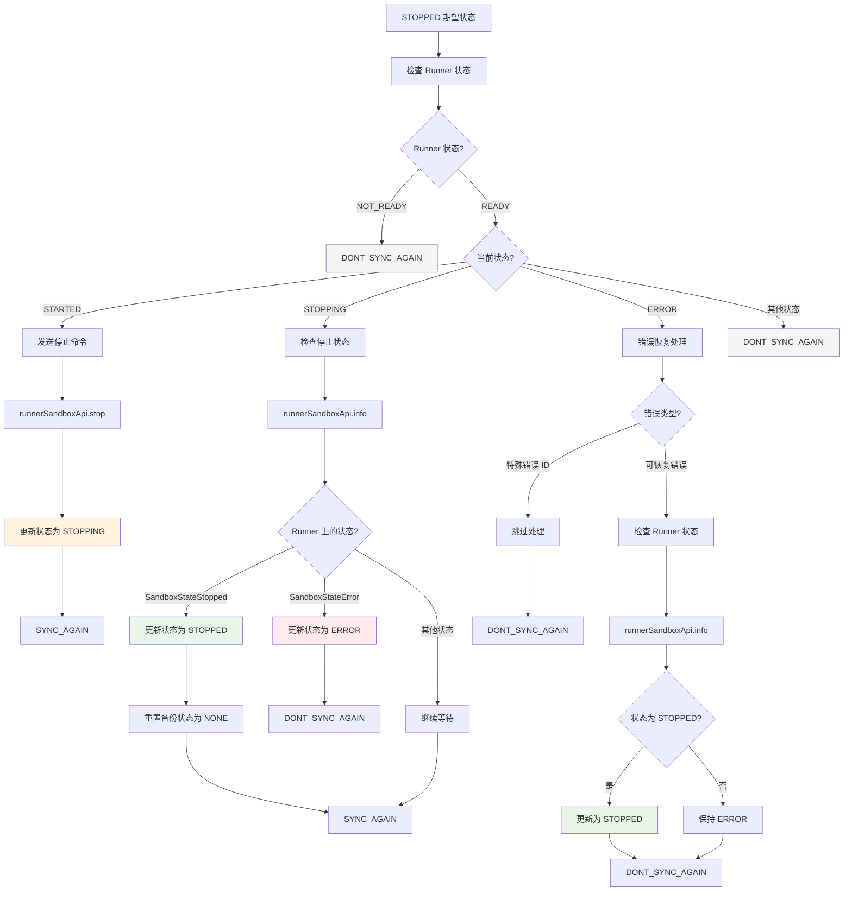

### 3. ARCHIVED 状态处理

归档是最复杂的流程，涉及并发控制、备份验证、超时处理和资源清理：

```typescript
private async handleSandboxDesiredStateArchived(sandbox: Sandbox): Promise<SyncState>
```

#### 并发控制机制

**归档锁策略**：

```typescript
const lockKey = 'archive-lock-' + sandbox.runnerId
if (!(await this.redisLockProvider.lock(lockKey, 10))) {
  return DONT_SYNC_AGAIN
}
```

**并发数量限制**：

```typescript
const inProgressOnRunner = await this.sandboxRepository.find({
  where: {
    runnerId: sandbox.runnerId,
    state: In([SandboxState.ARCHIVING]),
  },
  order: { lastActivityAt: 'DESC' },
  take: 100,
})

// 检查是否当前沙盒已在归档中
if (!inProgressOnRunner.find((s) => s.id === sandbox.id)) {
  // 每个 Runner 最多 3 个并发归档操作
  if (inProgressOnRunner.length > 2) {
    await this.redisLockProvider.unlock(lockKey)
    return  // 直接返回，防止 Runner 过载
  }
}
```

**特点**：

- 归档锁：`archive-lock-{runnerId}`，10秒超时
- 每个 Runner 最多 3 个并发归档操作
- 已在归档中的沙盒可以继续处理

#### 状态转换与锁管理

```typescript
switch (sandbox.state) {
  case SandboxState.STOPPED: {
    await this.updateSandboxState(sandbox.id, SandboxState.ARCHIVING)
    // fallthrough to archiving state
  }
  case SandboxState.ARCHIVING: {
    await this.redisLockProvider.unlock(lockKey)  // 立即释放锁
    // 继续处理归档逻辑...
  }
}
```

**设计亮点**：

- STOPPED 状态自动转换为 ARCHIVING
- 使用 fallthrough 减少代码重复
- 在开始长时间操作前释放锁

#### 备份错误重试机制

```typescript
if (sandbox.backupState === BackupState.ERROR) {
  const archiveErrorRetryKey = 'archive-error-retry-' + sandbox.id
  const archiveErrorRetryCountRaw = await this.redis.get(archiveErrorRetryKey)
  const archiveErrorRetryCount = archiveErrorRetryCountRaw ? parseInt(archiveErrorRetryCountRaw) : 0
  
  if (archiveErrorRetryCount > 3) {
    await this.updateSandboxState(sandbox.id, SandboxState.ERROR, undefined, 'Failed to archive sandbox')
    await this.redis.del(archiveErrorRetryKey)
    return DONT_SYNC_AGAIN
  }
  
  await this.redis.setex('archive-error-retry-' + sandbox.id, 720, String(archiveErrorRetryCount + 1))
  await this.sandboxRepository.update(sandbox.id, { backupState: BackupState.PENDING })
  return DONT_SYNC_AGAIN
}
```

**重试策略**：

- 最大重试次数：3 次
- 重试间隔 TTL：720 秒（12 分钟）
- 失败后重置备份状态为 PENDING
- 超过重试次数标记为 ERROR

#### 超时保护机制

```typescript
// 检查超时 - 如果超过 120 分钟未活跃
const thirtyMinutesAgo = new Date(Date.now() - 120 * 60 * 1000)
if (sandbox.lastActivityAt < thirtyMinutesAgo) {
  await this.updateSandboxState(sandbox.id, SandboxState.ERROR, undefined, 'Archiving operation timed out')
  return DONT_SYNC_AGAIN
}
```

**超时设计**：

- 超时阈值：120 分钟（注释说的是 30 分钟，但代码是 120 分钟）
- 基于 `lastActivityAt` 字段判断
- 超时后直接标记为 ERROR 状态

#### 备份完成后的资源清理

```typescript
if (sandbox.backupState !== BackupState.COMPLETED) {
  return DONT_SYNC_AGAIN  // 等待备份完成
}

const runner = await this.runnerService.findOne(sandbox.runnerId)
const runnerSandboxApi = this.runnerApiFactory.createSandboxApi(runner)

try {
  const sandboxInfoResponse = await runnerSandboxApi.info(sandbox.id)
  const sandboxInfo = sandboxInfoResponse.data
  
  switch (sandboxInfo.state) {
    case RunnerSandboxState.SandboxStateDestroying:
      return SYNC_AGAIN  // 等待销毁完成
    case RunnerSandboxState.SandboxStateDestroyed:
      await this.updateSandboxState(sandbox.id, SandboxState.ARCHIVED, null)
      return DONT_SYNC_AGAIN
    default:
      await runnerSandboxApi.destroy(sandbox.id)
      return SYNC_AGAIN
  }
} catch (error) {
  // 特殊错误处理
  if (
    (error.response?.data?.statusCode === 400 && 
     error.response?.data?.message.includes('Sandbox already destroyed')) ||
    error.response?.status === 404
  ) {
    await this.updateSandboxState(sandbox.id, SandboxState.ARCHIVED, null)
    return DONT_SYNC_AGAIN
  }
  throw error
}
```

**清理流程**：

1. **备份验证**：等待备份状态为 COMPLETED
2. **状态查询**：检查 Runner 上的沙盒状态
3. **销毁处理**：
   - `SandboxStateDestroying`：等待销毁完成
   - `SandboxStateDestroyed`：直接标记为 ARCHIVED
   - 其他状态：发送销毁命令
4. **异常处理**：400/404 错误表示已销毁，正常情况
5. **状态更新**：清空 `runnerId`，完成归档

#### ARCHIVED 状态机转换图

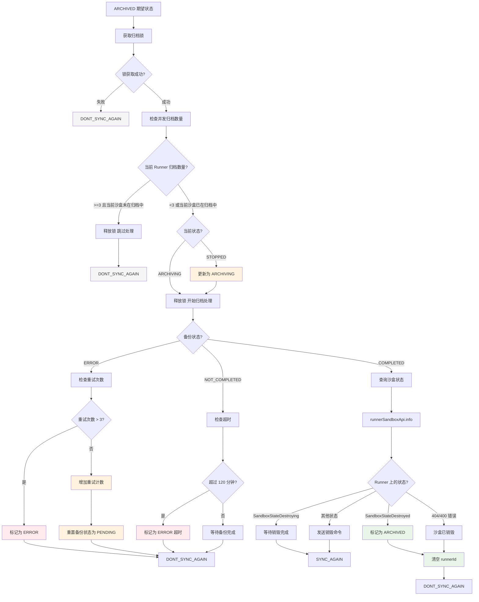

### 4. DESTROYED 状态处理

```typescript
private async handleSandboxDesiredStateDestroyed(sandbox: Sandbox): Promise<SyncState>
```

销毁是所有状态的最终归宿，包含三种主要场景的处理：

#### 归档沙盒的直接销毁

```typescript
if (sandbox.state === SandboxState.ARCHIVED) {
  await this.updateSandboxState(sandbox.id, SandboxState.DESTROYED)
  return DONT_SYNC_AGAIN
}
```

**特点**：

- 已归档的沙盒无需 Runner 操作
- 直接更新数据库状态即可
- 这是最高效的销毁路径

#### 销毁中状态的监控与清理

```typescript
case SandboxState.DESTROYING: {
  const runnerSandboxApi = this.runnerApiFactory.createSandboxApi(runner)
  
  try {
    const sandboxInfoResponse = await runnerSandboxApi.info(sandbox.id)
    const sandboxInfo = sandboxInfoResponse.data
    if (
      sandboxInfo.state === RunnerSandboxState.SandboxStateDestroyed ||
      sandboxInfo.state === RunnerSandboxState.SandboxStateError
    ) {
      await runnerSandboxApi.removeDestroyed(sandbox.id)
    }
  } catch (e) {
    // 404 错误表示沙盒已不存在
    if (!e.response || e.response.status !== 404) {
      throw e
    }
  }
  
  await this.updateSandboxState(sandbox.id, SandboxState.DESTROYED)
  return SYNC_AGAIN
}
```

**处理逻辑**：

1. **状态查询**：检查 Runner 上的沙盒状态
2. **资源清理**：如果已销毁或错误，清理 Runner 上的残留资源
3. **异常处理**：404 错误表示沙盒已不存在，正常情况
4. **状态更新**：标记为最终的 DESTROYED 状态

#### 活跃沙盒的销毁启动

```typescript
default: {
  try {
    const runnerSandboxApi = this.runnerApiFactory.createSandboxApi(runner)
    const sandboxInfoResponse = await runnerSandboxApi.info(sandbox.id)
    const sandboxInfo = sandboxInfoResponse.data
    if (sandboxInfo?.state === RunnerSandboxState.SandboxStateDestroyed) {
      await this.updateSandboxState(sandbox.id, SandboxState.DESTROYING)
      return SYNC_AGAIN
    }
    await runnerSandboxApi.destroy(sandbox.id)
  } catch (e) {
    if (e.response.status !== 404) {
      throw e
    }
  }
  await this.updateSandboxState(sandbox.id, SandboxState.DESTROYING)
  return SYNC_AGAIN
}
```

**处理流程**：

1. **状态检查**：先查询当前 Runner 状态
2. **预检查**：如果已经销毁，直接进入 DESTROYING 状态
3. **销毁命令**：发送销毁指令给 Runner
4. **状态转换**：更新为 DESTROYING 状态
5. **异常处理**：404 错误忽略，其他错误抛出

#### 错误处理与容错机制

**Runner 不可用处理**：

```typescript
const runner = await this.runnerService.findOne(sandbox.runnerId)
if (runner.state !== RunnerState.READY) {
  return DONT_SYNC_AGAIN
}
```

**网络异常处理**：

- `404 Not Found`：沙盒已不存在，正常情况
- 其他网络错误：重新抛出，触发重试机制

**状态转换保证**：

- 所有成功路径都会递归调用 `SYNC_AGAIN`
- 确保状态转换完整性

#### 销毁状态机转换图

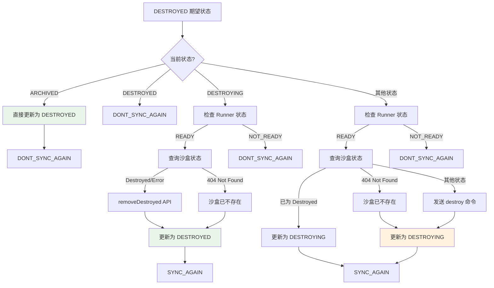

## 沙盒创建与恢复机制

### 创建沙盒 DTO 构建

```typescript
let createSandboxDto: CreateSandboxDTO = {
  id: sandbox.id,
  osUser: sandbox.osUser,
  snapshot: '',
  userId: sandbox.organizationId,  // TODO: 应该是 organizationId
  storageQuota: sandbox.disk,
  memoryQuota: sandbox.mem,
  cpuQuota: sandbox.cpu,
  env: sandbox.env,
  volumes: sandbox.volumes,
}
```

### 快照来源处理

**两种快照来源**：

1. **预构建快照**（无 buildInfo）：

```typescript
const snapshot = await this.snapshotService.getSnapshotByName(sandbox.snapshot, sandbox.organizationId)
const internalSnapshotName = snapshot.internalName

const registry = await this.dockerRegistryService.findOneBySnapshotImageName(
  internalSnapshotName,
  sandbox.organizationId,
)

createSandboxDto = {
  ...createSandboxDto,
  snapshot: internalSnapshotName,
  entrypoint: snapshot.entrypoint,
  registry: {
    url: registry.url,
    username: registry.username,
    password: registry.password,
  },
}
```

2. **动态构建快照**（有 buildInfo）：

```typescript
createSandboxDto = {
  ...createSandboxDto,
  snapshot: sandbox.buildInfo.snapshotRef,
  entrypoint: this.getEntrypointFromDockerfile(sandbox.buildInfo.dockerfileContent),
}
```

### Dockerfile 入口点解析

```typescript
private getEntrypointFromDockerfile(dockerfileContent: string): string[] {
  // 优先解析 ENTRYPOINT
  const entrypointMatch = dockerfileContent.match(/ENTRYPOINT\s+(.*)/)
  if (entrypointMatch) {
    const rawEntrypoint = entrypointMatch[1].trim()
    try {
      const parsed = JSON.parse(rawEntrypoint)
      if (Array.isArray(parsed)) return parsed
    } catch {
      return [rawEntrypoint.replace(/["']/g, '')]
    }
  }

  // 回退到 CMD
  const cmdMatch = dockerfileContent.match(/CMD\s+(.*)/)
  if (cmdMatch) {
    const rawCmd = cmdMatch[1].trim()
    try {
      const parsed = JSON.parse(rawCmd)
      if (Array.isArray(parsed)) return parsed
    } catch {
      return [rawCmd.replace(/["']/g, '')]
    }
  }

  // 默认入口点
  return ['sleep', 'infinity']
}
```

## 智能 Runner 选择与负载均衡

### 负载感知迁移

```typescript
const usageThreshold = 35
const runningSandboxsCount = await this.sandboxRepository.count({
  where: {
    runnerId: sandbox.runnerId,
    state: SandboxState.STARTED,
  },
})

if (runningSandboxsCount > usageThreshold) {
  const availableRunners = await this.runnerService.findAvailableRunners({
    region: sandbox.region,
    sandboxClass: sandbox.class,
  })
  const lessUsedRunners = availableRunners.filter((runner) => runner.id !== sandbox.runnerId)

  if (lessUsedRunners.length > 0) {
    await this.sandboxRepository.update(sandbox.id, {
      runnerId: null,
      prevRunnerId: sandbox.runnerId,
    })
  }
}
```

### 不可调度 Runner 处理

```typescript
if (sandbox.runnerId) {
  const runner = await this.runnerService.findOne(sandbox.runnerId)
  if (runner.unschedulable) {
    if (sandbox.backupState !== BackupState.COMPLETED) {
      // 备份未完成，保持在当前 Runner
    } else {
      // 迁移到新 Runner
      sandbox.prevRunnerId = sandbox.runnerId
      sandbox.runnerId = null
    }
  }
}
```

### 备份恢复故障转移

```typescript
const existingBackups = sandbox.existingBackupSnapshots.map((existingSnapshot) => existingSnapshot.snapshotName)
let validBackup = sandbox.backupSnapshot
let exists = false

while (existingBackups.length > 0) {
  try {
    if (!validBackup) {
      validBackup = sandbox.backupSnapshot
      existingBackups.pop()
    } else {
      validBackup = existingBackups.pop()
    }
    if (await this.dockerProvider.checkImageExistsInRegistry(validBackup, registry)) {
      exists = true
      break
    }
  } catch (error) {
    this.logger.error(`Failed to check backup snapshot ${validBackup}`)
  }
}
```

## 前序 Runner 清理机制

当沙盒迁移到新 Runner 后，需要清理旧 Runner 上的资源：

```typescript
if (sandbox.prevRunnerId) {
  const runner = await this.runnerService.findOne(sandbox.prevRunnerId)
  const runnerSandboxApi = this.runnerApiFactory.createSandboxApi(runner)
  
  try {
    // 1. 发送销毁命令
    await runnerSandboxApi.destroy(sandbox.id)

    // 2. 等待销毁完成（最多10次重试）
    let retries = 0
    while (retries < 10) {
      try {
        const sandboxInfo = await runnerSandboxApi.info(sandbox.id)
        if (sandboxInfo.data.state === RunnerSandboxState.SandboxStateDestroyed) {
          break
        }
      } catch (e) {
        if (e.response?.status === 404) break
        throw e
      }
      await new Promise((resolve) => setTimeout(resolve, 1000 * retries))
      retries++
    }

    // 3. 清理已销毁的沙盒
    await runnerSandboxApi.removeDestroyed(sandbox.id)
    sandbox.prevRunnerId = null
  } catch (e) {
    this.logger.error(`Failed to cleanup sandbox ${sandbox.id} on previous runner:`, fromAxiosError(e))
  }
}
```

## 沙盒守护进程版本管理

```typescript
private async getSandboxDaemonVersion(sandbox: Sandbox, runner: Runner): Promise<string> {
  const runnerSandboxApi = this.runnerApiFactory.createToolboxApi(runner)
  const getVersionResponse = await runnerSandboxApi.sandboxesSandboxIdToolboxPathGet(sandbox.id, 'version')
  
  if (!getVersionResponse.data || !(getVersionResponse.data as any).version) {
    throw new Error('Failed to get sandbox daemon version')
  }

  return (getVersionResponse.data as any).version
}
```

## 事件驱动架构

### 事件监听器

```typescript
@OnEvent(SandboxEvents.ARCHIVED)
private async handleSandboxArchivedEvent(event: SandboxArchivedEvent) {
  this.syncInstanceState(event.sandbox.id).catch(this.logger.error)
}

@OnEvent(SandboxEvents.DESTROYED)
private async handleSandboxDestroyedEvent(event: SandboxDestroyedEvent) {
  this.syncInstanceState(event.sandbox.id).catch(this.logger.error)
}

@OnEvent(SandboxEvents.STARTED)
private async handleSandboxStartedEvent(event: SandboxStartedEvent) {
  this.syncInstanceState(event.sandbox.id).catch(this.logger.error)
}

@OnEvent(SandboxEvents.STOPPED)
private async handleSandboxStoppedEvent(event: SandboxStoppedEvent) {
  this.syncInstanceState(event.sandbox.id).catch(this.logger.error)
}

@OnEvent(SandboxEvents.CREATED)
private async handleSandboxCreatedEvent(event: SandboxCreatedEvent) {
  this.syncInstanceState(event.sandbox.id).catch(this.logger.error)
}
```

### 事件与状态同步的协作

事件监听器提供即时响应能力，而定时任务提供兜底保障：

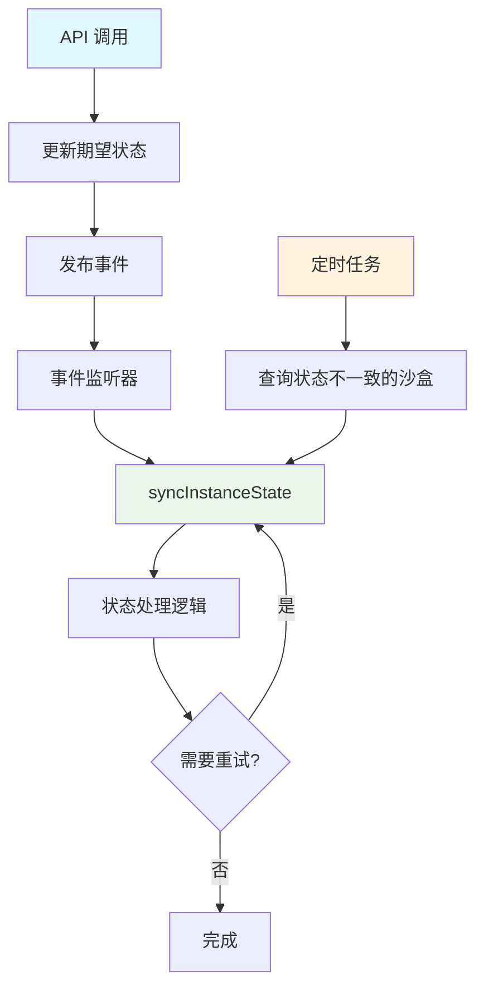

## 完整状态转换时序图

```mermaid
sequenceDiagram
    participant User as 用户/API
    participant SM as SandboxManager
    participant DB as Database
    participant Redis as Redis
    participant Runner as Runner API
    participant Docker as Docker Registry
    participant Event as 事件总线

    Note over User, Event: 沙盒启动流程

    User->>SM: 启动沙盒请求
    SM->>DB: 更新 desiredState = STARTED
    SM->>Event: 发布 STARTED 事件
    Event->>SM: 触发事件监听器
    
    SM->>Redis: 获取分布式锁 (360s)
    Redis-->>SM: 锁获取成功
    
    SM->>DB: 查询沙盒当前状态
    DB-->>SM: sandbox 信息
    
    alt 当前状态为 STOPPED
        SM->>Runner: 检查 Runner 状态
        Runner-->>SM: Runner 状态 READY
        
        alt 有分配的 Runner
            SM->>Runner: runnerSandboxApi.start(sandboxId)
            SM->>DB: 更新状态为 STARTING
            SM->>Redis: 释放锁
            SM->>SM: 递归调用 syncInstanceState
            
            SM->>Redis: 重新获取锁
            SM->>Runner: runnerSandboxApi.info(sandboxId)
            Runner-->>SM: 沙盒状态信息
            
            alt 状态为 STARTED
                SM->>Runner: 获取守护进程版本
                Runner-->>SM: 版本信息
                SM->>DB: 更新状态为 STARTED + 版本信息
                SM->>Redis: 释放锁
            end
            
        else 无分配的 Runner 且有备份
            SM->>Docker: 验证备份镜像存在性
            Docker-->>SM: 镜像存在确认
            
            SM->>SM: 选择可用 Runner
            SM->>DB: 更新 runnerId 和状态为 RESTORING
            SM->>Runner: 创建沙盒 (使用备份镜像)
            SM->>Redis: 释放锁
        end
        
    else 当前状态为 ARCHIVED
        SM->>Docker: 检查备份完整性
        Docker-->>SM: 备份验证结果
        
        SM->>SM: 选择新 Runner
        SM->>DB: 更新 runnerId 和状态为 RESTORING
        SM->>Runner: 使用备份创建沙盒
        SM->>Redis: 释放锁
    end

    Note over User, Event: 沙盒停止流程

    User->>SM: 停止沙盒请求
    SM->>DB: 更新 desiredState = STOPPED
    SM->>Event: 发布 STOPPED 事件
    
    SM->>Redis: 获取分布式锁
    SM->>Runner: runnerSandboxApi.stop(sandboxId)
    SM->>DB: 更新状态为 STOPPING
    SM->>Redis: 释放锁
    
    loop 状态检查
        SM->>Runner: runnerSandboxApi.info(sandboxId)
        Runner-->>SM: 沙盒状态
        alt 状态为 STOPPED
            SM->>DB: 更新状态为 STOPPED，重置备份状态
        end
    end

    Note over User, Event: 沙盒归档流程

    User->>SM: 归档沙盒请求
    SM->>DB: 更新 desiredState = ARCHIVED
    SM->>Event: 发布 ARCHIVED 事件
    
    SM->>Redis: 获取归档锁 archive-lock-{runnerId} (10s)
    Redis-->>SM: 锁获取成功
    
    SM->>DB: 查询同 Runner 上正在归档的沙盒数量
    DB-->>SM: 当前归档数量
    
    alt 归档数量 < 3 或当前沙盒已在归档中
        alt 当前状态为 STOPPED
            SM->>DB: 更新状态为 ARCHIVING
        end
        SM->>Redis: 释放归档锁
        
        alt 备份状态为 ERROR
            SM->>Redis: 检查重试次数
            alt 重试次数 > 3
                SM->>DB: 标记为 ERROR 状态
            else 重试次数 <= 3
                SM->>Redis: 增加重试计数
                SM->>DB: 重置备份状态为 PENDING
            end
        else 检查超时
            alt 超过 120 分钟
                SM->>DB: 标记为 ERROR (超时)
            else 备份状态为 COMPLETED
                SM->>Runner: runnerSandboxApi.info(sandboxId)
                Runner-->>SM: 沙盒状态信息
                
                alt 状态为 SandboxStateDestroying
                    Note over SM: 等待销毁完成，返回 SYNC_AGAIN
                else 状态为 SandboxStateDestroyed
                    SM->>DB: 更新状态为 ARCHIVED，清空 runnerId
                else 其他状态
                    SM->>Runner: runnerSandboxApi.destroy(sandboxId)
                    Note over SM: 返回 SYNC_AGAIN 继续监控
                end
            end
        end
    else 归档数量 >= 3
        SM->>Redis: 释放归档锁
        Note over SM: 跳过处理，防止 Runner 过载
    end

    Note over User, Event: 沙盒销毁流程

    User->>SM: 销毁沙盒请求
    SM->>DB: 更新 desiredState = DESTROYED
    SM->>Event: 发布 DESTROYED 事件
    
    SM->>Redis: 获取分布式锁 (360s)
    Redis-->>SM: 锁获取成功
    
    SM->>DB: 查询沙盒当前状态
    DB-->>SM: sandbox 信息
    
    alt 当前状态为 ARCHIVED
        SM->>DB: 直接更新状态为 DESTROYED
        SM->>Redis: 释放锁
        Note over SM: 已归档沙盒无需 Runner 操作
        
    else 当前状态为 DESTROYED
        SM->>Redis: 释放锁
        Note over SM: 已销毁，无需处理
        
    else 当前状态为 DESTROYING
        SM->>Runner: 检查 Runner 状态
        alt Runner 状态为 READY
            SM->>Runner: runnerSandboxApi.info(sandboxId)
            Runner-->>SM: 沙盒状态信息
            
            alt 状态为 Destroyed 或 Error
                SM->>Runner: runnerSandboxApi.removeDestroyed(sandboxId)
            end
            SM->>DB: 更新状态为 DESTROYED
            SM->>Redis: 释放锁
            SM->>SM: 返回 SYNC_AGAIN
        else Runner 不可用
            SM->>Redis: 释放锁
            Note over SM: Runner 不可用，跳过处理
        end
        
    else 其他状态 (STARTED/STOPPED/etc)
        SM->>Runner: 检查 Runner 状态
        alt Runner 状态为 READY
            SM->>Runner: runnerSandboxApi.info(sandboxId)
            Runner-->>SM: 沙盒状态信息
            
            alt 状态已为 Destroyed
                SM->>DB: 更新状态为 DESTROYING
                SM->>Redis: 释放锁
                SM->>SM: 返回 SYNC_AGAIN
            else 其他状态
                SM->>Runner: runnerSandboxApi.destroy(sandboxId)
                SM->>DB: 更新状态为 DESTROYING
                SM->>Redis: 释放锁
                SM->>SM: 返回 SYNC_AGAIN
            end
        else Runner 不可用
            SM->>Redis: 释放锁
            Note over SM: Runner 不可用，跳过处理
        end
    end

    Note over User, Event: 自动化任务

    loop 每分钟执行
        SM->>Redis: 获取工作锁
        SM->>DB: 查询需要自动停止的沙盒
        DB-->>SM: 超时沙盒列表
        
        par 并行处理每个沙盒
            SM->>Redis: 获取沙盒锁
            SM->>DB: 更新 desiredState = STOPPED
            SM->>SM: 触发状态同步
        end
    end

    loop 每10秒执行
        SM->>Redis: 获取状态同步锁
        SM->>DB: 查询状态不一致的沙盒
        DB-->>SM: 待同步沙盒列表
        
        par 并行处理
            SM->>SM: syncInstanceState(sandboxId)
        end
    end
```

## 性能优化策略

### 1. 并发控制优化

**分层锁设计**：

- 全局锁：防止定时任务重复执行
- 实例锁：防止同一沙盒并发操作
- 资源锁：限制 Runner 级别的并发操作

**锁超时策略**：

```typescript
const lockTimeouts = {
  'sync-instance-state': 360,  // 6分钟
  'archive-lock': 10,          // 10秒
  'auto-stop-check': 60,       // 1分钟
  'sync-states': 30,           // 30秒
}
```

### 2. 批处理优化

```typescript
// 限制批处理大小，防止内存溢出
const BATCH_SIZE = {
  AUTO_STOP: 10,
  AUTO_ARCHIVE: 3,  // 每个 Runner
  STATE_SYNC: 100,
}
```

### 3. 查询优化

**索引友好的查询**：

- 按 `lastActivityAt` 排序，利用时间索引
- 使用 `IN` 和 `NOT IN` 操作符
- 限制结果集大小

**条件优化**：

```sql
-- 避免全表扫描
WHERE runnerId = ? AND state = ? AND desiredState = ?
-- 使用时间范围查询
AND lastActivityAt < NOW() - INTERVAL '1 minute' * ?
```

## 错误处理与可观测性

### 错误分类处理

```typescript
try {
  // 状态转换逻辑
} catch (error) {
  if (error.code === 'ECONNRESET') {
    syncState = SYNC_AGAIN  // 网络错误，重试
  } else {
    const sandboxError = fromAxiosError(error)
    this.logger.error(`Error processing desired state for sandbox ${sandboxId}:`, sandboxError)
    await this.updateSandboxState(sandbox.id, SandboxState.ERROR, undefined, sandboxError.message)
  }
}
```

### 日志记录策略

**结构化日志**：

```typescript
this.logger.error(`Error processing auto-stop state for sandbox ${sandbox.id}:`, fromAxiosError(error))
this.logger.error(`Failed to cleanup sandbox ${sandbox.id} on previous runner ${runner.id}:`, fromAxiosError(e))
```

### OpenTelemetry 集成

```typescript
@OtelSpan()
async autostopCheck(): Promise<void>

@OtelSpan() 
async syncStates(): Promise<void>
```

## 配置管理

### 硬编码配置项

```typescript
const CONSTANTS = {
  USAGE_THRESHOLD: 35,                    // 负载迁移阈值
  MAX_RETRY_ATTEMPTS: 10,                 // 最大重试次数
  ARCHIVE_TIMEOUT_MINUTES: 120,           // 归档超时时间
  MAX_CONCURRENT_ARCHIVES_PER_RUNNER: 3,  // 每个 Runner 最大并发归档数
  MAX_ARCHIVE_ERROR_RETRIES: 3,           // 归档错误最大重试次数
  ARCHIVE_ERROR_RETRY_TTL: 720,           // 归档错误重试 TTL (12分钟)
}
```

### 可配置化建议

```typescript
// 建议的配置接口
interface SandboxManagerConfig {
  autoStop: {
    checkInterval: string
    batchSize: number
  }
  archive: {
    checkInterval: string
    maxConcurrentPerRunner: number
    timeoutMinutes: number
    maxRetries: number
  }
  sync: {
    stateInterval: string
    batchSize: number
    lockTimeout: number
  }
}
```

## 扩展性设计

### 插件化状态处理器

```typescript
interface StateHandler {
  canHandle(currentState: SandboxState, desiredState: SandboxDesiredState): boolean
  handle(sandbox: Sandbox): Promise<SyncState>
}

// 可扩展的处理器注册
class StateHandlerRegistry {
  private handlers: StateHandler[] = []
  
  register(handler: StateHandler): void {
    this.handlers.push(handler)
  }
  
  async handle(sandbox: Sandbox): Promise<SyncState> {
    const handler = this.handlers.find(h => 
      h.canHandle(sandbox.state, sandbox.desiredState)
    )
    return handler ? await handler.handle(sandbox) : DONT_SYNC_AGAIN
  }
}
```

### 事件驱动扩展

```typescript
// 支持更多事件类型
const SandboxEvents = {
  // 现有事件
  STARTED: 'sandbox.started',
  STOPPED: 'sandbox.stopped',
  
  // 扩展事件
  RESOURCE_CHANGED: 'sandbox.resource.changed',
  BACKUP_COMPLETED: 'sandbox.backup.completed',
  MIGRATION_STARTED: 'sandbox.migration.started',
  HEALTH_CHECK_FAILED: 'sandbox.health.failed',
}
```

## 总结

`SandboxManager` 是一个设计精良的分布式状态管理系统，具有以下核心特征：

### 技术亮点

1. **双状态模型**：当前状态与期望状态分离，支持异步状态转换
2. **分布式锁机制**：多层次锁策略确保并发安全
3. **智能重试策略**：网络错误自动重试，业务错误记录处理
4. **负载感知调度**：基于使用率的智能 Runner 选择和迁移
5. **事件驱动架构**：即时响应 + 定时兜底的双重保障
6. **故障转移机制**：多备份源验证和自动切换
7. **完善的状态机**：涵盖启动、停止、归档、销毁的完整生命周期
8. **资源清理策略**：前序 Runner 清理和销毁后资源回收

### 架构优势

1. **高可用性**：分布式锁和重试机制保证系统稳定性
2. **高性能**：并行处理和批量操作提升系统吞吐量
3. **可扩展性**：事件驱动架构支持水平扩展
4. **可维护性**：清晰的状态机和组件职责划分
5. **可观测性**：全面的日志记录和 OpenTelemetry 集成

### 设计模式应用

1. **状态模式**：复杂的状态转换逻辑
2. **观察者模式**：事件驱动的状态同步
3. **策略模式**：多种 Runner 选择和错误处理策略
4. **工厂模式**：RunnerApiFactory 创建不同类型的 API 客户端
5. **单例模式**：分布式锁确保操作唯一性

这个系统为大规模云开发环境提供了可靠、高效、可扩展的沙盒生命周期管理能力，是现代分布式系统设计的优秀实践案例。通过完整的状态机设计和精细的错误处理，确保了沙盒从创建到销毁整个生命周期的可靠性和一致性。
