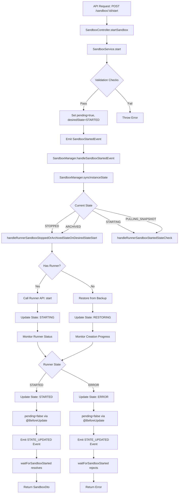

# Daytona Sandbox 启动流程深度分析

## 概述

本文档详细分析了 Daytona Sandbox 从 STOPPED 状态启动到 STARTED 状态的完整流程，重点关注 pending 标志的更新机制和事件驱动的状态同步流程。

## 核心架构组件

### 1. 控制器层 (Controller Layer)

- **SandboxController**: 处理 HTTP 请求，协调服务调用
- **startSandbox**: 启动沙盒的主要入口点

### 2. 服务层 (Service Layer)  

- **SandboxService**: 核心业务逻辑处理
- **RunnerService**: Runner 管理和通信

### 3. 管理器层 (Manager Layer)

- **SandboxManager**: 状态同步和生命周期管理
- **BackupManager**: 备份相关操作

### 4. 数据层 (Data Layer)

- **Sandbox Entity**: 沙盒实体定义
- **Sandbox Subscriber**: 数据库事件监听

## 启动流程详细分析

### 阶段 1: API 请求处理

#### 1.1 控制器接收请求

```typescript
// apps/api/src/sandbox/controllers/sandbox.controller.ts
@Post(':sandboxId/start')
async startSandbox(
  @AuthContext() authContext: OrganizationAuthContext,
  @Param('sandboxId') sandboxId: string,
): Promise<SandboxDto> {
  // 调用服务层启动沙盒
  await this.sandboxService.start(sandboxId, authContext.organization)
  
  // 等待沙盒启动完成
  const sandbox = await this.waitForSandboxStarted(sandboxId, 30)
  
  // 确保 runner domain 信息完整
  if (!sandbox.runnerDomain) {
    const runner = await this.runnerService.findBySandboxId(sandboxId)
    sandbox.runnerDomain = runner.domain
  }
  
  return sandbox
}
```

**关键点：**

- 使用 `this.sandboxService.start()` 启动沙盒
- 调用 `waitForSandboxStarted()` 等待状态变更
- 确保返回的 DTO 包含完整的 runner 信息

#### 1.2 事件驱动的状态等待机制

```typescript
// apps/api/src/sandbox/controllers/sandbox.controller.ts
private async waitForSandboxStarted(sandboxId: string, timeoutSeconds: number): Promise<SandboxDto> {
  const waitForStarted = new Promise<SandboxDto>((resolve, reject) => {
    let timeout: NodeJS.Timeout
    
    const handleStateUpdated = (event: SandboxStateUpdatedEvent) => {
      if (event.sandbox.id !== sandboxId) {
        return
      }
      
      if (event.sandbox.state === SandboxState.STARTED) {
        this.eventEmitter.off(SandboxEvents.STATE_UPDATED, handleStateUpdated)
        clearTimeout(timeout)
        resolve(SandboxDto.fromSandbox(event.sandbox, ''))
      }
      
      if (event.sandbox.state === SandboxState.ERROR || event.sandbox.state === SandboxState.BUILD_FAILED) {
        this.eventEmitter.off(SandboxEvents.STATE_UPDATED, handleStateUpdated)
        clearTimeout(timeout)
        reject(new BadRequestError(`Sandbox failed to start: ${event.sandbox.errorReason}`))
      }
    }

    this.eventEmitter.on(SandboxEvents.STATE_UPDATED, handleStateUpdated)
    timeout = setTimeout(() => {
      this.eventEmitter.off(SandboxEvents.STATE_UPDATED, handleStateUpdated)
      reject(new BadRequestError(`Sandbox failed to start: Timeout after ${timeoutSeconds} seconds`))
    }, timeoutSeconds * 1000)
  })

  return waitForStarted
}
```

**核心机制：**

- 使用 EventEmitter2 监听 `STATE_UPDATED` 事件
- 当 sandbox.state 变为 STARTED 时解析 Promise
- 30 秒超时机制
- 错误状态处理（ERROR, BUILD_FAILED）

### 阶段 2: 服务层状态设置

#### 2.1 SandboxService.start 方法

```typescript
// apps/api/src/sandbox/services/sandbox.service.ts
async start(sandboxId: string, organization: Organization): Promise<void> {
  const sandbox = await this.sandboxRepository.findOne({
    where: { id: sandboxId }
  })

  if (!sandbox) {
    throw new NotFoundException(`Sandbox with ID ${sandboxId} not found`)
  }

  // 验证状态转换的合法性
  if (String(sandbox.state) !== String(sandbox.desiredState)) {
    throw new SandboxError('State change in progress')
  }

  if (![SandboxState.STOPPED, SandboxState.ARCHIVED].includes(sandbox.state)) {
    throw new SandboxError('Sandbox is not in valid state')
  }

  // 验证组织状态
  this.organizationService.assertOrganizationIsNotSuspended(organization)

  // 验证 Runner 状态（如果已分配）
  if (sandbox.runnerId) {
    const runner = await this.runnerService.findOne(sandbox.runnerId)
    if (runner.state !== RunnerState.READY) {
      throw new SandboxError('Runner is not ready')
    }
  } else {
    // 恢复操作需要验证配额
    await this.validateOrganizationQuotas(organization, sandbox.cpu, sandbox.mem, sandbox.disk, sandbox.id)
  }

  // 防止并发操作
  if (sandbox.pending) {
    throw new SandboxError('Sandbox state change in progress')
  }

  // 设置状态和触发事件
  sandbox.pending = true
  sandbox.desiredState = SandboxDesiredState.STARTED
  await this.sandboxRepository.save(sandbox)

  this.eventEmitter.emit(SandboxEvents.STARTED, new SandboxStartedEvent(sandbox))
}
```

**关键状态更新：**

1. `pending = true` - 标记操作正在进行
2. `desiredState = STARTED` - 设置期望状态
3. 发出 `SandboxStartedEvent` 事件

### 阶段 3: 管理器层状态同步

#### 3.1 事件处理入口

```typescript
// apps/api/src/sandbox/managers/sandbox.manager.ts
@OnEvent(SandboxEvents.STARTED)
private async handleSandboxStartedEvent(event: SandboxStartedEvent) {
  this.syncInstanceState(event.sandbox.id).catch(this.logger.error)
}
```

#### 3.2 状态同步核心逻辑

```typescript
// apps/api/src/sandbox/managers/sandbox.manager.ts
async syncInstanceState(sandboxId: string): Promise<void> {
  // Redis 分布式锁，防止并发同步
  const lockKey = SYNC_INSTANCE_STATE_LOCK_KEY + sandboxId
  const acquired = await this.redisLockProvider.lock(lockKey, 360)
  if (!acquired) {
    return
  }

  const sandbox = await this.sandboxRepository.findOneByOrFail({
    id: sandboxId,
  })

  // 终端状态直接返回
  if ([SandboxState.DESTROYED, SandboxState.ERROR, SandboxState.BUILD_FAILED].includes(sandbox.state)) {
    await this.redisLockProvider.unlock(lockKey)
    return
  }

  let syncState = DONT_SYNC_AGAIN

  try {
    switch (sandbox.desiredState) {
      case SandboxDesiredState.STARTED: {
        syncState = await this.handleSandboxDesiredStateStarted(sandbox)
        break
      }
      // ... 其他状态处理
    }
  } catch (error) {
    // 错误处理和状态更新
    const sandboxError = fromAxiosError(error)
    await this.updateSandboxState(sandbox.id, SandboxState.ERROR, undefined, sandboxError.message)
  }

  await this.redisLockProvider.unlock(lockKey)
  
  // 递归同步（如果需要）
  if (syncState === SYNC_AGAIN) {
    this.syncInstanceState(sandboxId)
  }
}
```

#### 3.3 启动状态处理分发

```typescript
// apps/api/src/sandbox/managers/sandbox.manager.ts
private async handleSandboxDesiredStateStarted(sandbox: Sandbox): Promise<SyncState> {
  switch (sandbox.state) {
    case SandboxState.PENDING_BUILD: {
      return this.handleUnassignedBuildSandbox(sandbox)
    }
    case SandboxState.BUILDING_SNAPSHOT: {
      return this.handleRunnerSandboxBuildingSnapshotStateOnDesiredStateStart(sandbox)
    }
    case SandboxState.UNKNOWN: {
      return this.handleRunnerSandboxUnknownStateOnDesiredStateStart(sandbox)
    }
    case SandboxState.ARCHIVED:
    case SandboxState.STOPPED: {
      return this.handleRunnerSandboxStoppedOrArchivedStateOnDesiredStateStart(sandbox)
    }
    case SandboxState.RESTORING:
    case SandboxState.CREATING: {
      return this.handleRunnerSandboxPullingSnapshotStateCheck(sandbox)
    }
    case SandboxState.PULLING_SNAPSHOT:
    case SandboxState.STARTING: {
      return this.handleRunnerSandboxStartedStateCheck(sandbox)
    }
  }
  return DONT_SYNC_AGAIN
}
```

### 阶段 4: STOPPED 状态的具体处理

#### 4.1 已停止沙盒的启动逻辑

```typescript
// apps/api/src/sandbox/managers/sandbox.manager.ts
private async handleRunnerSandboxStoppedOrArchivedStateOnDesiredStateStart(sandbox: Sandbox): Promise<SyncState> {
  // 检查当前 Runner 的可调度性
  if (sandbox.runnerId) {
    const runner = await this.runnerService.findOne(sandbox.runnerId)
    if (runner.unschedulable) {
      // 如果有有效备份，迁移到新 Runner
      if (sandbox.backupState === BackupState.COMPLETED) {
        sandbox.prevRunnerId = sandbox.runnerId
        sandbox.runnerId = null
        await this.sandboxRepository.save(sandbox)
      }
    }

    // 负载均衡：如果当前 Runner 负载过高，迁移到其他 Runner
    if (sandbox.backupState === BackupState.COMPLETED) {
      const usageThreshold = 35
      const runningSandboxsCount = await this.sandboxRepository.count({
        where: {
          runnerId: sandbox.runnerId,
          state: SandboxState.STARTED,
        },
      })
      
      if (runningSandboxsCount > usageThreshold) {
        const availableRunners = await this.runnerService.findAvailableRunners({
          region: sandbox.region,
          sandboxClass: sandbox.class,
        })
        const lessUsedRunners = availableRunners.filter((runner) => runner.id !== sandbox.runnerId)
        
        if (lessUsedRunners.length > 0) {
          await this.sandboxRepository.update(sandbox.id, {
            runnerId: null,
            prevRunnerId: sandbox.runnerId,
          })
        }
      }
    }
  }

  if (sandbox.runnerId === null) {
    // 情况 1: 无 Runner，需要从备份恢复
    if (sandbox.backupState !== BackupState.COMPLETED) {
      await this.updateSandboxState(
        sandbox.id,
        SandboxState.ERROR,
        undefined,
        'Sandbox has no runner and backup is not completed',
      )
      return DONT_SYNC_AGAIN
    }

    // 选择有效的备份镜像
    const registry = await this.dockerRegistryService.findOne(sandbox.backupRegistryId)
    const existingBackups = sandbox.existingBackupSnapshots.map((snapshot) => snapshot.snapshotName)
    let validBackup = sandbox.backupSnapshot
    let exists = false

    // 验证备份镜像存在性
    while (existingBackups.length > 0) {
      try {
        if (await this.dockerProvider.checkImageExistsInRegistry(validBackup, registry)) {
          exists = true
          break
        }
        validBackup = existingBackups.pop()
      } catch (error) {
        this.logger.error(`Failed to check backup snapshot ${validBackup}:`, error)
      }
    }

    if (!exists) {
      await this.updateSandboxState(sandbox.id, SandboxState.ERROR, undefined, 'No valid backup snapshot found')
      return SYNC_AGAIN
    }

    // 分配新的 Runner
    const availableRunners = (
      await this.runnerService.findAvailableRunners({
        region: sandbox.region,
        sandboxClass: sandbox.class,
      })
    ).filter((runner) => runner.id != sandbox.prevRunnerId)

    const randomRunnerIndex = (min: number, max: number) => Math.floor(Math.random() * (max - min + 1) + min)
    const runnerId = availableRunners[randomRunnerIndex(0, availableRunners.length - 1)].id
    const runner = await this.runnerService.findOne(runnerId)

    // 更新状态为 RESTORING
    await this.updateSandboxState(sandbox.id, SandboxState.RESTORING, runnerId)

    // 调用 Runner API 创建沙盒
    const runnerSandboxApi = this.runnerApiFactory.createSandboxApi(runner)
    await runnerSandboxApi.create({
      id: sandbox.id,
      snapshot: validBackup,
      osUser: sandbox.osUser,
      userId: sandbox.organizationId,
      storageQuota: sandbox.disk,
      memoryQuota: sandbox.mem,
      cpuQuota: sandbox.cpu,
      env: sandbox.env,
      registry: {
        url: registry.url,
        username: registry.username,
        password: registry.password,
      },
    })
  } else {
    // 情况 2: 有 Runner，直接启动
    const runner = await this.runnerService.findOne(sandbox.runnerId)
    const runnerSandboxApi = this.runnerApiFactory.createSandboxApi(runner)
    
    await runnerSandboxApi.start(sandbox.id)
    await this.updateSandboxState(sandbox.id, SandboxState.STARTING)
    return SYNC_AGAIN
  }

  return SYNC_AGAIN
}
```

### 阶段 5: 启动状态监控

#### 5.1 启动进度检查

```typescript
// apps/api/src/sandbox/managers/sandbox.manager.ts
private async handleRunnerSandboxStartedStateCheck(sandbox: Sandbox): Promise<SyncState> {
  const runner = await this.runnerService.findOne(sandbox.runnerId)
  const runnerSandboxApi = this.runnerApiFactory.createSandboxApi(runner)
  const sandboxInfoResponse = await runnerSandboxApi.info(sandbox.id)
  const sandboxInfo = sandboxInfoResponse.data

  switch (sandboxInfo.state) {
    case RunnerSandboxState.SandboxStateStarted: {
      // 获取守护进程版本
      let daemonVersion: string | undefined
      try {
        daemonVersion = await this.getSandboxDaemonVersion(sandbox, runner)
      } catch (e) {
        this.logger.error(`Failed to get sandbox daemon version for sandbox ${sandbox.id}:`, e)
      }

      // 重置备份状态
      if ([BackupState.ERROR, BackupState.COMPLETED].includes(sandbox.backupState)) {
        const sandboxToUpdate = await this.sandboxRepository.findOneByOrFail({
          id: sandbox.id,
        })
        sandboxToUpdate.state = SandboxState.STARTED
        sandboxToUpdate.backupState = BackupState.NONE
        if (daemonVersion) {
          sandboxToUpdate.daemonVersion = daemonVersion
        }
        await this.sandboxRepository.save(sandboxToUpdate)
      } else {
        await this.updateSandboxState(sandbox.id, SandboxState.STARTED, undefined, undefined, daemonVersion)
      }

      // 清理之前的 Runner（如果有迁移）
      if (sandbox.prevRunnerId) {
        // ... 清理逻辑
      }
      break
    }
    case RunnerSandboxState.SandboxStateError: {
      await this.updateSandboxState(sandbox.id, SandboxState.ERROR)
      break
    }
  }

  return SYNC_AGAIN
}
```

### 阶段 6: Pending 标志自动管理

#### 6.1 实体级别的 Pending 标志更新

```typescript
// apps/api/src/sandbox/entities/sandbox.entity.ts
@Entity()
export class Sandbox {
  @Column({ default: false })
  pending?: boolean

  @BeforeUpdate()
  updatePendingFlag() {
    // 当实际状态等于期望状态时，清除 pending 标志
    if (String(this.state) === String(this.desiredState)) {
      this.pending = false
    }
    
    // 错误状态时也清除 pending 标志
    if (this.state === SandboxState.ERROR || this.state === SandboxState.BUILD_FAILED) {
      this.pending = false
    }
  }
}
```

**Pending 标志管理规则：**

- 操作开始时设置为 `true`
- 状态达到期望状态时自动设置为 `false`
- 出现错误时自动设置为 `false`

### 阶段 7: 数据库事件和通知

#### 7.1 数据库订阅者

```typescript
// apps/api/src/sandbox/subscribers/sandbox.subscriber.ts
@EventSubscriber()
export class SandboxSubscriber implements EntitySubscriberInterface<Sandbox> {
  afterUpdate(event: UpdateEvent<Sandbox>) {
    const updatedColumns = event.updatedColumns.map((col) => col.propertyName)

    updatedColumns.forEach((column) => {
      switch (column) {
        case 'state':
          this.eventEmitter.emit(
            SandboxEvents.STATE_UPDATED,
            new SandboxStateUpdatedEvent(event.entity as Sandbox, event.databaseEntity[column], event.entity[column])
          )
          break
        case 'desiredState':
          this.eventEmitter.emit(
            SandboxEvents.DESIRED_STATE_UPDATED,
            new SandboxDesiredStateUpdatedEvent(event.entity as Sandbox, event.databaseEntity[column], event.entity[column])
          )
          break
      }
    })
  }
}
```

#### 7.2 通知服务

```typescript
// apps/api/src/notification/services/notification.service.ts
@OnEvent(SandboxEvents.STATE_UPDATED)
async handleSandboxStateUpdated(event: SandboxStateUpdatedEvent) {
  const runner = await this.runnerService.findOne(event.sandbox.runnerId)
  const dto = SandboxDto.fromSandbox(event.sandbox, runner.domain)
  this.notificationGateway.emitSandboxStateUpdated(dto, event.oldState, event.newState)
}
```

## 状态转换流程图



## 关键特性分析

### 1. 事件驱动架构

**优势：**

- 解耦组件间的依赖关系
- 支持异步状态更新
- 易于扩展和维护

**事件流：**

1. `SandboxStartedEvent` → 触发状态同步
2. `SandboxStateUpdatedEvent` → 更新UI和通知
3. Database Events → 自动触发相关服务

### 2. 分布式锁机制

```typescript
const lockKey = SYNC_INSTANCE_STATE_LOCK_KEY + sandboxId
const acquired = await this.redisLockProvider.lock(lockKey, 360)
```

**作用：**

- 防止并发状态同步操作
- 确保状态转换的原子性
- 避免资源竞争

### 3. 递归状态同步

```typescript
if (syncState === SYNC_AGAIN) {
  this.syncInstanceState(sandboxId)
}
```

**机制：**

- 持续监控状态变化
- 确保最终一致性
- 自动重试机制

### 4. 错误处理和回滚

**策略：**

- 验证前置条件
- 原子性操作
- 自动状态回滚
- 详细错误信息记录

## 性能优化点

### 1. 批量状态同步

```typescript
@Cron(CronExpression.EVERY_10_SECONDS, { name: 'sync-states' })
async syncStates(): Promise<void> {
  const sandboxs = await this.sandboxRepository.find({
    where: {
      state: Not(In([SandboxState.DESTROYED, SandboxState.ERROR, SandboxState.BUILD_FAILED])),
      desiredState: Raw(() => `"Sandbox"."desiredState"::text != "Sandbox"."state"::text`),
    },
    take: 100,
    order: { lastActivityAt: 'DESC' },
  })
  
  // 并行处理多个沙盒的状态同步
}
```

### 2. 智能 Runner 选择

- 负载均衡算法
- 区域亲和性
- 资源可用性检查

### 3. 备份镜像缓存

- 镜像存在性缓存
- 就近备份选择
- 失效重试机制

## 常见问题和解决方案

### 1. 启动超时

**原因：**

- Runner 负载过高
- 网络连接问题
- 镜像拉取缓慢

**解决：**

- 增加超时时间
- Runner 健康检查
- 镜像预缓存

### 2. 状态不一致

**原因：**

- 并发操作冲突
- 网络分区
- Runner 故障

**解决：**

- 分布式锁
- 状态对账机制
- 自动重试逻辑

### 3. Pending 标志卡住

**原因：**

- 异常中断操作
- 事件丢失
- 数据库事务问题

**解决：**

- 定时清理机制
- 状态校验任务
- 手动恢复工具

## 监控和可观测性

### 1. 关键指标

- 启动成功率
- 平均启动时间
- 错误分布
- Runner 负载

### 2. 日志记录

```typescript
this.logger.error(`Error processing desired state for sandbox ${sandboxId}:`, sandboxError)
```

### 3. 事件追踪

- 状态变更历史
- 操作审计日志
- 性能指标收集

## 总结

Daytona Sandbox 的启动流程采用了事件驱动的架构设计，通过多层组件协作实现了高可靠性和可扩展性的状态管理。关键特性包括：

1. **事件驱动**: 使用 EventEmitter2 实现组件解耦
2. **状态管理**: 自动化的 pending 标志管理和状态转换
3. **分布式协调**: Redis 锁确保操作原子性
4. **容错机制**: 完善的错误处理和自动重试
5. **性能优化**: 智能调度和资源管理

这种设计确保了沙盒启动过程的可靠性、可观测性和高性能，为用户提供了流畅的使用体验。
