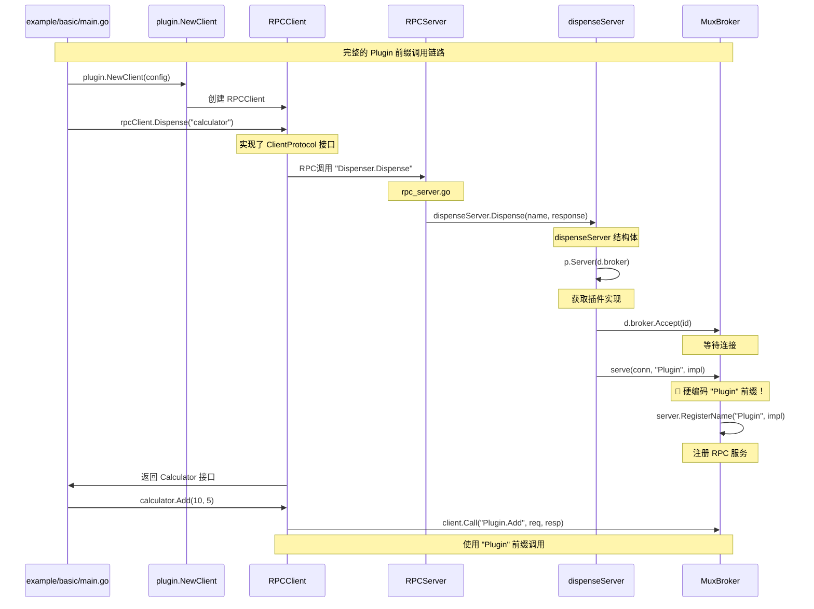

# HashiCorp Go-Plugin 框架学习案例

## 项目概述

本案例演示如何使用 HashiCorp Go-Plugin 框架实现跨进程 RPC 通信，模拟 Daytona Daemon 与 Computer-Use 插件的交互模式。通过一个简单的计算器插件，展示插件架构的核心概念和实现方式。

## 项目结构

```
hashicorp-go-plugin-example/
├── README.md                    # 本文档
├── go.mod                       # Go 模块文件
├── Makefile                     # 构建脚本
├── shared/                      # 共享接口和类型定义
│   ├── interface.go            # 插件接口定义
│   └── types.go                # RPC 客户端/服务端实现
├── host/                        # 主程序 (类似 Daemon)
│   ├── main.go                 # 主程序入口
│   └── plugin_manager.go       # 插件管理器
├── plugin/                      # 插件实现
│   ├── main.go                 # 插件入口
│   └── implementation.go       # 具体功能实现
└── examples/                    # 使用示例
    ├── basic/main.go           # 基本用法示例
    └── advanced_features.go     # 高级功能演示
```

## 快速开始

### 1. 构建项目

```bash
# 在学习案例目录下
cd hashicorp-go-plugin-example

# 构建所有组件
make build
```

### 2. 运行示例

```bash
# 运行主程序演示
make run-host

# 运行基本示例
make run-basic

# 运行高级功能示例
make run-advanced
```

### 3. 手动构建（可选）

```bash
# 1. 编译插件
cd plugin && go build -o ../calculator-plugin . && cd ..

# 2. 编译主程序
cd host && go build -o ../host-program . && cd ..

# 3. 编译示例
cd examples/basic && go build -o ../../basic-example . && cd ../..
cd examples && go build -o ../advanced-example advanced_features.go && cd ..

# 4. 运行
./host-program         # 完整演示
./basic-example        # 基本示例
./advanced-example     # 高级功能示例
```

## 核心流程

### 完整调用链路



## 关键技术点

### `Plugin` 前缀的来源

**问题**：为什么 RPC 调用时必须使用 `client.Call("Plugin.Add", ...)` 中的 `Plugin` 前缀？

**答案**：这是 HashiCorp go-plugin 框架的**硬编码约定**。调用链路如下：

```go
// 1. 用户代码 (examples/basic/main.go)
rpcClient.Dispense("calculator")

// 2. RPC客户端 (rpc_client.go:145)
c.control.Call("Dispenser.Dispense", name, &id)

// 3. RPC服务端 (rpc_server.go:195) ← 关键位置！
serve(conn, "Plugin", impl)

// 4. 最终注册 (rpc_server.go:203)
server.RegisterName("Plugin", impl)

// 5. 客户端调用
client.Call("Plugin.Add", req, resp)
```

**核心发现**：在 `dispenseServer.Dispense()` 方法中，框架硬编码调用 `serve(conn, "Plugin", impl)`，这是 `Plugin` 前缀的**唯一来源**。

### RPC 通信特点

- **跨进程调用**: 主程序和插件运行在独立进程中
- **类型安全**: 通过接口定义保证类型安全
- **错误传播**: 支持完整的错误处理机制
- **服务命名约定**: 框架强制使用 `"Plugin"` 作为 RPC 服务名

### 生命周期管理

- **握手协商**: 插件启动时的版本验证
- **状态监控**: 实时监控插件运行状态
- **优雅关闭**: 安全的资源清理

## 预期输出

### 基本示例输出

```
=== 基本用法示例 ===
1. 初始化插件...
2. 执行计算...
10 + 5 = 15.00
3. 检查状态...
插件状态: active (版本: 1.0.0)
4. 关闭插件...
=== 示例完成 ===
```

### 主程序演示输出

```
=== HashiCorp Go-Plugin 学习案例 ===
主程序启动中...
[INFO] 发现插件: calculator-plugin
[INFO] 插件握手成功
[INFO] 插件初始化完成

=== 基本计算演示 ===
插件状态: active (版本: 1.0.0)
计算结果: 10 + 5 = 15.00
计算结果: 20 - 8 = 12.00
计算结果: 6 * 7 = 42.00
计算结果: 84 / 2 = 42.00

=== 错误处理演示 ===
除零错误处理: division by zero

=== 性能测试 ===
执行 1000 次计算耗时: 40ms (平均: 40µs/次)

[INFO] 插件关闭完成
```

## 与 Daytona 的关联

本学习案例与 Daytona 项目的映射关系：

| 学习案例          | Daytona 实际项目      | 说明         |
| ----------------- | --------------------- | ------------ |
| `host/`           | `apps/daemon/`        | 主程序入口   |
| `plugin/`         | `libs/computer-use/`  | 插件实现     |
| `Calculator` 接口 | `IComputerUse` 接口   | 插件接口定义 |
| `PluginManager`   | `computeruse/manager` | 插件管理器   |
| 计算操作          | 桌面控制操作          | 业务功能     |

通过学习本案例，你将深入理解 Daytona 的插件架构设计原理和实现细节。

## 故障排除

### 常见问题

1. **插件文件未找到**

   ```bash
   # 确保已编译插件
   make build
   ```

2. **RPC 调用失败**

   ```bash
   # 检查是否使用正确的前缀
   client.Call("Plugin.Add", req, resp)  # ✅ 正确
   client.Call("Add", req, resp)         # ❌ 错误
   ```

3. **模块导入错误**

   ```bash
   # 确保使用完整的模块路径
   import "hashicorp-go-plugin-example/shared"
   ```

---

🎯 **开始您的插件架构学习之旅！** 从基础概念到实际应用，掌握现代分布式系统的核心设计模式。
